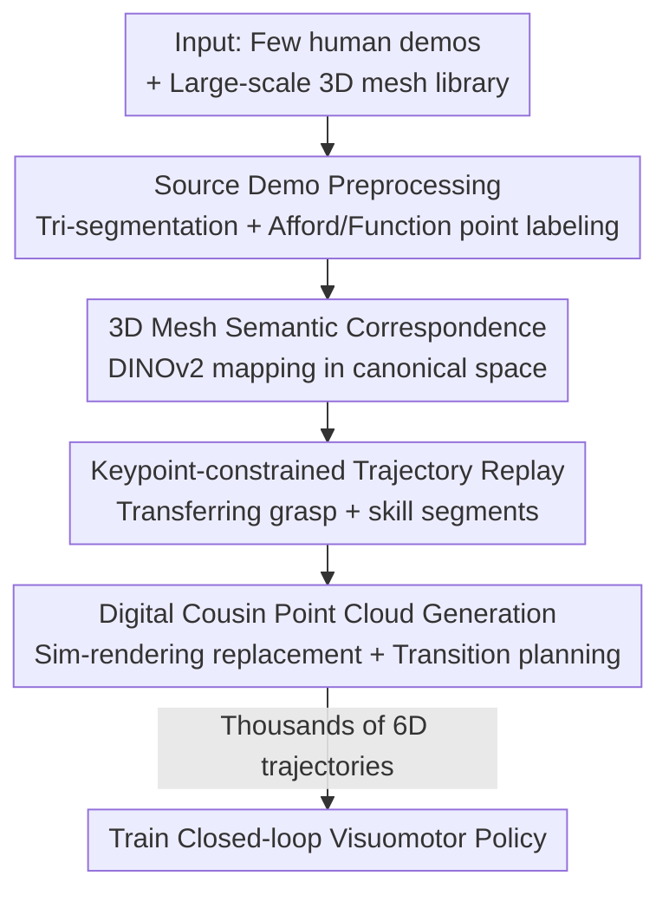

# AffordGen: Generating Diverse Demonstrations for Generalizable Object Manipulation with Affordance Correspondence

**Conference**: CVPR 2026  
**Paper**: [CVF Open Access](https://openaccess.thecvf.com/content/CVPR2026/html/Zhang_AffordGen_Generating_Diverse_Demonstrations_for_Generalizable_Object_Manipulation_with_Affordance_CVPR_2026_paper.html)  
**Code**: None  
**Area**: Robotics / Embodied AI  
**Keywords**: Imitation Learning, Data Generation, Semantic Correspondence, affordance, Cross-category Generalization  

## TL;DR
AffordGen transforms "affordance semantic correspondence" from an online planning signal into an **offline data generation prior**. By establishing keypoint correspondences across large-scale 3D meshes using DINOv2, it batch-transfers grasping and skill segments from a single human demonstration to hundreds of new objects. This process synthesizes a trajectory dataset covering full 6D poses and multiple categories, which is then used to train a closed-loop visuomotor policy, achieving zero-shot generalization to **genuinely unseen objects**.

## Background & Motivation
**Background**: Visuomotor imitation learning performs well in robotic manipulation but relies heavily on large-scale, high-quality human demonstrations. To mitigate the data bottleneck, two synthetic data routes have emerged: **trajectory adaptation** (e.g., DemoGen/CPGen), which expands a single demonstration into hundreds of spatially diverse trajectories; and LLM-driven generation (e.g., GenSim/RoboGen) which generates tasks and script solvers from scratch.

**Limitations of Prior Work**: Methods like DemoGen essentially perform spatial augmentation on a **single object instance**, inheriting the semantic scope of the source demonstration and failing on objects with different shapes (even within the same category). They also favor translational invariance and adapt poorly to varying orientations. Another affordance-based route (e.g., Robo-ABC, DenseMatcher, FUNCTO) enables cross-category skill transfer but remains **planning-centric and open-loop**. These policies simply follow pre-calculated trajectories, relying entirely on the accuracy of mapping points and planners; they fail under keypoint occlusion or large viewpoint differences, lacking the reactivity of learned closed-loop policies.

**Key Challenge**: Affordances provide "semantic generalization" (knowing where to grasp and act), while end-to-end learning provides "closed-loop robustness." However, the two have been disconnected—affordance is often treated as a static mapping signal for planners without a systematic method to inject it into learned pipelines.

**Goal**: To allow a single (or few) demonstration to generalize across both **geometric shapes** and **object categories** without increasing human demonstration costs, while retaining the reactive robustness of closed-loop policies.

**Core Idea**: Instead of using affordances for online planning, treat them as **conductors for data generation**. By using semantic correspondence to replicate source trajectories onto massive new meshes, a large and diverse affordance-aware dataset is created. A reactive closed-loop policy is then trained on this data, inheriting both the semantic generalization of affordances and the robustness of end-to-end learning.

## Method

### Overall Architecture
AffordGen takes few human expert demonstrations (point clouds + end-effector trajectories) and a large-scale 3D mesh library as input, outputting a closed-loop visuomotor policy. The pipeline consists of three serial steps: first, it **decomposes** the source demonstration into grasp, skill, and transition segments while labeling two keypoints; second, it uses a visual foundation model to **establish 3D keypoint correspondences** between the source mesh and a large set of target meshes; finally, it **transfers and replays** task-relevant segments onto each new mesh, completes transition segments via motion planning, and re-renders aligned hybrid point clouds. This expands one demonstration into thousands of trajectories for training a DP3-style closed-loop policy.

The task is formalized into three stages $\Omega=\{\Omega_G, \Omega_S, \Omega_T\}$: $\Omega_G$ (grasping), $\Omega_S$ (skill execution), and $\Omega_T$ (transition). At each timestep, the policy receives point cloud observation $o^e_t$ and proprioception $o^s_t$ to output action $a_t$. Point clouds are utilized as input due to their structural simplicity in 3D space, facilitating direct editing for data generation.

### Key Designs

**1. Source Demo Preprocessing: Decomposing Trajectories into Transferable Semantic Parts**

To reuse demonstrations, the system must identify what information is worth reusing. AffordGen extracts three types of information: the grasping moment $t_{grasp}$ (read from gripper status), the **skill segment** $\tau_s$ (detected via VLM video reasoning or manual labeling), and two keypoints on the manipulated object—the **affording point** (contact point between gripper and object) and the **function point** (the part that acts on the goal, e.g., a spout or blade). Both points are defined in 3D space. For the point cloud, SAM2 is used to segment RGB images into robot/object/goal/others, mapping 2D labels back to the 3D points. Background points are removed, and Farthest Point Sampling (FPS) is used to obtain the workspace point cloud $O^e\subset\mathbb{R}^3$. This step deconstructs a "continuous trajectory" into "semantic parts + keypoints," enabling the subsequent transfer to other objects.

**2. 3D Semantic Correspondence: Cross-object Mapping with DINOv2 in Canonical Space**

To move source keypoints to a new mesh, their corresponding positions must be identified. While 2D semantic correspondence is mature, robotic manipulation requires **precise 3D correspondence**. Existing 3D methods (e.g., DenseMatcher) lack accuracy due to small-scale training. The authors normalize all meshes into a unified **canonical space** and then lift 2D correspondences to 3D. Specifically, for a source keypoint $x\in\mathbb{R}^3$, RGB-D images $I_i$ are rendered from $n$ camera views, each passed through DINOv2 to get features $S_i$. Mesh vertices $v_j$ near $x$ are projected to pixels $u_{ij}$, and the best matching pixels are found in the target feature space via Cosine Similarity:

$$u^{tg}_{ij}=\arg\max_u \mathrm{CosSim}\!\big(S^{src}_i[u_{ij}],\, S^{tg}_i[u]\big),\quad w_{ij}=\mathrm{CosSim}\!\big(S^{src}_i[u_{ij}],\, S^{tg}_i[u^{tg}_{ij}]\big).$$

Matches are back-projected to 3D as candidates $v^{tg}_{ij}$ with weights $w_{ij}$, and the target keypoint is calculated as $x'=\frac{\sum_{i,j} w_{ij} v^{tg}_{ij}}{\sum_{i,j} w_{ij}}$. Canonical space normalization combined with multi-view voting ensures stability across instances and categories.

**3. Keypoint-constrained Trajectory Replay: Replicating Segments onto New Objects**

With corresponding points identified, the source trajectory is adapted to the new object. The core assumption is that **objects in the same function class share similar end-effector trajectories relative to the affording point, and similar function point trajectories relative to the goal**. Here, "function class" is broader than "object category" (e.g., both teapots and mugs belong to the "pouring" function class). The grasp segment $\tau_g$ is normalized to the source mesh local frame as $[\tau_g]_{local}=T_{init}^{-1}\cdot[\tau_g]_{world}$ and then translated to the new affording point: $[\tau'_g]_{local}=[\tau_g]_{local}-x_{aff}+x'_{aff}$. The skill segment $\tau_s$ is converted to a function point trajectory via the relative transform $T^{fun}_{ee}$, normalized, and translated to the new function point $x'_{fun}$. For any random pose $T'$, the new trajectories are solved as $[\tau'_g]=T'\cdot[\tau'_g]_{local}$ and $[\tau'_s]=T^{ee}_{fun}\cdot T'\cdot[\tau'_{fun}]_{local}$, with joint angles solved via inverse kinematics (IK). This distinguishes AffordGen from DemoGen's "single object translation," as keypoint correspondence binds task semantics to functional parts rather than absolute coordinates. Transition segments $\tau_m$ are completed using motion planning or spherical linear interpolation (slerp): $\tau'_m=\mathrm{MotionPlan}(\tau'_g[-1],\tau'_s[0])$.

**4. Digital Cousin Point Cloud Generation: Aligning Point Clouds with New Trajectories**

The point cloud input must also match the "new object in a new pose." Unlike DemoGen, which only uses global translation, AffordGen requires diverse 3D models and 6D poses. The authors render point clouds for the robot and manipulated objects directly from simulation and **replace** the corresponding parts in the source demonstration. This creates real-sim hybrid point clouds, mitigating the sim-to-real gap while avoiding full scene reconstruction.

## Key Experimental Results

### Main Results
Experiments were conducted in ManiSkill3 across four tasks: Teapot Pouring, Mug Hanging, Veggie Cutting, and Shoe Sorting. Only 1 expert demo was used to generate 1000 trajectories for each task. Success rates for unseen objects (same category) are shown below:

| Method (Mesh×Demo) | Teapot unseen | Mug unseen | Cutting unseen | Shoe unseen |
|--------|------|------|------|------|
| DemoGen (1×1000) | 0.131 | 0.402 | 0.224 | 0.212 |
| CPGen (1000×1) | 0.169 | 0.502 | 0.424 | 0.266 |
| **AffordGen (100×10)** | 0.519 | **0.707** | 0.510 | **0.588** |
| **AffordGen (50×20)** | **0.553** | 0.664 | 0.535 | 0.302 |

While all methods perform spatial generalization on source meshes, AffordGen outperforms the strongest baseline by an average of **24.1%** on unseen objects. In real-world tests, AffordGen consistently outperformed baselines and the planning-based FUNCTO, which failed under large orientation changes and occlusions, proving the vulnerability of open-loop planning to keypoint accuracy.

### Zero-shot Cross-category
Directly using generated data to train policies for new categories (e.g., Teapot $\rightarrow$ Mug pouring):

| Method | Teapot→Mug (Sim) | Mug→Bag (Sim) | Knife→Saw (Sim) | Teapot→Mug (Real) |
|------|------|------|------|------|
| DemoGen | 0.70% | 0.27% | 1.56% | 0/27 |
| CPGen | 2.70% | 0.67% | 1.11% | 3/27 |
| **AffordGen** | **55.00%** | **83.07%** | **40.22%** | **14/27** |

AffordGen is the only method to achieve **meaningful non-zero success rates** on cross-category objects.

### Key Findings
- Semantic correspondence is essential for cross-category generalization. DemoGen/CPGen only augment source geometry, whereas AffordGen uses afford/function points to "grow" skills onto functional counterparts.
- Object-level generation capability follows an **inverse U-shape**: generalization initially increases with more unseen objects but eventually declines.
- Closed-loop training overcomes planning pitfalls: policies implicitly learn the relationship between affordances and object shapes, resolving common occlusion issues in planning-based methods.

## Highlights & Insights
- **Paradigm shift**: Re-positioning affordance from an "online planning signal" to an "offline data generation prior" bridges the gap between semantic generalization and closed-loop robustness.
- **Canonical space + Multi-view DINOv2 voting** for 3D correspondence bypasses the need for large-scale 3D training, achieving cross-category precision with off-the-shelf VFMs.
- **Digital Cousins** (sim-rendered replacements) find a middle ground between weak global transforms and expensive full reconstructions, providing 6D pose diversity while managing the sim-to-real gap.
- The concept of **Function Classes** (e.g., teapots and mugs as "pouring" objects) provides an actionable criterion for skill transfer.

## Limitations & Future Work
- Heavy reliance on keypoint labeling quality and VLM skill segment detection; errors here can contaminate the generated data.
- The function class assumption (similar relative trajectories) applies to rigid, single-step interactions but may struggle with deformable objects or complex multi-step assembly requiring force feedback.
- The "inverse U-shape" of generation benefits remains an open question regarding how to determine optimal generation boundaries.
- Transition segments rely on rough motion planning/interpolation, which may be a bottleneck for long-horizon tasks like shoe sorting.

## Related Work & Insights
- **vs DemoGen**: DemoGen generates paired observations and actions via point cloud editing but only performs spatial translation on a single object. AffordGen extends this to cross-instance, cross-category, and full 6D poses via keypoint correspondence.
- **vs CPGen**: CPGen increases diversity through mesh deformation but remains limited to geometric variants of the source object. AffordGen enables cross-category transfer by swapping meshes based on semantic points.
- **vs FUNCTO**: FUNCTO relies on open-loop planning from LLM+VFM correspondences, making it fragile to occlusion. AffordGen internalizes semantic knowledge into a reactive policy via large-scale generation, enhancing robustness.

## Rating
- Novelty: ⭐⭐⭐⭐⭐ 
- Experimental Thoroughness: ⭐⭐⭐⭐ 
- Writing Quality: ⭐⭐⭐⭐ 
- Value: ⭐⭐⭐⭐⭐ 

<!-- RELATED:START -->

## Related Papers

- [\[CVPR 2025\] ManiVideo: Generating Hand-Object Manipulation Video with Dexterous and Generalizable Grasping](../../CVPR2025/robotics/manivideo_generating_hand-object_manipulation_video_with_dexterous_and_generaliz.md)
- [\[ICLR 2026\] MoMaGen: Generating Demonstrations under Soft and Hard Constraints for Multi-Step Bimanual Mobile Manipulation](../../ICLR2026/robotics/momagen_generating_demonstrations_under_soft_and_hard_constraints_for_multi-step.md)
- [\[CVPR 2026\] GraspLDP: Towards Generalizable Grasping Policy via Latent Diffusion](graspldp_towards_generalizable_grasping_policy_via_latent_diffusion.md)
- [\[CVPR 2026\] BiPreManip: Learning Affordance-Based Bimanual Preparatory Manipulation through Anticipatory Collaboration](bipremanip_learning_affordance-based_bimanual_preparatory_manipulation_through_a.md)
- [\[CVPR 2026\] AdaDexTrack: Dynamic Modulation for Adaptive and Generalizable Dexterous Manipulation Tracking](adadextrack_dynamic_modulation_for_adaptive_and_generalizable_dexterous_manipula.md)

<!-- RELATED:END -->
