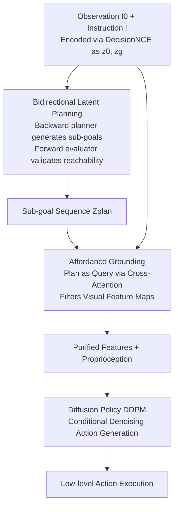

# AGiLe: Learning Robust Long-Horizon Manipulation via Affordance-Grounded Bidirectional Latent Planning

**Conference**: CVPR 2026  
**Paper**: [CVF Open Access](https://openaccess.thecvf.com/content/CVPR2026/html/Chen_AGiLe_Learning_Robust_Long-Horizon_Manipulation_via_Affordance_Grounded_Bidirectional_Latent_Planning_CVPR_2026_paper.html)  
**Code**: Project Page https://agile-long.github.io (Code not yet public)  
**Area**: Robotics / Embodied AI  
**Keywords**: Long-horizon manipulation, Latent space planning, Visual affordance, Diffusion policy, Language-guided manipulation

## TL;DR
AGiLe jointly trains a "backward planner + forward evaluator" to generate latent sub-goal sequences that are both goal-aligned and dynamically reachable (temporal robustness). These abstract sub-goals are used as queries to filter visual features via cross-attention, implicitly grounding them to pixel-level affordances to drive actions (spatial robustness). It achieves a 97.1% average success rate on LIBERO-LONG, an 8.5% improvement over the previous strongest baseline, LBP.

## Background & Motivation
**Background**: The dominant paradigm for long-horizon manipulation is a hierarchical approach comprising "high-level sub-goal planning + low-level policy execution." Long tasks, such as "placing two moka pots on the stove," are decomposed into a sequence of intermediate sub-goals for the policy to execute step-by-step.

**Limitations of Prior Work**: This paradigm suffers from shortcomings in two distinct dimensions. First, in the **temporal dimension**: fine-grained forward prediction methods (e.g., Seer) incur 
prohibitive computational costs, while coarse-grained forward planning methods (e.g., SuSIE) suffer from **accumulated error**, where small early deviations snowball over time, causing the plan to drift from the final goal. Second, in the **spatial dimension**: even if a plan is temporally correct, high-level abstract plans often fail to "ground" into the continuous perception-action space. A sub-goal like "grasp the first pot" is logically sound, but the policy may fail to find a precise grasp point due to visual ambiguity.

**Key Challenge**: Recent latent backward planning (LBP) mitigates temporal drift by reasoning backward from the final goal. However, it is **unidirectional**—the generated plans may be inconsistent with the current state or unreachable. Furthermore, LBP does not address spatial grounding. A robust framework must **simultaneously** achieve temporal robustness (coherent sub-goal sequences) and spatial robustness (effective perceptual grounding), whereas existing methods often sacrifice one for the other.

**Goal**: To solve both the "temporally coherent and reachable planning" and "pixel-level spatial grounding" problems within a unified framework.

**Key Insight**: Execution is explicitly decoupled into "what to do" (handled by planning) and "how to do it" (handled by affordance grounding). Planning is upgraded from unidirectional backward reasoning to bidirectional—backward reasoning ensures logical coherence, while forward validation ensures reachability.

**Core Idea**: Use a "backward planner + forward evaluator" bidirectional training scheme to distill reachability constraints into the planner (temporal robustness). Subsequently, use the "plan as a query to filter visual features" for affordance grounding to anchor abstract plans to task-relevant pixels (spatial robustness).

## Method

### Overall Architecture
AGiLe is a language-guided long-horizon manipulation framework that takes an initial observation $I_0$ and a language instruction $l$ as input to output low-level action sequences. The pipeline consists of two serial stages corresponding to two core innovations. **Stage 1**: A bidirectional latent planner operates in the shared latent space of a pre-trained DecisionNCE, encoding the goal and initial state as $z_g$ and $z_0$. The backward planner $P_{back}$ generates a sub-goal sequence $Z_{plan}$, while the forward evaluator $V_{fwd}$ validates if these sub-goals can reach the goal. After joint optimization, the planner internalizes reachability constraints, allowing it to be used standalone during inference. **Stage 2**: With the planner frozen, the affordance grounding module is trained. $Z_{plan}$ and $z_0$ are fused into a task query, which filters visual feature maps extracted by a backbone via cross-attention to obtain "purified" features containing only task-relevant information. These are concatenated with robot proprioception and fed into a conditional diffusion policy (DDPM) to generate precise actions.

### Key Designs

**1. Bidirectional Latent Planning: Backward for Coherence, Forward for Reachability**

This design addresses the LBP limitation where unidirectional backward planning might generate plans inconsistent with the current state. All components operate within the frozen DecisionNCE (RN50-CLIP) latent space: initial state encoded as $z_0$, language goal as $z_g$, and expert sub-goals as $Z_{gt}=(z_1,\dots,z_K)$. The **backward planner** $P_{back}$ consists of an initial predictor $P_{init}$ and a recursive Transformer $P_{recursive}$. It first predicts the furthest sub-goal $\hat{z}_1 = P_{init}(\text{concat}(z_0,z_g))$, then autoregressively generates subsequent sub-goals $\hat{z}_i = P_{recursive}(\text{tgt}=\hat{z}_{1:i-1}, \text{memory}=[z_0,z_g])$, aligned using a cosine imitation loss: $\mathcal{L}_{backward}=\sum_{i=1}^{K}\mathcal{L}_{cosine}(\hat{z}_i, z_i)$.

To ensure reachability, the **forward evaluator** $V_{fwd}$, an MLP-based forward model, predicts the final goal $\hat{z}_g = V_{fwd}(\text{concat}(z,z_0))$ from any candidate sub-goal $z$ and state $z_0$. Consistency constraints are applied to both expert and predicted sub-goals:

$$\mathcal{L}_{fwd\_gt}=\sum_{i=1}^{K}\mathcal{L}_{cosine}(V_{fwd}(z_i,z_0),z_g), \quad \mathcal{L}_{fwd\_pred}=\sum_{i=1}^{K}\mathcal{L}_{cosine}(V_{fwd}(\hat{z}_i,z_0),z_g)$$

The total planner loss is $\mathcal{L}_{planner}=\mathcal{L}_{backward}+\lambda_c(\mathcal{L}_{fwd\_gt}+\mathcal{L}_{fwd\_pred})$. The "bidirectional" nature is primarily for **training**: joint optimization allows the evaluator to distill reachability and dynamic consistency knowledge into the planner parameters. Thus, **the evaluator can be discarded during inference**, achieving temporal robustness with zero additional overhead.

**2. Sub-goal Affordance Grounding: Using Abstract Plans as Queries to Filter Visual Features**

This design bridges the gap between abstract latent plans and the pixel-level world. Execution is split into "where to look" (affordance grounding) and "what to do" (action generation). A **multi-head cross-attention** mechanism acts as an information bottleneck. The task query is formed by using $z_0$ to attend to the sequence $Z_{plan}$, resulting in $z_{fused}=F_{fuse}(z_0,Z_{plan})$, which is projected into $q_{task}$ via $P_{proj}$. The visual context $V_{seq}$ comes from a visual backbone (Swin Transformer) extracting features $F_{vis}$ from observation $I_t$.

The core grounding step explicitly aligns "task intent" with "spatial visual context": $\mathbf{A}, f_{temp}=\text{CrossAttn}(\text{Query}=q_{task},\ \text{Key}=V_{seq},\ \text{Value}=V_{seq})$. This produces two outputs: the attention weights $\mathbf{A}$, which serve as an **implicit, dynamic affordance map** highlighting task-relevant regions in $I_t$, and $f_{temp}$, which is the affordance-weighted visual evidence. The output $f_{attended}$ retains only task-relevant information. Unlike traditional methods requiring explicit affordance labels, AGiLe treats affordance as a **structural guide** learned end-to-end.

**3. Diffusion Policy + Unified Action Loss**

The grounded features $f_{attended}$ are converted into precise actions using a conditional Denoising Diffusion Probabilistic Model (DDPM) as the policy decoder $\pi_\theta$. At diffusion step $k$, it predicts noise $\epsilon$ in the noisy expert action $a_t^k$, conditioned on the fused context $c_{fused}=\text{concat}(f_{attended}, p_t)$ (where $p_t$ is proprioception):

$$\mathcal{L}_{action}=\mathbb{E}_{t,k,a_t,\epsilon,c}\left[\|\epsilon-\epsilon_\theta(a_t^k,k,\text{concat}(f_{attended},p_t))\|^2\right]$$

Crucially, a **unified loss** updates both the policy decoder and the affordance module. Gradients from action errors flow back through the cross-attention, forcing attention weights $\mathbf{A}$ to learn alignments that directly minimize final action error.

### Loss & Training
Two-stage training: In Stage 1, the bidirectional planner is trained ($\mathcal{L}_{planner}$) and then frozen. In Stage 2, the affordance grounding module and diffusion policy are trained end-to-end ($\mathcal{L}_{action}$). All components share the frozen DecisionNCE RN50-CLIP latent space. Optimization uses AdamW with cosine annealing and linear warmup on 2 NVIDIA A5000 GPUs via DDP.

## Key Experimental Results

### Main Results
On LIBERO-LONG (10 multi-stage long-horizon tasks, 50 demonstrations per task), average success rates (%) across 10 rollouts for the top-3 checkpoints:

| Method | Avg. Success Rate ↑ | Perfect Tasks (100%) |
|------|------|------|
| MTACT | 41.0 | — |
| OpenVLA | 54.0 | — |
| MVP | 68.2 | — |
| SuSIE | 76.3 | — |
| MPI | 77.3 | — |
| Seer | 87.7 | 1 / 10 |
| LBP (Prev. SOTA) | 88.6 | 3 / 10 |
| **Ours (AGiLe)** | **97.1 (Gain: 8.5%)** | **7 / 10** |

AGiLe achieves the highest average success rate and significantly increases the number of "perfect tasks" from LBP's 3 and Seer's 1 to 7, indicating sustained coherence over long sequences.

### Ablation Study
Ablations on LIBERO-LONG removing individual modules:

| Configuration | Avg. Success Rate | Perfect Tasks | Description |
|------|---------|------|------|
| AGiLe (Full) | 97.1 | 7 / 10 | Full model |
| w/o Forward Evaluator | 89.0 | 3 / 10 | $\lambda_c{=}0$, degrades to pure backward imitation |
| w/o Affordance Grounding | 90.5 | 2 / 10 | Replaced Cross-Attn with Global Average Pooling |

### Key Findings
- **Removing the forward evaluator causes the largest performance drop** (−8.0%, perfect tasks 7→3): Bidirectional training is critical for maintaining dynamic consistency and temporal robustness.
- **Removing affordance grounding maintains decent performance (90.5%) but fails at "perfect execution"** (perfect tasks only 2/10): Grounding helps the policy suppress visual distractors to achieve precise and stable execution.
- **Real-world advantage increases with task stages**: In xArm6 experiments, AGiLe significantly outperforms LBP in 6-stage tasks where LBP nearly collapses in the final stages, while AGiLe remains robust.

## Highlights & Insights
- **Bidirectional planning as training-time distillation**: The forward evaluator acts as a "teacher" during training to constrain the planner, but is discarded during inference—providing reachability benefits without deployment overhead.
- **Cross-attention as a dual-purpose tool**: Attention weights $\mathbf{A}$ serve as implicit affordance maps, while the weighted output acts as purified features. Affordance emerges as a "by-product" of minimizing action loss rather than requiring dense labels.
- **Explicit decoupling of "what" vs. "how"**: Temporal robustness is assigned to planning, while spatial robustness is assigned to grounding. This orthogonal decomposition makes the framework interpretable and diagnosable.

## Limitations & Future Work
- **Limitations**: The current two-stage framework freezes the planner after training, preventing it from adapting during the execution phase.
- **Future Work**: The authors aim to explore end-to-end or online optimization to allow the planner to refine itself based on execution feedback and extend to open-world scenarios with unseen objects.

## Related Work & Insights
- **vs. LBP**: LBP only uses unidirectional backward reasoning. AGiLe adds a forward evaluator for bidirectional training (reachability) and affordance grounding (spatial anchoring).
- **vs. Seer / SuSIE**: AGiLe avoids the high computational cost of Seer's frame-by-frame prediction and the error accumulation of SuSIE's coarse forward planning by using bidirectional latent reasoning.
- **vs. Traditional Affordance**: Unlike methods requiring explicit supervised affordance labels, AGiLe uses structure-guided grounding shaped by the action loss.

## Rating
- Novelty: ⭐⭐⭐⭐ Bidirectional training distillation combined with query-based implicit grounding is novel for long-horizon tasks.
- Experimental Thoroughness: ⭐⭐⭐⭐ Strong simulation and real-world results; however, object diversity in benchmarks remains somewhat limited.
- Writing Quality: ⭐⭐⭐⭐ The "temporal/spatial robustness" narrative is very clear and well-supported.
- Value: ⭐⭐⭐⭐ Practical "bidirectional at training, unidirectional at inference" design provides a significant SOTA boost (+8.5%).

<!-- RELATED:START -->

## Related Papers

- [\[CVPR 2026\] PALM: Progress-Aware Policy Learning via Affordance Reasoning for Long-Horizon Robotic Manipulation](palm_progress-aware_policy_learning_via_affordance_reasoning_for_long-horizon_ro.md)
- [\[CVPR 2026\] CLaD: Planning with Grounded Foresight via Cross-Modal Latent Dynamics](clad_planning_with_grounded_foresight_via_cross-modal_latent_dynamics.md)
- [\[CVPR 2026\] BiPreManip: Learning Affordance-Based Bimanual Preparatory Manipulation through Anticipatory Collaboration](bipremanip_learning_affordance-based_bimanual_preparatory_manipulation_through_a.md)
- [\[ICML 2026\] HDFlow: Hierarchical Diffusion-Flow Planning for Long-horizon Tasks](../../ICML2026/robotics/hdflow_hierarchical_diffusion-flow_planning_for_long-horizon_tasks.md)
- [\[CVPR 2026\] Recurrent Reasoning with Vision-Language Models for Estimating Long-Horizon Embodied Task Progress](recurrent_reasoning_with_vision-language_models_for_estimating_long-horizon_embo.md)

<!-- RELATED:END -->
