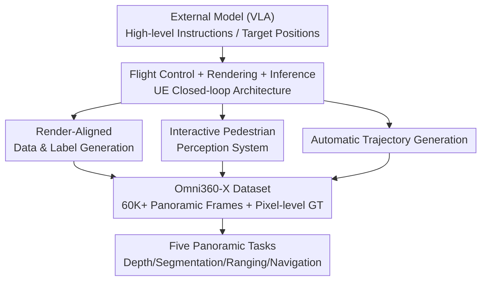

# AirSim360: A Panoramic Simulation Platform within Drone View

**Conference**: CVPR 2026  
**Paper**: [CVF Open Access](https://openaccess.thecvf.com/content/CVPR2026/html/Ge_AirSim360_A_Panoramic_Simulation_Platform_within_Drone_View_CVPR_2026_paper.html)  
**Code**: To be open-sourced (authors promise to release toolkits, plug-ins, and datasets)  
**Area**: Robotics / Embodied AI  
**Keywords**: Panoramic Simulation, UAV, Closed-loop Simulation, Omnidirectional Perception, Synthetic Data

## TL;DR
Based on Unreal Engine (compatible with UE 4.27–5.6), this work develops a 360° panoramic closed-loop simulation platform named AirSim360 tailored for drone views. Equipped with a three-piece toolchain consisting of "render-aligned pixel-level annotation, an interactive pedestrian system, and automatic trajectory generation," the platform synthesizes over 60,000 frames of omnidirectional data with depth/panoptic segmentation/3D human keypoints. It demonstrates that the synthetic data can successfully transfer to real-world scenarios across five categories of tasks, including depth estimation, segmentation, pedestrian distance estimation, and vision-language navigation.

## Background & Motivation
**Background**: Omnidirectional (360°) perception is of great value to spatial intelligence and embodied AI (such as omnidirectional obstacle avoidance in UAV navigation). The mainstream panoramic representation is Equirectangular Projection (ERP), which compresses multiple perspective fields of view into a single continuous image.

**Limitations of Prior Work**: Compared with massive perspective image datasets, panoramic data is extremely scarce. 360° cameras are seldom used in daily life, and many tasks require pixel-wise manual annotation, which is expensive. Consequently, most panoramic methods are restricted to small datasets, and data scaling has barely been explored.

**Key Challenge**: A seemingly straightforward solution is to "let the agent rotate through multiple angles in the simulator to capture omnidirectional views," but this approach has two fatal flaws. First, it is computationally inefficient, as repeated rendering slows down data acquisition. Second, there is a misalignment in ground truth definition: the omnidirectional depth along the line of sight is slant range, whereas under perspective projection, the depth is the orthogonal z-distance along the optical axis. Directly applying perspective ground truth is incorrect.

**Goal**: To build a simulation platform that natively supports panoramics and is tailored to drone views, enabling efficient, batch-like generation of pixel-aligned omnidirectional ground truth (depth, semantic/instance segmentation, 3D human keypoints) and supporting navigation tasks.

**Key Insight**: Choosing Unmanned Aerial Vehicles (UAVs) as agents allow exploring wider space and collecting more diverse data than ground robots. Panoramic simulation is modeled as a "4D real world" composed of static high-quality scenes and dynamic pedestrians.

**Core Idea**: Bypassing multiple renderings by "stitching a six-sided cube map in real-time into an ERP with direct texture copying on the GPU side," combined with render-aligned ground truth generation, a pedestrian behavior system, and automatic trajectory planning, to build a scalable and automated pipeline for producing UAV omnidirectional data.

## Method

### Overall Architecture
AirSim360 is an online closed-loop simulator: external models (such as VLA policies) output high-level control commands or target locations $\rightarrow$ the self-developed flight control module parses them into thrust and torque for four rotors $\rightarrow$ the UE rendering engine renders the scene in real time $\rightarrow$ various virtual sensors retrieve data synchronously. Around this closed loop, the platform additionally provides three offline data generation modules to automate "what to collect, how to label, and which trajectory to fly": render-aligned data and label generation, Interactive Pedestrian Perception System (IPAS), and automatic trajectory generation. The entire toolchain is compatible with UE 4.27 to 5.6, defaulting to UE5 (providing better dynamic lighting, geometric details, and scalability).

### Key Designs

**1. Render-aligned data and label generation: Stitching the six-sided cube map into ERP in one go and calibrating omnidirectional ground truth class-by-class**

The core design addresses the pain point of "rendering multiple angles being slow and inaccurate." The platform sets up six perfectly calibrated pinhole cameras facing six directions (front, back, left, right, up, down, each with a 90° field of view) to output six non-overlapping cube images $I_c^{6\times H_c \times W_c}$ and stitch them into one ERP image $I_e^{H_e \times W_e}$ (using spherical projection as a bridge between input and output). The challenge is that "capturing six directions simultaneously" tremendously increases GPU rendering load and storage pressure, causing the frame rate to drop severely at high resolutions. The authors re-engineered the multi-view texture synthesis mechanism from the bottom up by calling internal functions of the Render Hardware Interface (RHI) to directly copy texture resources on the GPU side. This completes the six-map stitching in one go, avoiding the overhead of secondary stitching in material nodes (Blueprints).

Regarding ground truth, each type of data is redefined according to omnidirectional semantics: **depth** is redefined as the slant range along the line of sight from the camera center to the point (instead of the perspective orthogonal distance along the optical axis). Deep integration with a material-based pipeline extracts depth from UE's pre-computed Z-Buffer, writes it into the image alpha channel, and computes precise distances combined with known camera intrinsics and extrinsics; **semantic segmentation** utilizes the graphics pipeline's Stencil Buffer to assign integers between 0 and 255 to static meshes, which are then converted to specific output colors via custom post-processing materials; **instance segmentation** needs to cover all instances across the image, but the Stencil Buffer only supports up to 256 classes, which is insufficient for complex scenes. Thus, the authors specially designed an instance segmentation method capable of labeling all static meshes, skeletal meshes, and terrain elements one by one to obtain complete fine-grained results for any frame. Finally, an Event Dispatcher is used to give a unified trigger signal to all sensors for **synchronous rendering**, and the "Capture Every Frame" option is turned off (since the camera moves continuously and capturing frame-by-frame is extremely resource-intensive), saving resources and ensuring multi-modal data is acquired synchronously.

**2. Interactive Pedestrian Perception System (IPAS): Enabling autonomous interaction for pedestrians and automatically generating temporally consistent 3D keypoints**

Addressing the pain point in low-altitude real environments where "pedestrians are crucial, yet simulating realistic human behaviors and manually labeling keypoints is difficult and inaccurate." IPAS operates on three fronts: first, allowing users to spawn any number of pedestrians in designated active zones and automatically assign behaviors; second, utilizing NPC Behavior Trees + State Machines to enable autonomous interactions—triggering state transitions via multi-actor message dispatching/receiving mechanisms (e.g., switching from "walking" to "chatting" when two agents meet, or randomly activating the "calling" state during walks); finally, generating human body keypoints in real time during interactions to ensure temporal consistency for downstream tasks. Generating keypoints presents two difficulties: having a framework that supports autonomous motion and accommodates physical body diversity, and mapping the same skeletal keypoints to different characters to avoid manual labeling errors. The authors use a Blueprint-based method to query existing general bone joints in the skeletal mesh, and joints not present in the standard skeleton are added to the bone tree via "Add Socket", allowing users to read all designed human keypoint coordinates.

**3. Automatic Trajectory Generation: Synthesizing smooth trajectories adhering to UAV dynamics from sparse waypoints using Minimum Snap**

Addressing the previous platform trajectory truth bottleneck where "most data collection relied on manual piloting," which led to low efficiency. The authors introduce Minimum Snap trajectory planning into the simulation pipeline: collectors only need to specify a few key waypoints in the scene, and the system automatically generates a smooth, realistic trajectory constraint-satisfying under UAV dynamics. This can be adapted by tuning parameters such as maximum velocity and acceleration. Crucially, the polynomial coefficients of the generated trajectories can be directly deployed on real quadrotors, providing physical consistency to the synthetic trajectories—this is the prerequisite that enables the Omni360-WayPoint dataset to provide supervision for perception, state estimation, trajectory prediction, and even VLA training.

> ⚠️ For flight control implementation details such as "resolving thrust/torque for the four rotors" or "deep integration of the flight control module into UE," the original text suggests more details are in the appendix and do not belong to the main omnidirectional simulation storyline. The main text only briefly mentions them; please refer to the original paper/appendix for implementation details.

### A Complete Example: Collecting a Single Frame of Urban Scene Data with Panoramic Panoptic Segmentation Ground Truth
Taking the City Park of Omni360-Scene (800,000 m², 25 semantic classes) as an example: First, run automatic trajectory generation to define several waypoints in the scene $\rightarrow$ Minimum Snap synthesizes a dynamically feasible flight path $\rightarrow$ the UAV flies along this path, and six cameras synchronously capture one cube image each under a unified trigger from the Event Dispatcher $\rightarrow$ RHI stitches them into an ERP panoramic image on the GPU side in one go, while slant depth is computed from the Z-Buffer, semantic colors are processed from the Stencil Buffer, and instance labels are applied to all objects using the custom method $\rightarrow$ if IPAS pedestrians are in the scene, their 3D keypoints are attached. In a single frame, perfectly aligned data of "Panoramic RGB + Depth + Semantic Segmentation + Instance Segmentation (+ Human Keypoints)" is acquired, which is then incorporated into the 60,000-frame Omni360-X dataset after deduplication via SSCD.

### Dataset Construction
The **Omni360-X** dataset collected using AirSim360 contains 60K panoramic frames deduplicated with SSCD, split into three subsets:

- **Omni360-Scene**: Over 60K images with depth + panoptic segmentation (semantic + instance) across 4 UE5 urban scenes (City Park / Downtown West / SF City / New York City), spanning 44,800 to 800,000 m² with 20–29 semantic classes (61,000 frames total). Drawing from ADE20K, semantic nouns are extracted from UE5 first, then a hierarchical semantic tree is designed to ensure cross-scene consistency, and "stuff" categories like "trees/buildings" are decomposed into individual instances.
- **Omni360-Human**: Around 100K samples covering 10+ pedestrian behaviors in about 6 scenes across various camera distances and perspectives. Each sample contains absolute camera poses and pedestrian keypoint locations/rotation angles, developed for 3D monocular human localization.
- **Omni360-WayPoint**: Over 100,000 UAV waypoint trajectories across 4 outdoor scenes, containing route variations with different maximum horizontal flight speeds, prepared for trajectory prediction, system identification, reinforcement learning, and VLA training.

## Key Experimental Results

### Platform Performance Ablation (Six-Camera Rendering/Transmission Optimization)

| Settings | Metrics | Value | Note |
|------|------|----|----|
| Capture Every Frame = Enable | FPS / GPU Time | 20 / 54 ms | Frame-by-frame capture |
| Capture Every Frame = Disable | FPS / GPU Time | 29 / 35 ms | Frame rate ↑, GPU time ↓ after disabling |
| Six-Camera, Unoptimized Scan | FPS | 14 | Baseline |
| Six-Camera, AirSim360 (RHI rewritten C++ pipeline) | FPS | 18 | Optimized |

The optimized scene scanning strategy yields a frame rate improvement of approximately 45% for a single camera; the RHI-reconstructed synthesis and transmission pipeline boosts the six-camera system frame rate from 14 to 18 FPS.

### Monocular Pedestrian Distance Estimation MPDE (Table 6, with Omni360-Human Data Augmentation)

| Training Set | Test Set | Dist. Err ↓ | Ang. Err ↓ |
|--------|--------|------------|-----------|
| nuScenes | nuScenes | 1.078 | 31.90 |
| nuScenes | FreeMan | 0.260 | 17.00 |
| nuScenes + Omni360 | nuScenes | 1.068 | 30.70 |
| nuScenes + Omni360 | FreeMan | 0.228 | 11.60 |

After incorporating Omni360-Human, the average angular error across three public test sets drops from 21.21° to 17.02°, and the average distance error drops from 0.484 m to 0.458 m. The improvement is most pronounced on FreeMan, the largest test set, where the angular error reduces from 17° to 11.6° (synthetic data uses a 20° pitch angle to match realistic camera configurations).

### Panoramic Depth Estimation (Table 7, UniK3D Fine-tuning, Deep360 vs Omni360)

| Settings | Training Data | Evaluation Data | AbsRel ↓ | RMSE ↓ | δ1 ↑ |
|------|---------|---------|---------|--------|------|
| Out-of-Domain | Deep360 | SphereCraft | 8.2570 | 0.0566 | 0.3490 |
| Out-of-Domain | Omni360 (Ours) | SphereCraft | **5.4372** | **0.0435** | **0.3990** |
| Cross-Domain | Deep360 | Omni360 | 0.3600 | 0.0714 | 0.4896 |
| Cross-Domain | Omni360 (Ours) | Deep360 | **0.1762** | **0.0229** | **0.6672** |

Under both out-of-domain (trained on Deep360/Omni360, tested on SphereCraft) and cross-domain settings, training with Omni360 yields superior performance, proving that synthetic data has stronger generalization and transferable representation.

### Panoramic Segmentation (Table 8, with Omni360-Scene Added)

| Task | WildPASS Only | + Omni360-Scene | Metrics |
|------|------------|-----------------|------|
| Semantic Segmentation | 58.0 | **67.4** | mIoU |
| Instance Segmentation | 24.6 | **38.9** | mAP |

### Panoramic Vision-Language Navigation (Table 9, Multi-VLM Zero-Shot)

| Model | SR ↑ | SPL ↑ | NE ↓ |
|------|------|-------|------|
| qwen2.5-vl-72b-instruct | 0.4 | 0.3843 | 18099.73 |
| qwen3-vl-flash | 0.2 | 0.1945 | 9506.26 |
| doubao-seed-1-6 | 0.5 | 0.4813 | 10573.89 |

### Key Findings
- **Universal Data Gain**: Adding AirSim360 synthetic data improves all three task categories (ranging, depth, and segmentation)—instance segmentation shows the largest gain from 24.6 to 38.9 mAP, validating that panoramic pixel-level understanding highly benefits from data scaling.
- **Cross-Domain Transferability**: Depth estimation achieves better results in both out-of-domain and cross-domain "non-cheating" setups, demonstrating that the improvement is not obtained by fitting in-distribution data.
- **YOMO (You Only Move Once)**: When the target is a prominent object and the trajectory is short, the panoramic UAV can head directly to the target with near-optimal efficiency based on a single omnidirectional perception without requiring extra yawing or exploration. This is reflected in the close values of SPL and SR in Table 9—which highlights the core advantage of panoramic views over monocular forward-facing cameras (larger perception coverage, more efficient target search, and virtually zero extra movement costs).

## Highlights & Insights
- **Treating "omnidirectional ground truth misalignment" as a first-class citizen**: Doing more than simply capturing and stitching six views, but rather redefining them class-by-class—depth is changed to slant range, semantics uses Stencil Buffer, and instance segmentation explicitly bypasses the 256-class ceiling. This rigor in "render alignment" is the key to synthetic data successfully transferring.
- **RHI GPU-side direct texture copying** is a highly reusable engineering trick: Shifting the six-sided stitching from secondary stitching in Blueprint material nodes to GPU texture copying directly boosts frame rates, offering inspiration for any multi-camera real-time rendering system.
- **Behavior trees + state machines + message dispatching** simulates autonomous human interactions, combined with "Add Socket" to supplement skeletal keypoints, effectively transforming "controllable, annotatable, and temporally consistent human data" into simulation primitives.
- **The first UAV-oriented omnidirectional navigation platform**, proposing the clear intuition of "YOMO" (You Only Move Once): Panoramic coverage makes near-optimal single-step decision-making possible when approaching a target.

## Limitations & Future Work
- **Flight control and dynamic details compressed into the appendix**, leaving the main text concise on "how to deeply integrate custom dynamics into UE and parse quadrotor thrust," resulting in a relatively high entry barrier for replication.
- **Preliminary VLN experiments**: It only uses off-the-shelf VLMs for zero-shot evaluation, and to validate YOMO, targets are intentionally set as prominent objects and trajectories are short. Consequently, navigation difficulty is simplified and may not reflect complex, long-horizon navigation capacities.
- **Realism remains constrained by UE assets and ideal pinhole camera assumptions**: The ideal stitching of six distortion-free pinhole cameras and the lens distortion/exposure differences of real 360° cameras still have a sim-to-real gap. The paper mostly validates this indirectly through downstream task transfer without directly quantifying this gap.
- **Future directions**: Introducing realistic camera distortion/noise models, extending larger-scale real long-horizon navigation benchmarks, and documenting open interfaces for dynamic modules and external physics engines.

## Related Work & Insights
- **vs AirSim / Cosys-AirSim**: Also based on UE for UAV simulation, but official AirSim only goes up to UE 4.27 and only supports perspective views. This work supports panoramic views + instance segmentation + 3D keypoints, is compatible with UE 4.27–5.6, supports runtime full interaction, and generates video-level panoramic panoptic segmentation labels.
- **vs UnrealCV / UnrealZoo**: These use socket interfaces to fetch RGB/depth/semantics but only support perspective views. They have limited geometric/semantic information, low frame rates, and lack instance-level distinction. In contrast, this work provides complete 360° coverage, instance-level annotation, and high frame rates.
- **vs CARLA / OmniGibson / OpenFly**: CARLA is focused on ground-based autonomous driving and lacks UAVs/panoramic views; OmniGibson is based on IsaacSim and is mostly indoor-focused; OpenFly is UAV-based but solely outdoor and lacks panoramic views. AirSim360 is the only one in the comparison table that ticks all boxes, including "configurable dynamics, Python/Blueprint dual interfaces, panoramic views, and instance segmentation."
- **Insights**: The concept of render-aligned ground truth generation is transferable to any omnidirectional/multi-camera task needing large-scale synthetic annotation; the YOMO argument suggests that when perception coverage is sufficient, "wider field of view" can be traded for "less motion," offering valuable insights for action design in embodied navigation.

## Rating
- Novelty: ⭐⭐⭐⭐ First simulation platform to systematically model a UAV omnidirectional 4D world, with genuine engineering innovation in ground-truth alignment and breakthrough instance segmentation limits.
- Experimental Thoroughness: ⭐⭐⭐⭐ Covers 5 tasks (depth, segmentation, ranging, and navigation) + platform performance ablation, though VLN is preliminary and the sim-to-real gap is not directly quantified.
- Writing Quality: ⭐⭐⭐⭐ Clear description of the three modules with comprehensive comparison tables; pushing some ground-truth and flight control details to the appendix slightly affects self-contentment.
- Value: ⭐⭐⭐⭐⭐ Directly addresses the bottleneck of panoramic data scarcity; open-sourcing the toolchain + dataset holds great value for panoramic perception and UAV embodied intelligence research.

<!-- RELATED:START -->

## Related Papers

- [\[CVPR 2026\] Learning to Act Robustly with View-Invariant Latent Actions](learning_to_act_robustly_with_view-invariant_latent_actions.md)
- [\[CVPR 2026\] HQC-NBV: A Hybrid Quantum-Classical View Planning Approach](hqc-nbv_a_hybrid_quantum-classical_view_planning_approach.md)
- [\[CVPR 2026\] Hoi! - A Multimodal Dataset for Force-Grounded, Cross-View Articulated Manipulation](hoi_-_a_multimodal_dataset_for_force-grounded_cross-view_articulated_manipulatio.md)
- [\[CVPR 2026\] A Cross-view Fusion Framework for Robust 6-DoF Grasp Pose Estimation](a_cross-view_fusion_framework_for_robust_6-dof_grasp_pose_estimation.md)
- [\[CVPR 2026\] DiffuView: Multi-View Diffusion Pretraining for 3D-Aware Robotic Manipulation](diffuview_multi-view_diffusion_pretraining_for_3d_aware_robotic_manipulation.md)

<!-- RELATED:END -->
