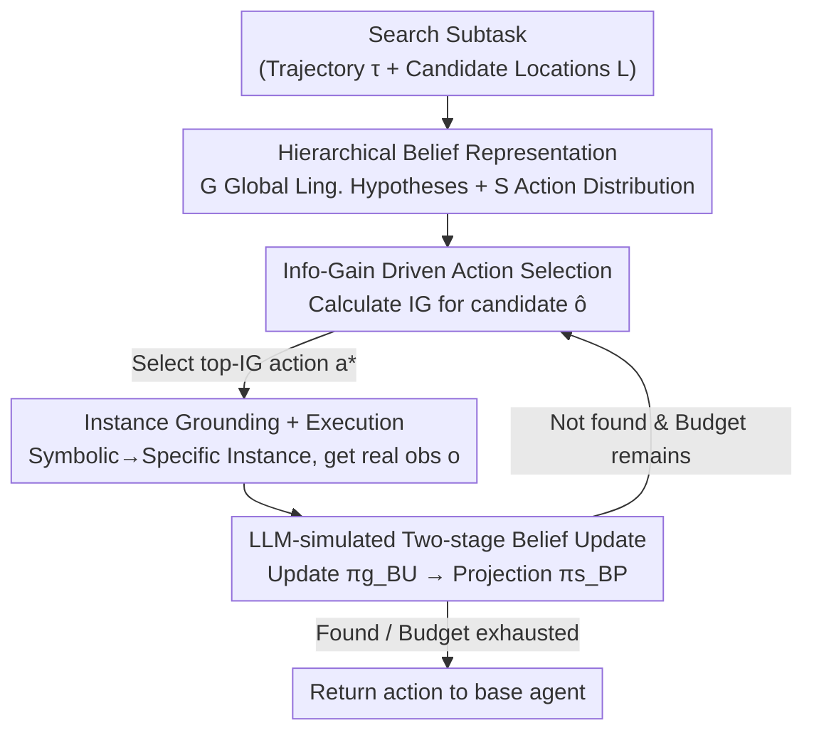

# Align While Search: Belief-Guided Exploratory Inference for World-Grounded Embodied Agents

**Conference**: CVPR 2026  
**Paper**: [CVF Open Access](https://openaccess.thecvf.com/content/CVPR2026/html/Bae_Align_While_Search_Belief-Guided_Exploratory_Inference_for_World-Grounded_Embodied_Agents_CVPR_2026_paper.html)  
**Code**: https://github.com/LGAI-Research/AWS-agent (Available)  
**Area**: Embodied AI / LLM Agent  
**Keywords**: Partial observability, belief inference, information gain, test-time adaptation, object search  

## TL;DR
To address the issue where LLM embodied agents "mechanically replay training trajectories" during object search in partially observable environments, AWS models search as a single-state Bayes-adaptive control. It maintains a hierarchical belief (global linguistic hypotheses + low-level action distribution) at test time, utilizes a frozen LLM to simulate observations for "update $\to$ projection" belief refreshes, and selects actions based on predicted information gain. **Without any gradient updates**, it simultaneously improves search success rates and reduces token overhead compared to inference-time scaling and training-time world model baselines.

## Background & Motivation
**Background**: Developing LLM agents for tasks in embodied environments like ALFWorld and VirtualHome primarily follows two paths: training-time optimization using supervised/reinforcement learning (ETO, WKM, MPO, etc.), or inference-time scaling (ReAct, Reflexion, RAP, RAFA, ReflAct, etc., which use prompt or retrieval augmentation to "think more").

**Limitations of Prior Work**: Training-time methods are costly and inflexible for deployment. While inference-time methods are more affordable, they **lack adaptive interaction with the environment**. They either rely on external simulators/learned critics or only maintain "Q&A-style" belief summaries; **none explicitly maintain a probability distribution regarding latent environment configurations and object locations**. The authors performed a key diagnosis (Fig. 2): the base model GPT-4o-mini has an action entropy of only 1.94 and a trajectory diversity of 0.21, **repeating the same search order even when room layouts change**. Worse, even after SFT on expert trajectories, 80.7% of the agents' search sequences in test environments still hard-replayed the training access order, with nearly 50% of failures occurring on these "training-style" sequences. The agent fails to "adjust based on what it sees" and instead follows pre-trained patterns blindly.

**Key Challenge**: The difficulty of searching is **not the inherent complexity of the world**, but the agent's failure to exploit the **well-defined latent semantic structures** within the environment. Using PCA (Fig. 3), the authors showed that object usage in different households naturally clusters (e.g., tech-enthusiast vs. minimalist), each with its own object preferences. Failing to explicitly model and utilize this latent structure is a missed opportunity.

**Goal**: Without training or gradient updates, enable the agent to **explicitly maintain and update a belief** about "where the target is" during search, using this belief to make information-gathering exploration decisions that improve both success rates and search efficiency.

**Key Insight**: Treat searching under partial observability as **approximate Bayesian adaptive control (Bayes-adaptive MDP)**. Introduce latent variables $\phi$ (environment type) and $\ell$ (object location), where the agent maintains a posterior $p(\phi, \ell \mid \tau_t)$ and selects actions that maximize the trade-off between "task reward + information gain" in the belief space.

**Core Idea**: Replace the "memorized policy" with an **external hierarchical belief module implemented by a frozen LLM**. The agent "Aligns While Searching" at test time—belief updates and action scoring are performed by prompting the same LLM without modifying weights.

## Method

### Overall Architecture
AWS runs on top of an existing LLM agent and is **only invoked during search subtasks**. It decomposes an episode into "Find Target (FIND) $\to$ Act (ACT)" and applies a key abstraction to the search phase: during search, the **physical world is static** (object positions are fixed), and only the agent's belief about "where the target is" changes. Thus, search is modeled as a **single-state MDP** $M_{\text{search}}=\langle\{s^\star\}, A_{\text{search}}, T_{\text{search}}, R_{\text{search}}, \gamma\rangle$. The only "true state" is a dummy state $s^\star$, and all dynamics are pushed into the belief. The action $a_t=\text{CHECK}(\ell_t)$ represents "navigate to location $\ell_t$, open if necessary, and check it" (packaging navigation and low-level control into an atomic action). The environment returns a textual observation $o_t$ (e.g., "saw an apple" / "the drawer is empty"). Rewards are sparse: 1 if the target is found, 0 otherwise. This is essentially a bandit-style single-state decision problem where only the belief $b_t \in \Delta L$ over locations evolves.

The entire pipeline is a closed loop: given the current trajectory, AWS maintains a hierarchical belief $(G, S)$. At each step, for every candidate CHECK action, it **simulates an observation** and performs an "update $\to$ projection" to obtain a hypothetical new belief. Actions are scored based on **predicted information gain**, and the top action is returned to the base agent. After the agent executes and receives the real observation, AWS performs a **real** belief update and proceeds to the next step until the target is found or the step budget is exhausted.

### Key Designs

**1. Hierarchical Belief Representation: Explicitly modeling "world layout" and "where to check"**

Previous inference-time agents either lacked beliefs or used vague textual summaries, which cannot support "picking actions by probability." AWS uses a hierarchical structure $(G, S)$ to express the agent's cognitive uncertainty. $G$ is a set of **global hypotheses** $B^G_t$ stored in natural language, representing guesses about user habits and scene layouts (e.g., "The kitchen is tidy; cups are usually in cabinets; mugs often appear near the sink"). This is initialized from the initial observation via LLM prompt. $S$ is a **low-level action belief** $b^S_t$, a categorical distribution over candidate locations, defined as:

$$b^S_t(a) = \Pr(\text{Find target after executing } a),\quad \forall a\in L_S,$$

where $L_S$ includes all symbolic CHECK actions. From a Bayesian perspective, $(G, S)$ is an **amortized variational approximation** of the joint latent variable $z=(\phi, \ell)$ posterior $q_\psi(z\mid\tau_t)=q_\psi(\phi\mid\tau_t)\,q_\psi(\ell\mid\phi,\tau_t)$. $q_\psi(\phi\mid\tau_t)$ is represented by $B^G$, and $q_\psi(\ell\mid\phi,\tau_t)$ by $b^S$. This hierarchy allows the high-level to carry "soft" semantic priors via language (flexibly rewritable by LLMs), while the low-level grounding provides "hard" executable distributions (scorable by information gain).

**2. LLM-Simulated Two-Stage Belief Update (Update $\to$ Projection): Using frozen LLMs as amortized inference operators**

AWS splits belief updates into two sequential LLM calls (Eq. 4):

$$B^G_t \xrightarrow{\ \pi^g_{BU}(\hat o)\ } B^G_{t+1} \xrightarrow{\ \pi^s_{BP}\ } b^S_{t+1}.$$

The first step $\pi^g_{BU}$ is the **update**: revising global hypotheses given observation $\hat o$ (e.g., if the sink is empty, remove "mugs are near the sink"). The second step $\pi^s_{BP}$ is the **projection**: grounding the textual belief into a distribution over symbolic locations. The mapping $B^G_t \to B^G_{t+1} \to b^S_{t+1}$ is treated as a black-box amortized inference $F_\psi$: $q_\psi(z\mid\tau_{t+1})=F_\psi(q_\psi(z\mid\tau_t), a_t, o_t) \approx p(z\mid\tau_{t+1})$—fully implemented by prompting a **frozen** LLM. Two projection variants are provided: **Similarity Projection** uses lexical similarity between symbolic candidates and updated hypotheses (local, smooth refinement); **LLM Projection** directly asks the LLM which symbols to boost or suppress (allows semantic jumps).

**3. Information Gain-Driven Exploratory Action Selection: Selecting actions that minimize uncertainty**

AWS calculates expected utility for each candidate action $a$ in belief space (Eq. 2):

$$a^*_t = \arg\max_{a\in A_{\text{search}}} \mathbb{E}_{\hat o\sim p(\hat o\mid a, b_t)}\big[\,U\big(b_t, b_{t+1}(b_t,a,\hat o)\big)\,\big],$$

where utility $U$ is instantiated as **Information Gain** (Eq. 3):

$$\text{IG}(a) = \mathbb{E}_{\hat o}\big[\,H(b_t) - H(b_{t+1}\mid a,\hat o)\,\big],$$

and $H(\cdot)$ is the entropy of the action-level belief. Crucially, the expectation over $\hat o$ is approximated using **LLM-simulated observations**: AWS asks the LLM to imagine "what would be seen if this location were checked," then performs the "update $\to$ projection" to estimate the entropy of the hypothetical new belief. Selecting the action with the highest IG is equivalent to solving a **contextual Bayesian bandit** for the search subtask. This lightweight IG surrogate transforms exploration from heuristics into a scorable value.

**4. Instance Grounding and Termination: Bridging symbolic beliefs to true environments**

While $b^S_t$ is defined over symbolic locations (e.g., cabinet, countertop), the environment requires specific instances (e.g., cabinet3). AWS selects a symbolic action and **uniformly samples an instance** from that set. Upon execution, the environment returns real rewards/observations, triggering a real belief update. Termination occurs when the task is satisfied or the budget is exhausted. An **observation alignment score** (comparing predicted vs. real feedback) is also used to detect convergence to a stable hypothesis.

## Key Experimental Results

### Main Results
Comparison with inference-time baselines on ALFWorld (Success Rate %, by subtask):

| Backbone | Method | CLEAN | COOL | HEAT | PICK | PICK-2 | Avg. |
|----------|------|-------|------|------|------|--------|------|
| GPT-4 | ReAct | 70.9 | 0.0 | 0.0 | 83.3 | 35.2 | 35.5 |
| GPT-4 | Reflexion | 64.5 | 90.5 | 95.7 | 83.3 | 58.8 | 82.1 |
| GPT-4 | ReflAct | 96.8 | 95.2 | 78.3 | 95.8 | 94.1 | **93.3** |
| GPT-4 | **AWS** | 96.8 | 100.0 | 91.3 | 91.6 | 94.1 | 90.0 |
| LLaMA-70B | ReAct | 22.5 | 0.0 | 0.0 | 75.0 | 35.2 | 22.1 |
| LLaMA-70B | ReflAct | 38.7 | 66.7 | 56.5 | 83.3 | 52.9 | 60.5 |
| LLaMA-70B | **AWS** | 93.5 | 80.9 | 65.2 | 95.8 | 76.4 | **76.0** |

On LLaMA-70B, AWS achieves an average of 76.0%, significantly outperforming ReflAct's 60.5%. On GPT-4, it ranks second overall (90.0%) but achieves the best or tied-best results in 7 out of 12 subtasks.

Comparison with training-time baselines (Success Rate %, Seen/Unseen):

| Method | VirtualHome Seen/Unseen | ALFWorld Seen/Unseen |
|------|--------------------------|----------------------|
| SFT | 64.9 / 57.7 | 79.3 / 71.6 |
| STeCa | 69.6 / 63.6 | — |
| MPO | — | 80.7 / 81.3 |
| **AWS (Zero-gradient)** | **69.6 / 65.2** | **87.5 / 85.3** |

Without updating any weights, AWS exceeds training-time SOTA methods like STeCa and MPO. AWS also uses 2–5× fewer tokens than strong inference-time baselines.

### Ablation Study
Comparison of four search strategies (same backbone, SR % / Avg. Steps):

| Configuration | Prior | Update | IG | MCTS | SR(%) | Steps↓ |
|------|:---:|:---:|:---:|:---:|------|--------|
| Random Search | × | × | × | × | 74.6 | 19.8 |
| Flat Prior | ✓ | × | × | × | 82.8 | 14.5 |
| Greedy (No IG) | ✓ | ✓ | × | × | 82.4 | 11.7 |
| MCTS (No IG) | ✓ | ✓ | × | ✓ | 85.0 | 14.7 |
| **Ours (full)** | ✓ | ✓ | ✓ | ✓ | **87.4** | 13.8 |

### Key Findings
- **Belief Update and IG are Synergistic**: Adding belief updates alone provides negligible gains (Flat Prior 82.8 $\to$ Greedy 82.4), but benefits emerge when paired with structured exploration (MCTS) and IG. Removing IG (Ours $\to$ MCTS) drops success from 87.4% to 85.0% and increases steps from 13.8 to 14.7.
- **IG Correlates with Belief Quality**: AWS's per-step information gain ($\Delta H_t$ 0.11 vs. SFT 0.05) and net entropy reduction ($\Delta H$ 0.87 vs. 0.39) are roughly double those of SFT.
- **Top-IG Selection is Optimal**: Forcing the selection of sub-optimal or lowest IG actions monotonically degrades performance.
- **Stackable with World Models**: Adding AWS on top of MPO achieves a new SOTA on ALFWorld-Text (Unseen) at 94.0%.

## Highlights & Insights
- **Reducing "Search" to a Single-State Bayesian Bandit**: By observing that the world is static during search, complex embodied dynamics are pushed into the belief, making the method lightweight yet theoretically grounded.
- **Frozen LLMs as Amortized Inference Operators**: The "update $\to$ projection" sequence as a variational posterior mapping $F_\psi$ is a reusable idea for training-free belief trackers.
- **Simulated IG Values**: Using simulated observations to quantify exploration value turns search from a heuristic into a scorable metric.
- **Diagnosis-Driven Design**: Quantifying the "closed-eye search" pathology (80.7% training replay rate) provided specific, actionable motivation.

## Limitations & Future Work
- **Dependency on Base LLM**: Performance relies on the model's ability to simulate realistic household dynamics and layouts. Smaller models may produce unreliable simulated observations, causing IG rankings to collapse.
- **Test-Time Overhead**: Simulating observations and updates for multiple candidates per step increases wall-clock time and token usage per step (though total tokens are often lower due to fewer steps).
- **Static Single-State Assumption**: The model assumes the world is static during FIND subtasks. It cannot directly handle non-stationary object positions or multi-agent environments.
- **Heuristic Proxies**: Belief updates and IG rely on prompts and similarity rules. There are no formal optimality guarantees, and the system is sensitive to prompts and hyperparameters.

## Related Work & Insights
- **vs. Inference Scaling (ReflAct, etc.)**: These rely on summaries or external critics. AWS maintains explicit location probability distributions and selects actions via IG, achieving better performance with 2–5× fewer tokens.
- **vs. Training Methods (MPO, STeCa)**: These require weight updates. AWS is zero-gradient yet exceeds these SOTAs on standard benchmarks.
- **vs. Classical POMDP Search**: Conceptually similar (latent variables, correlation structures), but AWS replaces explicit POMDP planning with linguistic amortized inference, avoiding the need for manual transition/observation models.

## Rating
- Novelty: ⭐⭐⭐⭐⭐ Cleanly modeling search as a single-state Bayes-adaptive control using frozen LLMs.
- Experimental Thoroughness: ⭐⭐⭐⭐ Broad coverage of environments and backbones, though some multimodal details are in the appendix.
- Writing Quality: ⭐⭐⭐⭐ Clear Bayesian narrative; some critical details are relegated to the appendix.
- Value: ⭐⭐⭐⭐⭐ Training-free, outperforms SOTA, and reduces token costs.

<!-- RELATED:START -->

## Related Papers

- [\[ICLR 2026\] Compositional Diffusion with Guided Search for Long-Horizon Planning](../../ICLR2026/robotics/compositional_diffusion_with_guided_search_for_long-horizon_planning.md)
- [\[CVPR 2026\] AGENTSAFE: Benchmarking the Safety of Embodied Agents on Hazardous Instructions](agentsafe_benchmarking_the_safety_of_embodied_agents_on_hazardous_instructions.md)
- [\[CVPR 2026\] UAST: Unified Active Search and Tracking for Arbitrary Targets with UAVs](uast_unified_active_search_and_tracking_for_arbitrary_targets_with_uavs.md)
- [\[CVPR 2026\] Adaptive Action Chunking at Inference-time for Vision-Language-Action Models](adaptive_action_chunking_at_inference-time_for_vision-language-action_models.md)
- [\[ICLR 2026\] Test-Time Mixture of World Models for Embodied Agents in Dynamic Environments](../../ICLR2026/robotics/test-time_mixture_of_world_models_for_embodied_agents_in_dynamic_environments.md)

<!-- RELATED:END -->
