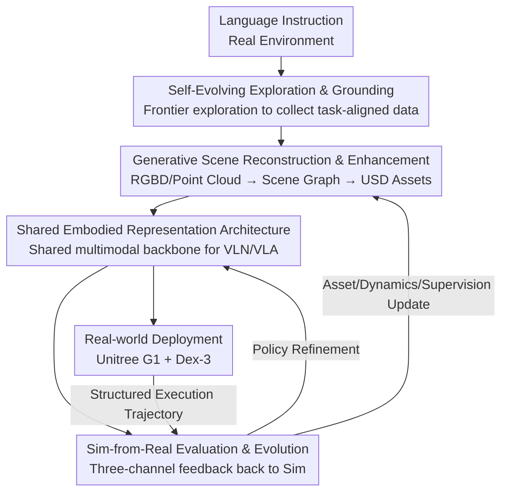

# Arcadia: Toward a Full-Lifecycle Framework for Embodied Lifelong Learning

**Conference**: CVPR 2026  
**Paper**: [CVF Open Access](https://openaccess.thecvf.com/content/CVPR2026/html/Gao_Arcadia_Toward_a_Full_Lifecycle_Framework_for_Embodied_Lifelong_Learning_CVPR_2026_paper.html)  
**Code**: The paper claims to open-source standardized evaluation interfaces, but no specific repository link is provided in the text. ⚠️ Subject to the original text.  
**Area**: Robotics / Embodied AI  
**Keywords**: Embodied Lifelong Learning, real-to-sim-to-real closed loop, generative scene reconstruction, shared multimodal backbone, deployment feedback

## TL;DR
Arcadia redefines embodied learning from "single-stage optimization" to a "full-lifecycle problem," utilizing a tightly coupled real→sim→real loop to string together autonomous exploration, generative scene reconstruction, shared navigation/manipulation backbones, and deployment feedback into a self-improving system. It achieves average improvements of 7.07% and 11.08% on navigation and manipulation benchmarks respectively, with real-world success rates significantly exceeding NaVILA and OpenVLA.

## Background & Motivation
**Background**: Current mainstream practices in embodied AI treat the pipeline as independent segments optimized separately—either training in static simulators or deploying directly without collecting feedback. Recent works like GRUtopia (unifying simulation scenes/agents/benchmarks) and NaVILA (linking high-level language instructions to low-level motor control with real-world validation) have begun to connect some stages.

**Limitations of Prior Work**: However, these works only "widen" the pipeline coverage without creating a true closed loop. GRUtopia primary expands the simulation side, while NaVILA extends execution to the real world; neither establishes a permanent path for deployment experience to flow back into simulation assets or supervision signals. The authors summarize these fragmentations into four specific weaknesses: (1) **Exogenous data dependence**—using YouTube videos or quadruped data to train humanoid robots results in morphology/perspective mismatch and limited gains; (2) **Pre-rendered environments**—static scenes like Matterport3D or Habitat have limited physical properties and are unchangeable, making it impossible to insert new variations observed during deployment; (3) **Architecture fragmentation**—navigation (VLN, often modeled as directed bboxes) and manipulation (VLA, fixed camera + end-effector control) use incompatible stacks, blocking cross-task credit assignment; (4) **Sparse real-world feedback**—deployment is treated as a one-off "success/failure label," preventing the localization of long-horizon errors or the feeding back of environmental drift.

**Key Challenge**: The root of these four points is not isolated algorithmic failure but the **rupture of lifecycle coupling**. Data collection, simulation, representation, and deployment supervision do not form a continuous feedback loop, causing the system to degrade into "one-off training" that fails to improve continuously or generalize across scenes.

**Goal**: Build an embodied lifecycle platform that simultaneously satisfies: (i) strong alignment between collected experience and target tasks; (ii) conversion of real observations into editable generative simulation assets; (iii) use of a shared, scalable embodied representation for cross-task learning; (iv) feedback of result-driven deployment data into assets and policies.

**Core Idea**: Use an **indivisible, tightly coupled closed loop** (where removing any part reverts it to one-off training) to bind "data collection → sim construction → shared representation learning → deployment feedback," allowing real experience to continuously update simulation, representation, and policies for lifelong self-improvement.

## Method
Given a natural language instruction (e.g., "Bring me the cup on the table"), Arcadia completes a full real→sim→real cycle: first, autonomous exploration in the real environment (3.1); then, generative reconstruction of multimodal data into editable simulation assets (3.2); training navigation and manipulation policies in simulation using a shared embodied backbone (3.3); and finally, real-world deployment to generate structured feedback that updates both assets and policies (3.4). The four components can work independently but synergize as a coupled loop—each solving a different bottleneck in the lifecycle to drive continuous self-improvement.

### Overall Architecture

The key to the entire pipeline is not a single point SOTA, but the feedback generated in stage E, which continuously corrects simulation assets and shared policies through two return edges (dashed lines), turning "simulation" from a static proxy into an active driver of adaptation.

### Key Designs

**1. Self-Evolving Exploration & Grounding: Changing data collection from "borrowing exogenous data" to "self-collecting task-aligned data"**

Addressing exogenous data dependence, Arcadia autonomously collects data in the exact physical environment of deployment, ensuring the perception/control model learns under real conditions. It uses Isaac ROS + Nvblox for SLAM and 3D reconstruction, employing a **frontier-based exploration strategy** to maximize information gain. Frontier points are boundaries between explored/unexplored regions, scored by "expected entropy reduction." The robot visits the highest-scoring points via low-level motion APIs. The map and frontier set update continuously, producing adaptive trajectories balanced between coverage, efficiency, and semantic relevance. Compared to grid/scripted exploration, this strategy emphasizes areas critical to downstream tasks, improving sample efficiency and task grounding coverage. After exploration, it outputs synchronized multimodal data (RGB-D, LiDAR, IMU, odometry, pose) and **retains the full observation history** to provide dense, temporally grounded supervision for reconstruction and policy learning.

**2. Generative Scene Reconstruction & Enhancement: Converting real observations into editable, task-aligned simulation assets to replace static scanning/retrieval**

Addressing uneditable pre-rendered environments, this design uses generative reconstruction to convert real environments directly into simulator-compatible assets. Starting from multimodal inputs (3.1), videos and point clouds are parsed into structured 3D **scene graphs** $G=(V,E)$ (objects/architectural elements as nodes, spatial relations as edges, implemented via modules like SpatialLM). The key difference is that instead of retrieving meshes from a database, it uses a **Gaussian-splatting-based reconstructor** to synthesize assets directly from multi-view observations, producing USD objects with consistent geometry, texture, and semantics. These are then imported into Isaac Sim via an automated management interface. This enables wide-area expansion without manual intervention, reduces asset bias, and retains task semantics—replacing manual retrieval with generative synthesis to make simulation both realistic and diverse for scalable lifelong learning.

**3. Shared Embodied Representation Architecture: Unifying VLN and VLA with a multimodal backbone to eliminate architectural fragmentation**

Addressing fragmented architectures, Arcadia no longer builds independent stacks for motion and manipulation but uses a **jointly trained unified multimodal backbone** + lightweight task-specific decoders (action decoder / language decoder). Supervision signals are generated in simulation: for navigation, start-goal pairs are sampled, and **A\*** produces collision-free paths expressed in a **7-primitive discrete control space** (forward with stride, rotate, backward, stop, position, orientation, etc.), generalizable across robot morphologies. For manipulation, **RRT** generates physically feasible trajectories. All trajectories are language-conditioned at the input, organized in VLN-CE / BridgeData V2 formats, and fed through shared perception/state encoders to their respective decoders. Joint training simultaneously encodes "global layout/reachable goals/approach strategies" for navigation and "local affordance/contact behaviors" for manipulation in the same latent space, reducing modal drift and facilitating inter-task representation transfer. Ablations show that this shared backbone has the smallest performance drop, confirming that VLN and VLA can share a VLM backbone.

**4. Sim-from-Real Evaluation & Evolution: Treating deployment as an "additional supervision stage" with three-channel feedback**

Addressing sparse real-world feedback, this design changes deployment from an "endpoint for success/failure labels" to an active supervision source. Real-world rollouts are recorded, decomposed into structured feedback, and fed back into simulation to update both policies and the environment. Feedback is divided into three channels: **Task Feedback** breaks each task into step-level actions. Feedback at time $t$ is defined as $F^T_t = \lambda_1 R_t + \lambda_2 \lVert s_{t+1}-s_t \rVert + \lambda_3 L_{conf}(o_t,\hat{o}_t) + \lambda_4 L_{goal}(s_t,s_g)$, where $R_t$ is a scalar reward, $\lVert s_{t+1}-s_t \rVert$ measures state transition magnitude, $L_{conf}$ is perception consistency, and $L_{goal}$ is distance to the goal, with $\lambda_i$ as weights. This converts raw trajectories into supervision signals encoding reward/dynamics/perception/goal alignment, enabling both global scoring and local error localization. **Scene Feedback** uses RGB/Depth/LiDAR/IMU to characterize environment dynamics and perception quality, recording failures like "mapping degradation in low light" or "unseen objects," which are used to instantiate new assets or inject perturbations, ensuring future simulations reflect deployment conditions. **Robot Feedback** monitors hardware telemetry (joint states, actuator load, communication stability), recording limit violations (e.g., exceeding step height) as $F^R$ signals for safety gating and adapting motion policies to platform constraints. All three channels feed back into simulation to update assets, dynamics, and supervision targets, forming a bidirectional real-to-sim-to-real loop—narrowing the sim-to-real gap during training rather than compensating at deployment.

## Key Experimental Results

Experiments answer four questions: Does Arcadia improve VLN (Q1), does it improve VLA manipulation (Q2), how is the real-world transfer (Q3), and what is the contribution of each component (Q4). The high-level backbone is Qwen2.5-VL; the real robot is Unitree G1 (with Dex-3 manipulators); simulation is in Isaac Sim.

### Main Results: VLN Navigation

Comparison on VLN-CE-Isaac, R2R Val-Unseen, RxR Val-Unseen, ScanQA (SR=Success Rate, SPL=Success weighted by Path Length, NE=Navigation Error, lower is better):

| Method | R2R SR↑ | R2R SPL↑ | RxR SR↑ | RxR SPL↑ | ScanQA Meteor↑ |
|------|---------|----------|---------|----------|----------------|
| Tuning (Single-stage fine-tuning) | 44.9 | 38.5 | 47.1 | 41.3 | 13.4 |
| NaVILA | 45.1 | 40.1 | 51.6 | 47.5 | 16.3 |
| Arcadia w/o feedback | 48.7 | 43.6 | 54.2 | 49.4 | 19.0 |
| **Arcadia w/ feedback** | **50.1** | **45.0** | **55.9** | **49.8** | **19.1** |

Under the same architecture and training budget, simply replacing stage-one trajectories with Arcadia's self-collected task-aligned data (w/o feedback) results in an average SR 2.7% higher than NaVILA. Adding the real-world feedback loop (w/ feedback) achieves the best performance across all benchmarks, proving gains come from data quality and closed-loop refinement rather than mere data volume.

### Main Results: VLA Manipulation

Success rates (%) on LIBERO (Spatial/Object/Goal/10) and BridgeData V2:

| Method | LIBERO-Spatial | LIBERO-Object | LIBERO-Goal | LIBERO-10 | BridgeData V2 |
|------|---------------|---------------|-------------|-----------|---------------|
| OpenVLA | 84.7 | 88.4 | 79.2 | 53.7 | 39.6 |
| Arcadia w/o feedback | 87.3 | 92.1 | 86.9 | 74.0 | 47.3 |
| **Arcadia w/ feedback** | **88.1** | **94.2** | **88.5** | **77.8** | **52.4** |

On BridgeData V2, the improvement from feedback is particularly significant (39.6→52.4), indicating that feedback enhances object grounding and long-horizon stability. The paper reports an average relative improvement of 7.07% / 11.08% for navigation/manipulation over baselines.

### Real-world Evaluation

100 navigation + 100 manipulation tasks, manually evaluated. Navigation is entirely **zero-shot** (no task fine-tuning); manipulation fine-tuned a dual-arm model for tabletop blocks:

| Method | Navigation Success | Manipulation Success |
|------|---------|---------|
| NaVILA / OpenVLA (Baseline) | 13 | 9 |
| **Arcadia** | **46** | **27** |

In multi-target navigation/multi-object manipulation scenarios where baselines failed completely, Arcadia maintained a 17% success rate (often completing initial sub-tasks but struggling with extended/compositional instructions).

### Ablation Study

Replacing the four modules with sub-optimal alternatives one by one to see the drop in success rate (%):

| Configuration | VLN-CE-Isaac | LIBERO | Description |
|------|:---:|:---:|------|
| Backbone (No components) | 44.9 | 76.5 | Starting point |
| Replaced with Static Training Set (ScaleVLN+RLBench) | 43.0 | 72.9 | Lower than start; exogenous data is harmful |
| Replaced with Retrieval-based Reconstruction | 46.1 | 81.4 | Loss of generative editability |
| Removed Joint Training (Separated) | 49.8 | 87.0 | Smallest drop |
| Sparse Feedback (Binary success only) | 48.8 | 85.3 | Significant drop without dense feedback |
| **Arcadia (Full)** | **50.1** | **87.2** | — |

### Key Findings
- **Static training sets provide negative contribution**: Replacing self-collected data with exogenous data like ScaleVLN+RLBench caused scores to drop below the baseline (43.0 / 72.9), directly confirming that "exogenous data dependence" is a real weakness—task alignment matters more than data quantity.
- **Shared backbone has minimal drop**: Separating the joint training only led to a slight decline (49.8 / 87.0), suggesting that VLN and VLA can indeed share a VLM backbone, supporting the unification of navigation and manipulation.
- **Feedback and generative reconstruction are both critical**: Cutting dense feedback or switching to retrieval-based reconstruction caused significant drops, echoing the assertion that the loop is "indivisible."

## Highlights & Insights
- **Reframing an "engineering pipeline" as a "lifecycle problem"**: The biggest insight is the argument itself—while many works optimize single stages, Arcadia highlights that the missing piece is the real→sim→real closed-loop coupling, demonstrating its necessity via ablations.
- **Deployment as supervision**: $F^T_t$ breaks a real trajectory into four weighted items (reward/dynamics/perception/goal alignment), enabling both scoring and error localization. This is much denser than "success/failure" labels and can be transferred to any embodied system with real-world feedback.
- **Scene feedback directly rewrites simulation assets**: Failures like mapping degradation or new objects are used to instantiate new assets or perturbations, ensuring simulation continues to approach the deployment distribution—upgrading "domain randomization" from manual priors to "data-driven adaptation."
- **Generative assets over retrieval**: Using Gaussian-splatting to synthesize assets directly from views instead of database retrieval provides editability and semantic preservation, a key reusable trick for real-to-sim.

## Limitations & Future Work
- **Author Acknowledgments**: Implementation is limited to the Unitree G1 + Isaac Sim platform; due to hardware costs, only 7B-class VLMs were validated, limiting the scope of large-scale evaluation. Plans include expanding to more morphologies and environments (e.g., InternRobot).
- **Significant Real-to-Sim Gap**: Absolute success rates of 46% for navigation and 27% for manipulation show that practical utility is still far off, with compositional/long-horizon instructions being the main failure points (only 17% in multi-target scenes).
- **Independent Observations**: (1) The paper lacks a clear open-source link ⚠️, making "standardized interface reproducibility" hard to verify; (2) Disclosure of the four $\lambda_i$ weights and their sensitivity is insufficient; (3) Real-world evaluation uses small-scale manual scoring (100+100 tasks); (4) "Lifelong" improvement is mostly shown via a single w/o→w/ feedback comparison, lacking multi-iteration curves to prove cumulative gain.

## Related Work & Insights
- **vs NaVILA**: NaVILA connects high-level language to low-level control with real-world validation and uses exogenous QA data to supplement scarcity. Arcadia adopts its hierarchical architecture but replaces the first-stage trajectories with self-collected task-aligned data and adds a feedback loop—NaVILA only expands "execution span," whereas Arcadia establishes a bidirectional path.
- **vs GRUtopia**: GRUtopia unifies scenes/agents/benchmarks but relies on limited asset libraries + retrieval-based variations, limiting generative adaptation. Arcadia replaces retrieval with generative reconstruction, allowing deployment experience to be edited into new scenes.
- **vs OpenVLA**: OpenVLA is a single-stage manipulation baseline. With the same data scale, Arcadia replaces trajectories with pipeline-generated data plus feedback, improving BridgeData V2 performance from 39.6 to 52.4, showing that closed-loop data quality beats mere scale.

## Rating
- Novelty: ⭐⭐⭐⭐ Reframing embodied learning as a full-lifecycle loop and proposing the Sim-from-Real three-channel feedback mechanism is a clear framework-level innovation, though individual modules (frontier exploration, Gaussian-splat, A*/RRT) are mature components.
- Experimental Thoroughness: ⭐⭐⭐⭐ Covers multiple VLN/VLA benchmarks + real robots + component ablations to prove the necessity of coupling; however, real-world scale is small and multi-iteration "lifelong" gain curves are missing.
- Writing Quality: ⭐⭐⭐⭐ Clear correspondence between pain points and designs; four weaknesses are matched one-to-one with four components. Some symbols ($F^R, \lambda_i$) lack full disclosure.
- Value: ⭐⭐⭐⭐ Provides a reusable real-to-sim-to-real paradigm and standardized evaluation approach for general-purpose embodied agents; if open-sourced properly, the impact could be significant.

<!-- RELATED:START -->

## Related Papers

- [\[CVPR 2026\] Lifelong Imitation Learning with Multimodal Latent Replay and Incremental Adjustment](lifelong_imitation_learning_multimodal_latent_rep.md)
- [\[NeurIPS 2025\] MindForge: Empowering Embodied Agents with Theory of Mind for Lifelong Cultural Learning](../../NeurIPS2025/robotics/mindforge_empowering_embodied_agents_with_theory_of_mind_for_lifelong_cultural_l.md)
- [\[CVPR 2026\] Dejavu: Towards Experience Feedback Learning for Embodied Intelligence](dejavu_towards_experience_feedback_learning_for_embodied_intelligence.md)
- [\[CVPR 2026\] CUBic: Coordinated Unified Bimanual Perception and Control Framework](cubic_coordinated_unified_bimanual_perception_and_control_framework.md)
- [\[CVPR 2026\] A Cross-view Fusion Framework for Robust 6-DoF Grasp Pose Estimation](a_cross-view_fusion_framework_for_robust_6-dof_grasp_pose_estimation.md)

<!-- RELATED:END -->
