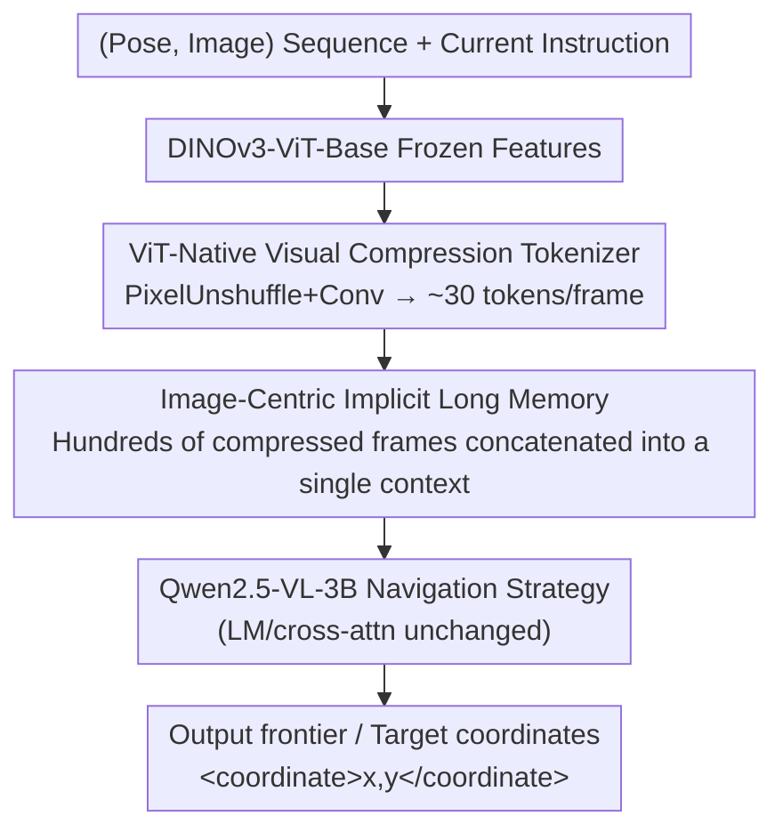

# AstraNav-Memory: Contexts Compression for Long Memory

**Conference**: CVPR 2026  
**Paper**: [CVF Open Access](https://openaccess.thecvf.com/content/CVPR2026/html/Hu_AstraNav-Memory_Contexts_Compression_for_Long_Memory_CVPR_2026_paper.html)  
**Code**: To be confirmed  
**Area**: Robotics / Embodied Navigation  
**Keywords**: Embodied Navigation, Long-term Memory, Visual Context Compression, Visual Token Compression, VLN

## TL;DR
AstraNav-Memory models the "memory" of embodied lifelong navigation as an image-centric implicit representation. Using a ViT-native visual compression tokenizer, it compresses each frame from $598$ visual tokens to approximately $30$ ($\approx 20\times$), allowing Qwen2.5-VL-3B to accommodate hundreds of historical frames in a single context. This facilitates more efficient exploration in unfamiliar environments and shorter paths in familiar environments by reusing memories, achieving SOTA performance on GOAT-Bench and HM3D-OVON.

## Background & Motivation

**Background**: Embodied navigation is transitioning from "single-task, single-goal" to "lifelong, long-horizon" scenarios. In real-world applications (such as home assistants), agents must carry memories across multiple tasks: starting with exploration and reasoning to find targets in unfamiliar rooms, and subsequently relying on memory to navigate directly to targets in familiar environments. The key to achieving this lies in efficiently storing, retrieving, and translating "long-term visual history" into navigation strategies.

**Limitations of Prior Work**: Mainstream memory systems generally fall into two categories. Object-centric memory relies on detection, segmentation, and reconstruction pipelines to crop object coordinates and categories, building queryable semantic maps. While interpretable, this approach suffers from complex pipelines, error propagation, and poor cross-domain generalization. Image-centric memory is more end-to-end, directly retaining poses and multi-view images to allow the model to learn spatial structures internally. However, its primary bottleneck is the **hardware cost of long-term memory**: to truly benefit lifelong tasks, the model must maintain hundreds of frames in its context. Uncompressed raw visual streams contain massive spatial and temporal redundancies. Without compression, long contexts are prohibitively expensive in terms of computation and GPU memory, and attention mechanisms risk being overwhelmed by noise, failing to isolate key information.

**Key Challenge**: A direct conflict exists between making image-centric memory "long" (retaining hundreds of frames) and "frugal" (keeping computation and VRAM manageable without drowning the attention mechanism in noise). The history length $\times$ tokens per frame constitutes the primary bottleneck for long-horizon scalability.

**Key Insight**: The authors observe that visual compression has progressed rapidly, notably with methods like DeepSeek-OCR, which use window attention and highly compressed convolutional features to squash dense image patches into very few tokens with minimal semantic loss. Inspired by this, they introduce "visual context compression" into long-term memory for embodied navigation, aiming to support longer histories under higher compression ratios while stably preserving retrievable spatial-semantic information.

**Core Idea**: By using a **task-aligned visual compression module coupled end-to-end with the navigation strategy**, each frame is compressed to approximately $30$ tokens. This makes the image-centric implicit memory compile both long-horizon coverage and computation efficiency, presenting a highly competitive alternative to object-centric memory.

## Method

### Overall Architecture
AstraNav-Memory formulation models navigation as a seq2seq mapping. The model input is represented as:

$$x = [\text{SYS};\ (P_1, I_1);\ (P_2, I_2);\ \dots;\ (P_T, I_T);\ \text{INSTR}]$$

where SYS is the system prompt, INSTR is the current instruction, and $(P_t, I_t)$ is the camera pose-image pair at frame $t$. The pose $P_t$ is serialized into text tokens and premium-placed before the visual tokens of that frame, allowing the text encoder to handle poses uniformly. The model outputs a natural language response describing the next frontier (exploration boundary) or target, wrapping its 2D coordinates in specialized tags, such as `<coordinate>x, y</coordinate>`.

The pipeline modifies **only the visual input parsing**, keeping the downstream multimodal projector, language model, and cross-attention blocks completely intact. Specifically, the image is first processed by a frozen DINOv3-ViT-Base to extract features, then passed through two stages of PixelUnshuffle and convolutional compression blocks. After flattening, it is joined by a $2\times2$ patch-merger, yielding about $30$ tokens per frame, which are directly fed into the first ViT block of Qwen2.5-VL-3B. The compressed, compact visual tokens, alongside language instructions, enter Qwen2.5-VL-3B to perform long-range navigation reasoning under low computational costs.

### Key Designs

**1. ViT-Native Visual Compression Tokenizer: Compressing each frame to ~30 tokens via rearrangement instead of pooling**

This component addresses the primary bottleneck of "too many tokens per frame $\to$ restricted history length". Instead of modifying Qwen's native patch embeddings, the authors construct a separate compression line. They deploy a **frozen DINOv3-ViT-Base** to extract features. DINOv3 is selected for its strong self-supervised semantics, robustness to domain shifts, and capacity to capture mid-level spatial cues (such as landmarks, layouts, and navigability) without requiring labels. Freezing this backbone stabilizes semantics, reduces training costs, and decouples the compressor and strategy from the encoder, facilitating simple future backbone upgrades.

The core technique of compression relies on **rearrangement instead of pooling** to shorten the sequence, preventing pooling operations from smoothing out crucial geometric information. PixelUnshuffle redistributes each local $2\times2$ neighborhood into the channel dimension:

$$\text{PU}_2:\ \mathbb{R}^{H\times W\times C} \to \mathbb{R}^{\frac{H}{2}\times \frac{W}{2}\times 4C}$$

Each PixelUnshuffle (stride 2) is followed by a stride-1 $3\times3$ convolution + BatchNorm + SiLU, forming a **compression block**: $X^{(i)} = \mathrm{SiLU}(\mathrm{BN}(\mathrm{Conv}(X^{(i-1)})))$. This halves both height and width, reducing the spatial token count by $4\times$ while remapping channels. Stacking $N$ compression blocks yields a spatial compression of $r = 2^{2N} = 4^N$. The primary configuration uses $N=2$ (achieving $16\times$ spatial compression), followed by a $2\times2$ patch-merger. For an input of $720\times640$ with a DINO patch size of $16$, the initial dimensions $H_0\times W_0 = 45\times40$ are padded to $48\times40$. Passing through two blocks reduces this to $(12,10)$, and the merger results in $L_t = \frac{12\cdot10}{4} = 30$ tokens. The final $3\times3$ convolution aligns the channel dimension with the $1280$ hidden dimension of the Qwen2.5-VL-3B ViT, allowing $\tilde Z_t \in \mathbb{R}^{30\times1280}$ (free of CLS/register tokens) to directly enter the first ViT block. In total, each frame is compressed from $598$ tokens to $30$ (approximately $20\times$), leaving downstream pipelines completely untouched. This visual tokenizer is a modular, plug-and-play component that can be applied to other embodied tasks beyond navigation.

**2. Image-Centric Implicit Long Memory: Treating hundreds of compressed frames directly as context memory**

By reducing the token count to ~30 tokens per frame, memory management no longer requires external retrieval databases or explicit semantic maps. The compressed history frames are **directly concatenated into Qwen2.5-VL's context** as implicit memory, achieving end-to-end integration of perception, language, and decision-making. This addresses the traditional limitation of image-centric approaches, where a single context can now retain hundreds of frames to satisfy the long-term implicit memory needs of indoor scenes. Compared to object-centric memory, this setup does not rely on upstream detection or segmentation, avoids error propagation, exhibits superior cross-domain robustness, and simplifies engineering complexity. Compared to prior image-centric methods, the heavy compression greatly extends the maintainable history. Mechanistically, long histories yield two major benefits: in unfamiliar environments, the agent utilizes frontier-based exploration to progressively discover and encode objects into the image-centric memory to improve exploration success rates; in familiar environments, it recalls this long-term implicit memory to plan direct paths, shortening travel steps and substantially improving SPL.

**3. Task-Aligned End-to-End Training and Lifelong Navigation Data Construction: Making compression "serve control" rather than "serve perception"**

The authors highlight that historical compression methods were largely "perception-driven" (aimed at reconstruction or classification), which provides weak constraints on long-term consistency and structured retrievability. AstraNav **trains the compression objective and the navigation strategy end-to-end**, ensuring that the compressed tokens retain spatial-semantic cues useful specifically for planning. To achieve this, they construct two custom datasets: On the OVON side, based on OVON data and following the MTU3D generation method, they discretize navigation into four actions (MOVE_FORWARD, TURN_LEFT, TURN_RIGHT, STOP). A 3D occupancy map is maintained to distinguish "explored/unexplored" areas, with frontiers defined at the boundary of these two zones. The next sub-goal is ranked by the shortest-path cost to the target; it is selected with a high probability from the minimum-cost frontier and randomly sampled with a low probability to balance efficiency and diversity, ultimately yielding OVON-500K by sampling from 145 scenes. On the GOAT side, they leverage the lifelong setting of GOAT-Bench—where the environment and agent states are not reset after a sub-task is completed, allowing the agent to execute subsequent instructions on persistent memory. They slice four datasets, GOAT-1M-50L/100L/200L/500L, based on memory lengths of 50/100/200/500 steps, filtering them to prevent short trajectories from disproportionately dominating. Training involves fine-tuning the base model on a combined 1.5M samples from OVON-500K and the four GOAT subsets.

### Loss & Training
Fine-tuning is conducted on the Qwen2.5-VL-3B base model using the combined 1.5M dataset (OVON-500K + GOAT-1M-50L/100L/200L/500L). Experiments with different input frame counts use the corresponding GOAT split matching the history length. Training is performed on 32 H20 GPUs with a learning rate of $1\times10^{-5}$, a warmup ratio of $0.05$, and up to $2$ epochs. Evaluation relies on Success Rate (SR, defined as stopping within 1m of the goal) and Success rate weighted by Path Length (SPL):

$$\text{SPL} = \frac{1}{N}\sum_{i=1}^{N} S_i \frac{L_i^*}{\max(L_i, L_i^*)}$$

where $S_i\in\{0,1\}$ indicates if the $i$-th case was successful, $L_i^*$ is the shortest path to the target, and $L_i$ is the actual path length, with higher values being better for both.

## Key Experimental Results

### Main Results

GOAT-Bench multimodal lifelong navigation (SR/SPL, higher is better):

| Method | Val-Seen SR | Val-Seen SPL | Val-Unseen SR | Val-Unseen SPL |
|------|------|------|------|------|
| Modular GOAT | 26.3 | 17.5 | 24.9 | 17.2 |
| SenseAct-NN Skill Chain | 29.2 | 12.8 | 29.5 | 11.3 |
| TANGO | - | - | 32.1 | 16.5 |
| MTU3D (Prev. SOTA) | 52.2 | 30.5 | 47.2 | 27.7 |
| **AstraNav-Memory** | **65.5** | **49.0** | **62.7** | **56.9** |

On the challenging Val-Unseen split, the model achieves **62.7 SR / 56.9 SPL**, outperforming the previous SOTA (MTU3D) by **+15.5 SR and +29.2 SPL**. Compared to Modular GOAT, this represents standard improvements of $2.4\times$ in SR and $3.3\times$ in SPL, indicating strong generalization to unfamiliar environments and instructions.

HM3D-OVON open-vocabulary object navigation:

| Method | Val-Unseen SR | Val-Unseen SPL |
|------|------|------|
| Uni-NaVid | 39.5 | 19.8 |
| MTU3D | 40.8 | 12.1 |
| **AstraNav-Memory** | **62.5** | **34.9** |

The model outperforms the previous best-performing model, MTU3D, by +21.7 SR and +22.7 SPL ($\approx 1.5\times$ SR, $1.7\times$ SPL), showing similarly superior generalization on open-vocabulary instructions.

### Ablation Study

Efficiency and accuracy under fixed $16\times$ compression and varying memory lengths (Tab. 3):

| Configuration | SR | Training (s/iter) | VRAM (GB) | Inference (s/instr) |
|------|------|------|------|------|
| 50 (Original, Uncompressed) | 60.2 | 26.4 | 90.6 | 10.3 |
| 50 (16×) | 56.6 | 6.5 | 46.8 | 2.2 |
| 100 (16×) | 57.5 | 9.2 | 68.5 | 4.2 |
| 200 (16×) | 55.2 | 12.0 | 86.8 | 5.6 |

Compression dramatically improves efficiency: for 50 frames, training time drops from 26.4s/iter to 6.5s, VRAM usage decreases from 90.6GB to 46.8GB, and inference time drops from 10.3s to 2.2s. In terms of accuracy, the uncompressed 50-frame baseline remains the best (60.2), indicating that aggressive compression incurs a slight accuracy loss. Among the compressed variants, 100(16$\times$) > 200(16$\times$) > 50(16$\times$). The 100-frame configuration strikes the best balance between "longer history" and "context under-saturation", whereas 200 frames suffers from a decline because the excessively long context makes it difficult for the model to pay attention to the most recent and informative frames.

Interaction of compression rate $\times$ stored frames on SR (Tab. 4, "-" indicates that the budget cannot accommodate this configuration):

| Compression Rate \ Frames | 50 | 100 | 200 | 500 |
|------|------|------|------|------|
| 1× | 60.2 | - | - | - |
| 4× | 61.3 | **63.2** | - | - |
| 16× | 56.6 | 57.5 | 55.2 | - |
| 64× | 42.5 | 49.1 | 48.1 | 47.6 |

Higher compression rates allow a longer history to be accommodated within the same memory footprint ($4\times$ scales from 50 to 100 frames, and $16\times$ scales further to 200 frames), but excessive compression is detrimental: at $64\times$, performance drops sharply (50 frames yields only 42.5), indicating severe loss of token information. Overall, $16\times$ offers a good trade-off between training speed and observable history, while **4$\times$ + 100 frames (63.2) is the overall best**. The authors also caution that the maximum number of frames is not strictly proportional to the compression rate—because the DINOv3 ViT encoder must still retain pre-compression tokens, which dominate VRAM and limit the effective context length.

### Key Findings
- **Compression rate has a sweet spot; more aggressive is not always better**: $4\times$ and $16\times$ compressions perform well, whereas $64\times$ results in significant performance drops. Keeping $30$ tokens per frame ($\approx20\times$) achieves the best trade-off between efficiency and fidelity.
- **The benefits of long-term memory are primarily reflected in "familiar environments"**: Long-term implicit memory shortens paths and reduces step counts in familiar environments (leading to a surge in SPL) without sacrificing exploration success rates in unfamiliar environments.
- **DINOv3 blind spots**: Analyzed by category (Tab. 5), AstraNav performs significantly better on "prominent objects" such as freezer (72 $\to$ 88), piano (67 $\to$ 79), book (66 $\to$ 73), hanging clothes (63 $\to$ 80), and shower glass (53 $\to$ 92). However, it underperforms the original Qwen encoder on fine-textured categories like carpet (61 $\to$ 56), island (97 $\to$ 76.3), and microwave (96 $\to$ 75). Feature visualization reveals that DINOv3 struggles to distinguish texture boundaries between carpets and surrounding floors, suggesting that supplementary mask-level cues, such as those from SAM, may be needed for these boundary-sensitive categories.

## Highlights & Insights
- **Reframing "compression" from a perceptual objective to a control objective**: The most critical shift is training the compression module and navigation strategy end-to-end together. The compressed tokens are not just "clear to look at" but "useful for planning," which explains why the model maintains strong long-horizon navigation metrics while retaining only ~30 tokens.
- **Engineering choice of rearrangement over pooling**: Using PixelUnshuffle to move spatial information into channels, followed by convolutional remapping rather than direct pooling, preserves crucial mid-level geometric cues like landmarks, layouts, and navigability—serving as the technical pivot for aggressive pruning without losing navigation-critical information.
- **Plug-and-play, keeping downstream intact**: Only the visual input phase is modified, DINOv3 is frozen, and Qwen's LM/projector/cross-attention are kept completely unchanged. This makes the tokenizer a generalizable compression component that can be transferred to other embodied tasks, facilitating direct future upgrades of the backbone.
- **The paradigm debate: image-centric vs. object-centric**: This work provides empirical evidence that image-centric implicit memory with strong compression can compete with object-centric memory. This suggests that the memory interface for lifelong embodied agents can be more end-to-end and engineered much more efficiently.

## Limitations & Future Work
- **Performance degradation on boundary-sensitive categories**: DINOv3 struggles to distinguish texture boundaries of surfaces like carpets, making fine-textured targets perform worse than with the original encoder. The authors suggest incorporating segmentation/mask cues like SAM.
- **Inherent precision ceiling under aggressive compression**: Performance drops sharply at $64\times$, and the uncompressed 50-frame baseline still yields the highest accuracy. Compression is lossy by nature, so the benefits of a longer history must be balanced against single-frame fidelity loss.
- **VRAM is still dominated by pre-compression tokens**: The DINOv3 encoder must retain pre-compression tokens, which limits the effective context length and prevents the maximum allowable frames from scaling linearly with the compression rate.
- **Evaluations limited to indoor environments**: Testing is confined to GOAT-Bench/HM3D-OVON (Habitat simulation); stability in outdoor/real-robot closed-loop and dynamic environments remains unverified. ⚠️ Some implementation details (e.g., specific padding/channel alignment values) are subject to the original text.

## Related Work & Insights
- **vs. Object-centric memory (e.g., MTU3D)**: MTU3D uses sparse vectorized object queries to store historical semantics, saving reconstruction costs but still relying on upstream detection and lacking tight coupling with end-to-end planning. AstraNav directly uses compressed image frames as implicit memory, trained end-to-end. It is more robust across domains and comprehensively outperforms MTU3D on GOAT and HM3D.
- **vs. Explicit external memory + retrieval (RAG/MemGPT style)**: Those methods are interpretable and controllable but rely on chunking/indexing heuristics, are sensitive to retrieval recall and latency, and tend to disrupt long-range temporal consistency. This work takes an implicit, token-fusion route, avoiding external indexing but requiring self-contained retrievability.
- **vs. General visual token compression (PVC/VScan, SparseVLM/FocusLLaVA, DeepSeek-OCR)**: The first two types are mostly perception-driven, with weak constraints on long-term consistency or unstable pruning. DeepSeek-OCR achieves extreme compression but is tailored for text recognition, offering no guarantee of spatial-semantic or planning viability in embodied scenarios. AstraNav's distinction lies in being "task-aligned and jointly trained with the navigation strategy," making compression serve control.

## Rating
- Novelty: ⭐⭐⭐⭐ Introducing visual context compression into lifelong embodied navigation memory and training it end-to-end with the strategy is a clear and compelling path (the compression module itself is a combination of existing components).
- Experimental Thoroughness: ⭐⭐⭐⭐ SOTA on two major benchmarks + three types of ablations (compression rate, memory length, category), with both efficiency and accuracy quantified. However, it is limited to indoor simulations.
- Writing Quality: ⭐⭐⭐⭐ The derivation of motivations and the method pipelines are clearly explained, and formulas/dimension derivations are complete.
- Value: ⭐⭐⭐⭐ Provides empirical evidence that "image-centric implicit memory can compete with object-centric approaches," serving as a valuable reference for designing memory interfaces in lifelong embodied agents.

<!-- RELATED:START -->

## Related Papers

- [\[ICLR 2026\] Planning with an Embodied Learnable Memory](../../ICLR2026/robotics/planning_with_an_embodied_learnable_memory.md)
- [\[CVPR 2026\] Affordance Field Intervention: Enabling VLAs to Escape Memory Traps in Robotic Manipulation](affordance_field_intervention_enabling_vlas_to_escape_memory_traps_in_robotic_ma.md)
- [\[CVPR 2026\] Predict Before You Explore: Predictive Planning with Specialized Memory for Embodied Question Answering](predict_before_you_explore_predictive_planning_with_specialized_memory_for_embod.md)
- [\[CVPR 2026\] Memory-Augmented Scene Understanding and Exploration for Open-World Aerial Object-Goal Navigation](memory-augmented_scene_understanding_and_exploration_for_open-world_aerial_objec.md)
- [\[CVPR 2026\] Global Prior Meets Local Consistency: Dual-Memory Augmented Vision-Language-Action Model for Efficient Robotic Manipulation](global_prior_meets_local_consistency_dual-memory_augmented_vision-language-actio.md)

<!-- RELATED:END -->
