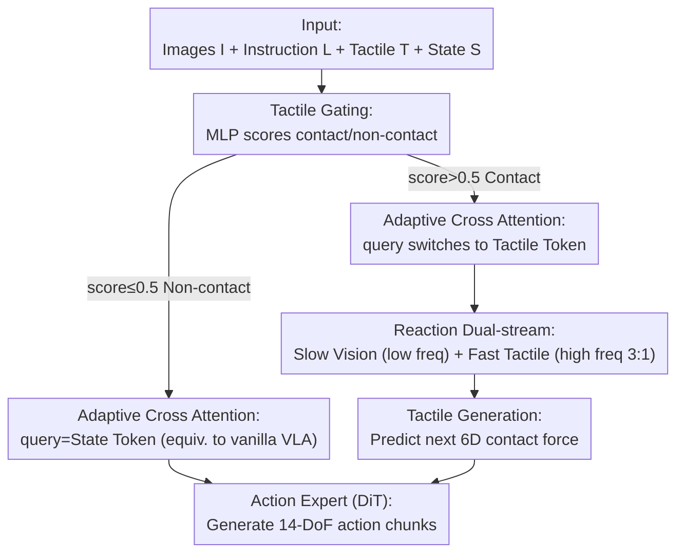

# AT-VLA: Adaptive Tactile Injection for Enhanced Feedback Reaction in Vision-Language-Action Models

**Conference**: CVPR 2026  
**Paper**: [CVF Open Access](https://openaccess.thecvf.com/content/CVPR2026/html/Li_AT-VLA_Adaptive_Tactile_Injection_for_Enhanced_Feedback_Reaction_in_Vision-Language-Action_CVPR_2026_paper.html)  
**Code**: [Project Page](https://sites.google.com/view/at-vla) (Code not yet released)  
**Area**: Robotics / Embodied AI  
**Keywords**: VLA, Tactile Feedback, Contact-rich Manipulation, Adaptive Injection, Dual-stream Policy

## TL;DR
AT-VLA introduces a learnable tactile gating mechanism into pre-trained VLAs (GO-1), injecting tactile signals into the action expert only during the moment of "object contact" to prevent the new modality from disrupting pre-trained visual grounding capabilities. By decoupling a slow visual stream and a fast tactile stream, it achieves a 0.04s closed-loop reaction, improving average success rates from 0.22 (vanilla) to 0.50 in real contact-rich tasks such as unzipping, stamping, wiping vases, and unscrewing caps.

## Background & Motivation
**Background**: Vision-Language-Action (VLA) models unify visual perception, semantic reasoning, and action generation into a single framework. Leveraging large-scale manipulation datasets and foundation models, they allow robots to ground linguistic instructions into perception to complete diverse tasks. Prevailing approaches (e.g., π0, GO-1) use VLM outputs as conditions and generate action chunks through diffusion or flow-matching action experts.

**Limitations of Prior Work**: Such models still struggle with "contact-rich" tasks. Tasks like unzipping or unscrewing require precise physical interaction force feedback. Pure vision-language VLAs cannot perceive contact forces, often leading to jammed zippers, stamps colliding with tables, or vases being knocked over during wiping. To compensate, existing works directly inject tactile modalities during downstream fine-tuning to make the model "understand" tactile signals (via multi-modal alignment or CoT reasoning).

**Key Challenge**: Tactile signals and the vision/language data used for pre-training are inherently different types of information, which the model rarely encountered during pre-training. The authors conducted a crucial experiment: directly concatenating tactile tokens into the action expert caused performance to drop—even visual grounding for grasping worsened. Attention maps revealed that tactile inputs pushed the model's focus away from the target object toward surrounding areas (see Tab.3, where Ex1 is 9% lower than Ex0). In other words, **the new modality disrupts pre-trained perceptual focus**. Another contradiction is that VLA inference is inherently slow, failing to keep up with high-frequency tactile feedback for timely closed-loop adjustments.

**Goal**: ① Integrate tactile sensing without destroying pre-trained capabilities; ② Enable the model to make real-time and accurate action adjustments based on high-frequency tactile feedback.

**Key Insight**: Vision and touch are complementary—vision handles contextual localization, while touch handles precise contact feedback. Thus, the model should maintain vanilla VLA behavior (relying on vision) during the "non-contact phase" and only introduce tactile sensing "when contact occurs." This maximizes the reuse of pre-trained representations.

**Core Idea**: Use a learnable "tactile gate" to dynamically decide **when and where** to inject tactile data (Adaptive Tactile Injection) and decouple frequencies into a **slow visual stream + fast tactile stream** to achieve a 0.04s loop for tactile reactions.

## Method

### Overall Architecture
AT-VLA uses a pre-trained GO-1 as the vanilla VLA (InternVL-2B as VLM, DiT as action expert), with an additional lightweight MLP tactile encoder. The policy $\pi_\theta$ takes inputs from three cameras $I=\{I_h, I_r, I_l\}$, language instructions $L$, tactile feedback $T$ (resultant force extracted from sensors, including 3D normal + 3D tangential components), and proprioceptive state $S$. It outputs action chunks $A=\pi_\theta(I,L,T,S)$ for 14-DoF bimanual end-effector poses.

The pipeline hinges on two "switching behaviors": a **Tactile Gating** module first determines if contact exists. When the gate is closed, the model's input and structure are identical to the vanilla VLA; when open, **Adaptive Cross Attention** switches the action expert's query from state tokens to tactile tokens. Meanwhile, the **Reaction Dual-stream** processes tactile data at a 3:1 higher frequency than vision-language updates. A **Tactile Generation** objective predicts the next-step contact force to strengthen physical dynamics understanding. All three components align with the strategy of "minimal-intrusion tactile injection only during contact."

### Key Designs

**1. Adaptive Tactile Injection: Using gates to decide "when" to inject, avoiding pre-trained representation contamination.**

This addresses the issue where direct tactile injection distracts attention from the target. The process is split into two steps. The first is **Tactile Gating**: The tactile encoder encodes signals into tokens $z_T$, which pass through a lightweight MLP to output a contact score. Supervision is provided by manually labeling each frame of training episodes as 0 (non-contact) or 1 (contact), using a binary cross-entropy gating loss $L_g$. When the score exceeds a threshold (e.g., 0.5), the gate activates, allowing the model to learn precisely when contact occurs.

The second is **Adaptive Cross Attention**, which ensures structural consistency across gate states. In the vanilla VLA action expert's cross-attention, image tokens $z_I$ and text tokens $z_L$ serve as keys/values, while state tokens $z_S$ serve as queries. AT-VLA **only replaces the source of the query**: when the gate is inactive, the query remains $z_S$ (identical to vanilla VLA); when active, it is replaced by tactile tokens $z_F$. This keeps the structure and dimensions unchanged, preserving visual localization during non-contact phases while conditioning action generation on touch during contact.

**2. Tactile Reaction Dual-stream: Slow-fast decoupling for a 0.04s loop.**

To address slow VLA inference, perception is split into two frequency streams. The **Slow Stream** uses the heavy VLM to process vision and language at a low frequency for task understanding, outputting latent features as keys/values. The **Fast Stream** processes tactile feedback at high frequency to serve as queries.

Based on action chunking, vision-language observations at $t_n$ guide future $H$ steps $(t_n{:}t_{n+H})$. Thus, slow stream outputs are used as temporal conditions for the next $H$ steps. The fast stream generates actions using the latest tactile feedback $t_{n+k}\,(0<k<H)$ at each step. During training, the frequency ratio is randomized between $h{:}1\,(1<h<H)$; during inference, it is fixed at 3:1 (one slow update per three fast updates), pushing the closed-loop reaction to 0.04s.

**3. Tactile Generation: Force prediction for physical dynamics understanding.**

To go beyond simply "reading" tactile data, the authors added a **Tactile Generation** auxiliary objective. Using tactile tokens from after the action expert, a lightweight decoder predicts the 3D normal and tangential forces for the next timestep. An MSE generation loss $L_r$ aligns these with ground truth, forcing the model to build a more complete representation of physical dynamics. Ablation studies show this provides a 4% performance boost.

### Loss & Training
All objectives are trained simultaneously with a total loss of:
$$L = L_a + \lambda_1 L_g + \lambda_2 L_r,$$
where $L_a$ is the action loss, $L_g$ is the gating binary cross-entropy loss, and $L_r$ is the tactile generation MSE loss, with $\lambda_1=\lambda_2=0.01$.

## Key Experimental Results

Experiments used AgiBot Genie1 with tactile sensors on the grippers. Four contact-rich tasks (unzipping, stamping, wiping vase, unscrewing) and two non-contact tasks (pick-place, open drawer) were evaluated across 30-50 demonstrations and 15 trials per task.

### Main Results: Contact-rich Task Success Rates
The "Overall" column represents the full task success rate.

| Task | Metric | GO-1 (vanilla) | π0.5 | AT-VLA (Ours) |
|------|------|------|------|------|
| Unzip Bag | Overall | 0.20 | 0.0 | **0.33** |
| Stamp | Overall | 0.33 | 0.20 | **0.46** |
| Wipe Vase | Overall | 0.07 | 0.33 | **0.33** |
| Unscrew Lid | Overall | 0.27 | **0.47** | 0.46 |

AT-VLA matches GO-1/π0.5 in pre-contact grasping (showing no disruption to pre-trained localization) and outperforms them during contact. Compared to VTLA/RDP which also use tactile sensing, it performs better. It only slightly lags in unscrewing because competitors were manually placed in ideal grasp poses, whereas AT-VLA performs end-to-end grasping.

### Ablation Study: Component Contribution (Average of 4 contact-rich tasks)

| Configuration | Avg Success Rate | Description |
|------|-----------|------|
| Ex0 Vanilla VLA | 0.22 | GO-1 baseline, no tactile |
| Ex1 + Adaptive Cross Attention | 0.13 | Direct injection without gating; lower than baseline |
| Ex2 + Tactile Gating | 0.39 | +17% over baseline; gating preserves pre-trained knowledge |
| Ex3 + Tactile Generation | 0.43 | +4% over Ex2 |
| Ex4 + Reaction Dual-stream (Full) | **0.50** | +7% over Ex3; high-frequency necessity |

### Key Findings
- **Gating is critical**: Ex1 (direct injection without gating) performed 9% worse than vanilla, but adding the gate (Ex2) resulted in a 17% gain over the baseline—confirming that indiscriminate tactile injection pollutes representations.
- **Robustness without tactile signals**: AT-VLA (w/o tactile at inference) performed better than GO-1 on the Stamp task (0.20 vs 0.13). This suggests the model learns contact dynamics and cross-modal associations during training, allowing it to infer tactile cues implicitly from vision.
- **Lower-dimensional tactile formats are more stable**: 6D force outperformed 2D markers or visuo-tactile images. The authors hypothesize that high-dimensional inputs introduce too many tokens, over-perturbing the representation space.

## Highlights & Insights
- **"Query-switching" is elegant**: Adaptive cross-attention achieves "zero intrusion" during non-contact and "tactile integration" during contact by merely swapping query sources, without altering sequence length or dimensions. This is the core difference from works that simply concatenate tactile tokens.
- **System 1/2 Paradigm for Tactile**: While previous dual-stream models used vision or point clouds as the fast stream, this is the first to use high-frequency tactile data for the fast stream, naturally fitting the need for rapid response during physical interactions.
- **Gating + Frame-level Annotation is a reusable trick**: Manual 0/1 labeling for a lightweight gate is a low-cost "trigger learning" strategy that can be migrated to other multi-modal tasks where a modality is only needed at specific moments.

## Limitations & Future Work
- **Dependency on Human Annotation**: Labeling 0/1 contact frames for every demonstration is costly at scale.
- **Grasping Stability**: The unscrewing task was slightly inferior to baselines using manual initialization, indicating that AT-VLA improves contact phase reactions rather than the force-loop of the grasp itself.
- **Small-scale Real-robot Validation**: Each task had limited samples/trials; future work must expand to more complex tasks and environments.
- **Empirical Frequency Ratio**: The 3:1 ratio is heuristic; whether optimal ratios vary by task remains unexplored.

## Related Work & Insights
- **vs TA-VLA / VTLA**: These focus on "understanding" tactile semantics (e.g., visuo-tactile images with ViTs), potentially at the cost of visual perception. AT-VLA balances pre-trained knowledge with tactile learning via two-stage gating.
- **vs Groot-N1**: Both use slow-fast systems, but Groot-N1 uses vision as the fast stream, while AT-VLA uses tactile data for real-time contact event reaction.
- **vs RDP**: RDP uses high-frequency feedback for diffusion policies without large-scale pre-training. AT-VLA leverages pre-trained VLAs for general perception while achieving similar reactive capabilities.

## Rating
- Novelty: ⭐⭐⭐⭐⭐ "Query-swap" adaptive injection and tactile-fast dual streams effectively balance pre-training with new modality learning.
- Experimental Thoroughness: ⭐⭐⭐⭐ 6 real-robot tasks and comprehensive ablations, though sample counts are relatively small.
- Writing Quality: ⭐⭐⭐⭐ Clear motivation and traceable ablations; frameworks and notation are somewhat dense.
- Value: ⭐⭐⭐⭐⭐ Provides a reusable paradigm for safely injecting new modalities into pre-trained VLAs, highly practical for contact-rich operations.

<!-- RELATED:START -->

## Related Papers

- [\[CVPR 2026\] ACoT-VLA: Action Chain-of-Thought for Vision-Language-Action Models](acot-vla_action_chain-of-thought_for_vision-language-action_models.md)
- [\[CVPR 2026\] Test-Time Perturbation Tuning with Delayed Feedback for Vision-Language-Action Models](test-time_perturbation_tuning_with_delayed_feedback_for_vision-language-action_m.md)
- [\[CVPR 2026\] Adaptive Action Chunking at Inference-time for Vision-Language-Action Models](adaptive_action_chunking_at_inference-time_for_vision-language-action_models.md)
- [\[CVPR 2026\] TRM-VLA: Temporal-Aware Chain-of-Thought Reasoning and Memorization for Vision-Language-Action Models](trm-vla_temporal-aware_chain-of-thought_reasoning_and_memorization_for_vision-la.md)
- [\[CVPR 2026\] MoEActok: A MoE-based Action Tokenizer for Vision-Language-Action Models](moeactok_a_moe-based_action_tokenizer_for_vision-language-action_models.md)

<!-- RELATED:END -->
