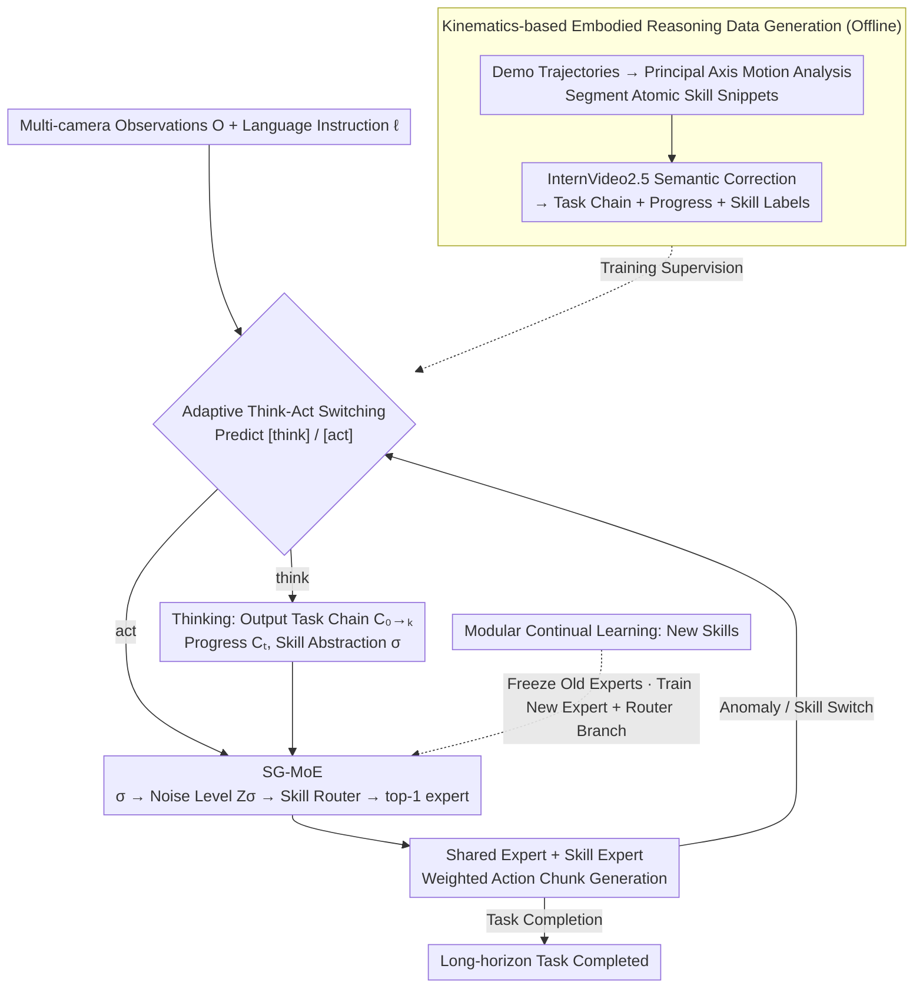

# AtomicVLA: Unlocking the Potential of Atomic Skill Learning in Robots

**Conference**: CVPR 2026  
**arXiv**: [2603.07648](https://arxiv.org/abs/2603.07648)  
**Institutions**: Sun Yat-sen University, Peng Cheng Laboratory, Yinwang Intelligent
**Area**: Robotic Manipulation / Vision-Language-Action Models  
**Keywords**: VLA, Atomic Skills, Mixture-of-Experts, Continual Learning, Task Planning, Skill Routing

## TL;DR

This paper proposes AtomicVLA, a unified planning-execution framework built upon $\pi_0$. By utilizing adaptive Think-Act switching to generate atomic skill abstractions and routing actions to specialized experts via Skill-Guided MoE (SG-MoE), it improves the LIBERO-LONG success rate from 85.2% to 95.2% (+10%), achieves a +18.3% Gain in real-world Franka long-horizon tasks, and increases continual learning performance by 21%.

## Background & Motivation

- **Limitations of Prior Work**: Current VLA models (e.g., $\pi_0$, OpenVLA) employ a single action decoder, mixing all skill knowledge within the same parameter set. They lack explicit planning capabilities for multi-step tasks and suffer from catastrophic forgetting when learning new skills.
- **Background**: Methods like SayCan and Inner Monologue use external LLMs for high-level planning combined with independent low-level controllers. However, the lack of mutual awareness between the planner and executor leads to outdated or irrelevant instructions and system latency.
- **Goal**: Robotic models must simultaneously support (1) high-level reasoning and task planning, (2) fine-grained action generation, and (3) scalable continual learning—capabilities that existing methods fail to provide concurrently.
- **Key Idea**: To decompose complex tasks into reusable atomic skills (e.g., grasp, push, rotate), where each skill is handled by a dedicated expert. This modular design enables the continuous expansion of a skill library.

## Method

### Overall Architecture

AtomicVLA is an end-to-end framework based on $\pi_0$ that unifies thinking and acting modalities. Given multi-camera observations $O_t^{1:n}$ and a language instruction $\ell$, the model adaptively predicts whether to enter thinking or acting mode:

- **Thinking Mode**: Activated at task onset or sub-skill transitions. It generates three outputs: a task chain $C_{0 \to k}$ (decomposing instructions into ordered sub-goals), current progress $C_t$, and an atomic skill abstraction $\sigma$.
- **Acting Mode**: Activated during execution. Based on the latest skill abstraction $\sigma$ and proprioceptive state $s_t$, it generates action chunks $A_t$ via SG-MoE.

Offline, kinematic data is used to generate supervision for "task chain + progress + skill labels." During runtime, the model switches adaptively between think and act modes. In the act phase, SG-MoE routes actions to specialized experts. If an anomaly or sub-skill transition is detected, the model returns to the think phase for re-planning. New skills are added to the library by extending the architecture without modifying existing components.

### Key Designs

**1. Adaptive Think-Act Switching: Self-determined Planning vs. Execution**

Running high-level planning at every frame is wasteful, as robots mostly execute pre-determined sub-goals. However, removing planning entirely causes models to lose track in multi-step tasks. AtomicVLA introduces [think] and [act] tokens into the vocabulary, allowing the model to decide its mode at each step. Planning occurs only at task starts or transition points, saving computation while enabling error recovery; if an object is dropped, the model detects the anomaly, switches to [think], and regenerates the skill abstraction.

**2. SG-MoE: Semantic Skill Routing for Expert Specialization**

Standard MoE routes at the token level, forcing experts to learn a mix of skills. SG-MoE uses the atomic skill abstraction $\sigma$ as the routing signal. Each skill maps to a scalar noise level $\sigma \in [0,100]$, converted into a high-dimensional vector $Z_\sigma = E(\text{norm}(\log(\sigma)))$. The Skill Router calculates the distribution over $Z_\sigma$ to activate the top-1 skill expert. The final action is a weighted combination of a shared expert (preserving general capability) and a specialized skill expert:

$$F_{out} = (1-w_k) \cdot F_{share}(x_t) + w_k \cdot F_k(x_t)$$

**3. Modular Continual Learning: Scalable Expansion without Forgetting**

Traditional VLA fine-tuning causes catastrophic forgetting (e.g., $\pi_{0.5}$ loses 15% performance on old skills after learning new ones). AtomicVLA treats new skills as additions: when a new atomic skill is introduced, only a new randomly initialized expert is added, and the router's embedding space is expanded. Existing experts are frozen, ensuring zero degradation of prior knowledge without requiring EWC or experience replay.

**4. Kinematic-based Embodied Reasoning Data Generation: Physical Priors over VLM Segmentation**

Data for the thinking mode is generated using a two-stage pipeline. First, principal axis motion analysis of trajectories (tracking translation, rotation, and gripper states) automatically segments trajectories into atomic snippets (e.g., Z-axis descent + gripper closure = "pick"). Second, InternVideo2.5 provides semantic labels to refine these segments. This kinematic boundary detection is more precise and requires less human intervention than pure VLM-based methods.

## Key Experimental Results

### Main Results: LIBERO Benchmark (Success Rate %)

| Method | Spatial | Object | Goal | Long | Avg. |
|------|---------|--------|------|------|------|
| Octo | 78.9 | 85.7 | 84.6 | 51.1 | 75.1 |
| OpenVLA | 84.9 | 88.4 | 79.2 | 53.7 | 76.5 |
| CoT-VLA | 87.5 | 91.6 | 87.6 | 69.0 | 81.1 |
| $\pi_0$ | 96.4 | 98.8 | 95.8 | 85.2 | 94.2 |
| $\pi_{0.5}$ | 98.8 | 98.2 | 98.0 | 92.4 | 96.9 |
| **AtomicVLA** | 96.8 | 98.0 | 96.4 | **95.2** | **96.6** |
| **AtomicVLA\*** | **98.8** | **98.8** | **97.2** | **96.2** | **97.8** |

### Main Results: CALVIN ABC→D (Task Sequence Completion Rate %)

| Method | 1 Task | 2 Tasks | 3 Tasks | 4 Tasks | 5 Tasks | Avg.Len↑ |
|------|-------|-------|-------|-------|-------|----------|
| $\pi_0$ | 94.3 | 87.0 | 77.9 | 68.5 | 59.4 | 3.87 |
| $\pi_{0.5}$ | 91.9 | 84.6 | 79.4 | 75.5 | 71.0 | 4.02 |
| **AtomicVLA** | 95.0 | 87.8 | 81.9 | 75.0 | 69.1 | **4.09** |
| **AtomicVLA\*** | 94.1 | **88.7** | **85.2** | **81.7** | **77.6** | **4.27** |

### Real Franka Robot: Long-horizon Tasks (Success Rate %)

| Method | Put in Plate | Put in Drawer | Put in Microwave | Avg. | ΔAvg. |
|------|----------|------------|-------------|------|-------|
| $\pi_0$ | 45 | 55 | 10 | 36.7 | — |
| $\pi_{0.5}$ | 65 | 35 | 35 | 45.0 | — |
| AtomicVLA | 65 | 60 | 45 | 56.7 | +20.0 |
| AtomicVLA\* | **75** | **60** | **55** | **63.3** | **+18.3** |

### Ablation Study: SG-MoE Routing Mechanism (LIBERO-LONG %)

| Method | LIBERO-LONG |
|------|-------------|
| $\pi_0$ (No MoE) | 85.2 |
| + Standard Token-level MoE | 88.6 (+3.4) |
| + MoDE (Denoising-step Routing) | 89.5 (+4.3) |
| + **SG-MoE (Atomic Skill Routing)** | **95.2 (+10.0)** |

### Key Findings

- **Significant Gains in LIBERO-LONG**: AtomicVLA improves success rates by 10% on the most challenging long-sequence tasks, proving the value of explicit planning and skill decomposition.
- **Superiority of SG-MoE**: Compared to standard token-level MoE (+3.4%) and MoDE (+4.3%), SG-MoE (+10.0%) ensures all tokens of a specific skill are processed by the same expert, minimizing cross-skill interference.
- **Minimal Forgetting**: While $\pi_{0.5}$ experiences a 15% drop in prior skill performance after learning new tasks, AtomicVLA\* shows only a 1.3% decrease.
- **Error Recovery**: The model demonstrates the ability to detect task failures and re-plan by generating new skill abstractions, though standard benchmarks like CALVIN may not fully capture this benefit.

## Highlights & Insights

- **Unified Think-Act Paradigm**: Deeply couples planning with atomic skill abstractions—the output of the "thinking" phase directly drives MoE routing decisions.
- **Noise-scheduled Skill Embedding**: Adopts diffusion model concepts to map discrete skill labels to a continuous embedding space for effective routing.
- **Additive Continual Learning**: Solves the forgetting problem through architectural isolation (freezing old experts) rather than complex regularization.
- **Physically Grounded Data Generation**: Uses principal axis motion analysis to provide more reliable action segmentation than pure VLM video interpretation.

## Limitations

- Skill label quality depends on InternVideo2.5, which may struggle with rare or highly specialized operations.
- Top-1 routing may be insufficient for tasks requiring simultaneous "multi-skill" coordination (e.g., pushing while rotating).
- Linear growth of parameters with each new skill expert lacks a mechanism for expert merging or pruning.
- Improvement on CALVIN is smaller than on LIBERO, likely due to a misalignment between CALVIN task granularity and defined atomic skills.

## Related Work & Insights

- **vs. $\pi_0$/$\pi_{0.5}$**: These models predict actions via pure flow matching without explicit planning. AtomicVLA adds thinking and routing, yielding a +10% Gain on LIBERO-Long.
- **vs. SayCan/Inner Monologue**: These decouple planning (LLM) from execution (controller). AtomicVLA unifies them within a single model to close the modality gap.
- **vs. MoDE**: While MoDE uses denoising timesteps for routing, it remains token-level. SG-MoE uses semantic skill labels, proving skill-level routing is more effective (+5.7%).

## Rating

- Novelty: ⭐⭐⭐⭐⭐ 
- Experimental Thoroughness: ⭐⭐⭐⭐ 
- Writing Quality: ⭐⭐⭐⭐ 
- Value: ⭐⭐⭐⭐⭐ 

<!-- RELATED:START -->

<!-- RELATED:END -->

## Related Papers

- [\[CVPR 2026\] SwiftVLA: Unlocking Spatiotemporal Dynamics for Lightweight VLA Models at Minimal Overhead](swiftvla_unlocking_spatiotemporal_dynamics_for_lightweight_vla_models_at_minimal.md)
- [\[CVPR 2026\] Towards Motion Turing Test: Evaluating Human-Likeness in Humanoid Robots](towards_motion_turing_test_evaluating_human-likeness_in_humanoid_robots.md)
- [\[NeurIPS 2025\] Policy Compatible Skill Incremental Learning via Lazy Learning Interface](../../NeurIPS2025/robotics/policy_compatible_skill_incremental_learning_via_lazy_learning_interface.md)
- [\[CVPR 2026\] MergeVLA: Cross-Skill Model Merging Toward a Generalist Vision-Language-Action Agent](mergevla_cross-skill_model_merging_toward_a_generalist_vision-language-action_ag.md)
- [\[ICCV 2025\] iManip: Skill-Incremental Learning for Robotic Manipulation](../../ICCV2025/robotics/imanip_skill-incremental_learning_for_robotic_manipulation.md)

<!-- RELATED:END -->
