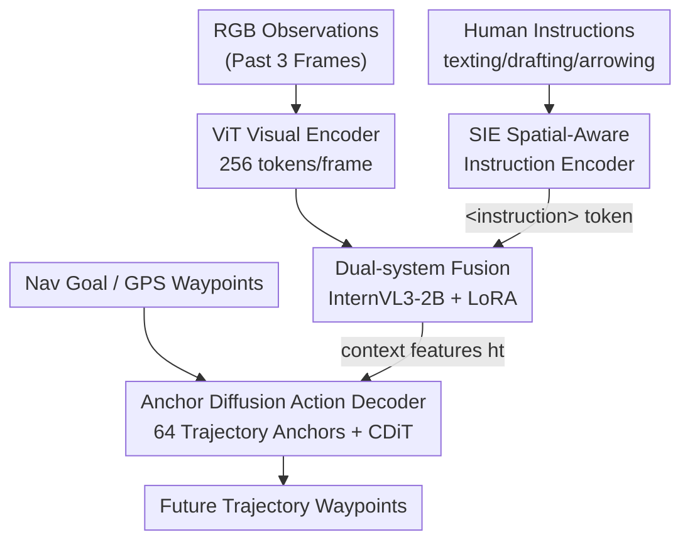

# AURA: Multi-modal Shared Autonomy for Urban Navigation

**Conference**: CVPR 2026  
**Paper**: [CVF Open Access](https://openaccess.thecvf.com/content/CVPR2026/html/Ma_AURA_Multi-modal_Shared_Autonomy_for_Urban_Navigation_CVPR_2026_paper.html)  
**Code**: Project Page https://vail-ucla.github.io/aura/ (No independent repository found)  
**Area**: Embodied AI / Robot Navigation  
**Keywords**: Shared Autonomy, Vision-Language-Action (VLA), Urban Sidewalk Navigation, Diffusion Policy, Instruction Following

## TL;DR
AURA decomposes urban sidewalk navigation into hierarchical shared autonomy where "humans provide high-level instructions and AI handles low-level control." By using a Spatial-Aware Instruction Encoder (SIE) to align text, sketches, and arrows with scene semantics and geometry, and an anchor-based diffusion policy to generate trajectories, it reduces human takeover frequency by 44% and operational costs by over 70% in both simulation and real-world environments.

## Background & Motivation
**Background**: "Mobile machines" such as sidewalk delivery robots and assisted wheelchairs currently rely on human-in-the-loop teleoperation or close supervision to ensure safety. Proposed shared autonomy allows AI to assist human operators during training or testing with the goal of freeing humans to perform only "monitoring and failure intervention."

**Limitations of Prior Work**: Existing shared autonomy methods almost exclusively assume that humans and AI work within the **same low-level action space**—meaning both directly control wheel speed or steering. Consequently, humans must operate continuously at the same frequency as the AI. For long-range tasks like urban sidewalk delivery, this coupling is inefficient and imposes a heavy cognitive load, as humans must focus on wheel-level details.

**Key Challenge**: Long-range navigation truly requires human intervention for **high-level strategic judgment** (e.g., how to bypass crowds or which alternative route to take), yet existing frameworks lock humans into **high-frequency low-level control**. Furthermore, pure language instructions (such as those used in RLHF/InstructGPT) can only express high-level intent and cannot support the real-time, high-frequency, safety-critical fine-grained corrections needed for navigation.

**Goal**: To design a shared autonomy system capable of understanding multi-modal human instructions while performing low-level control autonomously, allowing humans to intervene only when necessary via low-bandwidth methods, thereby significantly reducing operational costs.

**Key Insight**: Distribute urban navigation by abstraction levels—humans handle high-level instructions (reasoning through corner cases, proposing routes), while AI handles low-level execution (lane keeping, obstacle avoidance). A key observation is that human intervention has three natural low-bandwidth modes—texting intent, drafting a path on the screen, or drawing an arrow for velocity/direction—all of which are less taxing than continuous joystick operation.

**Core Idea**: Use a dual-system VLA model that connects "multi-modal instruction understanding" with "diffusion-based trajectory generation." A specially designed SIE explicitly grounds geometric information from instructions into the spatial scene, enabling the robot to be guided by a single sentence, line, or arrow.

## Method

### Overall Architecture
AURA is an end-to-end shared autonomy framework. It takes first-person RGB observations (past 3 frames) and optional human instructions as input and outputs future trajectory waypoints. It offers two modes: **Autopilot**, where sparse GPS waypoints are used for sidewalk following and obstacle avoidance; and **Takeover**, where humans intervene via texting, drafting, or arrowing when GPS is unreliable, goals are ambiguous, or corner cases occur. The system relies solely on monocular RGB perception without pre-built maps or explicit localization modules, modeling navigation as sequential decision-making.

The architecture follows a **dual-system** design: a multi-modal encoder encodes observations and instructions into context features $h_t$, and a diffusion-based policy executor generates trajectories. Specifically, RGB frames are processed by a ViT encoder (resized to 448×448, projected into 256 tokens per frame). Human instructions are injected via a special `<instruction>` token after being encoded by the SIE. These tokens are fused in a pre-trained InternVL3-2B LLM (with LoRA adapters). Intermediate representations $h_t$ are extracted from the 12th layer to balance inference speed and quality, and a lightweight text head decodes readable reasoning traces for linguistic supervision. Finally, $h_t$ is cross-attended by a DiT action decoder to conditionally generate continuous trajectories.

### Key Designs

**1. Hierarchical Shared Autonomy and Dual-System Architecture: Liberating Humans from Low-Level Control**
To address the pain point of humans being forced into the same low-level action space as AI, AURA explicitly splits navigation into two abstraction layers. Humans provide high-level instructions only during Takeover, while AI handles low-level control during Autopilot, switching between modes as needed (hierarchical takeover). In the model, the multi-modal VLM encoder "understands what the human wants," and the diffusion policy "calculates how to move." This VLA design allows the AI to act as an "autopilot assistant" that can be integrated into existing robots without hardware modifications.

**2. SIE (Spatial-Aware Instruction Encoder): Grounding Human Instruction Geometry**
The hardest part of shared autonomy is grounding ambiguous instructions into the environment. Standard VLMs have strong semantics but weak spatial awareness. The SIE addresses this by first **rendering** instructions (trajectory lines, arrows) onto the observation image as visual prompts, using the same visual encoder to extract features $V_c$. It then injects **geometric** embeddings. For drafting, $K$ pixels $p_d=\{(u_i,v_i)\}$ are sampled along the projected line. Following Segment Anything, Fourier positional encoding is used:
$$PE(p_{d,i}) = [\sin(w^\top p_{d,i}),\ \cos(w^\top p_{d,i})]$$
Learnable order embeddings are added: $E^{(i)}_d = PE(p_{d,i}) + \mathrm{PosEmbed}(i)$. For arrowing (velocity $v$ and orientation $\omega$), a rotation-invariant encoding is used:
$$E_s = \mathrm{MLP}\big([\cos(\omega'),\ \sin(\omega'),\ \log(1+|v|)]\big),\quad \omega' = \omega + \pi\cdot \mathbb{1}_{v<0}$$
The geometric embedding $E\in\{E_d,E_s\}$ then cross-attends with visual features $V_c$ to produce instruction-aware features for the LLM.

**3. Anchor-based Diffusion Action Decoder: Starting from Motion Primitives**
Low-level control involves generating multi-modal solutions for long-range trajectories. AURA uses a diffusion-based DiT policy but **does not start from Gaussian noise**. Instead, it initializes the diffusion process from $m=64$ trajectory anchors (motion primitives like straight, turn, stop) clustered via MM-CoS. A lightweight transformer decoder denoises the input conditioned on context $h_t$, goal $g_t$, and timestep $t_d$. During training, the loss includes classification and regression:
$$L = L_{cls} + L_{reg}$$
This provides a structured prior and naturally supports multi-modality.

**4. MM-CoS Dataset and Automated Annotation Pipeline**
AURA repurposes 50 hours (3,040 trajectories) of real sidewalk teleoperation logs. An automated pipeline uses InternVL3-8B to score "interestingness" (based on visual complexity) and weighted motion saliency to prioritize informative frames. Qwen2.5VL-72B then generates command-style instructions (texting, drafting, arrowing) to mirror the three human interfaces.

### Loss & Training
Training occurs in two stages. **Stage 1** performs instruction-conditioned VLM adaptation, freezing the visual encoder and training the SIE and LoRA adapters using language modeling loss on trajectory captions. **Stage 2** involves end-to-end training of the diffusion policy, freezing the multi-modal encoder and training the diffusion decoder and auxiliary encoders with $L_{cls} + L_{reg}$.

## Key Experimental Results

### Main Results
In open-loop evaluation (MM-CoS test set, `*` denotes retraining on this dataset), the arrowing variant achieved the lowest L2 error, while the drafting variant achieved the highest mAP:

| Method | minADE@1s↓ | minFDE@1s↓ | L2@1s↓ | L2@2s↓ | mAP↑ |
|------|-----------|-----------|--------|--------|------|
| ViNT* | 0.247 | 0.450 | 0.425 | 0.925 | - |
| CityWalker* | 0.180 | 0.353 | 0.353 | 0.786 | - |
| **AURA (arrowing)** | **0.108** | 0.220 | **0.150** | **0.473** | 0.750 |
| **AURA (drafting)** | 0.122 | 0.218 | 0.244 | 0.557 | **0.844** |

The L2@2s of the arrowing variant (0.473) is **39.8%** lower than the strongest baseline.

Real-world closed-loop trials (2.8 km):
| Method | HO(%)↓ | NIR↓ | ODR↓ | TSR↑ |
|------|--------|------|------|------|
| NoMaD | 9.74 | 43.2 | 11.3 | 89.0 |
| **AURA** | **1.73** | **16.99** | **10.5** | **89.3** |
(HO=Human Operation %, NIR=Interventions per 100m, ODR=Off-path Distance Ratio, TSR=Time Success Rate.)

### Ablation Study
Instruction understanding capability (ROUGE-L and Intent/Qwen Score):

| Config | Finetune | Visual Prompt | SIE | ROUGE-L↑ | Intent Score↑ |
|------|----------|---------------|-----|----------|---------------|
| InternVL3-2B | ✗ | ✗ | ✗ | 0.167 | 2.019 |
| **AURA** | ✓ | ✓ | ✓ | **0.581** | **5.446** |

### Key Findings
- **Fine-tuning and datasets are critical**: Small fine-tuned models (InternVL3-2B) significantly outperform larger non-fine-tuned ones.
- **Visual prompts and SIE are complementary**: Geometric encoding provides long-term spatial consistency and memory, while visual prompts handle short-term tracking.
- **Shared control costs are slashed**: High-level instructions reduce human operation time by 9.9% and frequency by **44%**.

## Highlights & Insights
- **Unified Interfaces**: The mirroring of texting/drafting/arrowing between human interaction and automated oversight is a robust "interaction-as-supervision" design.
- **Geometric Grounding**: Using Fourier positional encoding for drafted points and rotation-invariant encoding for arrows effectively addresses the spatial weakness of VLMs.
- **Anchor-based Priors**: Initializing diffusion from motion primitives rather than noise provides a structured prior for long-range trajectory generation.

## Limitations & Future Work
- The lack of an independent repository affects reproducibility.
- Real-world trials were limited to 2.8 km with a single robot type.
- Simulation-based "judgments" for takeovers simplify human behavioral unpredictability.

## Related Work & Insights
- Compared to same-action-space shared autonomy (e.g., CityWalker), AURA reduces intervention frequency by 44%.
- Compared to pure language VLA, AURA provides the fine-grained spatial guidance necessary for navigation via SIE and geometric instructions.

## Rating
- Novelty: ⭐⭐⭐⭐ Systematic combination of hierarchical autonomy, SIE grounding, and anchor-based diffusion.
- Experimental Thoroughness: ⭐⭐⭐⭐ Open-loop, pseudo-sim, and real-world results.
- Writing Quality: ⭐⭐⭐⭐ Clear motivation and technical details.
- Value: ⭐⭐⭐⭐ Strong potential for deployment in sidewalk delivery and assistive robotics.

<!-- RELATED:START -->

## Related Papers

- [\[CVPR 2026\] FloVerse: Floor Plan-Guided Multi-Modal Navigation](floverse_floor_plan-guided_multi-modal_navigation.md)
- [\[CVPR 2026\] Multi-SpatialMLLM: Multi-Frame Spatial Understanding with Multi-Modal Large Language Models](multi-spatialmllm_multi-frame_spatial_understanding_with_multi-modal_large_langu.md)
- [\[CVPR 2026\] HTNav: A Hybrid Navigation Framework with Tiered Structure for Urban Aerial Vision-and-Language Navigation](htnav_a_hybrid_navigation_framework_with_tiered_structure_for_urban_aerial_visio.md)
- [\[CVPR 2026\] CLaD: Planning with Grounded Foresight via Cross-Modal Latent Dynamics](clad_planning_with_grounded_foresight_via_cross-modal_latent_dynamics.md)
- [\[CVPR 2026\] DiffuView: Multi-View Diffusion Pretraining for 3D-Aware Robotic Manipulation](diffuview_multi-view_diffusion_pretraining_for_3d_aware_robotic_manipulation.md)

<!-- RELATED:END -->
