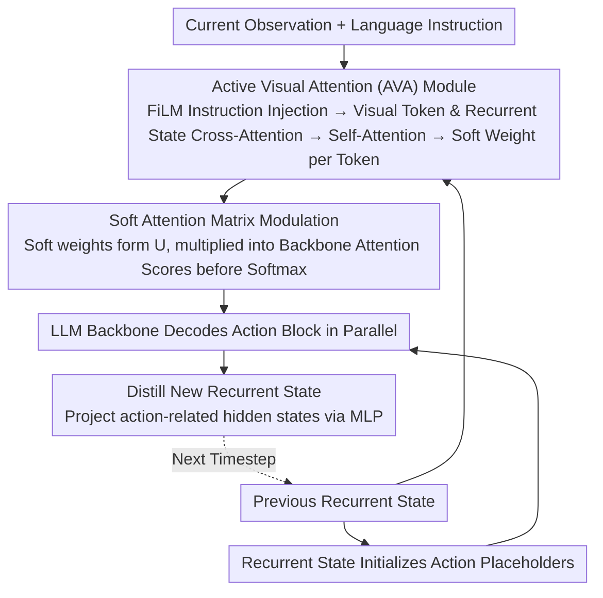

# AVA-VLA: Improving Vision-Language-Action models with Active Visual Attention

**Conference**: CVPR 2026 Highlight  
**arXiv**: [2511.18960](https://arxiv.org/abs/2511.18960)  
**Code**: [Project Page](https://liauto-dsr.github.io/AVA-VLA-Page)  
**Area**: Robotics
**Keywords**: VLA Models, Active Visual Attention, POMDP, Recurrent State, Visual Token Modulation

## TL;DR

This work re-examines the visual processing of VLA models from a POMDP perspective and proposes the AVA-VLA framework. By utilizing a recurrent state and an active visual attention module, it dynamically modulates the importance of current-frame visual tokens based on historical context, achieving SOTA performance on benchmarks such as LIBERO and CALVIN.

## Background & Motivation

Vision-Language-Action (VLA) models have shown significant progress in robotic manipulation tasks. However, most methods process visual observations independently at each timestep, implicitly modeling robotic manipulation as a Markov Decision Process (MDP). This history-free design has fundamental flaws:

1. Real-world robot control is inherently partially observable (POMDP), where a single current frame cannot fully describe the environment state.
2. Visual attention is only guided by static language instructions, failing to suppress temporally redundant information based on past actions.
3. The model cannot anticipate "what to focus on next"; the vision system is passive rather than active.

For example, in a task like "turn on the stove and place the moka pot on it," a vanilla OpenVLA-OFT might fail to locate the task-critical "stove switch," whereas AVA-VLA can maintain stable focus by leveraging historical context.

## Method

### Overall Architecture

AVA-VLA aims to address the blind spots caused by the "frame-by-frame independent observation" in VLA models. Traditional models treat each current frame as a complete state, failing to identify which visual information was used in previous steps or predict where to look based on history. The proposed solution introduces a recurrent state that persists across timesteps, acting as an approximation of the POMDP belief state, and uses this history to actively reallocate attention over current visual tokens.

The pipeline advances cyclically: the current frame observation and the recurrent state from the previous timestep are fed into the AVA module to calculate soft weights for each visual token. These weights are integrated into the attention matrices of each LLM backbone layer, enhancing critical regions and suppressing redundant ones. Simultaneously, the recurrent state initializes action placeholders, allowing the backbone to decode an action block in parallel. Finally, a new recurrent state is distilled from the backbone's hidden states for the next timestep. This transforms visual processing from "passive reception" to "memory-driven active focus."

### Key Designs

**1. Recurrent State: Approximating POMDP Belief State with Compressed History**

Robot control is essentially a Partially Observable Markov Decision Process (POMDP). Theoretically, a belief distribution over the true environment state should be maintained, but exact computation is infeasible with high-dimensional visual inputs. AVA-VLA adopts a recurrent state vector as a neural approximation of the belief state. It is derived via MLP projection from action-related hidden states in the last LLM layer, naturally carrying context about "what happened previously" and "the current stage of the action." This state serves two purposes: as a historical input for the AVA module and as an initialization for action placeholders, providing a historical prior for action decoding.

**2. Active Visual Attention (AVA) Module: Letting History Dictate Focus**

To make history actively influence perception, the AVA module first uses FiLM to inject language instruction features into visual features, ensuring focus aligns with task semantics. It then performs cross-attention using visual tokens as Queries and the recurrent state as Keys/Values, followed by a self-attention layer. This allows each visual token to coordinate with others and evaluate its importance based on history. The module outputs a soft weight for each token—a continuous score representing enhancement or attenuation. Unlike static instruction-guided attention, these weights change dynamically with history, suppressing redundant temporal information and redirecting attention to critical, un-manipulated regions (e.g., a stove switch yet to be toggled).

**3. Soft Attention Matrix Modulation: Injecting Weights into Backbone Layers**

To apply the weights calculated by AVA, the LLM backbone's attention mechanism is modified. The weights are organized into a soft attention matrix $U$, mapping only to visual token positions. $U$ is multiplied into the original attention scores before the Softmax operation (scaling then normalization). This ensures enhanced visual tokens are consistently prioritized across all backbone layers. Notably, $U$ is shared across layers to maintain consistent focus and is implemented as a positional weighting on existing scores, requiring no structural changes to the VLA backbone.

### Loss & Training

- Action prediction utilizes MAE loss combined with L2 regularization. The regularization term constrains the mean of soft weights near a target value $c$ to prevent weight dispersion.
- Truncated Backpropagation Through Time (BPTT) is used with $T=4$ steps to balance computational feasibility and temporal dynamic learning.
- The initial recurrent state is set to a zero vector and reset at the beginning of each episode.

## Key Experimental Results

### Main Results

| Benchmark | Metric | AVA-VLA | OpenVLA-OFT | Gain |
|------|------|---------|-------------|------|
| LIBERO (All 4 sets) | Average SR | 98.0% | 96.8% | +1.2% |
| LIBERO-Long | SR | 97.6% | 95.3% | +2.3% |
| CALVIN ABC→D | Avg. Length | 4.65 | 4.28 | +0.37 |
| Real Robot | Average SR | Highest | Second | Multi-task improvement |

### Ablation Study

| Configuration | LIBERO Average SR | Description |
|------|-------------|------|
| OpenVLA-OFT Baseline | 96.8% | No historical information |
| + State Initialization | 97.5% | Recurrent state injected into placeholders |
| + AVA Module | 97.5% | Visual token re-weighting |
| + Both Combined | 98.0% | Complementary effect |

### Key Findings

- **Visual Token Pruning**: Performance with 70% visual token pruning still exceeded the baseline OpenVLA-OFT (97.3 vs 96.8), validating that the AVA module effectively identifies critical regions.
- **Backbone Generalization**: Improvements were consistent across OpenVLA-7B, LLaMA2-7B, and Qwen2.5-0.5B, demonstrating high versatility.
- **Visualization**: Weights consistently focused on robot-contact regions and target objects.

## Highlights & Insights

- The POMDP theoretical perspective provides an elegant foundation for historical modeling in VLA models.
- The AVA module is lightweight and plug-and-play, requiring no modification to the LLM backbone architecture.
- A byproduct of soft weights is the potential for visual token pruning, offering a path for VLA efficiency optimization.
- Improvements are most significant in challenging long-sequence tasks like LIBERO-Long and CALVIN.

## Limitations & Future Work

- Truncated BPTT ($T=4$) limits the learning of long-term dependencies.
- The recurrent state is derived only from the previous step; longer memory windows remain unexplored.
- Soft weights only modulate the attention matrix without directly modifying visual feature representations.
- Real-robot experimental data remains relatively small (30-450 demonstrations).

## Related Work & Insights

- **vs OpenVLA/UniVLA**: These use autoregressive action decoding without explicit history modeling; AVA-VLA preserves temporal context via a recurrent state.
- **vs CoT-VLA**: Uses Chain-of-Thought for reasoning but does not explicitly model the temporal dynamics of visual attention.
- **vs SP-VLA/FLOWER**: These focus on visual token pruning efficiency but do not perform active focusing based on historical context.

## Rating

- **Novelty**: ⭐⭐⭐⭐ Combining POMDP perspective with active visual attention is novel in the VLA field.
- **Experimental Thoroughness**: ⭐⭐⭐⭐⭐ Full coverage of LIBERO/CALVIN/Real-robot, with thorough ablation, visualization, and pruning analysis.
- **Writing Quality**: ⭐⭐⭐⭐ Clear motivation, concise theoretical derivation, and standard experimental presentation.
- **Value**: ⭐⭐⭐⭐ Provides a new paradigm for time-aware visual processing in VLA models.

<!-- RELATED:START -->

## Related Papers

- [\[CVPR 2026\] SaPaVe: Towards Active Perception and Manipulation in Vision-Language-Action Models for Robotics](sapave_active_perception_manipulation_vla_roboti.md)
- [\[CVPR 2026\] ACoT-VLA: Action Chain-of-Thought for Vision-Language-Action Models](acot-vla_action_chain-of-thought_for_vision-language-action_models.md)
- [\[AAAI 2026\] TTF-VLA: Temporal Token Fusion via Pixel-Attention Integration for Vision-Language-Action Models](../../AAAI2026/robotics/ttf-vla_temporal_token_fusion_via_pixel-attention_integratio.md)
- [\[CVPR 2026\] HiF-VLA: Hindsight, Insight and Foresight through Motion Representation for Vision-Language-Action Models](hif-vla_hindsight_insight_and_foresight_through_motion_representation_for_vision.md)
- [\[CVPR 2026\] Adaptive Action Chunking at Inference-time for Vision-Language-Action Models](adaptive_action_chunking_at_inference-time_for_vision-language-action_models.md)

<!-- RELATED:END -->
