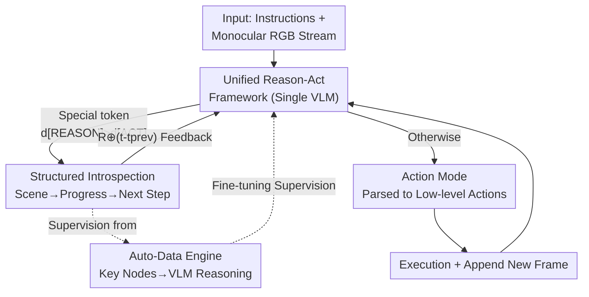

# AwareVLN: Reasoning with Self-awareness for Vision-Language Navigation

**Conference**: CVPR 2026  
**arXiv**: [2605.22816](https://arxiv.org/abs/2605.22816)  
**Code**: https://gwxuan.github.io/AwareVLN/ (Project Page)  
**Area**: Robotics / Embodied Navigation / Multi-modal VLM  
**Keywords**: Vision-Language Navigation, Self-aware Reasoning, Sparse Reasoning, Auto-Data Engine, VLN-CE

## TL;DR
AwareVLN equips end-to-end VLN models with "self-aware reasoning" capabilities—sparsely triggering structured reasoning only at critical navigation nodes (subtask completion, path deviation, or stopping errors). It utilizes an automated data engine that requires no manual annotation to generate introspective supervision, enabling a pure monocular RGB agent to significantly outperform previous SOTA models on R2R-CE and RxR-CE.

## Background & Motivation
**Background**: Vision-Language Navigation (VLN) requires agents to ground natural language instructions into physical movements within 3D environments. Current research follows two main paths: first, traditional explicit mapping (topological maps + SLAM + heuristic planning), which performs well but relies on extra 3D sensors and is difficult to integrate with large-scale vision-language pre-training; second, recent end-to-end VLM approaches (NaVid, NaVILA, StreamVLN, etc.), which directly map instructions and RGB observations to low-level actions. These are generalization-friendly as they rely solely on RGB.

**Limitations of Prior Work**: Most end-to-end VLM approaches focus on "aligning VLMs to predict actions" but **fail to utilize the reasoning capabilities of the VLM itself**. Consequently, the navigation process behaves like a black box—the agent lacks awareness of its progress, whether it has deviated, or when to stop, resulting in poor error correction and fine-grained planning. The most related work, Nav-R1, attempts a dual-system mechanism for reasoning at **fixed intervals**. However, its reasoning supervision is generated by querying general VLMs with historical observations, which lacks genuine "self-aware" knowledge. As a result, its reasoning is often superficial and purely textual, failing to guide subsequent actions.

**Key Challenge**: To make an agent "understand itself," it must have high-quality reasoning supervision aligned with actual navigation progress. However, such supervision is difficult to annotate manually and should not be triggered mindlessly at fixed intervals like Nav-R1 (per-step reasoning is inefficient and redundant). Determining **when to reason, what to reason about, and how reasoning should guide actions** remains unresolved.

**Goal**: (1) Enable the model to decide "when it is worth stopping to think"; (2) Conduct structured and deep introspection (where am I, what is the progress, what is the next step); (3) Feed reasoning results back into subsequent action generation; (4) Generate these reasoning supervisions at scale with zero manual annotation.

**Key Insight**: The authors observe that reasoning is truly required at **key nodes** (when a sub-instruction is completed, a deviation is detected, or the goal is near but doesn't match the target description), rather than at every frame. Sparsely triggering structured reasoning at these nodes is efficient and forces genuine self-awareness.

**Core Idea**: Replace "dense/fixed-interval shallow reasoning" with "sparsely-triggered structured introspective reasoning + a progress-aware auto-data engine," embedding self-awareness into a unified reason-act model.

## Method

### Overall Architecture
AwareVLN unifies reasoning and action prediction into the **same VLM** (instead of two separate models), allowing knowledge of "thinking" and "doing" to mutually reinforce each other. Given instructions $\mathcal{I}=\{w_1,\dots,w_l\}$ and a monocular RGB observation stream $\mathcal{O}_t=\{\mathbf{x}_0,\dots,\mathbf{x}_t\}$ (no depth, no pose, 8 uniformly sampled frames as visual input), the model first outputs the **logit of a special token** $d$ at each step to determine the mode: if $d_{\texttt{[REASON]}}>d_{\texttt{[ACT]}}$, it enters reasoning mode to generate a structured introspective text $\mathcal{R}$; otherwise, it enters action mode to output a command decodable into low-level actions (FORWARD, TURN-LEFT, TURN-RIGHT, STOP). The previous reasoning result $\mathcal{R}$ is concatenated with the "step difference since the last reasoning" and fed back into the next step ($\mathcal{R}'=\mathcal{R}\oplus(t-t_{\mathrm{prev}})$), forming a closed loop of temporal self-awareness. Training supervision is produced offline by an **auto-data engine**: trajectories are collected in Habitat, key nodes are identified using room semantics and ground-truth waypoints, and a general VLM (Qwen-VL-Max) converts node contexts into structured reasoning text.

### Key Designs

**1. Unified Reason-Act Framework: Switching between "Thinking" and "Doing" with a Special Token**

The pain point of existing methods is that they either only predict actions (black-box, no error correction) or use two separate VLMs like RT-H (reasoning and action are decoupled, and knowledge is not shared). AwareVLN integrates both into the **same policy** $\pi_\theta$. At each step, it first decodes the logit of a special token to divert the flow: $d,y_t=\pi_\theta\big(f_{\mathrm{tok}}(\mathcal{I}),f_{\mathrm{tok}}(\mathcal{R}'),f_{\mathrm{vis}}(\mathcal{O}_t)\big)$, and then according to:

$$\mathcal{D}=\begin{cases}\texttt{[REASON]},&\text{if }d_{\texttt{[REASON]}}>d_{\texttt{[ACT]}}\\\texttt{[ACT]},&\text{otherwise}\end{cases}$$

decides whether to save $y_t$ as a new reasoning $\mathcal{R}$ or parse it as a low-level action. Crucially, the reasoning text is **fed back**—the next step takes the previous $\mathcal{R}$ along with the "step difference" $(t-t_{\mathrm{prev}})$ as input. Thus, reasoning is no longer a one-off textual byproduct but actively participates in subsequent decision-making. The unified architecture allows the model to internalize knowledge from both "reasoning" and "action" dimensions within the same set of parameters, which is fundamentally why it is more effective than Nav-R1.

**2. Sparse Triggering of Structured Reasoning at Key Nodes: Three-stage Introspection at Pivotal Moments**

Reasoning at every frame is inefficient and redundant. AwareVLN learns to **trigger only at key states**: (i) Subtask Completion (detecting that a sub-instruction like "walk to the doorway" is achieved, summarizing progress, and planning the next step); (ii) Path Deviation (detecting when visual cues do not match expectations—missing landmarks or spatial mismatches—triggering analysis of the error and corrective actions); (iii) Stopping Error (when near the goal, the visual context contradicts the target description, triggering plan adjustments). The output is a fixed **tripartite structure**: ① Scene Description (concise visual context at the node) → ② Progress Evaluation (which parts of the instruction are finished, and if there is deviation) → ③ Next Step Planning (high-level intent). This "describe-evaluate-plan" causal structure unifies perception, reasoning, and planning into the same linguistic space; the sparse + structured combination ensures both efficiency and depth.

**3. Progress-aware Auto-Data Engine: Zero-annotation Production of progress-aligned Supervision**

Self-aware supervision is rare—manual annotation is expensive, and data from "querying general VLMs for history" (as in Nav-R1) lacks real progress information. This paper designs an **Auto-Data Engine requiring no manual labels**: it first collects trajectories in Habitat using two strategies—Ground-truth Following (to create "correct reasoning" samples) and DAgger Collection (running an early VLN model to predict actions and pulling back to waypoints when straying, creating trajectories with "natural mistakes + corrections"). It then uses the simulator's **room-level semantics and ground-truth waypoints** to automatically locate key nodes: subtask completion is determined by room category changes, while path/stop errors are determined by spatial deviation exceeding thresholds. Finally, it feeds the multimodal context of each node (node type, downsampled observations, room transitions, progress ratio, and corrective observations for deviation nodes) into Qwen-VL-Max. Use of **multi-turn dialogue** guides the VLM to build global understanding and generate causally explainable three-stage reasoning for each node.

### Loss & Training
Two-stage training is employed. **Pre-training** follows the NaVILA configuration, mixing large-scale VQA data with navigation data to maintain visual grounding and language alignment. **Fine-tuning** uses "reasoning-enhanced navigation trajectories" from the auto-data engine, plus human videos without reasoning to improve generalization. Training is performed on 4 NVIDIA H20 GPUs; inference on a single RTX 4090 runs at ~1 FPS.

## Key Experimental Results

### Main Results
Comparison on R2R-CE / RxR-CE Val-Unseen (R2R-CE 1,839 episodes, RxR-CE 11,006 episodes, MP3D environment). Ours uses only monocular RGB (S.RGB) but outperforms methods using panoramic/depth/odometry or simulator-pre-trained waypoint predictors.

| Dataset | Method | Obs | NE↓ | SR↑ | SPL↑ | nDTW↑ |
|--------|------|------|------|------|------|-------|
| R2R-CE | NaVILA | S.RGB | 5.22 | 54.0 | 49.0 | - |
| R2R-CE | StreamVLN | S.RGB | 4.98 | 56.9 | 51.9 | - |
| R2R-CE | **Ours** | S.RGB | **4.02** | **65.4** | **55.1** | - |
| RxR-CE | StreamVLN | S.RGB | 6.22 | 52.9 | 46.0 | 61.9 |
| RxR-CE | NaVILA | S.RGB | 6.77 | 49.3 | 44.0 | 58.8 |
| RxR-CE | **Ours** | S.RGB | **3.95** | **67.6** | **56.1** | **65.7** |

On R2R-CE, SR increased from 56.9 (StreamVLN) to 65.4 (+8.5), and NE dropped from 4.98 to 4.02. On RxR-CE, SR rose from 52.9 to 67.6 (+14.7).

**Real-world Evaluation** (Corridor / Home / Office environments × Simple/Complex, 18 instructions, deployed on a quadruped robot):

| Env-Difficulty | NaVid SR↑ | NaVILA SR↑ | Ours SR↑ |
|-----------|-----------|------------|--------------|
| Corridor-Simp | 0.33 | 0.33 | **1.00** |
| Home-Simp | 0.67 | 0.67 | **1.00** |
| Office-Simp | 0.33 | 0.67 | **1.00** |
| Corridor-Comp | 0.00 | 0.33 | **0.67** |
| Home-Comp | 0.33 | 0.67 | **1.00** |
| Office-Comp | 0.00 | 0.33 | **0.67** |

Trained only on simulation data but leading in real-world quadruped tests, verifying that introspective reasoning aids sim-to-real generalization.

### Ablation Study
**(A) Impact of key node types in the Auto-Data Engine** (Val-Unseen):

| Configuration | R2R NE↓ | R2R SR↑ | R2R SPL↑ | RxR SR↑ | Note |
|------|---------|---------|----------|---------|------|
| Complete Reasoning Data | 4.02 | 65.4 | 55.1 | 67.6 | Complete |
| w/o Subtask Completion | 4.92 | 52.3 | 50.7 | 52.7 | Largest drop |
| w/o Path Deviation | 4.70 | 55.1 | 51.5 | 54.0 | Lost correction |
| w/o Stopping Error | 4.76 | 60.0 | 57.5 | 61.2 | Poor stop localization |

**(B) Architecture and Reasoning Scheduling** (R2R-CE Val-Unseen):

| Configuration | NE↓ | SR↑ | SPL↑ | Note |
|------|-----|------|------|------|
| w/ special tokens (Complete) | 4.02 | 65.4 | 55.1 | Sparse + Special tokens |
| w/o special tokens | 4.60 | 62.5 | 53.3 | Direct prediction |
| Reason with action densely | 4.27 | 63.8 | 54.2 | Dense per-frame |

### Key Findings
- **Removing the "Subtask Completion" node caused the largest performance drop** (R2R SR 65.4→52.3, −13.1), suggesting that tracking overall progress is the most core "self-awareness" capability.
- **Sparse reasoning is superior to dense reasoning**: Per-frame reasoning (densely) lowered SR to 63.8, indicating that reasoning only when necessary is not just efficient but improves decision quality—mindless dense reasoning introduces noise.
- **Special tokens are indispensable**: Removing them dropped SR from 65.4 to 62.5; structured mode-switching tokens are necessary for clear task decomposition.
- DAgger-collected "error + correction" trajectories are critical for learning to analyze path/stopping errors, which cannot be learned from ground-truth trajectories alone.

## Highlights & Insights
- **"When to reason" is modeled as a learnable token decision**: Instead of fixed intervals or every frame, the model learns to trigger at three types of critical nodes. This targets the "reasoning budget" effectively, saving computation and improving quality.
- **Reasoning feedback loop**: The previous introspection $\mathcal{R}$ plus "step difference" $t-t_{\mathrm{prev}}$ is fed back, ensuring reasoning actively participates in the decision loop, rather than being a discarded CoT byproduct.
- **Auto-Data Engine distills simulator privileged information**: Room semantics and ground-truth waypoints are used to automatically locate key nodes, which are then translated into introspective text. This "distilling privileged info into explainable reasoning" can be migrated to other embodied tasks like manipulation.
- **Three-stage structured reasoning (Scene → Progress → Next Step)** unifies perception, progress evaluation, and planning into the language space. In real robot rollouts, it demonstrates the ability to self-correct misunderstandings and identify subtask completion.

## Limitations & Future Work
- The authors acknowledge that **monocular 3D perception is sometimes imprecise**, leading to occasional collisions with doors or stopping slightly off-target. Future work includes learning more robust 3D scene representations from monocular RGB.
- **Reliance on Simulator Metadata**: The auto-data engine depends heavily on simulator room semantics and ground-truth waypoints. It is unclear if this can be easily replicated in environments without such rich annotations.
- Reasoning supervision is generated offline by Qwen-VL-Max; the upper bound of reasoning quality is limited by this VLM's capabilities and prompt design.
- Inference speed is ~1 FPS (RTX 4090); though sparse triggering helps, this remains a bottleneck for high real-time requirements. Real-world samples were also relatively small.

## Related Work & Insights
- **vs. Nav-R1**: Both add explicit reasoning to navigation. Nav-R1 uses a dual-system triggered at **fixed intervals** with supervision lacking real progress information. Ours uses **sparse triggering at key nodes** + reasoning feedback + progress-aware data engine, resulting in deeper introspection and direct intervention in decision-making.
- **vs. NaVILA / StreamVLN / Uni-NaVid**: These end-to-end VLM methods map instructions/RGB directly to actions without reasoning about state or progress. Ours improves SR on R2R-CE from 56.9 (StreamVLN) to 65.4 using the same RGB input.
- **vs. Explicit Mapping (ETPNav / BEVBert with Depth+Pano)**: Mapping methods achieve high scores but are heavy to deploy and difficult to pre-train. Ours outperforms those that do not rely on simulator-pre-trained waypoint predictors while being more deployment-friendly.
- **Inspiration**: Drawing from "critical step triggering" in manipulation (e.g., OneTwoVLA) and "Language CoT," AwareVLN systematically introduces these concepts to navigation and completes the missing piece of "automated introspective supervision."

## Rating
- Novelty: ⭐⭐⭐⭐⭐ Combines sparse triggering, structured introspection, feedback, and auto-engine into a unified reason-act framework; first to solidify self-aware reasoning in VLN.
- Experimental Thoroughness: ⭐⭐⭐⭐ Significant gains over SOTA on R2R/RxR; clear ablations and real-world robot validation, though real samples are small.
- Writing Quality: ⭐⭐⭐⭐ Clear motivation and methodology; technical details on the framework/data engine are well-presented.
- Value: ⭐⭐⭐⭐⭐ Monocular RGB only, deployment-friendly, explainable, and capable of error correction; highly valuable for grounding end-to-end VLN.

<!-- RELATED:START -->

## Related Papers

- [\[CVPR 2026\] Towards Open Environments and Instructions: General Vision-Language Navigation via Fast-Slow Interactive Reasoning](towards_open_environments_and_instructions_general_vision-language_navigation_vi.md)
- [\[CVPR 2026\] ProFocus: Proactive Perception and Focused Reasoning in Vision-and-Language Navigation](profocus_proactive_perception_and_focused_reasoning_in_vision-and-language_navig.md)
- [\[CVPR 2026\] FantasyVLN: Unified Multimodal Chain-of-Thought Reasoning for Vision-and-Language Navigation](fantasyvln_unified_multimodal_chain-of-thought_reasoning_for_vision-and-language.md)
- [\[ICLR 2026\] Self-Refining Vision Language Model for Robotic Failure Detection and Reasoning](../../ICLR2026/robotics/self-refining_vision_language_model_for_robotic_failure_detection_and_reasoning.md)
- [\[CVPR 2026\] GA-VLN: Geometry-Aware BEV Representation for Efficient Vision-Language Navigation](ga-vln_geometry-aware_bev_representation_for_efficient_vision-language_navigatio.md)

<!-- RELATED:END -->
