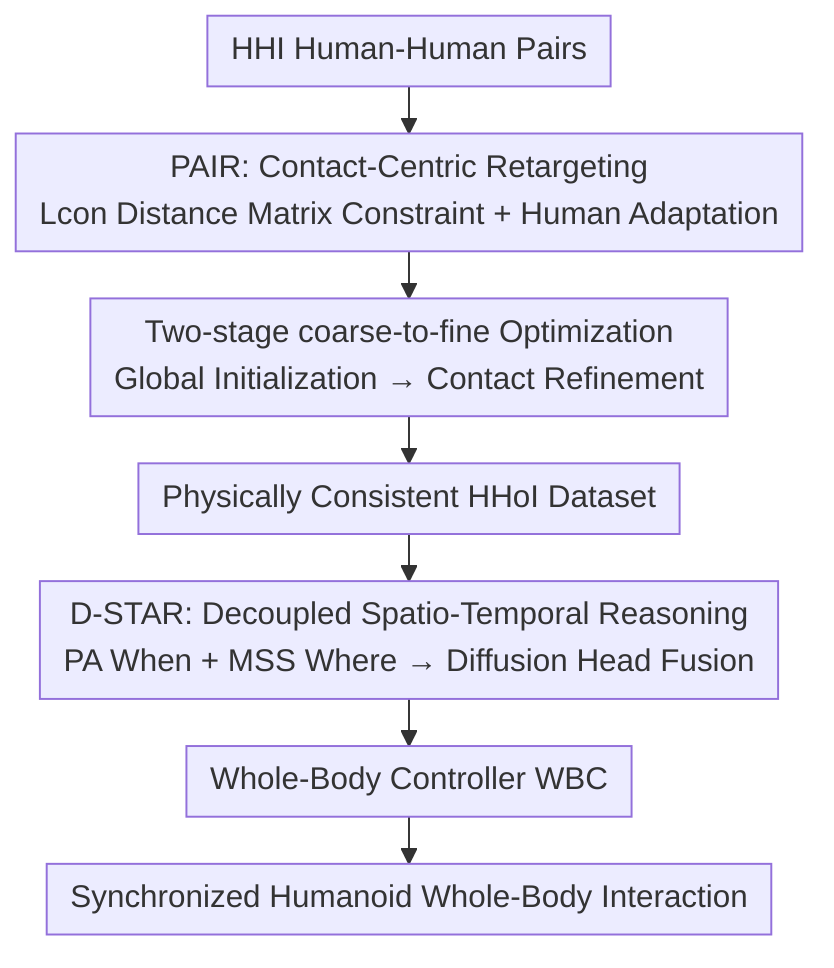

# Beyond Mimicry: Learning Whole-Body Human-Humanoid Interaction from Human-Human Demonstrations

**Conference**: CVPR 2026  
**Paper**: [CVF Open Access](https://openaccess.thecvf.com/content/CVPR2026/html/Huang_Beyond_Mimicry_Learning_Whole-Body_Human-Humanoid_Interaction_from_Human-Human_Demonstrations_CVPR_2026_paper.html)  
**Code**: None (Not released)  
**Area**: Robotics / Embodied AI  
**Keywords**: Humanoid Robot, Human-Robot Interaction, Motion Retargeting, Diffusion Policy, Whole-Body Control  

## TL;DR
To enable humanoid robots to learn whole-body physical interactions such as hugging, handshaking, and high-fives, this paper first utilizes Contact-Aware Interaction Retargeting (PAIR) to translate massive "Human-Human Interaction" (HHI) data into physically consistent "Human-Humanoid Interaction" (HHoI) data. It then employs a hierarchical diffusion strategy (D-STAR) that decouples "when to move" and "where to move" to learn synchronized interactions. The method achieves an average success rate of 75.4% across 6 interaction tasks and is deployed on the Unitree G1 robot.

## Background & Motivation
**Background**: Integrating humanoid robots into human spaces to perform human-humanoid interactions (HHoI) like shaking hands or hugging is a key frontier in robotics. However, training such policies requires massive interaction data. Real teleoperation data is high-fidelity but expensive, slow, unsafe, and lacks diversity. A more scalable approach is to leverage existing "Human-Human Interaction" (HHI) datasets and map human motions to robots via motion retargeting.

**Limitations of Prior Work**: The authors identify two consecutive failure points. **First**, standard retargeting directly transfers joint angles or positions for kinematic similarity but **ignores morphological differences between humans and robots**. If a 1.7m human shakes hands with a 1.3m robot, simply copying the human trajectory leaves the robot's hand inches away from the partner's hand, breaking critical physical contact and rendering the interaction meaningless. **Second**, even with high-quality data, conventional imitation learning tends to "reproduce average trajectories," resulting in an "average motion" lacking relational geometric understanding or timing, failing to perform responsive synchronized interactions.

**Key Challenge**: The essence of interaction lies in **contact semantics** (hand-to-hand contact, appropriate social distance), which often conflicts with kinematic similarity when morphologies do not match. Furthermore, interaction policies must simultaneously reason about "when to move" (temporal intent) and "where to move" (spatial contact point); entangling these two tasks leads to mutual interference.

**Goal**: (1) Losslessly convert HHI data into physically consistent HHoI training data; (2) Learn a policy that understands timing and geometry to perform synchronized whole-body interactions.

**Key Insight**: At the **data level**, use contact-centric retargeting (PAIR) to explicitly preserve contact semantics. At the **policy level**, decouple and then fuse "when to move" and "where to move" (D-STAR). Both ends "beyond simple mimicry."

## Method

### Overall Architecture
The pipeline is a "data-to-policy" closed loop: The PAIR component on the left generates data by retargeting human-human interaction pairs $(M_{Hp}, M_{Hs})$ into physically consistent HHoI segments through contact-aware two-stage optimization. The D-STAR component on the right trains a hierarchical diffusion policy on this data, decomposing interaction reasoning into Phase Attention (PA) for "when" and Multi-scale Spatial Module (MSS) for "where." These are fused by a diffusion head into high-level action targets, executed by a standard Whole-Body Controller (WBC) in simulation/reality.

### Key Designs

**1. PAIR: Contact-Centric Retargeting by Encoding Contact into Loss Functions**

To address the issue where copying joint angles breaks physical contact, PAIR stops penalizing only per-joint errors between the robot and a morphologically aligned human skeleton. Instead, it formulates retargeting as a hierarchical optimization objective:

$$L_{retarget} = w_{con}L_{con} + w_{kin}L_{kin} + w_{hum}L_{hum} + w_{reg}L_{reg}.$$

The core innovation is the **Contact Preservation Loss** $L_{con}$: It does not align specific fingers point-by-point but constrains the **pairwise distance matrix of the entire interaction** to remain consistent. Let $D^{orig}_t$ and $D^{opt}_t$ be the $N \times N$ distance matrices calculated from a set of task-relevant keypoints for the original HHI and optimized HHoI at time $t$, respectively:

$$L_{con} = \frac{1}{T}\sum_{t=1}^{T}\big\lVert D^{opt}_t - D^{orig}_t \big\rVert_F^2.$$

This matrix-level constraint preserves **relational geometry** such as "hand-to-hand contact" and "social distance," making it much more robust than fragile point-wise penalties. $L_{kin}$ ensures the style remains human-like; $L_{hum}=\frac{1}{T}\sum_t\lVert p'_{Hp,t}-p_{Hp,t}\rVert_2^2$ is the **Human Fidelity Loss**, allowing small, necessary adaptations of the human partner's joints (e.g., raising hands for a shorter robot) to avoid distorting the human motion into a different action just to force contact.

**2. Two-Stage Coarse-to-Fine Optimization: Avoiding "Almost Touching" Local Minima**

$L_{con}$ makes the objective function complex and non-convex. Single-stage optimization often converges to physically failed near-optimal solutions (e.g., grabbing air). The authors use **two stages** to guide the solver. **Stage 1 (Global Kinematic Initialization)**: Optimizes the full objective with a moderate $w_{con}$ to find a globally consistent, kinematically reasonable motion. **Stage 2 (Contact and Stability Refinement)**: Uses Stage 1 as a hot start and significantly increases $w_{con}$ to aggressively correct fine contact misalignments and enforce physical stability. Ablations show that collapsing this to a single stage drops the contact F1 from 0.841 to 0.788.

**3. D-STAR: Hierarchical Diffusion Policy Decoupling "When" and "Where"**

To prevent imitation learning from entangling timing and targets into "average trajectories," D-STAR splits reasoning into two complementary streams. The input consists of $h$ frames of history (robot proprioception $s^R_t$ + human SMPL joints $s^H_t$). A **Long-Short Temporal Encoder (LSTE)** processes this, where $E_{long}$ captures interaction phase context and $E_{short}$ captures fine spatial coordination, resulting in $f^{temp}_t=\text{Concat}(E_{long}(\cdot), E_{short}(\cdot))$.

Based on this, **Phase Attention (PA, When)** predicts the current interaction phase—using "Preparation / Action / Follow-through" divisions with a transition consistency loss—and weights specialized self-attention blocks to produce phase-conditioned temporal features $f^{Phase}_t$. The **Multi-scale Spatial Module (MSS, Where)** uses absolute position, pairwise distance, and relative orientation encoders to characterize multi-scale human-robot geometry, aggregating cues into $f^{MSS}_t$ to identify "where the contact geometry is." Both features, along with a **text instruction token**, condition the **Diffusion Planning Head** to generate high-level reference motions.

### Loss & Training
PAIR uses the $L_{retarget}$ objective for two-stage optimization (data generation phase). D-STAR jointly trains the LSTE, PA, MSS, and Diffusion Head using a combination of diffusion action prediction loss, phase classification auxiliary loss, and geometric consistency terms. During deployment, a short text instruction selects the interaction type without requiring task-specific weights.

## Key Experimental Results

Experiments address four questions: Q1 Is retargeting effective? Q2 Does the hierarchical policy outperform baselines? Q3 Are the decoupled modules necessary? Q4 Is it robust to unseen human morphologies or behaviors? Quantitative comparisons are done in Isaac Gym with Unitree G1 (50 Hz).

### Main Results

Retargeting Quality (Contact F1 @0.35m threshold, Joint Position Error JPE, Smoothness Jerk):

| Method | JPE↓ | Contact F1 @0.35m↑ | Jerk Mean↓ |
|------|------|---------------|------------|
| Simple MSE | 0.188 | 0.688 | 0.0026 |
| IK Baseline | 0.337 | 0.649 | 0.0348 |
| ImitationNet† (SOTA) | 0.181 | 0.502 | 0.0015 |
| **PAIR (Ours)** | **0.174** | **0.841** | **0.0008** |

PAIR achieves a contact F1 of 0.841, a **67.5% gain** over ImitationNet and 22.2% over Simple MSE, while obtaining the best JPE (0.174) and smoothest motion.

Policy Success Rate (6 interaction tasks):

| Method | Hug | High-Five | Handshake | Avg. |
|------|-----|-----------|-----------|------|
| Naive Mimicry (BC only) | 0.0 | 0.0 | 0.0 | 0.0 |
| Pure RL | 46.7 | 7.4 | 19.4 | 51.6 |
| Transformer Policy | 73.3 | 44.4 | 32.3 | 64.3 |
| Diffusion Policy | 73.3 | 3.7 | 38.7 | 58.7 |
| **D-STAR (Full)** | **100.0** | 40.7 | **61.3** | **75.4** |

Full D-STAR reaches an average success rate of 75.4%. Naive Mimicry fails completely, and standard Diffusion Policy only reaches 58.7%, highlighting that "decoupled reasoning" rather than just a stronger backbone is key.

### Ablation Study

| Configuration | Retargeting F1 @0.35m | Policy Avg. Success Rate |
|------|----------------|----------------|
| Full Model | 0.841 | 75.4 |
| w/o Human Adaptation | 0.823 | — |
| w/o Contact Loss $L_{con}$ | 0.821 | — |
| w/o Two-Stage | 0.788 | — |
| w/o PA | — | 65.9 |
| w/o MSS | — | 64.3 |

### Key Findings
- **Two-stage optimization is the biggest contributor** for retargeting: Removing it drops F1 to 0.788, proving that complex contact objectives require coarse-to-fine guidance.
- **MSS is critical for spatially precise tasks**: Without MSS, handshake success drops from 61.3% to 32.3%, showing geometric encoding is the lifeline of contact-based tasks.
- **Robustness**: In a matrix of human partner scale (0.8x-1.2x) and speed (0.8x-1.2x), performance degrades gracefully rather than crashing, indicating the policy learns relational geometry rather than memorizing trajectories.

## Highlights & Insights
- **Upgrading Contact from Point-wise to Distance Matrix**: $L_{con}$'s use of $N \times N$ pairwise distance matrices preserves relational geometry. This is ingenious because it is naturally invariant to morphology (constraining relative distance rather than absolute position).
- **"When vs. Where" Decoupling**: Interaction failures often stem from incorrect timing or targets. Isolating these flows while fusing them via a single diffusion head avoids interference while maintaining continuity.
- **Data-Policy Closed Loop**: The authors systematically diagnose why standard retargeting fails (broken contact) and why standard imitation fails (trajectory averaging), creating a modular solution where each component addresses a specific failure mode.

## Limitations & Future Work
- **Quantitative Comparison Limited to Sim**: To ensure controller fairness, quantitative comparisons are kept in simulation. Real-world results are qualitative (hugs/handshakes/high-fives) without success rate statistics. ⚠️
- **Limited Interaction Types**: Only covers 6 predefined types selected via text; generalization to open-ended or multi-person interaction is unverified.
- **High-Five Success (40.7%)**: Fast, precise high-fives remain difficult, suggesting spatio-temporal alignment for high-speed contact is still a bottleneck.

## Related Work & Insights
- **vs XBG / RHINO (HHoI via teleoperation)**: These methods learn directly from teleoperation, which is high-fidelity but expensive. This work gains whole-body supervision from massive HHI data, offering higher scalability.
- **vs ImitationNet (SOTA Unsupervised Retargeting)**: ImitationNet focuses on style/kinematic similarity; PAIR improves contact F1 to 0.841 (from 0.502) by explicitly adding contact semantics.
- **vs Diffusion Policy (Strong Baseline)**: With the same data and controller, standard DP only reaches 58.7%, whereas D-STAR hits 75.4%, showing gain from the architecture rather than just the diffusion model.

## Rating
- Novelty: ⭐⭐⭐⭐⭐ 
- Experimental Thoroughness: ⭐⭐⭐⭐ 
- Writing Quality: ⭐⭐⭐⭐⭐ 
- Value: ⭐⭐⭐⭐ 

<!-- RELATED:START -->

## Related Papers

- [\[CVPR 2026\] Towards Motion Turing Test: Evaluating Human-Likeness in Humanoid Robots](towards_motion_turing_test_evaluating_human-likeness_in_humanoid_robots.md)
- [\[CVPR 2026\] RoboWheel: A Data Engine from Real-World Human Demonstrations for Cross-Embodiment Robotic Learning](robowheel_a_data_engine_from_real-world_human_demonstrations_for_cross-embodimen.md)
- [\[CVPR 2026\] End-to-End Language-Action Model for Humanoid Whole Body Control](end-to-end_language-action_model_for_humanoid_whole_body_control.md)
- [\[AAAI 2026\] Theory of Mind for Explainable Human-Robot Interaction](../../AAAI2026/robotics/theory_of_mind_for_explainable_human-robot_interaction.md)
- [\[CVPR 2026\] Scalable Trajectory Generation for Whole-Body Mobile Manipulation](scalable_trajectory_generation_for_whole-body_mobile_manipulation.md)

<!-- RELATED:END -->
