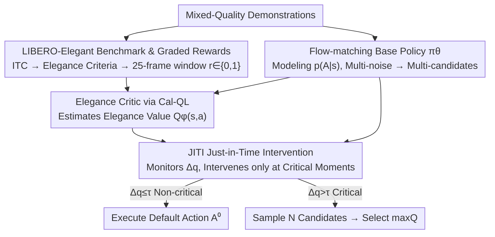

# Beyond Success: Refining Elegant Robot Manipulation from Mixed-Quality Data via Just-in-Time Intervention

**Conference**: CVPR 2026  
**Paper**: [CVF Open Access](https://openaccess.thecvf.com/content/CVPR2026/html/Mao_Beyond_Success_Refining_Elegant_Robot_Manipulation_from_Mixed-Quality_Data_via_CVPR_2026_paper.html)  
**Code**: The paper claims to open-source code and benchmarks on GitHub, no explicit link provided (⚠️ refer to the original text)  
**Area**: Robotics / Embodied AI  
**Keywords**: VLA, Robot Manipulation, Offline Reinforcement Learning, Mixed-Quality Data, Inference-time Guidance  

## TL;DR
Addressing the problem where Vision-Language-Action (VLA) policies learn "successful but non-elegant" behaviors from mixed-quality human demonstrations, this work avoids retraining the base policy. Instead, it trains an Elegance Critic offline (using Cal-QL to estimate the "elegance value" of actions) and triggers multi-candidate re-selection only during critical decision moments by monitoring Q-value fluctuations. This improves the Elegant Success Rate from approximately 50% to 67% in LIBERO-Elegant and real-world experiments (+23.7 pts on hardware).

## Background & Motivation
**Background**: Large Vision-Language-Action (VLA) models utilize internet-scale demonstrations for imitation learning, enabling them to understand linguistic instructions and generalize to new scenarios. This is currently the mainstream paradigm for general-purpose robot manipulation.

**Limitations of Prior Work**: The execution quality of these models is inconsistent—for the same "placement" task, the policy sometimes places objects stably and aligned, but other times releases them prematurely, causing drops or bounces. The capability exists but is not expressed reliably.

**Key Challenge**: The root cause is that the training data itself is **mixed-quality**. Real-world human demonstrations are a mixture of expert-level operations, hesitant corrections, inefficient movements, and even failure noise. Standard Behavior Cloning (BC) inherits this entire behavioral distribution $p(A_t\mid s_t)$, effectively learning both "perfect" and "mediocre" actions together. The problem is that while demonstrations are all labeled as "success," their implicit rules regarding "how an action should be performed" are only **partially satisfied**.

**Goal**: (1) To make "action quality" quantifiable beyond binary success; (2) To elevate execution quality without retraining or contaminating the base policy.

**Key Insight**: The authors draw inspiration from how humans refine motor skills—humans do not correct themselves uniformly along a trajectory but fine-tune only at specific critical moments. This inspires a division of labor: "evaluate while executing." A pre-trained VLA handles broad task execution, while a lightweight Critic evaluates quality and intervenes only at critical moments.

**Core Idea**: "Elegant execution" is formalized as satisfying Implicit Task Constraints (ITC). An Elegance Critic is trained to assign "elegance scores" to candidate actions, and Just-in-Time Intervention (JITI) triggers multi-candidate re-selection only when Q-values fluctuate sharply—replacing base policy retraining with a decoupled, non-intrusive critic.

## Method

### Overall Architecture
The method is a **three-stage decoupled framework**, centering on the principle of "separation of execution and evaluation, with evaluation only at critical moments." Stage 1 trains a generative base policy $\pi_\theta$ (Flow-matching model) on mixed-quality data, capable of sampling **diverse** candidate actions for the same state. Stage 2 utilizes graded reward annotations from LIBERO-Elegant to train an Elegance Critic $Q_\phi$ via Calibrated Q-Learning, specifically estimating the "elegance value" of actions. Stage 3, Just-in-Time Intervention (JITI), links the two during inference: normally, the default action from the base policy is executed; only when the critic's Q-value exhibits sharp fluctuations (identified as critical moments) are $N$ candidates sampled, and the one with the highest elegance score is selected. The entire process does not modify or retrain $\pi_\theta$.

### Key Designs

**1. Formalization of Elegant Execution + LIBERO-Elegant Benchmark with Graded Rewards: Making "Execution Quality" Measurable**

The pain point is that in LIBERO, every demonstration is labeled "success," even though their adherence to implicit rules varies significantly, leaving no signal to distinguish "elegance" from "mediocrity." The authors define **elegant execution** as completing the task while satisfying Implicit Task Constraints (ITC)—including proper release timing, precise placement, pose alignment, and avoiding unintended collisions. They then construct LIBERO-Elegant on top of LIBERO: selecting 8 manipulation tasks sensitive to execution quality (precise placement, controlled insertion, collision-free pushing, etc.). Each task is evaluated using two sets of criteria: the original **Success Criteria** of LIBERO and an **Elegance Criteria** evaluating quality across four dimensions (task sequence integrity, target pose accuracy, pose alignment, and collision-free execution).

For supervision signals, the authors annotate binary rewards $r_t\in\{0,1\}$ on **short time slices** most relevant to ITC: premature release or misaligned placement is recorded as 0, while controlled, constraint-satisfying transitions are recorded as 1. This expands each demonstration into the Elegance-Enriched Dataset $\mathcal{D}_{\text{elegant}}$. Scale: 8 tasks, 327 demonstrations, approximately 52.7K frames of synchronized RGB-D and proprioceptive data; 148 demonstrations achieve positive rewards for high-quality execution, with annotations occurring only within a **25-frame window** (the most critical ITC moment). This "sparse + graded" reward is the source that allows the Critic to learn fine-grained preferences and for Q-values to fluctuate at critical points.

**2. Flow-matching Base Policy + Multi-candidate Sampling: Turning "Quality Variance" into Selectable Diversity**

The challenge is that inference-time re-selection requires the ability to produce a set of **different** candidate actions for the same state. Stage 1 intentionally ignores the distinction between good and bad demonstrations, training $\pi_\theta$ as a generative model to capture the entire mixed-quality distribution $p(A_t\mid s_t)$ using flow-matching. A Transformer network $v_\theta$ learns a continuous-time vector field to transform noise samples into clean actions. During training, ground truth $A_t$ and Gaussian noise $\epsilon$ are sampled to construct noisy actions $A_t^\tau=\tau A_t+(1-\tau)\epsilon$, optimizing the mean squared error between the predicted vector field and the target direction:

$$\mathcal{L}_{\text{FM}}(\theta)=\mathbb{E}_{\tau,(s_t,A_t),\epsilon}\big[\|v_\theta(A_t^\tau,s_t)-(A_t-\epsilon)\|_2^2\big]$$

During inference, starting from initial noise $A_t^0\sim\mathcal{N}(0,I)$, $v_\theta$ is integrated along $\tau\in[0,1]$ using numerical solvers like forward Euler. Crucially, **initializing with different noise sets allows generating a diverse group of candidates for the same state**—this is the prerequisite for JITI to "sample multiple and pick the most elegant" at critical moments. Reinterpreting "quality variance" as "the candidate pool contains both good and bad options" is a key insight of this design.

**3. Elegance Critic via Cal-QL: Learning Non-overestimated "Elegance Value" from Mixed-Quality Data**

The pain point is twofold: the critic must be sensitive to **graded fine-grained rewards** encoding ITC (to learn elegance), while avoiding **overestimating** the value of low-quality or unseen actions outside the data support (a common OOD issue in offline RL). Architecturally, the critic reuses the frozen VLM backbone from Stage 1 to extract multimodal representations of $s_t, s_{t+1}$, followed by a **VLM-based refinement head** to redirect representations toward value estimation, obtaining context embeddings $f_s, f_{s'}$. These are concatenated with action $a_t$ and reward $r_t$ and passed to the Cal-QL module to update $\phi$—leveraging pre-trained knowledge without modifying the encoder to maintain decoupling.

The learning objective utilizes Calibrated Q-Learning with a calibration regularizer:

$$R_{\text{cal}}(\phi)=\mathbb{E}_{s\sim\mathcal{D}}\Big[\max\big(\mathbb{E}_{a\sim\pi(\cdot\mid s)}Q_\phi(s,a),\,V_\mu(s)\big)-\mathbb{E}_{a\sim\mathcal{D}(\cdot\mid s)}Q_\phi(s,a)\Big]$$

This ensures that when the critic's estimation for in-distribution actions is already lower than the behavioral value $V_\mu(s)$, it stops penalizing, thereby calibrating the critic's "confidence" to the behavior distribution and providing conservative but accurate estimations. The full objective combines Bellman consistency with the calibration regularizer:

$$\mathcal{L}_{\text{Cal-QL}}(\phi)=\mathcal{L}_{\text{Bellman}}(\phi)+\lambda_{\text{cal}}R_{\text{cal}}(\phi)$$

Where $\mathcal{L}_{\text{Bellman}}(\phi)=\mathbb{E}\big[(Q_\phi(s_t,a_t)-(r_t+\gamma\max_{a'}Q_{\phi'}(s_{t+1},a')))^2\big]$, and $Q_{\phi'}$ is a slowly updating target network. This combination of conservatism and calibration ensures the critic remains sensitive to elegance within the data support while staying conservative toward unseen behaviors—providing reliable signals for Stage 3's value guidance.

**4. JITI Just-in-Time Intervention: Using Q-value Fluctuations to Trigger Costly Re-selection Only at Critical Moments**

The limitation is that naive "Full-Guidance" samples multiple candidates, evaluates all of them, and selects the most elegant at every step—effective but expensive and often unnecessary, as most local decisions are unambiguous. Only a few critical moments truly determine the elegance of the entire trajectory. JITI's key insight is that overall elegance is primarily decided by this small set of critical moments. Thus, it is designed as an **event-driven, plug-and-play** mechanism that activates high-cost multi-candidate evaluation only when the policy exhibits uncertainty.

How to identify critical moments? Using the critic's own Q-value fluctuations. When the base policy proposes actions consistent with "elegance" in familiar regions, Q-value predictions are stable and high-confidence. Once an OOD state is encountered or a sub-optimal action is given (unstable grasp, inefficient trajectory), confidence drops, manifesting as **sharp fluctuations** in Q-values—either a sudden drop (loss of value) or a sudden spike (entering a high-stakes critical segment). This is quantified as $\Delta q_t=|q_t-\bar q_t|$, where $q_t=Q_\phi(s_t,A_t^0)$ is the evaluation of the default action, and $\bar q_t$ is the moving average over a short historical window. A small $\Delta q_t$ indicates temporal consistency and high confidence; a sudden change marks a critical decision moment. Notably, these fluctuations are a natural byproduct of the critic's dual training dynamics: spikes come from Bellman backups triggered by sparse graded rewards (identifying high-reward segments), while drops come from Cal-QL conservative regularization penalizing OOD/non-elegant actions.

Inference Algorithm (Algorithm 1): At each step, sample default action $A_t^0\sim\pi_\theta$, calculate $q_t$, and update the window and $\Delta q_t$. If $\Delta q_t\le\tau$, it is considered non-critical, and $A_t^0$ is executed directly (requiring only one critic evaluation). If $\Delta q_t>\tau$, it is identified as critical, and $N$ candidates are sampled, scored by $Q_\phi$, and the $\arg\max_a Q_\phi(s_t,a)$ is executed. This maintains efficiency for daily decisions while filtering out sub-optimal behaviors by re-selecting only when uncertainty arises, without retraining $\pi_\theta$.

## Key Experimental Results

### Main Results
The metric is **Elegant Success Rate (ESR)**: an episode is considered an "elegant success" only if it completes the task objective and satisfies all preset elegance constraints, averaged over 50 rollouts per task. Comparison across 8 LIBERO-Elegant tasks (T-0 to T-7):

| Method | Avg. ESR (%) |
|------|------|
| π0.5 | 44.2 |
| Isaac GR00T N1 | 40.2 |
| SmolVLA (Base, 450M) | 49.8 |
| Isaac GR00T N1.5 (Base, 3B) | 46.0 |
| **Ours (JITI) + SmolVLA** | **67.2** |
| **Ours (JITI) + GR00T N1.5** | **67.2** |

JITI provides a +17.4 pts gain for SmolVLA and +21.2 pts for GR00T N1.5. Both VLAs of different capacities are brought to 67.2%, validating the **model-agnostic, plug-and-play** nature of the critic.

### Ablation Study

**(a) JITI vs. Full-Guidance (Figure 4, 8-task Average)**:

| Configuration | Avg. ESR (%) | Avg. Interventions per Episode |
|------|------|------|
| SmolVLA (Base) | 49.8 | — |
| Full-Guidance (Re-select every step) | 53.8 | 16.25 |
| **Ours (JITI)** | **67.2** | **6.26** |

JITI not only achieves a higher ESR than Full-Guidance (67.2% vs. 53.8%) but also requires over 60% fewer interventions—event-driven targeted re-selection is **both better and more efficient** than blind continuous re-selection.

**(b) Reward Type Ablation (Table 2, 8-task Average)**:

| Reward Type | Avg. ESR (%) |
|------|------|
| Binary Reward (Sparse success label at end of episode) | 56.8 |
| **Task-Specific (Ours: Graded Elegance Reward)** | **67.2** |

Sparse binary feedback is insufficient to learn the fine-grained preferences defining elegance (10.4 pts difference), indicating that effective elegance refinement requires both uncertainty-aware intervention like JITI and a critic training signal with sufficient information.

### Key Findings
- The greatest contribution comes from the combination of JITI's "intervention on demand" and "graded rewards": removing graded rewards drops performance to 56.8%, and changing demand-based to full-guidance drops it to 53.8%; omitting either results in a significant decline.
- JITI's efficiency advantage is robust: higher ESR is achieved with approximately 1/3 of the interventions, proving most moments do not require re-selection and that value fluctuation is a low-cost, effective trigger.
- Real-world gains (+23.7) exceed simulation gains (+17.4), particularly in precision-sensitive tasks, suggesting the mechanism is robust to real-world latency, uncertainty, and stochasticity.

## Highlights & Insights
- **Turning "Mixed-Quality" from a Weakness into a Resource**: Mixed-quality data is usually treated as noise to be filtered. This work reverses that by using flow-matching to learn the entire distribution as a "candidate pool" and relying on a critic to pick during inference—retaining data and avoiding retraining.
- **Q-value Fluctuation as a "Critical Moment" Detector**: Reusing the byproduct of critic training dynamics (Cal-QL conservative penalty drops + sparse reward Bellman spikes) as an intervention signal is virtually zero-cost and interpretable.
- **Decoupled & Non-intrusive**: The base policy is completely frozen; the critic is an external module, making it naturally plug-and-play. It works for both SmolVLA (450M) and GR00T (3B)—this "external evaluator" paradigm is transferable to other control tasks requiring quality constraints without retraining large models.

## Limitations & Future Work
- **Reliance on Manual Annotation of Critical Windows**: The Elegance-Enriched Dataset depends on human-annotated 25-frame windows and binary rewards with cross-validation. Scaling to new task families requires re-annotation, and the four-dimensional definition of "elegance criteria" is somewhat subjective.
- **Sensitivity to Threshold $\tau$, Window $k$, and Candidate Number $N$**: JITI's trigger is entirely determined by $\Delta q_t > \tau$. The paper does not fully demonstrate the robust ranges of these hyperparameters (⚠️ refer to the original text); a $\tau$ that is too loose degrades to Full-Guidance, while one that is too tight misses critical moments.
- **"Elegance" Still Bound by Human-defined ITC Dimensions**: While the four dimensions cover timing, pose, and collisions, more complex "elegance" (force-control compliance, energy efficiency, safety in human collaboration) has not yet been included.
- Real-world verification was limited to the SO-100 single-arm robot across 6 tasks; performance on dual-arm or long-horizon tasks remains to be observed.

## Related Work & Insights
- **vs. Data-centric Methods (filtering/re-weighting/re-sampling mixed-quality data)**: These modify the static dataset before BC. This work instead learns a value function capable of reasoning about long-term consequences and postpones judgment until inference—avoiding the short-sightedness of "reshaping the dataset."
- **vs. Online RL Fine-tuning VLAs**: Online RL requires expensive and potentially unsafe real-world interaction, and fine-tuning can be unstable with risks of catastrophic forgetting. This work is offline and does not fine-tune the base policy at all.
- **vs. Intrusive Offline RL (Directly fine-tuning VLA)**: Such methods risk catastrophic forgetting. This work belongs to the decoupled inference-time guidance camp (retaining base model + lightweight critic guidance), but with a narrower focus—refining for "elegance" defined by ITC rather than general quality improvement.
- **vs. Full Value Guidance (Full-Guidance)**: Both use a critic to select actions, but this work uses Q-value fluctuations to limit high-cost evaluation to critical moments, improving both efficiency and quality.

## Rating
- Novelty: ⭐⭐⭐⭐ Formalizing "execution quality beyond success" as ITC and achieving non-intrusive refinement via the "Q-fluctuation triggered JITI" mechanism is clever, though components are mostly combinations of existing technologies (Flow-matching + Cal-QL).
- Experimental Thoroughness: ⭐⭐⭐⭐ Includes simulation main experiments + JITI/reward double ablations + zero-shot generalization + real-world 6-task verification, covering two VLA architectures. However, it lacks systematic sensitivity analysis for key hyperparameters like $\tau/N$.
- Writing Quality: ⭐⭐⭐⭐ Motivation, method, and experimental logic are clear. The three-stage framework is well-integrated with diagrams, though some formulas (e.g., the specific source of $V_\mu$) are somewhat brief.
- Value: ⭐⭐⭐⭐ Provides a plug-and-play paradigm for improving execution quality without retraining large VLAs and offers a reusable LIBERO-Elegant benchmark, making it friendly for practical deployment.

<!-- RELATED:START -->

## Related Papers

- [\[CVPR 2026\] SPEAR-1: Scaling Beyond Robot Demonstrations via 3D Understanding](spear-1_scaling_beyond_robot_demonstrations_via_3d_understanding.md)
- [\[CVPR 2026\] Affordance Field Intervention: Enabling VLAs to Escape Memory Traps in Robotic Manipulation](affordance_field_intervention_enabling_vlas_to_escape_memory_traps_in_robotic_ma.md)
- [\[CVPR 2026\] IGen: Scalable Data Generation for Robot Learning from Open-World Images](igen_scalable_data_generation_for_robot_learning_from_open-world_images.md)
- [\[CVPR 2026\] DynBridge: Bridging Imagination and Control through Interaction Dynamics for Robot Manipulation](dynbridge_bridging_imagination_and_control_through_interaction_dynamics_for_robo.md)
- [\[ICLR 2026\] Real-Time Robot Execution with Masked Action Chunking](../../ICLR2026/robotics/real-time_robot_execution_with_masked_action_chunking.md)

<!-- RELATED:END -->
