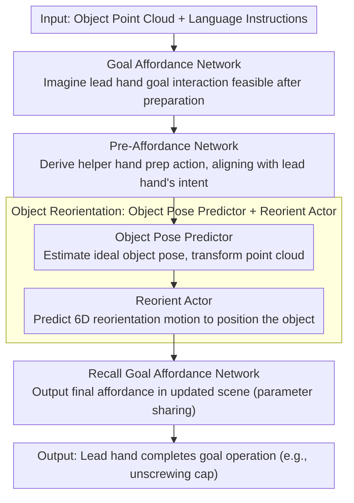

# BiPreManip: Learning Affordance-Based Bimanual Preparatory Manipulation through Anticipatory Collaboration

**Conference**: CVPR 2026  
**arXiv**: [2603.21679](https://arxiv.org/abs/2603.21679)  
**Code**: [Project Page](https://sites.google.com/view/bipremanip)  
**Area**: Robotic Manipulation / Human Understanding  
**Keywords**: Bimanual Collaborative Manipulation, Visual Affordance, Preparatory Manipulation, Anticipatory Reasoning, Point Clouds

## TL;DR
The BiPreManip framework is proposed to achieve bimanual preparatory manipulation based on visual affordance representations. It first imagines the target interaction region for the lead hand and then guides the helper hand to perform preparatory actions (e.g., flipping a bottle so the cap faces the lead hand), significantly outperforming baselines in both simulation and real-world environments.

## Background & Motivation
**Background**: Research in bimanual manipulation has made significant progress recently (ACT, RDT-1B, 3D FlowMatch Actor, etc.), covering various collaboration modes such as symmetric, sequentially independent, and complementary roles.

**Limitations of Prior Work**: Existing methods assume both hands can directly interact with the object. however, many daily scenarios require one hand to first "change the state of the object" before the other hand can operate—for example, pushing a tablet to the edge of a table to pick it up, or standing a pen upright to remove its cap.

**Key Challenge**: Preparatory manipulation requires asymmetric anticipatory coordination and long-horizon interdependent planning—the helper hand must understand the future intention of the lead hand while avoiding interference with the lead hand's anticipated interaction region.

**Goal**: To define and solve the new problem category of "collaborative preparatory manipulation," enabling robots to learn bimanual coordination behaviors that prepare before operating.

**Key Insight**: Affordance-driven—first use an affordance map to imagine the final goal action, then reverse-derive the preparatory behavior of the helper hand.

**Core Idea**: Achieve cross-arm reasoning through an anticipatory affordance map, ensuring that every action of the helper hand serves the final goal of the lead hand.

## Method

### Overall Architecture
BiPreManip targets collaborative preparatory manipulation where "one hand must first change the object state before the other can operate"—for instance, flipping a bottle so the cap faces the lead hand for unscrewing. The key is to think in reverse: the Goal Affordance Network first imagines where and how the lead hand will ultimately interact, then the Pre-Affordance Network derives the helper hand's preparatory action. Subsequently, the Anticipatory Object Pose Predictor estimates the ideal object pose, the Reorient Actor executes reorientation, and finally, the Goal Affordance Network is called again to complete the lead hand's target operation. The input consists only of the object point cloud and language instructions.

### Key Designs

**1. Goal Affordance Network: Imagining target interactions feasible only "after preparation"**

If a reactive strategy is used looking only at the current state, it would output infeasible grasps when the object is not yet positioned. This network first uses PointNet++ to encode point cloud features $f_p$ and CLIP to encode language instructions as $f_l$. After MLP fusion, it predicts an affordance score $s$ for each point (probability of the point being a contact region) and uses a cVAE to predict the target gripper orientation $d_{\text{goal}} \in SO(3)$, combined into a 6D goal action $a_{\text{goal}} \in SE(3)$. Critically, it predicts "anticipation" rather than "reaction"—imagining interactions possible only after preparation, which offers better generalization by expressing "where and how to grasp" through affordance rather than direct action sequences.

**2. Pre-Affordance Network: Aligning helper hand prep actions with lead hand future intent**

The helper hand cannot grasp blindly; every action must serve the lead hand's final goal. This network is conditioned on the anticipated goal affordance from the previous step, fusing $(f_p, f_l, f_{p_{\text{goal}}}, f_{d_{\text{goal}}})$ to predict a preparatory affordance map. A cVAE then samples the helper gripper orientation $d_{\text{pre}}$ to obtain the preparatory action $a_{\text{pre}} \in SE(3)$. Since the input includes features of the lead hand’s target position and orientation, the helper hand's behavior naturally aligns with the lead hand's future interaction space without occupying or interfering with that region.

**3. Anticipatory Object Pose Predictor + Reorient Actor: Explicitly modeling object reorientation**

The essence of many preparatory tasks is rotating the object to a suitable orientation. Learning this step end-to-end is both uncontrollable and difficult. Here, the ideal object pose $T^{\text{obj}} = (t^{\text{obj}}, r^{\text{obj}}) \in SE(3)$ that allows the lead hand collision-free contact with the target region is first estimated. The point cloud is transformed as $O' = T^{\text{obj}} \cdot O$. The Reorient Actor then receives the transformed point cloud and the current grasping scene to predict 6D reorientation motion. Separately predicting the target pose provides a clear target for reorientation, making it more controllable than direct end-to-end action output.

### Loss & Training
- Affordance Score: Supervised by $\ell_1$ loss, with positive and negative samples derived from demonstrations.
- Gripper Orientation: Geodesic distance loss $\mathcal{L}_{\text{ori}} = \arccos\frac{\text{Tr}(d^\top d^*) - 1}{2}$ + KL regularization.
- The anticipation stage lacks direct labels and is supervised through pose transformations constructed from the execution stage: $R_{\text{grp,ant}} = R_{\text{obj,init}} \cdot R_{\text{obj,fin}}^\top \cdot R_{\text{grp,fin}}$.
- Both the pose predictor and reorient actor are cVAEs, optimized with a combination of geodesic loss + $\ell_1$ + KL.

## Key Experimental Results

### Main Results (Success Rate %, Seen/Unseen Objects)

| Category | Ours | ACT | 3DFA | Heuristic | W2A |
|------|-----------|-----|------|-----------|-----|
| Bowl (Edge-Push) | **49/52** | 32/27 | 3/0 | 15/21 | 0/0 |
| Cap | **71/74** | 22/36 | 5/14 | 31/37 | 2/4 |
| Pen-Button (Artic.) | **67/72** | 15/9 | 14/25 | 27/34 | 0/0 |
| Lighter | **43/58** | 34/30 | 41/36 | 21/32 | 2/0 |
| Plate (PerAct2) | **85/82** | 30/26 | 71/68 | 81/78 | 4/4 |

### Ablation Study

| Configuration | Bottle | Pen-button | Pen-cap | Description |
|------|--------|-----------|---------|------|
| Full Model | **30/26** | **67/72** | **26/32** | Best performance |
| w/o Ant-Aff | 27/13 | 48/58 | 23/10 | Removing anticipatory affordance leads to significant drop |
| w/o ObjPosePred | 24/15 | 51/50 | 21/8 | Removing pose prediction leads to reorientation failure |

### Key Findings
- Across 18 object categories, BiPreManip significantly outperforms all baselines on most tasks.
- Strong generalization to unseen objects, with success rates for unseen objects in some categories even exceeding those of seen objects.
- Both anticipatory affordance and object pose prediction are critical components.
- Real-world human-to-robot hand-over experiments also validate the practicality of the method.

## Highlights & Insights
- Defines a completely new problem category of "collaborative preparatory manipulation," filling an important gap in bimanual manipulation research.
- Affordance-driven anticipatory reasoning is elegant—the "think before doing" approach is highly consistent with human behavior.
- Parameter sharing ensures semantic consistency between the anticipation and execution phases, guaranteeing coherence between "imagination" and "execution."
- Systematic benchmarking on 18 object categories and 882 instances.

## Limitations & Future Work
- The multi-modal modeling capability of cVAE is limited; more complex operations might require diffusion models.
- Reliance on full point cloud observations may lead to failure under heavy occlusion.
- Currently only supports two-step preparation (grasp + reorient); longer sequence preparatory manipulation remains unexplored.
- Can be combined with language models for more complex task decomposition.

## Related Work & Insights
- Single-arm affordance methods like Where2Act provide the foundation but lack support for coordinated reasoning.
- The Transformer architecture of ACT is suitable for general bimanual prediction but lacks anticipatory reasoning capabilities.
- Insight: For manipulation tasks requiring sequential coordination, explicitly modeling "intent" is more effective than end-to-end learning.

## Rating
- Novelty: ⭐⭐⭐⭐⭐ New problem definition + bimanual coordination framework driven by anticipatory affordances.
- Experimental Thoroughness: ⭐⭐⭐⭐ Simulation + real world, 18 categories, multiple baselines and ablations.
- Writing Quality: ⭐⭐⭐⭐ Clear logic and intuitive illustrations.
- Value: ⭐⭐⭐⭐⭐ Drives the development of bimanual manipulation toward more practical scenarios.

<!-- RELATED:START -->

## Related Papers

- [\[CVPR 2026\] AGiLe: Learning Robust Long-Horizon Manipulation via Affordance-Grounded Bidirectional Latent Planning](agile_learning_robust_long-horizon_manipulation_via_affordance-grounded_bidirect.md)
- [\[ICML 2025\] BiAssemble: Learning Collaborative Affordance for Bimanual Geometric Assembly](../../ICML2025/robotics/biassemble_learning_collaborative_affordance_for_bimanual_geometric_assembly.md)
- [\[CVPR 2026\] AffordGen: Generating Diverse Demonstrations for Generalizable Object Manipulation with Affordance Correspondence](affordgen_generating_diverse_demonstrations_for_generalizable_object_manipulatio.md)
- [\[CVPR 2026\] DynBridge: Bridging Imagination and Control through Interaction Dynamics for Robot Manipulation](dynbridge_bridging_imagination_and_control_through_interaction_dynamics_for_robo.md)
- [\[CVPR 2026\] Affordance Field Intervention: Enabling VLAs to Escape Memory Traps in Robotic Manipulation](affordance_field_intervention_enabling_vlas_to_escape_memory_traps_in_robotic_ma.md)

<!-- RELATED:END -->
