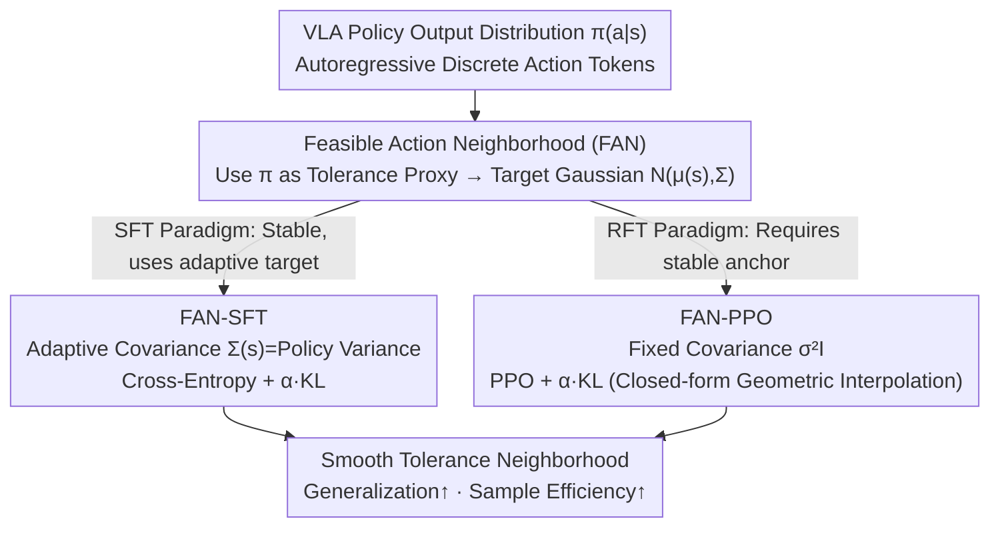

# Boosting Vision-Language-Action Finetuning with Feasible Action Neighborhood Prior

**Conference**: CVPR 2026  
**arXiv**: [2604.01570](https://arxiv.org/abs/2604.01570)  
**Code**: None  
**Area**: Robot Manipulation / VLA Finetuning  
**Keywords**: VLA Finetuning, Feasible Action Neighborhood, Gaussian Regularization, Reinforcement Finetuning, Sample Efficiency

## TL;DR
This paper proposes the Feasible Action Neighborhood (FAN) regularizer, which shapes the output distribution of VLA models into a Gaussian form that matches physical action tolerances. It significantly improves success rates, generalization, and sample efficiency in both SFT and RFT paradigms (RFT achieves a 90% success rate with only 1/3 of the training steps).

## Background & Motivation
**Background**: VLA models (such as OpenVLA, $\pi_0$) unify visual perception, language understanding, and low-level control into a single model, performing autoregressive prediction via discretized action tokens. In practice, these models are typically pre-trained and then finetuned using Supervised Finetuning (SFT) or Reinforcement Finetuning (RFT).

**Limitations of Prior Work**: VLA training methods directly inherit the training paradigms of language models (one-hot cross-entropy or PPO). However, **physical actions possess inherent tolerances**—nearby actions may yield equivalent task progress. This fundamental difference is currently overlooked.

**Key Challenge**: SFT collapses probability mass onto a single demonstrated action (overfitting), leading to poor generalization. While RFT can expand the distribution, its sample efficiency is extremely low, requiring extensive exploration to implicitly discover the tolerance structure.

**Goal**: How can the tolerance structure of the physical action space be explicitly utilized during VLA finetuning?

**Key Insight**: The concept of "Feasible Action Neighborhood" (FAN) is formalized, and it is observed that the shape of the policy distribution (sharp vs. smooth) is highly correlated with generalization performance.

**Core Idea**: A FAN-guided Gaussian regularizer is introduced to reshape the policy distribution from "overconfident peaks" to "smooth tolerance neighborhoods." This approach is applicable to both SFT and RFT without requiring modifications to the model architecture.

## Method

### Overall Architecture
This paper addresses the issue where VLA finetuning directly adopts language model training paradigms (one-hot cross-entropy or PPO), ignoring the natural tolerance of physical actions where neighboring actions often result in equivalent task progress. FAN does not change the model architecture; instead, it pulls the policy action distribution $\pi(a|s)$ toward a target Gaussian $\mathcal{N}(\mu(s), \Sigma)$ at each state $s$, transforming "overconfident peaks" into "smooth tolerance neighborhoods." The same regularizer, derived from a shared FAN concept, is integrated into two finetuning paths: SFT, which is stable and uses a covariance that adapts to the policy geometry, and RFT, which requires a stable anchor and uses a fixed covariance. Both paths ultimately shape the policy distribution into tolerance neighborhoods to improve generalization and sample efficiency, while autoregressive discrete decoding remains unchanged throughout the process.

### Key Designs

**1. Feasible Action Neighborhood (FAN): Formalizing Action Tolerance as an Observable Proxy**

The tolerance structure, previously ignored implicitly, is defined explicitly: for a given state $s$, the FAN is the set of all actions with Q-values close to the optimum:
$$\mathbb{N}_\delta(s) \subseteq \{a \in A: Q(s, a^*(s)) - Q(s, a) \leq \delta\}$$
Physical manipulations naturally possess non-trivial FANs. Since Q-values are difficult to obtain directly, the authors use the policy distribution $\pi(a|s)$ as a practical observable proxy for FAN—a sharper distribution corresponds to a smaller FAN and poorer generalization, while a smoother distribution indicates a larger FAN and better generalization. This correspondence stems from empirical observations: the distribution shape is highly correlated with success rate, making "distribution shaping" the lever for "tolerance regulation."

**2. FAN-SFT: Countering Demonstration Overfitting with Adaptive Gaussians**

SFT tends to collapse probability mass onto a single demonstrated action, causing overfitting and poor generalization. FAN-SFT adds a KL term to the standard cross-entropy loss to pull the policy toward a Gaussian defined by its own statistics:
$$\mathcal{L}_{\text{FAN-SFT}} = -\frac{1}{n}\sum_{i,t}\left(\log\pi_\theta(a_t^i|s_t^i, l^i) + \alpha D_{\text{KL}}(\pi_\theta(\cdot|s_t^i)\|\mathcal{N}(\cdot|\mu(s_t^i), \Sigma(s_t^i)))\right)$$
The covariance is dynamically set to the policy's own variance $\Sigma(s) = \text{diag}(\sum_a \pi(a|s)(a-\mu(s))^2)$. Since SFT is inherently stable, it can safely use this adaptive target following policy geometry, encouraging the distribution to spread according to the appropriate tolerance width for the current state rather than collapsing to a point.

**3. FAN-PPO: Anchoring Reinforcement Finetuning with Fixed Gaussians**

While RFT can expand the distribution, its sample efficiency is extremely low as it relies on extensive exploration to implicitly discover tolerance structures. FAN-PPO adds a KL term with a fixed-covariance Gaussian to the PPO objective:
$$\max_\pi \mathbb{E}[\frac{\pi(a|s)}{\pi_t(a|s)}A^{\pi_t}] - \alpha \mathbb{E}[D_{\text{KL}}(\pi\|\mathcal{N}(\mu(s), \sigma^2 I))]$$
Here, a fixed $\Sigma = \sigma^2 I$ is used (where the hyperparameter directly controls the target FAN size). It features a closed-form optimal policy:
$$\pi_{t+1} \propto \mathcal{N}^{\frac{\alpha}{\alpha+\beta^*}} \cdot \pi_t^{\frac{\beta^*}{\alpha+\beta^*}} \cdot \exp(\frac{Q}{\alpha+\beta^*})$$
This implies the new policy is a geometric interpolation between the old policy and the target Gaussian, reweighted by Q-values, where $\alpha$ controls the Gaussian pull and $\beta^*$ controls conservatism. Since RFT needs stable anchors, the fixed covariance provides a consistent target, allowing the model to inherit tolerance priors without starting from zero exploration, which significantly boosts sample efficiency.

### Loss & Training
- The FAN regularization is added to standard SFT/PPO losses, with $\alpha$ controlling the weight.
- Hyperparameters: OpenVLA ($\sigma=0.3, \alpha=1.0$); OpenVLA-OFT ($\sigma=0.2, \alpha=0.1$).
- GAE is used to estimate the advantage function, and the value network is trained with MSE loss.

## Key Experimental Results

### Main Results (ManiSkill, Success Rate %)

| Method | In-dist | OOD-Visual | OOD-Semantic | OOD-Execution | OOD Average |
|------|--------|---------|---------|---------|---------|
| OpenVLA + SFT | 78.1 | 76.6 | 57.4 | 40.4 | 58.1 |
| **OpenVLA + FAN-SFT** | **89.8** | **81.7** | **63.5** | **44.8** | **63.3** |
| Gain | +11.7 | +5.1 | +6.1 | +4.4 | +5.2 |
| OpenVLA + PPO | 95.9 | 80.1 | 79.7 | 85.8 | 81.9 |
| **OpenVLA + FAN-PPO** | **97.4** | **85.0** | **86.7** | **92.6** | **88.1** |
| Gain | +1.5 | +4.9 | +7.0 | +6.9 | +6.2 |

### Ablation Study (Sample Efficiency)

| Configuration | Steps to Reach 90% Success Rate | Description |
|------|----------------------|------|
| OpenVLA + PPO | ~X steps | Baseline |
| OpenVLA + FAN-PPO | **~X/3 steps** | Requires only about 1/3 of training steps |

| Data Volume | SFT | FAN-SFT | Gain |
|--------|-----|---------|------|
| 1.6K | Lower | Higher | FAN is consistently effective across data scales |
| 16K | Higher | **Even Higher** | Gains persist even with large data volumes |

### Key Findings
- The improvement of FAN-PPO is most significant in OOD-Execution scenarios (+6.9~11.1%), indicating that FAN significantly enhances action space generalization.
- The boost in sample efficiency is most notable—FAN-PPO requires only 1/3 of the baseline steps to achieve equivalent performance.
- Real-world robot experiments also validated the spatial generalization capabilities of FAN-SFT (higher success rates in unseen positions).
- FAN differs from maximum entropy—while maximum entropy provides unstructured exploration encouragement, FAN is a structured regularizer that leverages physical priors.

## Highlights & Insights
- The formalization of FAN, while simple, is profound—it reveals the fundamental mismatch between language training objectives and physical action spaces.
- The regularizer does not modify the architecture or decoding method, making it truly plug-and-play.
- The derivation of the closed-form optimal policy (Proposition 1) provides a clear theoretical understanding.
- The unified treatment of the SFT and RFT paradigms offers excellent generalizability.

## Limitations & Future Work
- The Gaussian assumption might be too simplistic—actual FANs could be non-convex or multimodal.
- $\sigma$ requires tuning across tasks; adaptively learning the FAN size is an important future direction.
- Currently validated only in simulators and simple real-world tasks; complex dexterous manipulation remains to be tested.
- Future work could combine FAN with value functions to dynamically estimate tolerance for each state.

## Related Work & Insights
- VLA models like RT-2 and OpenVLA directly adopt language training paradigms; this paper exposes the fundamental flaws of that approach.
- RFT methods like RL4VLA and GRPO optimize only at the reward end; FAN optimizes from the action space geometry end, making them complementary.
- Label smoothing is also a form of distribution regularization, but it does not utilize physical structures, making it much less effective than FAN.
- Insight: In robotic control, "physical priors" should be more actively integrated into learning objectives.

## Rating
- Novelty: ⭐⭐⭐⭐⭐ The FAN concept is novel and profound, closely combining theory and practice.
- Experimental Thoroughness: ⭐⭐⭐⭐⭐ Covers both SFT+RFT paradigms, multiple VLA backbones, In-dist+OOD, sample efficiency, and real-world robots.
- Writing Quality: ⭐⭐⭐⭐⭐ The logical chain from motivation to theory to experiments is complete and fluent.
- Value: ⭐⭐⭐⭐⭐ Provides a new fundamental principle for VLA finetuning with broad applicability.

<!-- RELATED:START -->

## Related Papers

- [\[CVPR 2026\] Global Prior Meets Local Consistency: Dual-Memory Augmented Vision-Language-Action Model for Efficient Robotic Manipulation](global_prior_meets_local_consistency_dual-memory_augmented_vision-language-actio.md)
- [\[CVPR 2026\] MoEActok: A MoE-based Action Tokenizer for Vision-Language-Action Models](moeactok_a_moe-based_action_tokenizer_for_vision-language-action_models.md)
- [\[CVPR 2026\] Adaptive Action Chunking at Inference-time for Vision-Language-Action Models](adaptive_action_chunking_at_inference-time_for_vision-language-action_models.md)
- [\[CVPR 2026\] ACoT-VLA: Action Chain-of-Thought for Vision-Language-Action Models](acot-vla_action_chain-of-thought_for_vision-language-action_models.md)
- [\[CVPR 2026\] QuantVLA: Scale-Calibrated Post-Training Quantization for Vision-Language-Action Models](quantvla_scale-calibrated_post-training_quantization_for_vision-language-action_.md)

<!-- RELATED:END -->
