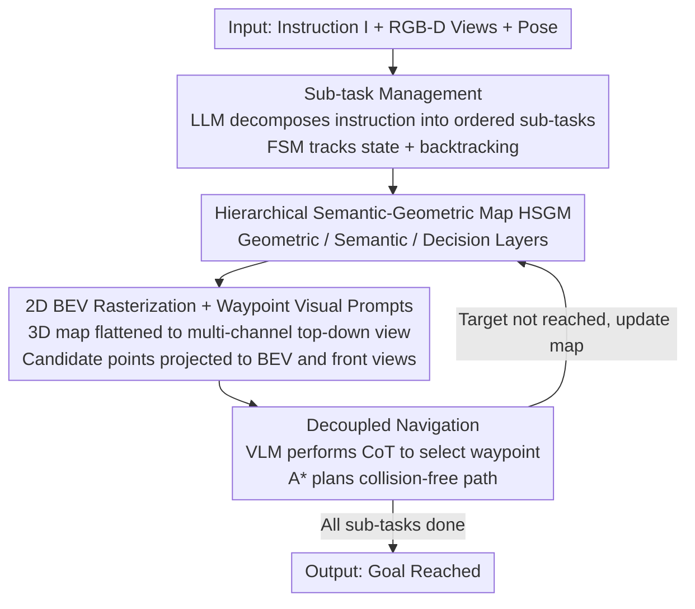

# Bridging the 2D-3D Gap: A Hierarchical Semantic-Geometric Map for Vision Language Navigation

**Conference**: CVPR 2026  
**Paper**: [CVF Open Access](https://openaccess.thecvf.com/content/CVPR2026/html/Li_Bridging_the_2D-3D_Gap_A_Hierarchical_Semantic-Geometric_Map_for_Vision_CVPR_2026_paper.html)  
**Code**: https://github.com/TeacherTom/HSGM_public (Available)  
**Area**: Robotics / Embodied AI  
**Keywords**: Vision-Language Navigation, Zero-shot VLN-CE, Semantic-Geometric Map, VLM High-level Planning, Decoupled Control  

## TL;DR
This paper proposes HSGM—a hierarchical map that rasterizes 3D geometric information into multi-channel 2D top-down views readable by VLMs. This allows the VLM to focus on high-level semantic decisions ("picking the next waypoint on the map") while an A* algorithm handles low-level collision-free movement. In a completely training-free zero-shot setting, it achieves 47.9% / 41.8% SR on R2R-CE / RxR-CE, surpassing all zero-shot methods and even some supervised models.

## Background & Motivation

**Background**: Vision-Language Navigation (VLN) requires embodied agents to navigate toward target points based on natural language instructions in unseen environments. Recent mainstream approaches integrate pre-trained VLMs directly into the navigation loop—VLMs possess powerful cross-modal alignment, world knowledge, and common-sense reasoning, making them adept at understanding language instructions and 2D scenes. The task has also shifted from early discrete graph traversal (R2R) to more realistic continuous environments (VLN-CE, executing low-level actions in Habitat).

**Limitations of Prior Work**: VLMs are "geometrically naive" navigators. Trained on image-text pairs, their reasoning is confined to the appearance plane, with little concept of underlying 3D geometry or how spatial relationships evolve with physical interaction. This manifests as two entangled weaknesses: ① **Insufficient spatial understanding**—VLMs can identify objects and local relationships ("the chair is next to the table") but struggle to assemble a global spatial layout across multiple views; their understanding of continuous space is fragmented and ambiguous, failing to reliably align instructions like "walk between the two" to 3D positions. ② **Weak motion planning**—VLMs excel at high-level semantic planning ("walk through the hallway and turn to the sofa") but struggle to translate this into physically executable low-level action sequences ("turn left 15°, move forward 0.5m").

**Key Challenge**: Previous methods (e.g., MapNav, AO-Planner) either force VLMs to predict raw actions directly or plan paths on 2D images—both paths entangle **semantic reasoning and geometric execution**, pushing VLMs beyond their capability boundaries. The root problem lies in the absence of a bridge that is "geometrically grounded" yet "semantically readable to VLMs," while simultaneously decoupling high-level planning from low-level control.

**Goal**: (1) Provide the VLM with an environment representation that its native 2D visual pipeline can digest while retaining geometric cues; (2) Convert continuous 3D planning problems into discrete selection problems at which VLMs excel; (3) Prevent long-range navigation from "forgetting progress / hallucinating completion."

**Key Insight**: Since the VLM's strength lies in 2D image-text understanding, one should not force it to read 3D point clouds—instead, **rasterize the 3D environment into a top-down Bird's-Eye View (BEV) semantic map** for the VLM, delegating geometric execution to classical planning algorithms.

**Core Idea**: Utilize a "Hierarchical Semantic-Geometric Map (HSGM)" as the information hub—the VLM only selects geometrically valid waypoints on the map for high-level semantic decisions, while A* handles collision-free movement between waypoints. The entire framework is **training-free**.

## Method

### Overall Architecture

HSGM is a training-free zero-shot VLN-CE framework. Inputs consist of the user's natural language instruction $I$ and the agent's first-person RGB-D multi-view observations $O_t=\{V_t^i\}_{i=1}^3$ (front/left/right); the output is a sequence of low-level actions until the agent selects STOP. The pipeline functions by decomposing instructions into sub-tasks, building a three-layer map during navigation, flattening the map into 2D visual prompts for the VLM, allowing the VLM to select points, and finally using A* to connect those points into a path.

Formally, navigation is a sequential decision process $a_t=\pi_\theta(I,O_t,H_t)$, where $H_t=\{(O_k,a_k)\}_{k<t}$ is the historical context. The key lies in splitting $\pi_\theta$ into two layers: a high-level policy $\pi_H$ handled by the VLM (selecting waypoints on the map) and a low-level policy $\pi_L$ handled by A* (translating waypoints into atomic actions). The coordination between the four modules is as follows:

### Key Designs

**1. Hierarchical Semantic-Geometric Map HSGM: Splitting 3D environments into geometric, semantic, and decision layers**

This is the information hub of the paper, directly addressing the "geometrically naive" VLM issue. It maintains a dynamically updated 3D representation across three complementary levels. The **Geometric Layer $M_{geo}$** is the spatial skeleton: following InstructNav, multi-view RGB pixels are back-projected into a scene point cloud $P_{scene}$ using depth maps $I_t^{i,D}$ and camera poses $\xi_t$. Points above the ground are categorized as obstacles $P_{obs}$, while others form the initial navigable area $P_{nav}^{init}$. To support multi-floor navigation, surface normal estimation and tilted plane filtering are used to detect stairs $P_{stair}$, which are merged into the navigable area:

$$P_{nav}=P_{nav}^{init}\cup P_{stair},\quad M_{geo}=P_{nav}\cup P_{obs}.$$

The **Semantic Layer $M_{sem}$** allows the VLM to perceive the scene from a semantic perspective: YOLO-E provides instance segmentation masks $\{M_j\}$ and categories $\{c_j\}$ on first-person RGB views. Each mask is back-projected to 3D to obtain instance point clouds $P_{obj,j}$. As the agent moves, $P_{obj,j}$ from multiple frames are merged if they show high 3D IoU and semantic consistency, forming a temporally coherent instance-level semantic map. Low-confidence instances are discarded as noise, resulting in $M_{sem}=\{(P_{obj,j},c_j)\}_{j=1}^{N_{obj}}$. The **Decision Layer $M_{dec}=\{G,A_{curr}\}$** discretizes the navigable space into waypoints (see Design 3) and records historical trajectories $\tau_{his}$ and completed sub-task nodes $\{\pi_{done,k}\}$. By stacking these three layers, the VLM gains for the first time a "globally consistent + object-grounded + candidate-selective" view of the environment.

**2. 2D BEV Rasterization + Waypoint Visual Prompts: Flattening 3D maps into VLM-readable top-down views**

Since VLMs are primarily trained on 2D image-text pairs, they struggle to interpret raw 3D point clouds. This step rasterizes the 3D HSGM from Design 1 into an agent-centric **multi-channel 2D top-down view $M_{bev}$** as the core visual input for the VLM. $M_{bev}$ includes three types of channels: ① Geometric channels (obstacles $P_{obs}$ in black, navigable area $P_{nav}$ in gray); ② Semantic channels (category-specific markers at object centroids); ③ Status annotations (overlaying current agent position, historical trajectory $\tau_{his}$, and completed sub-task endpoints). Crucially, the set of current local candidate waypoints $A_{curr}$ is labeled with **numerical indices** and projected onto both the BEV map and the agent's front view $V_t^{front}$. Visited vs. unvisited waypoints are distinguished by color. Consequently, the VLM does not need to output continuous coordinates but instead "picks a numbered point" from the image—transforming continuous 3D planning into a discrete choice task.

**3. Decoupled Navigation: VLM for high-level point selection, A* for low-level collision-free movement, plus training-free waypoint sampling**

To solve the "semantic and geometric entanglement" pain point, the framework completely decouples the two layers. At the **High-level**, the VLM receives visual inputs (indexed $V_t^i$ and $M_{bev}$) and text inputs (instruction + reasoning history) at each step. It follows a structured CoT sequence—Movement → Observation → Thought → Plan → Action—to select from the action space $A_t=A_{turn}\cup A_{curr}$ (fixed turns + dynamic waypoints) or output STOP. At the **Low-level**, once a waypoint $g$ is selected, A* finds the shortest path $\tau_{path}$ on a pre-constructed global graph $G=(V,E)$ using Euclidean distance as the cost. This path is decomposed into atomic actions like "ROTATE to align, then FORWARD," with geometric precision guaranteed by the classical algorithm.

The waypoint generation is also **training-free**. Nodes in the global graph $G$ are generated from $M_{geo}$ via denoising and voxel downsampling to get candidates $A_{glob}$. Each candidate $p_c$ undergoes a cylindrical occupancy check $P_{obs}\cap \text{Cyl}(p_c,r,h)=\varnothing$ ($r,h$ are agent radius and height). Edges are established between nodes with distance $\le 1.0\text{m}$ and height difference $\le 0.3\text{m}$ (allowing stair traversal), with interpolation used to confirm no obstacles are intersected. The local waypoint set $A_{curr}$ is generated similarly in the current field of view but at a coarser resolution (e.g., 1.0m), followed by three heuristic filters: distance (0.3–3.0m), semantics (prioritizing points near objects), and reachability.

**4. Sub-task Management: Splitting long instructions into FSMs to prevent "forgetting/hallucination"**

VLMs often skip instructions or misjudge completion in long-range tasks. This mechanism first uses the VLM to decompose a complex instruction $I$ into ordered executable sub-tasks $T=\{T_1,\dots,T_k\}$. Each sub-task must satisfy two constraints: **explicit termination** (verifiable end state, e.g., "leave the bedroom") and **bounded complexity**. During execution, a Finite State Machine (FSM) progresses through states $S\in\{\text{pending, in progress, done}\}$. The VLM is fed only the current "in progress" sub-task until it outputs STOP, at which point the sub-task is marked "done" and the next is activated. **Double confirmation** (two consecutive STOPs) is used for the final sub-task to prevent premature termination. Two auxiliary mechanisms enhance robustness: ① History—completed sub-task locations $\pi_{done,i}$ are recorded and projected onto the BEV as spatial anchors; ② Automatic backtracking—if a sub-task exceeds a step limit, the agent automatically returns to the starting position and retries.

### Loss & Training
The framework is entirely **training-free**, requiring no training or fine-tuning. All experiments utilize the GPT-5 API as the core VLM (serving both instruction decomposition and navigation decisions), with YOLO-E for semantic segmentation and A* for low-level path planning.

## Key Experimental Results

### Main Results

Evaluated on R2R-CE (full val-unseen) and RxR-CE (random 500 English episodes), HSGM consistently outperforms all zero-shot methods and surpasses several supervised methods (SR↑ / SPL↑ / NE↓ / OSR↑ / nDTW↑):

| Setting | Method | R2R-CE SR | R2R-CE SPL | R2R-CE NE | RxR-CE SR | RxR-CE nDTW |
|------|------|-----------|------------|-----------|-----------|-------------|
| Supervised | NaVid (RSS24) | 37.4 | 35.9 | 5.47 | 23.8 | – |
| Supervised | MapNav (ACL25) | 39.7 | 37.2 | 4.93 | 32.6 | 43.5 |
| Supervised | ETPNav (TPAMI24) | 57.0 | 49.0 | 4.71 | 54.8 | 61.9 |
| Zero-shot | AO-Planner (AAAI25) | 25.5 | 16.6 | 6.95 | 22.4 | 33.1 |
| Zero-shot | DreamNav (arXiv25) | 32.8 | 28.9 | 7.06 | – | – |
| Zero-shot | **Ours (HSGM)** | **47.9** | **32.8** | **5.42** | **41.8** | **54.9** |

On R2R-CE, the SR is 15.1% higher than the strongest zero-shot baseline (DreamNav), with lower NE and the highest OSR (58.7%). On the long-range RxR-CE benchmark, the gap is even larger: 41.8% SR is nearly double that of AO-Planner (22.4%), with nDTW at 54.9%, confirming the efficacy of sub-task management for spatio-temporal alignment.

### Ablation Study

**Layered additions to the BEV map** (R2R 300-episode subset):

| Geometric | Semantic | Decision | SR ↑ | SPL ↑ |
|--------|--------|--------|------|-------|
| × | × | × | 46.0 | 30.1 |
| ✓ | × | × | 47.3 | 31.8 |
| ✓ | ✓ | × | 49.2 | 32.8 |
| ✓ | ✓ | ✓ | 51.0 | 33.7 |

**Decoupled navigation components** (R2R val-unseen):

| Configuration | SR ↑ | SPL ↑ | NE ↓ | OSR ↑ | Note |
|------|------|-------|------|-------|------|
| Full Model | 51.0 | 33.7 | 5.24 | 61.7 | Full Model |
| w/o Sub-task Decomposition | 42.1 | 28.9 | 5.59 | 57.9 | **Gain**: -8.9% SR |
| w/o Planning-Control Separation | 44.3 | 31.9 | 5.47 | 57.0 | **Gain**: -6.7% SR |
| w/o Structured CoT | 34.0 | 18.0 | 6.48 | 55.3 | **Gain**: -17.0% SR |

### Key Findings
- **Structured CoT is the lifeline**: Removing it causes SR to plummet from 51.0 to 34.0 (-17%) and SPL to nearly halve. Forcing the VLM to reason in a Movement→Observation→Thought→Plan→Action sequence is what makes "selecting points on a map" reliable.
- **Three-layer map provides cumulative gains**: The geometric layer resolves spatial ambiguity (+1.3%), the semantic layer provides instruction-object grounding (+1.9%), and the decision layer offers long-range context (+1.8%).
- **Sub-task management is more valuable for long-range tasks**: The improvement is particularly significant on RxR-CE (nDTW nearly doubled), though removing it on R2R also drops SR by 8.9%.
- **Automatic backtracking saves episodes**: Backtracking was triggered in 18.3% / 19.0% of R2R/RxR episodes, with a recovery success rate of 30.8% / 26.8%, proving that retrying from a known state recovers many otherwise failed navigations.

## Highlights & Insights
- **Clean division of labor**: The approach does not force the VLM to read 3D or output continuous actions. By allowing it to make discrete choices on a numbered top-down view, continuous 3D planning is reduced to a VLM's "comfort zone."
- **Outsourcing geometric precision to A***: Tasks that VLMs are naturally bad at—such as collision avoidance, stair traversal, and shortest path calculation—are handed to deterministic classical algorithms. The VLM only handles the "selection," making the system stable and efficient.
- **Zero-shot outperforming supervised methods**: Achieving 47.9% SR on R2R-CE without training suggests that "good environment representation + rational division of labor" can partially replace massive in-domain training data.
- **Transferable design**: The interface of rasterizing 3D structures into multi-channel BEV for VLMs can be transferred to any embodied task requiring global spatial layouts.

## Limitations & Future Work
- **Dependency on perception quality**: The semantic layer relies entirely on YOLO-E. Errors in detection for complex/rare objects or poor viewpoints can propagate through the system.
- **VLM cost and latency**: Calling the GPT-5 API for CoT reasoning at every step is expensive and introduces latency, posing challenges for real-time deployment.
- **Relatively lower SPL**: While SR is high, the R2R-CE SPL of 32.8% is notably lower than the 49.0% of the supervised ETPNav, indicating a gap in path efficiency (detours).
- **Heuristic stair detection**: Multi-floor capability depends on surface normals and tilted plane filtering; the robustness of these geometric heuristics on non-standard stairs or ramps remains unverified.

## Related Work & Insights
- **vs. MapNav / Dynam3D (Structured Map Input)**: These methods also provide VLMs with top-down views or 3D representations but **require in-domain training** to teach the VLM how to interpret them. HSGM is entirely zero-shot.
- **vs. InstructNav / CA-Nav (Value-map Decoupling)**: These use the VLM as a semantic scorer to guide low-level planners, but the map is often invisible to the VLM. HSGM makes the map a direct visual input.
- **vs. AO-Planner (2D Affordance Reasoning)**: This prompts VLMs to perform reachability reasoning on 2D images, often confusing visual visibility with physical reachability. HSGM's waypoints have 3D geometric guarantees.

## Rating
- **Novelty**: ⭐⭐⭐⭐ Combining multi-channel BEV rasterization, high-low level decoupling, and training-free waypoint sampling into a clean zero-shot framework is clever, though components are often skillful assemblies of existing tech.
- **Experimental Thoroughness**: ⭐⭐⭐⭐ Results across major benchmarks with core ablations are self-consistent; however, API costs limited ablations to 300-episode subsets.
- **Writing Quality**: ⭐⭐⭐⭐⭐ The link between pain points, design, formulas, and ablations is logically sound and clearly explained.
- **Value**: ⭐⭐⭐⭐⭐ High practical value due to zero-shot performance exceeding supervised models and a transferable representation interface.

<!-- RELATED:START -->

## Related Papers

- [\[CVPR 2026\] TrajRAG: Retrieving Geometric-Semantic Experience for Zero-Shot Object Navigation](trajrag_retrieving_geometric-semantic_experience_for_zero-shot_object_navigation.md)
- [\[CVPR 2026\] Progress-Think: Semantic Progress Reasoning for Vision-Language Navigation](progress-think_semantic_progress_reasoning_for_vision-language_navigation.md)
- [\[CVPR 2026\] D3D-VLP: Dynamic 3D Vision-Language-Planning Model for Embodied Grounding and Navigation](d3d-vlp_dynamic_3d_vision-language-planning_model_for_embodied_grounding_and_nav.md)
- [\[CVPR 2026\] AwareVLN: Reasoning with Self-awareness for Vision-Language Navigation](awarevln_reasoning_with_self-awareness_for_vision-language_navigation.md)
- [\[CVPR 2026\] Learning to Control Physically-simulated 3D Characters via Generating and Mimicking 2D Motions](learning_to_control_physically-simulated_3d_characters_via_generating_and_mimick.md)

<!-- RELATED:END -->
