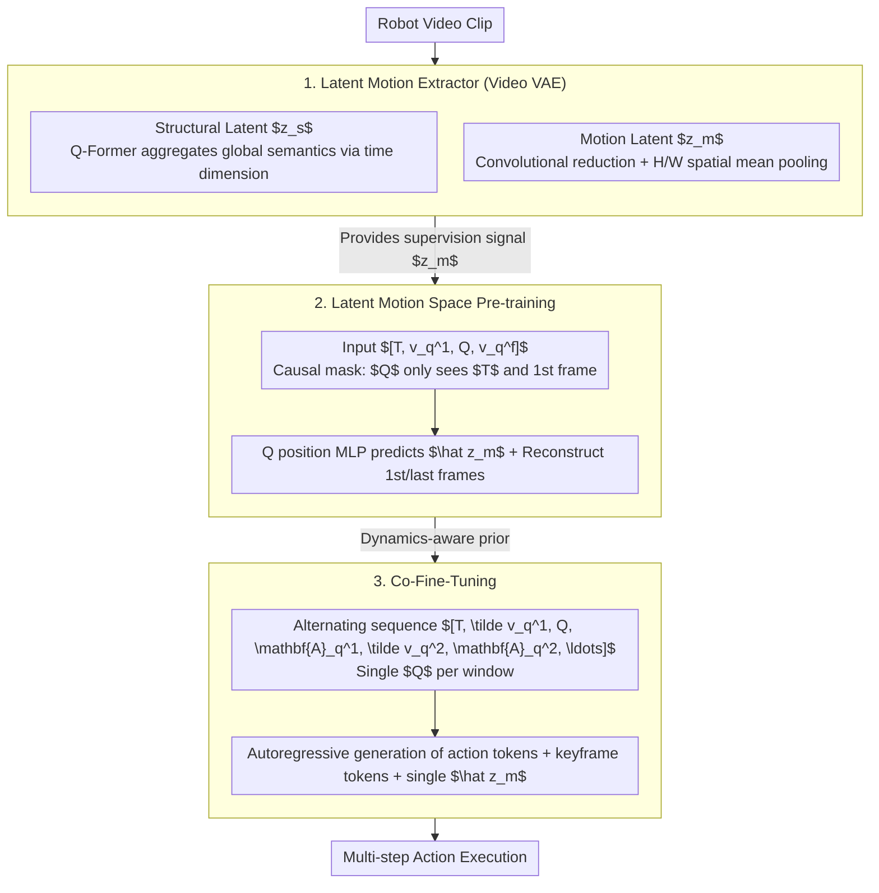

# Chain of World: World Model Thinking in Latent Motion (CoWVLA)

**Conference**: CVPR 2026  
**arXiv**: [2603.03195](https://arxiv.org/abs/2603.03195)  
**Code**: [https://fx-hit.github.io/cowvla-io](https://fx-hit.github.io/cowvla-io)  
**Area**: Robot Manipulation / Vision-Language-Action Models / World Models  
**Keywords**: [VLA, World Model, Latent Motion Modeling, Video VAE, Keyframe Prediction, Action Quantization]  

## TL;DR
CoWVLA is proposed to unify the advantages of world-model VLAs and latent-action VLAs. By utilizing a Latent Motion Extractor to decompose video into structural and motion latents, the VLA performs world-model prediction within the latent motion space instead of reconstructing redundant pixels. Combined with Co-Fine-tuning to alternately generate keyframes and action tokens, it achieves 95.2% on LIBERO-LONG, surpassing $\pi_0$ (85.2%), and an average score of 0.560 on SimplerEnv-WidowX, exceeding $\pi_0$ (0.425).

## Background & Motivation
Integrating world models into VLAs is a significant recent trend. The core idea is to enable models to not only predict actions but also future states—"imagining" what the world will look like after an action. However, existing methods face two primary challenges:

1.  **World-model VLA (e.g., GR-2, UniPi)**: These predict future frames directly in pixel space. The problem is that many pixels represent static backgrounds (tables, walls, distant objects), leading the model to waste capacity on reconstructing redundant information. Information truly useful for robot decision-making (object displacement, robot arm trajectories) occupies only a tiny fraction of the pixel space.
2.  **Latent-action VLA (e.g., LAPA, latent action pretraining)**: These encode actions into a latent space to bypass constraints of explicit action labeling. However, these methods only extract latent representations of actions and lack modeling of temporal continuous dynamics—they cannot predict "what happens next" and do not integrate world knowledge for forward-looking reasoning.

**Key Challenge**: World models need to predict the future, but pixel-level prediction is inefficient; latent actions save capacity but lose world dynamic information.

## Core Problem
How can a VLA be equipped with world-mode prediction capabilities—performing reasoning in a latent motion space rather than pixel space—without reconstructing redundant background pixels?

## Method

### Overall Architecture
CoWVLA aims to combine the benefits of both approaches. Its solution is to have the VLA perform world-model prediction in "latent motion space." The system consists of **two models and three training stages**: the **Latent Motion Extractor (Video VAE)** first decomposes video clips into structural latents $z_s$ and motion latents $z_m$, providing supervision signals. The **VLA Decoder** then performs unified autoregressive prediction across two stages: a pre-training stage that infers latent motion $\hat z_m$ from instructions and the first frame while reconstructing the first and last frames, and a Co-Fine-Tuning stage that aligns this dynamic reasoning with discrete actions by alternately modeling keyframe visual tokens and FAST-quantized action tokens.

### Key Designs

**1. Latent Motion Extractor: Separating Video into Structure and Motion to Filter Redundant Background**

**Design Motivation**: Pixel space contains vast static backgrounds; reconstructing them wastes capacity. This extractor is a pre-trained video VAE that encodes video clips into intermediate latent tensors, then decouples them into two branches: the structural branch uses a Q-Former (learnable queries aggregating via cross-attention along the time dimension) to extract structural latents $z_s$, encoding global semantics ("what the scene looks like"); the motion branch uses convolutional layers for dimension reduction followed by mean pooling along the H and W spatial axes to obtain directional motion embeddings $z_m^h$ and $z_m^w$. These are concatenated into a unified motion latent $z_m$ representing a 2D motion field. Spatial mean pooling naturally suppresses contributions from static regions, allowing $z_m$ to filter out backgrounds automatically.

**2. World Model Pre-training in Latent Motion Space: Predicting Motion Instead of Copying Answers**

**Mechanism**: To teach the VLA to predict motion given current observations and instructions, the pre-training sequence is $[T, v_q^1, Q, v_q^f]$, where $T$ is the language instruction, $v_q^1$ and $v_q^f$ are discretized visual tokens for the first and last frames, and $Q$ is a learnable motion query. An MLP at the $Q$ position outputs $\hat z_m$, aligned with the extracted ground truth $z_m$ via MSE. A causal attention mask ensures $Q$ can only see $\{T, v_q^1\}$, preventing it from seeing the future frame $v_q^f$. The total loss $\mathcal{L}_{pretrain} = \|\hat z_m - z_m\|_2^2 + \sum_{x\in\{1,f\}}\mathrm{CE}(\hat v_q^x, v_q^x)$ encourages coherent prediction of the "world after the action."

**3. Co-Fine-Tuning: Single Query Aggregating Full-Window Dynamics Aligned to Multi-step Actions**

**Function**: Aligning prediction with control. The sequence becomes $[T, \tilde v_q^1, Q, \mathbf{A}_q^1, \tilde v_q^2, \mathbf{A}_q^2, \ldots, \mathbf{A}_q^N]$, where $\mathbf{A}_q^j$ are FAST-quantized action tokens. **Ours** uses a single $Q$ after the first keyframe as a dynamic aggregator for the entire window, producing one $\hat z_m$ to summarize the continuous dynamics. The decoder autoregressively generates action and keyframe tokens. The causal mask forces the model to rely on latent dynamic reasoning rather than "peeking" at future frames.

### Loss & Training
- **Pre-training**: $L = \text{MSE}(\hat z_m, z_m) + \text{CE}(v_q^f \text{ reconstruction})$, trained on large-scale robot video data.
- **Co-Fine-tuning**: $L = \text{CE}(\text{action tokens}) + \text{CE}(\text{keyframe tokens}) + \text{MSE}(\text{motion prediction})$, fine-tuned on task-specific data.
- FAST quantizer and VQGAN are pre-trained independently and then frozen.
- **Inference**: Autoregressively generate action tokens decoded into continuous actions, while keyframe tokens are used for validation/visualization.

## Key Experimental Results

| Dataset | Metric | CoWVLA | $\pi_0$ | OpenVLA | HPT | Gain (vs $\pi_0$) |
| :--- | :--- | :--- | :--- | :--- | :--- | :--- |
| LIBERO-Spatial | Success Rate | **96.8%** | 92.4% | 78.8% | — | **+4.4** |
| LIBERO-Object | Success Rate | **98.4%** | 94.0% | 88.4% | — | +4.4 |
| LIBERO-Goal | Success Rate | **95.2%** | 87.2% | 68.4% | — | +8.0 |
| LIBERO-Long | Success Rate | **95.2%** | 85.2% | 56.4% | — | **+10.0** |
| LIBERO-Avg | Success Rate | **96.4%** | 89.7% | 73.0% | — | **+6.7** |
| SimplerEnv-WidowX | Avg score | **0.560** | 0.425 | 0.268 | 0.308 | **+0.135** |
| SimplerEnv-Google Robot | Avg score | **0.504** | — | 0.248 | 0.480 | — |

### Ablation Study
- **Removing motion latent pre-training**: LIBERO-Avg drops from 96.4% to 92.1%, identifying world model pre-training in latent motion space as a core contribution.
- **Replacing latent motion prediction with pixel-level reconstruction**: Performance drops to 90.8%, confirming pixel reconstruction wastes capacity.
- **Removing keyframe generation in Co-Fine-tuning**: Drops to 93.7%, showing keyframes provide useful visual anchors.
- **Comparison of $z_m$ extraction**: H/W axis mean concatenation > Global mean pooling > Temporal difference convolution, indicating the importance of directional info.

## Highlights & Insights
- **Conceptual Breakthrough**: Predicting within a compressed motion latent space instead of pixel space maintains forward-looking reasoning while eliminating computational waste on redundant backgrounds.
- **Elegant $z_m$ Extraction**: H/W directional mean pooling naturally filters static backgrounds and retains motion direction information with a minimalist design.
- **Sophisticated Causal Masking**: Ensuring $Q$ cannot see the future forces the model to perform genuine "prediction."
- **Efficiency of Co-Fine-Tuning**: The single query design aggregates window-wide dynamics, efficiently bridging world-model thinking with action decision-making.
- **Superiority in Long-Sequence Tasks**: The +10% gain in LIBERO-Long suggests world-model reasoning is critical for complex, long-horizon tasks.

## Limitations & Future Work
- The Video VAE is frozen after pre-training; end-to-end joint training might further improve decomposition.
- Spatial mean pooling for $z_m$ may lose fine-grained local motion details required for high-precision tasks like threading a needle.
- Strategy for keyframe selection (e.g., uniform vs. adaptive) is not explored in detail.
- Discretization errors from FAST and VQGAN may accumulate in fine-grained manipulation.

## Related Work & Insights
- **vs. GR-2 / UniPi (Pixel-level World Model VLA)**: These suffer high computational costs and capacity waste on backgrounds; CoWVLA focuses only on motion-relevant information.
- **vs. LAPA (Latent Action Pre-training)**: LAPA extracts action latents without temporal dynamic modeling; CoWVLA predicts "how the world changes."
- **vs. $\pi_0$ (Flow matching VLA)**: $\pi_0$ lacks a world model component; CoWVLA adds world-model thinking to the framework, significantly boosting long-horizon performance.

## Rating
- **Novelty**: ⭐⭐⭐⭐⭐ Latent motion space world model is a fresh concept; $z_m$ extraction and Co-Fine-tuning are innovative.
- **Experimental Thoroughness**: ⭐⭐⭐⭐ Strong results across LIBERO and SimplerEnv, though lacks real-robot validation.
- **Writing Quality**: ⭐⭐⭐⭐ Clear motivation and systematic methodology description.
- **Value**: ⭐⭐⭐⭐⭐ Directs VLA world models toward latent motion spaces, achieving substantial SOTA improvements.

<!-- RELATED:START -->

## Related Papers

- [\[CVPR 2026\] Motus: A Unified Latent Action World Model](motus_a_unified_latent_action_world_model.md)
- [\[CVPR 2026\] Dexterous World Models](dexterous_world_models.md)
- [\[ICML 2026\] Dual-Stream Diffusion for World-Model Augmented Vision-Language-Action Model](../../ICML2026/robotics/dual-stream_diffusion_for_world-model_augmented_vision-language-action_model.md)
- [\[CVPR 2026\] VideoWorld 2: Learning Transferable Knowledge from Real-world Videos](videoworld_2_learning_transferable_knowledge_from_real-world_videos.md)
- [\[CVPR 2026\] From Manuals to Actions: A Unified VLA Model for Chain-of-Thought Manual Generation and Robotic Manipulation](from_manuals_to_actions_a_unified_vla_model_for_chain-of-thought_manual_generati.md)

<!-- RELATED:END -->
