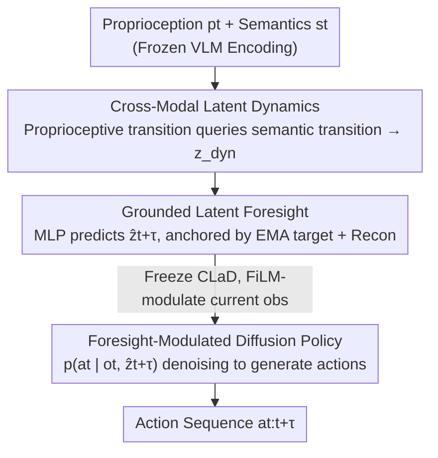

# CLaD: Planning with Grounded Foresight via Cross-Modal Latent Dynamics

**Conference**: CVPR 2026  
**Paper**: [CVF Open Access](https://openaccess.thecvf.com/content/CVPR2026/html/Jeong_CLaD_Planning_with_Grounded_Foresight_via_Cross-Modal_Latent_Dynamics_CVPR_2026_paper.html)  
**Code**: https://andrewwwj.github.io/clad (Project Page)  
**Area**: Robotics / Embodied AI  
**Keywords**: Robotic Manipulation, Latent Planning, Cross-Modal Dynamics, Diffusion Policy, Self-Supervised Foresight  

## TL;DR
CLaD enables robots to plan within a compact latent space. It models the co-evolution of modalities through an asymmetric cross-attention mechanism where "proprioceptive changes query semantic changes." It predicts latent foresight grounded by both EMA targets and reconstruction losses, which then modulates a diffusion policy for action generation. On LIBERO-LONG, it achieves a 94.7% success rate with only 0.66B parameters, outperforming the 7B OpenVLA.

## Background & Motivation
**Background**: Planning for long-horizon robotic manipulation currently follows two main paradigms. One is "Semantic Reasoning," utilizing Large Language Models for Chain-of-Thought planning (e.g., SayCan, CoT) or generating sub-goal images/videos (e.g., SuSIE) as intermediate targets to guide low-level policies. The other is "Latent Space Planning," which learns a forward dynamics world model to perform model-predictive control within compressed latent representations (e.g., RSSM, decoder-free implicit optimization, LBP), offering significantly higher efficiency.

**Limitations of Prior Work**: Semantic reasoning requires the iterative generation of expensive "semantic artifacts" (images, videos, or text) at every step, incurring high computational overhead. While latent planning is faster, it often **implicitly blends semantic and kinematic information into a single latent vector** without explicit constraints to ensure coordinated evolution during rollouts. Consequently, during long-horizon unrolling, semantic and kinematic latents may drift or decouple, leading to physically or logically inconsistent trajectories.

**Key Challenge**: When a robot manipulates an object, proprioceptive changes (arm movement) and semantic changes (visual scene transition) are **causally coupled** by the same underlying action. However, existing cross-modal representation learning typically aligns static states at "single timestamps" (matching visual features with proprioception in a specific frame) and fails to model "how both states change together under action." Thus, it cannot guarantee consistency between visual scene transitions and robot configuration changes.

**Goal**: To learn a representation that captures the correlation between **transitions** (transition-to-transition) rather than states, and to use this representation to predict reliable future latent states for guiding action generation.

**Key Insight**: The authors observe that "consistency should be imposed on transitions rather than static states." When a robot closes its gripper (kinematic transition), it observes how the scene changes (semantic transition). These co-occurring changes are causally linked. Furthermore, the relationship is directional—the kinematic context serves as a more reliable baseline for interpreting visual changes (understanding one's own movement facilitates understanding visual shifts).

**Core Idea**: Use **asymmetric cross-attention** where proprioceptive transitions query semantic transitions to derive a shared cross-modal dynamics representation $z_{\text{dyn}}$. Predict "grounded" latent foresight from $z_{\text{dyn}}$ and use it to condition a diffusion policy. The entire planning process is completed within a compact latent space without generating explicit semantic artifacts.

## Method

### Overall Architecture
CLaD is a **two-stage** framework. Inputs are the current proprioceptive state $p_t$ (joint angles and velocities) and semantic state $s_t$ (vision-language embeddings from a frozen VLM fused via FiLM). The output is an action sequence $a_{t:t+\tau}$. The authors utilize a System 2 / System 1 analogy: Stage 1 is "Slow Thinking"—learning cross-modal dynamics and predicting future latent foresight; Stage 2 is "Fast Reaction"—a diffusion policy generating low-level actions conditioned on the foresight. This decoupled training ensures planning focuses on accurate future state prediction without interference from policy optimization bias, while maintaining efficiency by operating entirely in the latent space.

Specifically: Stage 1 encodes $p_t$ and $s_t$ to extract **transition representations** $z_p$ and $z_s$ (using past states and actions to cross-attend to the current state). Asymmetric cross-attention lets $z_p$ query $z_s$, followed by pooling into a shared dynamics $z_{\text{dyn}}$. Lightweight MLPs predict future latent foresight $\hat z^{t+\tau}_p$ and $\hat z^{t+\tau}_s$ from $z_{\text{dyn}}$, supervised by an EMA target encoder and a reconstruction decoder. Stage 2 freezes CLaD and uses the foresight $\hat z^{t+\tau}$ to modulate the current observation via FiLM, conditioning the diffusion policy.

### Key Designs

**1. Cross-Modal Latent Dynamics: Interpreting Semantic Changes via Kinematic Context**

To address the decoupling in latent planning, CLaD shifts the modeling focus from "static state alignment" to "correlation between transitions." Transition representations are extracted for each modality: for an action horizon $\tau$, past states and action sequences are used to cross-attend to the current state—$z_p = \text{CrossAttn}(p_t,\, [p_{t-\tau};\, a_{t-\tau:t}])$ and $z_s = \text{CrossAttn}(s_t,\, [s_{t-\tau};\, a_{t-\tau:t}])$. During training, action tokens are **randomly replaced with a learnable token** (similar to MAE masking), forcing the model to infer transitions from state differences alone, enhancing robustness to action noise.

The core mechanism is **asymmetric cross-attention**: $z_{p\to s} = \text{CrossAttn}(z_p,\, z_s)$, where proprioceptive transitions act as queries and semantic transitions as keys/values. This involves an inductive bias: the robot's knowledge of its own movement is a reliable basis for interpreting scene changes. Finally, a learnable query $q_{\text{out}}$ performs pooling to compress $z_{p\to s}$ into a single compact vector $z_{\text{dyn}} \in \mathbb{R}^H$. Ablations (Table 5) show this directionality is crucial: symmetric self-attention yields 86.7%, the reverse direction 93.8%, while the proposed direction reaches 94.7%.

**2. Grounded Latent Foresight: EMA Target + Reconstruction Loss**

Predicting futures solely in latent space often leads to **representation collapse**, where a model maps all predictions to a trivial point. CLaD uses two complementary mechanisms to "ground" the foresight. First, the prediction targets originate from an **EMA target encoder** $f^{\text{target}}$ (momentum update $\theta_{\text{target}} \leftarrow m\,\theta_{\text{target}} + (1-m)\,\theta$, $m=0.995$). It encodes real future states $p_{t+\tau}$ and $s_{t+\tau}$ into stable targets, preventing the online encoder from chasing a moving target. The latent loss is the MSE on L2-normalized embeddings, constraining them to a unit hypersphere:

$$\mathcal{L}_{\text{latent}} = \left\| \hat z^{t+\tau}_p - \frac{\bar z^{t+\tau}_p}{\|\bar z^{t+\tau}_p\|} \right\|_2^2 + \left\| \hat z^{t+\tau}_s - \frac{\bar z^{t+\tau}_s}{\|\bar z^{t+\tau}_s\|} \right\|_2^2.$$

Second, an **辅助重建损失** (auxiliary reconstruction loss) uses lightweight decoders to map foresight back to raw observations: $\mathcal{L}_{\text{recon}} = \|h_p(\hat z^{t+\tau}_p) - p_{t+\tau}\|_1 + \|h_s(\hat z^{t+\tau}_s) - s^v_{t+\tau}\|_1$. The total objective is $\mathcal{L} = \mathcal{L}_{\text{latent}} + \lambda_{\text{recon}}\mathcal{L}_{\text{recon}}$ ($\lambda_{\text{recon}}=0.1$). This loss forces latent representations to be decodable back to observable states, preventing drift toward excessive abstraction. Ablations (Table 4) show that removing it drops the success rate from 94.7% to 86.1%.

**3. Foresight-Modulated Diffusion Policy: Latent Foresight as Learned Sub-goals**

A standard diffusion policy $p(a_t \mid o_t)$ generates actions from current observations without future expectations. CLaD extends this to $p(a_t \mid o_t, z_t)$, where foresight $z_t$ acts as a **learned latent sub-goal**. Structurally similar to goal-conditioned policies, it uses latent vectors instead of explicit images to avoid iterative generation overhead. Stage 2 freezes CLaD, encodes current observations $o^t_p, o^t_s$, and applies **FiLM modulation** to anchor foresight to the present: $g_p = \text{FiLM}(\hat z^{t+\tau}, o^t_p)$ and $g_s = \text{FiLM}(\hat z^{t+\tau}, o^t_s)$. The policy is trained using standard DDPM noise prediction: $\mathcal{L}_{\text{policy}} = \mathbb{E}\big[\|\epsilon - \hat\epsilon_\theta(a_k, k, g_p, g_s)\|_2^2\big]$.

## Key Experimental Results

### Main Results
On **LIBERO-LONG** (10 long-horizon tasks, each consisting of 2-3 sequential sub-tasks), CLaD achieves a 94.7% average success rate with 0.66B parameters, outperforming the 7B OpenVLA and 3.3B π0.5.

| Method | Parameters | LIBERO-LONG Avg. Success Rate |
|------|-----------|----------------------|
| SuSIE | 0.86B | 76.3% |
| π0 | 3.3B | 82.0% |
| Seer | 0.32B | 87.7% |
| LBP | 0.19B | 88.6% |
| π0.5 | 3.3B | 93.2% |
| OpenVLA | 7B | 93.8% |
| **CLaD (Ours)** | **0.66B** | **94.7%** |

CLaD also excels in efficiency—25 Hz inference with only 4 GB VRAM, significantly lower than OpenVLA (6 Hz / 15 GB) and π0.5 (10 Hz / 19 GB).

### Ablation Study
| Configuration | Avg. Success Rate | Description |
|------|-----------|------|
| Full CLaD (Dual-modal foresight) | 94.7% | — |
| Semantic foresight only (CLaD_s) | 91.5% | Semantic future states provide guidance |
| Policy only (No foresight) | 84.8% | Baseline without look-ahead |
| Proprioceptive foresight only (CLaD_p) | 50.4% | Leads to misleading signals without semantic grounding |
| w/o $\mathcal{L}_{\text{recon}}$ | 86.1% | Reconstruction is a grounding mechanism, not just regularization |
| Symmetric Self-Attention | 86.7% | Fails to capture dependencies without directionality |
| Semantic queries Proprioception | 93.8% | Reverse direction, slightly inferior |
| Proprioception queries Semantic (Ours) | 94.7% | Optimal inductive bias for interpreting visual changes |

### Key Findings
- **Proprioceptive foresight alone fails** (50.4%): Predicting only kinematics without semantic grounding introduces noise, supporting the need for semantic context.
- **Reconstruction loss is core to grounding**: Its removal causes an 8.6% drop; UMAP visualizations show task clusters becoming overlapping and blurred without it.
- **Directionality matters**: Symmetric attention yields only 86.7%. Directionality (in either way) helps, but "proprioception querying semantics" is optimal, aligning with physical intuition.
- **Robust in perceptually ambiguous tasks**: On Task 9 (placing two similar pots on a stove), CLaD maintains 81.3% while others degrade, showing that explicit cross-modal dynamics help resolve ambiguity.

## Highlights & Insights
- **"Align transitions, not states"** is the central insight. CLaD moves consistency constraints to "change-to-change," addressing the root cause of modal decoupling in long-horizon rollouts.
- **Asymmetric attention encodes physical priors**: Using "how I move" to query "how the scene changes" is a clean, convincing inductive bias supported by a 8% gain over symmetric models.
- **Latent sub-goals replace explicit generation**: Conditioning on foresight vectors instead of generated images preserves the goal-conditioned structure while removing iterative generation overhead.
- **Robust SSL combinations**: The EMA target + L2 normalization + auxiliary reconstruction recipe for preventing collapse is highly applicable to other latent space prediction tasks.

## Limitations & Future Work
- **Limitations**: Compact latent representations might lose fine-grained visual details, leading to drops in precision-heavy tasks (Task 9 at 81.3%). Object-centric or spatially structured foresight may help.
- **Training Cost**: Total training time is ~22 hours on a single RTX 4090. Dynamics pre-training could potentially be amortized over large-scale heterogeneous robot data.
- **Future Work**: Validation is currently limited to LIBERO-LONG simulation; real-world and cross-environment generalization remain to be tested.

## Related Work & Insights
- **vs. SuSIE / Seer (Generative)**: These generate sub-goal images or future frames. CLaD predicts foresight only in latent space, reaching higher performance (e.g., +18.2 over SuSIE) with less computation.
- **vs. LBP / UVA (Latent Planning)**: While both plan in latent space, previous methods blend modalities implicitly. CLaD explicitly models coordinated transitions, performing better in ambiguous tasks (Task 9).
- **vs. Cross-modal Alignment**: Prior methods align static states. CLaD aligns "action-driven transitions," capturing how states change together.

## Rating
- Novelty: ⭐⭐⭐⭐⭐ "Align transitions, not states" + asymmetric cross-attention is a clear, intuitive perspective.
- Experimental Thoroughness: ⭐⭐⭐⭐ Complete ablations against strong baselines, though limited to LIBERO-LONG without real-world validation.
- Writing Quality: ⭐⭐⭐⭐⭐ Clear motivation, assisted by the System 1/2 analogy.
- Value: ⭐⭐⭐⭐⭐ 0.66B matching 7B; the latent planning paradigm and grounding recipes are valuable for the field.

<!-- RELATED:START -->

<!-- RELATED:END -->

## Related Papers

- [\[CVPR 2026\] AGiLe: Learning Robust Long-Horizon Manipulation via Affordance-Grounded Bidirectional Latent Planning](agile_learning_robust_long-horizon_manipulation_via_affordance-grounded_bidirect.md)
- [\[CVPR 2026\] ForeAct: Steering Your VLA with Efficient Visual Foresight Planning](foreact_steering_your_vla_with_efficient_visual_foresight_planning.md)
- [\[CVPR 2026\] Cross-Hand Latent Representation for Vision-Language-Action Models](cross-hand_latent_representation_for_vision-language-action_models.md)
- [\[CVPR 2026\] AURA: Multi-modal Shared Autonomy for Urban Navigation](aura_multi-modal_shared_autonomy_for_urban_navigation.md)
- [\[CVPR 2026\] FloVerse: Floor Plan-Guided Multi-Modal Navigation](floverse_floor_plan-guided_multi-modal_navigation.md)

<!-- RELATED:END -->
