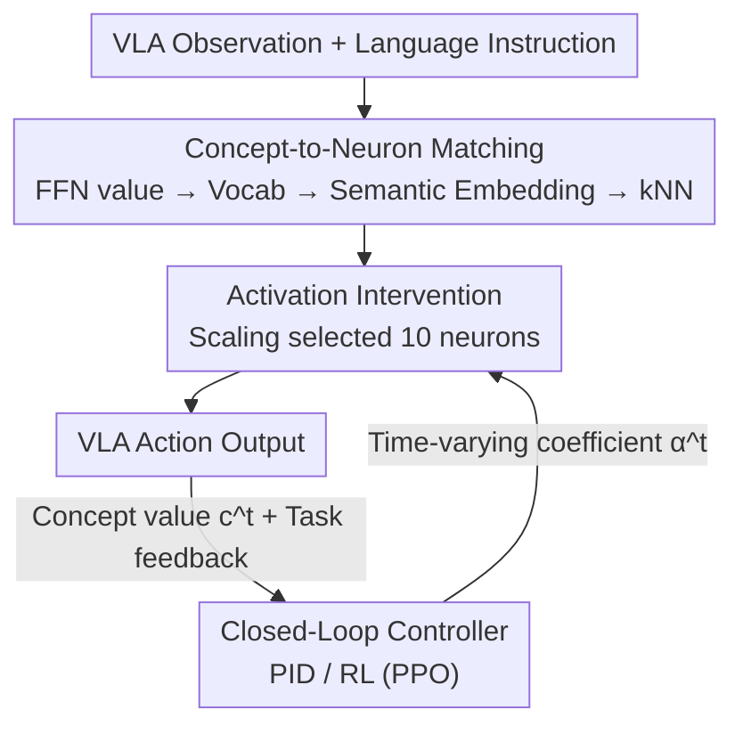

# Closed-Loop Neural Activation Control in Vision-Language-Action Models

**Conference**: CVPR 2026  
**arXiv**: [2606.00269](https://arxiv.org/abs/2606.00269)  
**Code**: To be confirmed  
**Area**: Robotics / Embodied AI (VLA Inference-time Regulation)  
**Keywords**: VLA, activation steering, closed-loop control, mechanistic interpretability, PID, Reinforcement Learning

## TL;DR
Addressing the issue where existing VLA activation steering uses **fixed coefficients and open-loop operations**, leading to overshoot and task failure, this paper proposes CTRL-STEER. It identifies a set of FFN neurons aligned with motion concepts using mechanistic interpretability and then employs PID / RL controllers to **gradually adjust** the intervention intensity of these neurons online during inference. This achieves a better trade-off between "steering to target" and "task success"—without modifying or retraining the base model, it restores the success rate of OpenVLA under strong intervention from 1.8% to near or even exceeding the unsteered baseline.

## Background & Motivation

**Background**: Vision-Language-Action (VLA) models (e.g., OpenVLA, $\pi_0$) utilize pre-trained VLMs as perception-semantic backbones coupled with an action decoder to autoregressively output robot action tokens, enabling semantic generalization across object categories and new instructions. A compelling "retraining-free" regulation route is **activation steering**: intervening in internal semantic directions during inference to make the robot exhibit behaviors like "lift a bit higher" or "move faster."

**Limitations of Prior Work**: Existing steering methods (e.g., work by Haon et al.) use a **fixed steering coefficient $\alpha$**. After selecting certain neurons, their activations are multiplied by a constant across the entire trajectory. This is essentially **open-loop**: it ignores how the task state and concept error evolve over time. Consequently, strong intervention may lift the end-effector too high (hitting a microwave top) or push the speed out of control. While steering metrics improve, the task fails. Success rates for X-VLA / OpenVLA in LIBERO-20 tasks drop from ~77% to single digits (as low as 1.8%).

**Key Challenge**: A trade-off exists between the steering goal and the dynamics learned by the base model, which fixed coefficients cannot resolve. Worse, for **temporal concepts** (speed, smoothness, acceleration)—which depend on behavior evolution across time steps—VLA forwards each step independently and only calculates residual updates using current observations. **A single forward pass cannot calculate speed**. Thus, "a certain value vector correlating with speed" does not mean "this neuron directly controls speed." Open-loop static intervention is particularly ineffective for temporal concepts.

**Goal**: Reformulate VLA steering as a **closed-loop control problem**—dynamically adjusting intervention intensity during execution to satisfy both concept alignment and task success without retraining the base model.

**Key Insight**: Decouple "representation" from "regulation"—no longer assuming temporal concepts are directly controlled by single neurons, but rather intervening along motion-aligned residual directions and letting a feedback controller decide the intervention intensity online.

**Core Idea**: Replace "single-feature neurons + fixed coefficients" with "a set of motion-concept neurons + online feedback controllers (PID / RL)," turning activation steering from open-loop to closed-loop.

## Method

### Overall Architecture
CTRL-STEER consists of two steps. **Offline/Preprocessing**: Use mechanistic interpretability to select a set (eventually 10) of FFN neurons aligned with motion concepts, forming the intervention set $\mathcal{S}$. **Inference-phase Closed-loop**: Scale the activations of these neurons at each time step by a **time-varying** coefficient $\bm{\alpha}^t$ (instead of a fixed $\alpha$). After scaling, the VLA outputs an action, the environment provides the current concept value $c^t$ and task feedback. The controller then calculates the steering error $e^t = c^* - c^t$ and updates the next step's $\bm{\alpha}^{t+1}$, forming a "intervention → execution → error measurement → intervention adjustment" loop. Two controller instances are used: reactive PID and RL (PPO) with long-range planning.

### Key Designs

**1. Concept-to-Neuron Matching: Mapping a "Group of Motion Features" rather than a single feature to a cluster of FFN neurons**

The challenge is identifying which neurons to modify. Neurons are often **polysemantic**, and an interpretable feature might be distributed across multiple units. Prior work focused on neurons for single features (up/down/left/...). This paper adopts the FFN key-value memory perspective: the FFN output of layer $\ell$ is $\mathrm{FFN}^\ell(r^\ell)=\sum_i m_i^\ell v_i^\ell$, where each neuron has an input-independent value vector $v_i^\ell$ in the same space as the residual stream. It can be projected via the LM head to vocabulary logits $z_i^\ell = W_{\mathrm{out}} v_i^\ell$. After taking the top-$k$ ($k=20$) tokens via softmax, a probability-weighted semantic embedding is calculated: $sem_i^\ell = \sum_w p_i^\ell(w)\,e(w)$. Then, for a **set** of representative feature tokens (motion concepts: $\{$up, down, left, right, forward, backward$\}$), kNN (cosine similarity, $k=5$) is performed across all FFN layers. The candidate set is $\mathcal{S}=\bigcup_w \mathrm{kNN}_k(e(w);\{sem_i^\ell\})$. Finally, manual inspection of top-$k$ tokens filters out polysemantic neurons with semantic conflicts, retaining the **10 most semantic consistent** ones. Selected neurons are observed to cluster in the latter half of the transformer.

**2. Formulating Steering as a Closed-Loop Control Problem: Replacing fixed $\alpha$ with time-varying coefficients**

Prior methods set the activation of selected neurons to a constant $\tilde m_i^\ell = \alpha$ ($(\ell,i)\in\mathcal{S}$), creating a **constant** residual shift in the subspace spanned by $\{v_i^\ell\}$. This paper defines the steering error $e^t = c^* - c^t$ between the target concept value $c^*$ and current value $c^t$ (e.g., for height steering $c^*=2h_0$; for speed $c^*=30$ cm/s). The problem is reformulated to find a time-varying vector $\bm{\alpha}^t = \arg\min_{\bm{\alpha}}\sum_{\tau=t+1}^{T} e^\tau$ to minimize cumulative error over the control horizon $T$. This converts the intervention intensity from a manual hyperparameter to a control signal solved online during execution.

**3. PID Controller: Reactive online adjustment using historical errors**

The PID calculates a time-varying scalar signal $\bm{\alpha}^t_{PID}=K_P e^t + K_I\sum_{\tau=0}^t e^\tau + K_D(e^t - e^{t-1})$ applied across all selected neurons. The proportional term corrects quickly based on current deviation; the integral term accumulates historical errors to offset **steady-state bias** caused by conflicts between base dynamics and steering goals; the derivative term responds to the rate of error change. Since neuron scaling jumps can induce **oscillatory trajectories**, the derivative term suppresses oscillation and prevents overshoot. $\bm{\alpha}^t_{PID}$ is constrained to $[0,20]$ with conservative gains ($K_P{=}4.0,\,K_I{=}0.5,\,K_D{=}1.0$, horizon 20 steps).

**4. RL (PPO) Controller: Joint optimization of steering and task success via long-range planning**

To introduce "planning," a PPO policy $\pi_\theta$ replaces PID. The state $s_t=[a_t,\Delta a_t,\alpha^{t-1},t/T]$ includes current activations of $k$ neurons, their changes, previous steering signals, and normalized progress. The policy outputs a $k$-dimensional vector $\bm{\alpha}^t_{RL}=\pi_\theta(s_t)$. Unlike PID's scalar, it **assigns values to each neuron individually**, modeling non-linear dependencies. The reward $r_t = r_{steer}(t) + \lambda\cdot r_{task}$ balances steering metrics with task completion. Each task uses an independent strategy, **initialized with PID output $\bm{\alpha}^t_{PID}$** and refined through interaction—giving RL a strong starting point to learn balance with long-range task success.

### Loss & Training
The base OpenVLA (7B, LLaMA-2 backbone, based on Prismatic VLM) is **independently fine-tuned on each task suite to improve success rates without changing architecture**; weights remain frozen during steering. PID requires no training. RL uses PPO with trajectories of $T=920$ steps (20-step warmup + 900-step execution), using $r_t=r_{steer}+\lambda r_{task}$ and PID signal warm-starting.

## Key Experimental Results

Experiments used OpenVLA (with transferability verified on X-VLA) on LIBERO task suites (Goal/Object/Spatial/Long) and BridgeData V2. Two concepts steered: height (state-based) and speed (temporal). Metrics: Height (avg height / 95th percentile / Area Above Threshold - AAT), Speed (avg speed / Speed Above Threshold - SAT), and SR (Success Rate).

### Main Results (LIBERO Height Steering, Select Table 3)

| Task Suite | Method | Height (m) | AAT | SR (%) |
|---|---|---|---|---|
| LIBERO GOAL | OpenVLA (Unsteered) | 1.056 | 107.76 | 77.50 |
| LIBERO GOAL | Static C=20 | 1.041 | 95.92 | **41.00** |
| LIBERO GOAL | CTRL-STEER (PID) | 1.058 | 108.79 | 79.00 |
| LIBERO GOAL | CTRL-STEER (RL) | 1.062 | 99.78 | **82.00** |
| LIBERO LONG | OpenVLA | 0.832 | 181.66 | 58.00 |
| LIBERO LONG | Static C=20 | 0.723 | 201.08 | 10.00 |
| LIBERO LONG | CTRL-STEER (RL) | 0.804 | 181.86 | 57.00 |
| LIBERO OBJECT | Static C=20 | 0.203 | 2.60 | 33.50 |
| LIBERO OBJECT | CTRL-STEER (RL) | 0.211 | 4.67 | 77.00 |

Interpretation: Static-20 causes severe SR drops across almost every suite (dropping to 10% in Long, 33.5% in Object). CTRL-STEER maintains or exceeds unsteered success rates while preserving AAT.

### Speed (Temporal) Steering (Select Table 4, LIBERO)

| Task Suite | Method | Speed (cm/s) | SAT | SR (%) |
|---|---|---|---|---|
| LIBERO LONG | OpenVLA | 11.26 | 2.69 | 58.00 |
| LIBERO LONG | Static C=20 | 12.70 | 4.27 | **1.50** |
| LIBERO LONG | CTRL-STEER (RL) | 11.04 | 2.54 | **66.50** |
| LIBERO GOAL | Static C=20 | 14.52 | 3.86 | **2.50** |
| LIBERO GOAL | CTRL-STEER (RL) | 14.04 | 3.49 | **83.00** |
| LIBERO OBJECT | Static C=20 | 10.16 | 2.47 | 2.50 |
| LIBERO OBJECT | CTRL-STEER (RL) | 14.11 | 2.17 | 76.50 |

For temporal concepts, open-loop is a catastrophic failure (SR 1.5%–2.5%), validating the motivation that temporal concepts cannot be controlled by a fixed coefficient in a single forward pass. Closed-loop restores success rates to 66%–83%.

### Key Findings
- **The cost of open-loop is task failure**: While Static-20 steering magnitude (AAT/speed) is the largest, SR collapses systematically; this is the steering-success trade-off the paper addresses.
- **RL > PID**: Aggregate data shows PID maintains success rates near the unsteered baseline (71.37%), while RL further increases height steering SR to 73.88% and speed to 76.12%, occasionally outperforming the unsteered baseline (e.g., Goal height 82% vs 77.5%).
- **Temporal concepts are the watershed**: Fixed coefficients fail almost entirely for speed, proving that "representation $\neq$ controllability" and requires closed-loop.
- **Transferable**: Effective on X-VLA, showing the method is not tied to a single VLA architecture.

## Highlights & Insights
- **Clean "Representation / Regulation Decoupling" framing**: Instead of agonizing over "which neuron equals speed," the paper acknowledges temporal concepts are not single-step calculable and delegates intensity regulation to a feedback controller—transforming an interpretability challenge into a control problem.
- **Applying classical PID to internal NN activations**: Mapping integral terms to steady-state bias and derivative terms to trajectory oscillation provides strong explanatory power and zero training cost.
- **Hot-starting RL with PID**: Initializing PPO with a reasonable PID steering signal improves sample efficiency for training control policies from scratch.
- **No changes to base weights**: Purely inference-time intervention is a pragmatic route for retraining-free adaptation to new physical setups.

## Limitations & Future Work
- **Per-task RL policies**: RL controllers are task-specific and require separate rollout training, raising questions about scalability and cross-task generalization.
- **Manual neuron selection**: Filtering polysemantic neurons depends on manual inspection of top-$k$ tokens, which is hard to automate and replicate perfectly.
- **Dependency on ground-truth measurements**: Calculating error $e^t=c^*-c^t$ requires online access to true height/speed values, which may be difficult to obtain on real robots.
- **Narrow concept scope**: Currently verified only for height (state) and speed (temporal) using 10 neurons; more complex/composite concepts (smoothness, force control) are unexplored.

## Related Work & Insights
- **vs. Fixed-coefficient Activation Steering (Haon et al., [12])**: They select **single-feature** neurons and use **fixed $\alpha$** open-loop intervention. Ours selects neurons for a **set** of motion features and replaces $\alpha$ with **time-varying signals** solved by PID/RL, adding the "task-level feedback" loop.
- **vs. LLM Representation Engineering**: Share the idea of intervening along semantic directions, but LLM work focuses on discrete text without embodied success constraints. This paper applies it to continuous control + task success.
- **vs. Classical Robotic PID/RL Control**: Traditional control acts on action/torque layers. This method pushes control down to **internal FFN activations**, a novel integration of control theory and neural state regulation.

## Rating
- Novelty: ⭐⭐⭐⭐⭐ Reframing activation steering as closed-loop via PID/RL on internal neurons is novel and self-consistent.
- Experimental Thoroughness: ⭐⭐⭐⭐ Covers 4 LIBERO suites + BridgeData + two VLAs + two concepts, though task-specific RL training remains a bottleneck.
- Writing Quality: ⭐⭐⭐⭐ Clear motivation on temporal concepts; mathematical formulations are complete.
- Value: ⭐⭐⭐⭐ Retraining-free, plug-and-play mitigation of the steering-success trade-off is highly practical for VLA regulation.

<!-- RELATED:START -->

## Related Papers

- [\[CVPR 2026\] Iterative Closed-Loop Motion Synthesis for Scaling the Capabilities of Humanoid Control](iterative_closed-loop_motion_synthesis_for_scaling_the_capabilities_of_humanoid_.md)
- [\[CVPR 2026\] SRPO: Self-Referential Policy Optimization for Vision-Language-Action Models](srpo_self-referential_policy_optimization_for_vision-language-action_models.md)
- [\[CVPR 2026\] MoEActok: A MoE-based Action Tokenizer for Vision-Language-Action Models](moeactok_a_moe-based_action_tokenizer_for_vision-language-action_models.md)
- [\[CVPR 2026\] ACoT-VLA: Action Chain-of-Thought for Vision-Language-Action Models](acot-vla_action_chain-of-thought_for_vision-language-action_models.md)
- [\[CVPR 2026\] QuantVLA: Scale-Calibrated Post-Training Quantization for Vision-Language-Action Models](quantvla_scale-calibrated_post-training_quantization_for_vision-language-action_.md)

<!-- RELATED:END -->
