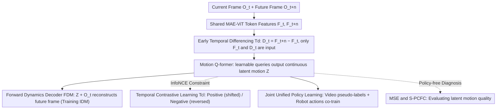

# CoMo: Learning Continuous Latent Motion from Internet Videos for Scalable Robot Learning

**Conference**: CVPR 2026  
**arXiv**: [2505.17006](https://arxiv.org/abs/2505.17006)  
**Code**: [github.com/MCG-NJU/CoMo](https://github.com/MCG-NJU/CoMo)  
**Area**: Robot Learning  
**Keywords**: Continuous latent motion, pseudo-action labels, inverse dynamics model, temporal contrastive learning, video-robot co-training

## TL;DR

Ours proposes CoMo, which synergistically addresses the shortcut learning problem in continuous latent motion learning through two mechanisms: Early Temporal Differencing (Td) and Temporal Contrastive Learning (Tcl). It extracts fine-grained continuous pseudo-action labels from internet videos, allowing video data and robot actions to be co-trained under a unified continuous distribution, significantly improving policy performance.

## Background & Motivation

Learning latent motion from internet videos is a key direction for scaling robot learning, but existing methods face fundamental bottlenecks:

**Information Loss from Discretization**: Pioneering works such as LAPA, UniVLA, and Moto-GPT employ VQ-VAE to discretize latent motion (with codebook sizes as small as 8-16). While effective at suppressing shortcut learning, discretization leads to significant loss of motion information, making it difficult to capture complex and fine-grained dynamics.

**Shortcut Learning Problem**: If continuous latent motion is learned directly (by removing VQ), the Inverse Dynamics Model (IDM) tends to extract extensive static background information from future frames (rather than foreground motion), as the decoder can more easily reconstruct pixel details this way. The model degrades into an ineffective future frame predictor.

**Distribution Mismatch between Discrete and Continuous**: A natural distribution gap exists between discrete latent motion and continuous robot actions, hindering joint learning of a unified policy and requiring complex multi-stage training pipelines.

**Core Problem**: Can continuous latent motion be learned from action-unlabeled videos without using VQ? Continuous representations are better suited for modeling fine inter-frame changes and naturally align with the distribution of continuous robot actions.

## Method

### Overall Architecture

CoMo aims to learn continuous latent motion representations from unlabeled internet videos while circumventing the trap where direct continuous learning is destroyed by shortcut learning. It follows the established Inverse Dynamics Model (IDM) - Forward Dynamics Model (FDM) framework: the IDM observes the current frame $O_t$ and a future frame $O_{t+n}$ to produce continuous latent motion $Z_{t,t+n}$; the FDM then uses $Z_{t,t+n}$ and $O_t$ to reconstruct the future frame $\hat{O}_{t+n}$. The core novelty lies in replacing VQ discretization with two mechanisms—Early Temporal Differencing (Td) and Temporal Contrastive Learning (Tcl)—to force the IDM to focus on foreground motion rather than background; the trained IDM then generates continuous pseudo-action labels for videos, which are co-trained with robot actions in a unified strategy.

### Key Designs

**1. Early Temporal Differencing (Td): Removing the "Answers" of Future Frames from Input**

The greatest risk for continuous representation is shortcut learning—if the IDM can directly see the complete features of the future frame, the decoder will lazily copy background pixels to reconstruct the image, degrading the model into an ineffective predictor. Td blocks this shortcut in two steps. First, it uses a shared MAE-pretrained ViT to encode the current and future frames into token-level features $F_t, F_{t+n}$, then performs element-wise differencing $D_t = F_{t+n} - F_t$. This sparse difference naturally amplifies the parts of the frame truly in motion. Second, the crucial step: $[F_t, D_t]$ is fed into the Motion Q-former instead of $[F_t, F_{t+n}]$. Since the full representation of the future frame is removed, the encoder cannot copy the background, cutting off the shortcut at the source.

**2. Temporal Contrastive Learning (Tcl): Forcing the Model to Focus on "How to Move"**

Td alone is insufficient: irrelevant information may still persist in sparse differences, and simple contrastive learning might only learn identity information such as "what and where the foreground is," missing the "how it moves." Tcl addresses this by designing a specific set of sample pairs—positive samples are slightly time-shifted labels $Z_{t,t+n+\delta}$ and $Z_{t,t+n}$ (where $\delta \in [-n/5, n/5]$, sharing the same motion direction), while negative samples are time-reversed labels $Z_{t+n,t}$ and $Z_{t,t+n}$ (same frames but moving backward). InfoNCE is used to pull positive samples closer and push negative samples away:

$$\mathcal{L}_{\text{tcl}} = -\log\frac{e^{S_1}}{e^{S_1} + e^{S_2} + e^{S_3}}$$

Because negative samples are "reversed playback," the model must learn the actual directionality of motion rather than static appearance to distinguish them. Thus, Td handles "where to learn from" (extracting the future frame) and Tcl handles "what to learn" (focusing on foreground motion direction).

**3. Joint Unified Policy Learning: Merging Video and Actions via Continuous Distributions**

A distribution gap previously existed between discrete latent motion and continuous robot actions, typically requiring multi-stage processes to bridge. Since CoMo's continuous latent motion and robot actions naturally share the same continuous distribution, they can be co-trained directly in a unified policy model by assigning a lightweight head to each, eliminating the need for explicit two-stage pre-training.

**4. MSE and S-PCFC: Diagnosing Latent Motion Quality without Running Policies**

Evaluating latent motion quality usually requires completing full policy training to observe success rates, which is costly. CoMo introduces two lightweight proxy metrics: **MSE** measures the error of an MLP regressing true actions from latent motion (lower scores indicate more action-relevant information); **S-PCFC** measures the cosine similarity between "past $\rightarrow$ current" and "future $\rightarrow$ current" motion segments (higher scores indicate more action-irrelevant background noise). Together, these allow rapid assessment of the respective roles of Td and Tcl.

### Loss & Training

- CoMo jointly minimizes weighted InfoNCE loss, pixel-level reconstruction loss, and perceptual loss.
- Uses 120K internet videos (SAM-V 40K + EgoVid 40K + Droid 40K) to train the IDM-FDM.
- Policy training supports both Diffusion (LIBERO) and Autoregressive (CALVIN) architectures.

## Key Experimental Results

### Main Results

LIBERO Benchmark (only 10 robot trajectories per task + video pseudo-labels):

| Method | Spatial | Object | Goal | Long | Avg SR |
| :--- | :--- | :--- | :--- | :--- | :--- |
| DP (No Video) | 72.3 | 82.3 | 70.3 | 56.7 | 70.4 |
| GR2-like (Future Features) | 76.0 | 92.0 | 73.3 | 53.7 | 73.8 |
| GR00T (Discrete Latent) | 80.7 | 83.3 | 80.0 | 59.7 | 75.9 |
| Dynamo (Cov. Reg.) | 75.3 | 92.7 | 80.7 | 46.0 | 73.7 |
| **Ours (CoMo)** | **80.3** | **97.0** | **81.0** | **62.0** | **80.1** |

CALVIN ABC $\rightarrow$ D Benchmark:

| Method | 1-step | 2-step | 3-step | 4-step | 5-step | Avg |
| :--- | :--- | :--- | :--- | :--- | :--- | :--- |
| No Motion | 0.772 | 0.494 | 0.307 | 0.191 | 0.114 | 1.878 |
| Discrete (Moto) | 0.801 | 0.575 | 0.409 | 0.283 | 0.187 | 2.255 |
| **Ours (CoMo)** | **0.882** | **0.732** | **0.589** | **0.490** | **0.377** | **3.070** |
| Ours (x4 Dim) | 0.891 | 0.758 | 0.646 | 0.529 | 0.423 | 3.247 |

### Ablation Study

| Configuration | Avg SR | MSE $\downarrow$ | S-PCFC $\downarrow$ | Description |
| :--- | :--- | :--- | :--- | :--- |
| Future Features | 73.8 | 2.14 | 1.000 | Heavy background noise |
| Discrete (Dis.) | 75.9 | 5.67 | 0.481 | Severe info loss |
| Continuous Base (Con.) | 75.2 | 1.63 | 0.927 | Shortcut learning issue |
| Con. + Td | 76.9 | 1.52 | 0.889 | Td reduces S-PCFC |
| Con. + Tcl | 77.9 | 1.31 | 0.623 | Tcl significantly reduces S-PCFC |
| **Con. + Td + Tcl (CoMo)** | **80.1** | **1.26** | **0.550** | Collaborative optimum |

### Key Findings

- **Td and Tcl are complementary**: Td primarily reduces MSE (enhancing motion cues), while Tcl primarily reduces S-PCFC (suppressing background noise).
- **Continuous > Discrete**: CoMo achieves an average SR of 80.1% vs 75.9% for discrete methods, with particularly large gains in fine-grained tasks (Object 97.0% vs 83.3%).
- **Dimensional Scalability**: CoMo performance increases from 128 to 512 dimensions (CALVIN 3.070 $\rightarrow$ 3.247), whereas Td alone introduces more noise as dimensions increase.
- Real-world experiments validate the advantages of continuous latent motion, especially for high-precision manipulation tasks (e.g., opening drawers, inserting bread).

## Highlights & Insights

- The argument for **Continuous > Discrete** is well-supported: while discretization suppresses shortcuts, the cost in information loss is too high.
- The **Td + Tcl synergy** is elegant: Td solves "where to learn" (removing direct future frame info), and Tcl solves "what to learn" (guiding foreground focus and motion directionality).
- The **MSE + S-PCFC evaluation framework** provides a rapid diagnostic tool without the need for expensive policy evaluations.
- The simplicity of joint training offers significant engineering value compared to complex multi-stage pipelines.

## Limitations & Future Work

- Validation is limited to LIBERO and CALVIN; generalization to more complex real-world scenarios remains to be explored.
- Lack of theoretical guidance for the upper bound of latent motion dimensions and optimal dimension selection.
- Tcl's sample construction relies on temporal shift assumptions ($\delta$ range), which may be suboptimal for high-speed motion.
- Real-world experimental scale is relatively small (25 robot trajectories + 25 human videos per task).

## Related Work & Insights

- Comparison with LAPA/GR00T: CoMo demonstrates that continuous representation is a superior direction.
- Temporal Differencing is adapted from the video understanding community (TDN), showing significant cross-domain transfer effects in robot learning.
- Creative contrastive learning design: using time-reversal as negative samples is naturally suited for distinguishing motion direction.

## Rating

- **Novelty**: ⭐⭐⭐⭐ Td+Tcl as a VQ replacement is clear and innovative, though individual components exist in other fields.
- **Experimental Thoroughness**: ⭐⭐⭐⭐⭐ Comprehensive ablations, deep MSE/S-PCFC analysis, and cross-architecture validation.
- **Writing Quality**: ⭐⭐⭐⭐ Clear problem definition and analytical depth, though some sections are slightly redundant.
- **Value**: ⭐⭐⭐⭐⭐ Provides a practical and principled solution for scaling robot learning from internet videos.

<!-- RELATED:START -->

<!-- RELATED:END -->

## Related Papers

- [\[CVPR 2026\] IGen: Scalable Data Generation for Robot Learning from Open-World Images](igen_scalable_data_generation_for_robot_learning_from_open-world_images.md)
- [\[CVPR 2026\] Learning a Unified Latent Action Space from Videos with Action-centric Cycle Consistency](learning_a_unified_latent_action_space_from_videos_with_action-centric_cycle_con.md)
- [\[CVPR 2026\] StaMo: Unsupervised Learning of Generalizable Robot Motion from Compact State Representation](stamo_unsupervised_learning_of_generalizable_robot_motion_from_compact_state_rep.md)
- [\[CVPR 2026\] Video2Robo: 3DGS-based Synthetic Data from One Video Enables Scalable Robot Learning](video2robo_3dgs-based_synthetic_data_from_one_video_enables_scalable_robot_learn.md)
- [\[ICCV 2025\] Moto: Latent Motion Token as the Bridging Language for Learning Robot Manipulation from Videos](../../ICCV2025/robotics/moto_latent_motion_token_as_the_bridging_language_for_learning_robot_manipulatio.md)

<!-- RELATED:END -->
