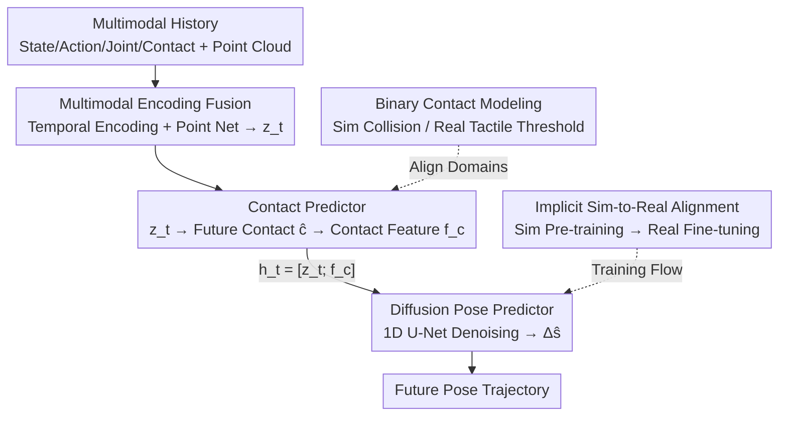

# Contact-Aware Neural Dynamics

**Conference**: CVPR 2026  
**Paper**: [CVF Open Access](https://openaccess.thecvf.com/content/CVPR2026/html/Jing_Contact-Aware_Neural_Dynamics_CVPR_2026_paper.html)  
**Code**: [Project Page](https://changwei-jing.github.io/neural-physics/)  
**Area**: Robotics / Embodied AI  
**Keywords**: sim-to-real, contact dynamics, tactile sensing, neural dynamics model, diffusion models  

## TL;DR
Addressing the sim-to-real gap in contact-rich manipulation with dexterous hands, this paper utilizes off-the-shelf simulators as priors and develops a neural forward dynamics model that implicitly aligns simulation and reality through a "predict contact events first, then predict contact-conditional diffusion poses" approach. By anchoring physical reality with binary contact signals from robot tactile sensors, the model achieves state-of-the-art MSE and ADD-S in long-horizon predictions for single/multi-object tasks and enables screening/fine-tuning of policies trained purely in simulation for higher real-world success rates.

## Background & Motivation
**Background**: Robotic manipulation policies increasingly rely on simulation for large-scale, reproducible training and evaluation. However, a significant sim-to-real gap exists. For locomotion with simple kinematics, dynamics errors are often tolerable; however, in hand manipulation and contact-rich tasks, minute deviations in contact geometry, friction, compliance, and integration time-steps are magnified, leading to completely divergent object motion and stability.

**Limitations of Prior Work**: The mainstream approach to bridging this gap is **explicit system identification**—adjusting geometric parameters, friction, and mass to optimize a small set of physical parameters so that simulation rollouts match real trajectories. However, this assumes that "low-dimensional parameter correction is sufficient," whereas errors in contact-rich tasks are **high-dimensional, state-dependent, and mixed with discrete integration errors** (complex contact representations like damping and restitution). Methods relying purely on domain randomization or parameter sweeps trade precision for robustness and still fail to capture non-smooth transitions during contact moments. Another category of vision-oriented sim-to-real (rendering, aggressive domain randomization) only closes the perception gap, leaving the underlying contact dynamics model largely unchanged.

**Key Challenge**: Most existing **implicit alignment** works (adding neural residuals to analytical dynamics, differentiable simulation, or neural dynamics trained purely on simulation/reality) are largely **contact-agnostic**. They treat contact discontinuities as noise or use only kinematic/proprioceptive signals, **wasting the most information-rich signal in manipulation: contact itself**. High-bandwidth tactile feedback can provide fast, sensitive contact signals to guide modeling.

**Goal**: Construct a forward dynamics model that inherits both the diversity/low-cost of simulation and the fidelity of real-world data, enabling accurate multi-step rollout predictions in contact-rich manipulation and practical use in policy evaluation and fine-tuning.

**Key Insight**: Rather than fitting a set of continuous contact forces (which are noisy, sensitive to calibration, and difficult to align between simulation and reality), it is better to abstract contact into **hand-level binary signals** (whether contact occurs). These signals serve as stable conditions to drive dynamics prediction. This discrete event can be derived from both simulation collision detection and real-world tactile thresholds, naturally aligning across both domains.

**Core Idea**: Replace "explicit parameter identification" with a "contact-aware neural forward dynamics model + implicit alignment." Learn contact-induced physical behaviors on a large-scale simulation first, then fine-tune with a small amount of real interaction data containing tactile signals to align the simulated states with the real states within a shared contact representation.

## Method
This paper models the sim-to-real alignment of contact-rich manipulation as a **conditional dynamics prediction problem**: At time $t$, given the object pose $s_t \in SE(3)$ (translation + rotation), robot hand joint configuration $q_t \in \mathbb{R}^{d_q}$, action $a_t \in \mathbb{R}^{d_q}$, hand-object contact represented by a **binary** signal $c_t \in \{0,1\}$ (where $c_t=1$ if any fingertip contacts the object), and object geometry represented by point cloud $\mathcal{P} \in \mathbb{R}^{N\times 3}$ (initially sampled from the mesh surface and transformed with the pose).

### Overall Architecture
The model takes a fixed-length history $\mathcal{H}_t = \{s_{t-K:t},\, a_{t-K:t},\, q_{t-K:t},\, c_{t-K:t},\, \mathcal{P}\}$ and outputs the contact sequence and pose increment trajectories for the next $H$ steps. The entire pipeline consists of two stages in sequence: **Multimodal Encoding Fusion → Stage I Contact Prediction → Stage II Contact-Conditional Diffusion Pose Prediction**. Temporal histories of state/action/joints/contact are encoded separately, while the point cloud is processed by a PointNet encoder to obtain geometric embeddings. All modalities are concatenated and fused into a shared latent variable $z_t \in \mathbb{R}^{512}$ via a lightweight MLP. Stage I uses $z_t$ to predict future contact probabilities and encodes them into a compact contact feature $f_c$. These are concatenated to form the contact condition vector $h_t=[z_t; f_c]$. Stage II uses a 1D U-Net to perform denoising diffusion conditioned on $h_t$ to generate future pose increments $\Delta\hat{s}_{t+1:t+H}$. The entire model is **pre-trained on large-scale simulation and fine-tuned with a small amount of real data containing tactile feedback**, thus implicitly aligning the contact dynamics of both domains.

### Key Designs

**1. Binary Hand-Level Contact Representation: Extracting Discrete Events from Non-Smooth Contact**

In contact-rich tasks, the contact dynamics between fingertips and objects are highly non-smooth—force spikes and velocity discontinuities appear at the moment of impact. Continuous contact quantities (forces/distributions) are both difficult to model reliably and sensitive to calibration (even if the contact state remains unchanged, continuous measurements exhibit small jitters). This paper avoids regressing continuous forces and instead uses a **hand-level binary signal** $c_t\in\{0,1\}$, focusing only on the structural signal of "whether contact occurred." This design offers three benefits: ① Binarization filters out high-frequency sensor noise, providing cleaner supervision for training; ② Discrete labels can be **derived consistently from simulation (MuJoCo collision detection, where $c_t=1$ if fingertip and object meshes intersect) and reality (tactile normal force exceeding threshold $\tau_{\text{force}}$)**, naturally aligning contact representations across domains; ③ It aligns with the smooth nature of neural networks—the network does not need to fit high-frequency changes in contact magnitude but only learns the underlying discrete contact events, using them as stable conditioning signals for downstream dynamics. On the real robot, a lightweight heuristic is used: a fingertip is marked as in contact if $|F_x|+|F_y|+|F_z| > 0.3\text{N}$, and $c_t=1$ if any fingertip is triggered.

**2. Two-Stage "Contact-then-Pose" Decoupled Prediction: Conditioning Dynamics Explicitly on Contact Events**

Instead of having a single network output the pose in one go (which results in accumulated drift at contact points if contact is ignored), the paper splits prediction into two stages. **Stage I Contact Predictor**: Predicted $H$-step contact probabilities $\hat{c}_{t+1:t+H}=\sigma(W_c z_t + b_c)$ are generated from the fused latent $z_t$ via MLP, supervised by binary cross-entropy $\mathcal{L}_{\text{cnt}}=\mathrm{BCE}(\hat{c}_{t+1:t+H}, c_{t+1:t+H})$. The predicted sequence is then projected into a compact contact feature $f_c\in\mathbb{R}^{d_c}$ ($d_c=64$) and concatenated into the contact condition vector $h_t=[z_t; f_c]$. **Stage II Diffusion Pose Predictor**: Models the future **pose increments** $x_0=\Delta s_{t+1:t+H}$. Each step uses a 6D minimal representation $\Delta s_{t+k}=[\Delta p_{t+k},\, \omega_{t+k}]$, where translation increment $\Delta p_{t+k}=p_{t+k}-p_{t+k-1}$ and rotation increment is updated via the exponential map $R_{t+k}=\exp(\widehat{\omega}_{t+k}) R_{t+k-1}$. The pose distribution is modeled using conditional denoising diffusion, with forward noise addition as:

$$q(x_t \mid x_0)=\mathcal{N}\!\big(\sqrt{\bar{\alpha}_t}\, x_0,\, (1-\bar{\alpha}_t) I\big),$$

and reverse denoising performed by a 1D U-Net acting as a noise predictor $\epsilon_\theta=\mathrm{UNet}_{1D}(x_t, t, h_t)$, with $h_t$ injected as a condition via FiLM in all layers. The objective is $\mathcal{L}_{\text{diff}}=\mathbb{E}[\lVert \epsilon - \epsilon_\theta(x_t, t, h_t)\rVert_2^2]$. Thus, dynamics prediction is **explicitly conditioned on inferred contact**, allowing the model to adaptively switch motion modes like a simulator with collision detection (e.g., adjusting trajectories upon detecting contact loss in slippage scenarios), whereas single-step predictors ignoring contact drift severely due to compounded errors. The entire model is jointly optimized: $\mathcal{L}=\mathcal{L}_{\text{cnt}}+\lambda \mathcal{L}_{\text{diff}}$.

**3. Implicit Sim-to-Real Alignment: Simulation as a Strong Prior, Small-Scale Real Data Co-training to Anchor Contact**

Since explicit parameter identification cannot correct high-dimensional state-dependent contact errors, this work adopts implicit alignment: first, the dynamics model is **fully trained in simulation** (single-object tasks use 8,000 trajectories from the YCB mustard bottle; multi-object tasks use 15,000 trajectories covering 40 YCB objects, with randomized physical and contact parameters). This allows the network to learn contact-induced physical behaviors from state/action/contact histories. Then, a **small amount of real interaction data** (with tactile readings, containing both successful and failed trajectories) is used to continue fine-tuning from the pre-trained weights (using a lower learning rate to stabilize optimization and refine the contact-conditioned latent representation). The key is "co-training" rather than "fitting an independent refinement stage"—this aligns simulated and real states into a **shared representation based on contact events**, allowing the model to leverage simulation diversity while inheriting real-world fidelity. To counter residual noise and drift from visual pose estimation (which uses FoundationPose as a backbone), control frequency is reduced and small random perturbations are added to measured poses during training for regularization.

### Loss & Training
- **Contact Loss** $\mathcal{L}_{\text{cnt}}=\mathrm{BCE}(\hat{c}, c)$: Supervises Stage I contact event prediction.
- **Diffusion Loss** $\mathcal{L}_{\text{diff}}=\mathbb{E}[\lVert \epsilon-\epsilon_\theta\rVert_2^2]$: Standard DDPM noise regression with FiLM condition injection.
- **Joint Objective** $\mathcal{L}=\mathcal{L}_{\text{cnt}}+\lambda\mathcal{L}_{\text{diff}}$: Jointly optimizes contact prediction and contact-conditioned dynamics.
- **Two-Stage Training**: Large-scale simulation pre-training → Low learning rate fine-tuning on real data; Real-world pose perturbation regularization and reduced control frequency to suppress estimation noise.

## Key Experimental Results

Evaluations were conducted across single-object and multi-object settings using three data regimes (Sim-only, Real-only, Sim+Real co-training). Metrics include MSE↓ and AUC of ADD-S↑ (ADD-S measures the proportion of predicted vs. ground-truth trajectories within a 3D distance threshold, reflecting long-horizon geometric consistency).

### Main Results

| Setting | Method | MSE↓ (Real-Finetune) | ADD-S↑ (Real-Finetune) |
|------|------|------|------|
| Single Object | Baseline [52] | — (N/A) | — |
| Single Object | MLP | 0.0110 | 77.43 |
| Single Object | UNet | 0.0130 | 70.11 |
| Single Object | Diffusion-UNet | 0.0091 | 82.45 |
| Single Object | **Diffusion-UNet w/ Contact** | **0.0082** | **88.23** |
| Multi-Object | Diffusion-UNet | 0.0065 | 75.82 |
| Multi-Object | **Diffusion-UNet w/ Contact** | **0.0058** | **79.12** |

Diffusion-UNet with contact performs best across all regimes; in the co-training setting, it achieves 0.0082 MSE / 88.23% ADD-S for single objects and maintains strong performance for multiple objects, demonstrating that contact-aware representations improve both physical realism and sim-to-real transfer.

### Ablation Study

| Configuration | Key Difference | Observation |
|------|---------|------|
| Diffusion-UNet w/ Contact | Full: Two-stage + Contact-conditioned + Diffusion | Optimal across all regimes |
| Diffusion-UNet (w/o Contact) | Removed contact condition | Single-object fine-tune ADD-S 82.45 vs 88.23 (nearly 6-point drop) |
| UNet / MLP | Replaced diffusion pose predictor | Generally lower ADD-S, more prone to long-term drift |
| Baseline [52] | Existing neural dynamics baseline | Highest error, lacked real-world fine-tuning capability |

### Downstream Application: Task Success Rate (Success if final predicted endpoint error <5cm)

| Training Regime | Single-Object Success (%) | Multi-Object Success (%) |
|------|------|------|
| Real-only | 52.6 | 47.1 |
| **Sim+Real w/ Contact** | **73.7** | **64.7** |

### Key Findings
- **Contact conditioning is the primary performance driver**: Removing contact conditions leads to a significant drop in ADD-S. Single-step or contact-agnostic predictors suffer from compounded drift in contact-switching scenarios (e.g., slippage), while contact-aware models adaptively switch motion modes like a simulator with collision detection.
- **co-training > Real-only**: Training purely on real data (Real-only) leads to severe long-term drift, with success rates of only 52.6%/47.1%. Using simulation as a prior followed by real-world contact fine-tuning increases this to 73.7%/64.7%, with particularly notable gains in multi-object scenarios.
- **The value of binary contact for alignment**: Using the same binary definition to connect simulation collision detection and real-world tactile thresholds ensures consistent contact representations across domains, which is the prerequisite for successful implicit alignment.

## Highlights & Insights
- **Treating "contact" as a first-class citizen rather than noise**: Whereas existing implicit alignment works often treat contact discontinuities as noise to be smoothed out, this paper does the opposite—explicitly conditioning dynamics on a simple binary signal. This avoids calibration noise from continuous forces while accurately anchoring the model to discrete events that can be reliably obtained in both sim and real environments.
- **The decoupling of "predicting contact then conditioning pose" is clever**: Contact is the cause and pose change is the effect. Predicting the cause first to drive the effect effectively equips the diffusion predictor with a "soft collision detector." This two-stage approach could be transferred to any prediction problem where discrete events trigger continuous state transitions (e.g., switches, buckles, foot-ground contact).
- **co-train instead of two-stage correction**: By directly fine-tuning from simulation pre-trained weights with a low learning rate rather than using a separate residual correction network, simulation and real states are fused within a shared contact representation, avoiding the common pitfall of a refinement stage over-fitting to small-scale real data.

## Limitations & Future Work
- **Reliance on FoundationPose**: Object states during data collection are provided by visual pose estimation; accuracy degradation under occlusion, clutter, or multi-object stacking accumulates into prediction errors.
- **Limited information in binary contact**: The authors acknowledge that while binary signals are stable and easy to learn, they do not capture richer real-world contact attributes such as contact area, slip direction, or force distribution—this remains a source for potential ADD-S improvements.
- **Compound errors over long horizons**: While short-term prediction is strong, long-term rollouts under frequent contact switching or rapid motion still accumulate errors, limiting application in long-term planning.
- **Data scale threshold**: Generalization across diverse motions/tasks requires large and diverse datasets; extensibility may be limited when real-world data collection is expensive. ⚠️ The paper does not specify the exact number of real fine-tuning trajectories, only referring to it as "a small amount"; scale sensitivity remains to be confirmed in the original text/appendix.

## Related Work & Insights
- **vs. Explicit System Identification (tuning friction/mass/geometry)**: They perform low-dimensional parameter correction, whereas this work performs high-dimensional implicit neural alignment. The advantage here is capturing state-dependent, non-smooth contact errors; the disadvantage is the requirement for real interaction data over pure simulation optimization.
- **vs. Contact-agnostic neural residuals/differentiable simulation**: They treat contact discontinuities as noise or use only kinematic/proprioceptive signals. This work explicitly introduces tactile binary contact as a condition. The key difference lies in "whether contact is treated as a modeling signal," allowing better modeling of discontinuities at the moment of impact.
- **vs. Vision-oriented sim-to-real (rendering/domain randomization) & Visual World Models**: Those works close the perception gap but their dynamics often violate contact reality. This work anchors on tactile rather than visual signals, ensuring physical grounding of predicted trajectories.

## Rating
- Novelty: ⭐⭐⭐⭐ The combination of binary tactile contact as an explicit condition + two-stage contact/pose decoupling + implicit co-train alignment is a clearly defined and relatively unique approach.
- Experimental Thoroughness: ⭐⭐⭐⭐ Comparisons across single/multi-object × three regimes + multiple backbone ablations + downstream success rates cover most bases; however, disclosure of real-world data scale and hyperparameter sensitivity is somewhat limited.
- Writing Quality: ⭐⭐⭐⭐ The chain of motivation-method-experiment flows smoothly, with clear explanations of formulas and design motivations.
- Value: ⭐⭐⭐⭐ Provides an extensible, data-driven dynamics alignment paradigm for contact-rich manipulation that can be directly applied to policy evaluation and screening.

<!-- RELATED:START -->

## Related Papers

- [\[ICML 2025\] Geometric Contact Flows: Contactomorphisms for Dynamics and Control](../../ICML2025/robotics/geometric_contact_flows_contactomorphisms_for_dynamics_and_control.md)
- [\[ICLR 2026\] DexNDM: Closing the Reality Gap for Dexterous In-Hand Rotation via Joint-Wise Neural Dynamics Model](../../ICLR2026/robotics/dexndm_closing_the_reality_gap_for_dexterous_in-hand_rotation_via_joint-wise_neu.md)
- [\[CVPR 2026\] GeoDexGrasp: Geometry-aware Generation for Data-efficient and Physics-plausible Dexterous Grasping](geodexgrasp_geometry-aware_generation_for_data-efficient_and_physics-plausible_d.md)
- [\[CVPR 2026\] GeCo-SRT: Geometry-aware Continual Adaptation for Cross-Task Sim-to-Real Transfer](geco-srt_geometry-aware_continual_adaptation_for_cross-task_sim-to-real_transfer.md)
- [\[CVPR 2026\] CLaD: Planning with Grounded Foresight via Cross-Modal Latent Dynamics](clad_planning_with_grounded_foresight_via_cross-modal_latent_dynamics.md)

<!-- RELATED:END -->
