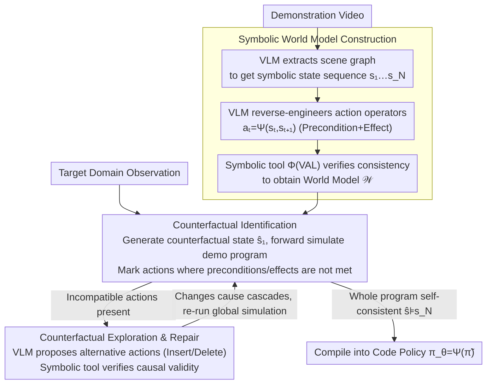

<!-- Generated automatically by src/gen_stubs.py -->
# Cross-Domain Demo-to-Code via Neurosymbolic Counterfactual Reasoning

**Conference**: CVPR2026  
**arXiv**: [2603.18495](https://arxiv.org/abs/2603.18495)  
**Code**: To be confirmed  
**Area**: Robotics  
**Keywords**: video-instructed robotic programming, cross-domain adaptation, neurosymbolic reasoning, counterfactual reasoning, code-as-policies

## TL;DR

This paper proposes NeSyCR, a neurosymbolic counterfactual reasoning framework that abstracts video demonstrations into symbolic world models. By performing counterfactual state deduction to detect cross-domain incompatibilities and automatically correcting program steps, it achieves a 31.14% improvement in success rate over the strongest baseline, Statler, on cross-domain demo-to-code tasks.

## Background & Motivation

1.  **Rise of the Code-as-Policies Paradigm**: LLMs/VLMs possess code generation capabilities, making it possible to synthesize executable robot control code from language instructions or video demonstrations. However, cross-domain adaptation remains a critical challenge.
2.  **Inevitable Domain Gap in Video Demonstrations**: Inherent differences in environmental layout, object attributes, and robot configurations exist between the demonstration domain and the deployment domain. Directly imitating demonstration behaviors leads to program failure.
3.  **Perceptual Observations are Insufficient to Explain Procedural Differences**: While observations reveal physical differences, they cannot explain how structural differences break the underlying task program or causal dependencies.
4.  **VLM Lacks Procedural Understanding**: Current VLMs struggle to reconstruct causal dependencies and achieve behavioral compatibility under domain shifts, often producing actions that are semantically plausible but logically inconsistent.
5.  **Cascading Incompatibilities are Difficult to Handle**: Cross-domain differences affect not only individual steps but can also trigger cascading incompatibilities (e.g., a change in tool position blocking subsequent steps), requiring global program rearrangement.
6.  **Existing Methods Lack Verifiable Adaptation Mechanisms**: VLM-based reasoning methods lack symbolic verification tools, and world model methods that rely on constructing complete domain knowledge from a single demonstration often generate invalid plans.

## Method

### Overall Architecture

NeSyCR treats cross-domain demo-to-code as a counterfactual reasoning problem: given a demonstration video and target domain observations, it outputs a code policy executable in the new domain. It consists of two stages: first, it abstracts a symbolic world model from the demonstration video that is capable of forward simulation and logical verification. Second, it compares this world model with target domain observations and uses counterfactual deduction in two steps to correct the program: first, **Identifying** which steps fail when transferred to the new domain, and then **Exploring Repairs** for those steps, repeatedly re-running simulations after changes until the entire program is self-consistent. Finally, the repaired symbolic program is compiled into executable code. The VLM is responsible for "understanding the scene and proposing ideas," while the symbolic tool (based on VAL) handles "calculating logic and verifying results" within a repeat-until loop of mutual constraint.

### Key Designs

**1. Symbolic World Model Construction: Translating video demonstrations into forward-simulatable, verifiable trajectories**

Observations alone only reveal environment appearance but cannot explain the causal dependencies behind operations—the root cause of failure when directly imitating demonstrations across domains. NeSyCR first directs the VLM to extract a scene graph representing object entities and spatial relationships for each observation frame, yielding a symbolic state sequence $\{s_1, \dots, s_N\}$. For each pair of consecutive states $(s_t, s_{t+1})$, the VLM reverse-engineers an action operator $a_t = \Psi(s_t, s_{t+1})$, explicitly defining its preconditions and effects. Crucially, a symbolic tool $\Phi$ (based on VAL) performs consistency verification $\forall t,\ \Phi(s_t, a_t) \models s_{t+1}$ to ensure the world model $\mathcal{W} = (\mathcal{Q}, \mathcal{P}, \mathcal{A}, \Phi)$ is logically self-consistent. Using a STRIPS-style formalization, this world model is both executable for forward simulation and logically verifiable, providing a "sandbox for thought experiments" for subsequent counterfactual deduction. Removing this (w/o Symbolic World Model) in ablation studies caused the success rate to drop by 34.21%, the largest decrease, indicating that verifiable symbolic representation is the foundation of the method.

**2. Counterfactual Identification: Deducting "which step fails in a different domain" at the symbolic level**

With the sandbox ready, counterfactual questions can be asked: if the demonstration program is moved to the target domain without changes, where will it fail? NeSyCR generates a counterfactual initial state $\hat{s}_1$ (equivalent to an intervention on variables reflecting domain conditions) from target domain observations using a VLM. The symbolic tool then performs step-by-step forward simulation along the demonstration program. The decision rule is clear: if an action's preconditions are no longer met in the current counterfactual state, or if its effects cannot be reproduced in the next state, it is marked as incompatible. This step only performs "diagnosis" without altering the program, precisely locating domain differences to specific actions. Removing it (w/o Counterfactual Identification) dropped the success rate by 21.05%, showing that accurate localization is a prerequisite for repair.

**3. Counterfactual Exploration & Repair: Local program rewriting and iterating to self-consistency (naturally handling cascading incompatibilities)**

Once incompatible actions are located, NeSyCR performs local repairs in the symbolic state space using an "addition/subtraction" approach. For each incompatible action, the VLM utilizes common sense to propose alternative actions—the effects of which must satisfy the broken preconditions of the subsequent valid action $a_{t+1}$ (e.g., inserting an auxiliary step like "close the top drawer first"). If no viable alternative is found, or if the action is redundant for the goal, it is deleted. Each candidate is given to the symbolic tool to verify causal validity (Eq.8). The adapted program $\tilde{\pi}$ must eventually satisfy $\forall t,\ \Phi(\hat{s}_t, \tilde{a}_t) = \hat{s}_{t+1}$ and reach the goal state $\hat{s}_{t+1} \models s_N$, before being compiled into a code policy $\pi_\theta = \Psi(\tilde{\pi})$. Critically, this is a repeat-until loop: after every modification, the global forward simulation is re-run. Thus, a chain of incompatibilities triggered by one modification (e.g., moving a tool preventing preconditions for several subsequent steps) is automatically detected and repaired until the entire program is self-consistent. Cascading incompatibilities are naturally resolved by this iterative structure rather than focusing only on the point of failure. Removing alternative action verification (w/o Alternative Action Verification) dropped the success rate by 18.42%. Compared to re-planning from scratch, this "local surgery" preserves more of the demonstration structure and provides a layer of logical guarantee beyond pure VLM reasoning.

### A Complete Example

Consider the real-world "vertically stacked drawers" scenario: in the demonstration video, two drawers are side-by-side horizontally, and the robot arm opens them sequentially. In the target domain, they are stacked vertically. The symbolic tool simulates forward starting from the counterfactual initial state $\hat{s}_1$. When reaching the "open lower drawer" step, it finds that the precondition—the upper drawer must be closed and not obstructing—is not met in the new domain, thus marking it as incompatible. The VLM then proposes inserting a "close upper drawer" action before this step. The symbolic tool verifies that the integrated program satisfies preconditions step-by-step to reach the final goal, accepts the modification, and compiles it into the final code policy. Thus, a program that would have failed due to drawer interference is automatically corrected into a feasible version involving alternating operations.

## Key Experimental Results

### Experimental Setup

- **Cross-Domain Factors**: 5 categories—Obstruction, Object affordance, Kinematic config, Gripper type, and Compositional.
- **Benchmark Tasks**: Long-horizon manipulation (up to 116 API calls) covering sub-tasks like pick-and-place, sweeping, rotating, and sliding.
- **Complexity Levels**: Low/Medium/High, totaling 440 scenarios.
- **6 Baselines**: Demo2Code, GPT4V-Robotics, Critic-V, MoReVQA, Statler, LLM-DM.

### Main Results (Table 1 — Simulation)

| Method | SR (Low) | SR (Med) | SR (High) | Description |
|------|---------|---------|----------|------|
| Demo2Code | 26.67 | 25.00 | 22.50 | No adaptation mechanism |
| GPT4V-Robotics | 71.67 | 41.67 | 20.00 | VLM reasoning |
| Statler | 61.67 | 41.67 | 5.00 | World model without symbolic verification |
| **NeSyCR** | **86.67** | **75.00** | **60.00** | Ours |

- NeSyCR achieved a **31.14%** average SR improvement over Statler and a **27.73%** average SR improvement over GPT4V-Robotics.
- Under compositional cross-domain factors, NeSyCR maintained 47.5-80.0% SR, while Statler dropped to 32.5-67.5%.

### Real-World Experiments (Table 2)

| Method | SR | GC | PD |
|------|-----|-----|-----|
| Demo2Code | 0.00 | 25.00 | — |
| GPT4V-Robotics | 50.00 | 75.00 | 0.00 |
| Statler | 50.00 | 67.86 | 42.86 |
| **NeSyCR** | **87.50** | **98.21** | 24.49 |

- Used a Franka Emika Research 3 robot arm, adapting from human video demonstrations to real robot deployment.
- Vertical drawer scenario: Required alternating operations on two drawers to avoid mutual interference.

### Ablation Study (Table 3)

| Variant | SR | Gain |
|------|-----|------|
| NeSyCR (Full) | 68.42 | — |
| w/o Alternative Action Verification (Eq.8) | 50.00 | -18.42 |
| w/o Counterfactual Identification (Eq.6) | 47.37 | -21.05 |
| w/o Both | 39.47 | -28.95 |
| w/o Symbolic World Model (Eq.4) | 34.21 | -34.21 |

The symbolic world model had the most significant impact, proving that verifiable symbolic reasoning is the core component.

## Highlights & Insights

- **Models cross-domain demo-to-code as counterfactual reasoning**, providing a clear formal framework (STRIPS + counterfactual state space exploration).
- **Synergistic design of VLM and symbolic tools**: The VLM uses common sense to propose candidates, while the symbolic tool ensures logical correctness, demonstrating strong complementarity.
- **Handles cascading incompatibilities**: Automatically detects how one modification affects subsequent steps and performs global corrections.
- **Thorough real-world validation**: Conducted large-scale quantitative experiments (440 scenarios) in simulation and verified end-to-end feasibility on real robots.
- **Refined experimental design**: A systematic experimental matrix of 5 cross-domain factors × 3 complexity levels facilitates detailed performance analysis across different dimensions.

## Limitations & Future Work

- **Performance drops significantly when task complexity gaps are too large**: Counterfactual reasoning struggles to compensate for missing information when the deployment task far exceeds the demonstration complexity.
- **Dependence on VLM scene graph extraction quality**: The accuracy of symbolic state translation is limited by the perceptual capabilities of the VLM.
- **Limited expressiveness of STRIPS-style representation**: Difficult to model complex scenarios involving continuous physical quantities or deformable objects.
- **Computational overhead**: Iterative verification between VLM and symbolic tools may introduce significant latency in long-sequence tasks.
- **Single demonstration constraint**: Relying on a single demonstration video for world model construction lacks diversity.

## Related Work & Insights

- **vs. Code-as-Policies (SayCan, ProgPrompt)**: Ours focuses on cross-domain adaptation rather than single-domain code generation.
- **vs. Demo2Code**: Demo2Code directly imitates demonstrations without adaptation; NeSyCR corrects programs via counterfactual reasoning.
- **vs. Statler**: Statler has symbolic state representations but lacks integrated symbolic verification tools, causing it to fail under high complexity when re-planning from scratch.
- **vs. LLM-DM**: LLM-DM builds complete domain knowledge from a single demo, often generating invalid plans; NeSyCR preserves demo structure and performs only local corrections.
- **vs. Behavior Cloning/Inverse RL**: These methods struggle with generalization under perceptual and physical changes; NeSyCR adapts at the symbolic level.

## Rating

- Novelty: ⭐⭐⭐⭐ — The combination of counterfactual reasoning and neurosymbolic verification is a new paradigm in the demo-to-code field.
- Experimental Thoroughness: ⭐⭐⭐⭐⭐ — Systematic experiments across 440 scenarios + real robot validation + fine-grained ablation studies.
- Writing Quality: ⭐⭐⭐⭐ — Clear formalization, rigorous symbolic notation, and intuitive case studies.
- Value: ⭐⭐⭐⭐ — Provides a verifiable adaptation framework for cross-domain robotic programming, addressing an important direction.

<!-- RELATED:START -->

## Related Papers

- [\[CVPR 2026\] Counterfactual VLA: Self-Reflective Vision-Language-Action Model with Adaptive Reasoning](counterfactual_vla_self-reflective_vision-language-action_model_with_adaptive_re.md)
- [\[ICLR 2026\] One Demo Is All It Takes: Planning Domain Derivation with LLMs from A Single Demonstration](../../ICLR2026/robotics/one_demo_is_all_it_takes_planning_domain_derivation_with_llms_from_a_single_demo.md)
- [\[NeurIPS 2025\] NeSyPr: Neurosymbolic Proceduralization For Efficient Embodied Reasoning](../../NeurIPS2025/robotics/nesypr_neurosymbolic_proceduralization_for_efficient_embodied_reasoning.md)
- [\[ICML 2026\] Turning Adaptation into Assets: Cross-Domain Bridging for Online Vision-Language Navigation](../../ICML2026/robotics/turning_adaptation_into_assets_cross-domain_bridging_for_online_vision-language_.md)
- [\[CVPR 2026\] DecoVLN: Decoupling Observation, Reasoning, and Correction for Vision-and-Language Navigation](decovln_decoupling_observation_reasoning_and_correction_for_vision-and-language_.md)

<!-- RELATED:END -->
