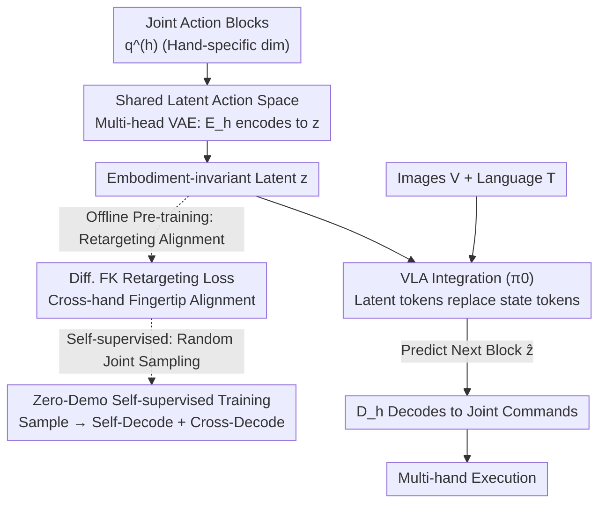

# Cross-Hand Latent Representation for Vision-Language-Action Models

**Conference**: CVPR 2026  
**Paper**: [CVF Open Access](https://openaccess.thecvf.com/content/CVPR2026/html/Jiang_Cross-Hand_Latent_Representation_for_Vision-Language-Action_Models_CVPR_2026_paper.html)  
**Code**: https://xl-vla.github.io (Project Page)  
**Area**: Robotics / Embodied AI  
**Keywords**: Vision-Language-Action Models, Dexterous Hands, Cross-Embodiment, Latent Action Space, Retargeting  

## TL;DR
XL-VLA trains a shared, embodiment-independent latent action space for four structurally diverse dexterous hands. By plugging this space into a VLA framework like $\pi_0$ to replace original joint state tokens, a single hand-agnostic policy can simultaneously control multiple dexterous hands, improving the average cross-embodiment manipulation success rate from 0.55 to 0.90 on real hardware.

## Background & Motivation
**Background**: Vision-Language-Action (VLA) models extend the capabilities of large-scale vision/language models to robot control—perceiving images, understanding language instructions, and outputting actions. The mainstream approach treats actions as an additional output modality in a sequence model, performing seq-to-seq modeling alongside vision and language.

**Limitations of Prior Work**: While language has a relatively stable and universal "vocabulary," a robot's action space is inherently tethered to its morphology. This is particularly severe for dexterous hands—action parameterization (joint angles) varies significantly across different hands, and new hardware emerges constantly. Collecting a large dataset for every new hand is prohibitively expensive.

**Key Challenge**: To achieve scalable cross-embodiment learning, a unified action representation reusable across multiple hands is required. However, joint space dimensions (Ability/Inspire 12D, X-Hand 12D, Paxini 16D), finger counts (4 or 5 fingers), and actuation methods differ, making direct sharing impossible.

**Goal**: The problem is decomposed into two specific sub-questions: (1) How to define a unified action representation within a robot family? (2) How to seamlessly integrate a new robot with an action space different from existing ones?

**Key Insight**: The authors observe that while the joint space of each hand is hand-specific, the **geometric relationships of fingertips** (e.g., pinch distance and direction from the thumb to other fingers) are semantic invariants that can be aligned across hands. Thus, hand-specific joints are decoupled from the hand-agnostic sequence model—the sequence model operates only within a shared latent space, and the hand identity is used only to select the corresponding encoder/decoder.

**Core Idea**: A cross-hand shared latent action space replaces the raw joint spaces of individual hands as an "embodiment-invariant" action representation that can be directly plugged into standard VLAs, enabling cross-embodiment joint training and zero-shot reuse.

## Method

### Overall Architecture
XL-VLA consists of two parts: **(1) A pre-trained cross-embodiment latent action space** (a set of hand-specific encoders $E_h$ / decoders $D_h$ mapping to the same latent distribution), and **(2) A VLA backbone built on $\pi_0$** (vision/language encoders + action expert).

The latent space is pre-trained independently of the VLA; subsequently, these encoders/decoders are **entirely frozen** during VLA training. During online inference for a hand $h$, $E_h$ first compresses the previous absolute joint action block $q_t^{(h)}$ (64 frames @ 20 Hz, approx. 3.2s) into a compact latent vector $z_t = E_h(q_t^{(h)})$. The VLA backbone, conditioned on a short history of these latent tokens plus vision/language tokens, predicts the next latent block $\hat z_{t+1}$. The corresponding embodiment decoder $D_h$ then maps it back to joint commands $\hat q_{t+1}^{(h)} = D_h(\hat z_{t+1})$. Crucially, the hand identity $h$ is **only used to select $E_h/D_h$ and is never fed to the VLA backbone as an explicit token**, allowing the same hand-agnostic policy to operate across different hands.

### Key Designs

**1. Shared Latent Action Space + Multi-head VAE: Sharing an Action Manifold Across Dimensions**

To address the issue that joint space dimensions/structures differ, the authors do not define separate action spaces. Instead, a **multi-head VAE-style autoencoder** maps all hands to a shared latent distribution. For each hand $h$, the encoder outputs Gaussian posterior parameters $(\mu^{(h)}, \sigma^{(h)}) = E_h(q^{(h)})$. Using the reparameterization trick, a latent code $z$ is sampled: $q(z\mid q^{(h)}) = \mathcal N(\mu^{(h)}, \mathrm{diag}((\sigma^{(h)})^2))$. The decoder then reconstructs it back to the joint space $\hat q^{(h)} = D_h(z)$. Each encoder/decoder is a lightweight MLP. The base reconstruction constraint $L_1$ ensures that kinematics are not degraded:

$$L_1 = L_{rec} = \frac{1}{|H|}\sum_{h\in H}\mathrm{MSE}\big(\hat q^{(h)}, q^{(h)}\big)$$

However, $L_1$ only ensures good individual autoencoding; it does not force the same $z$ to have the same meaning across hands. The next design addresses this.

**2. Differentiable Forward Kinematics (FK) Retargeting Loss: Aligning Hands via Fingertip Geometry**

To make the latent space truly cross-embodiment, the same $z$ must produce geometrically consistent actions across hands. The authors use **differentiable Forward Kinematics (FK)** to map joints to fingertip positions $p_i^{(h)}$ and define fingertip displacements $\delta_{ij}^{(h)} = p_i^{(h)} - p_j^{(h)}$. A retargeting loss is applied to a subset $P$ (thumb paired with index/middle/ring/pinky) to penalize discrepancies in pinch distance and direction between source hand $s$ and target hand $t$:

$$L_2 = \frac{1}{|H|(|H|-1)|P|}\sum_{s\neq t}\sum_{(i,j)\in P} w_{ij}^{(s)}\Big(\lambda_{dis}\big(\|\delta_{ij}^{(s)}\|_2 - \|\hat\delta_{ij}^{(t)}\|_2\big)^2 + \lambda_{dir}\big(1 - c_{ij}^{(s,t)}\big)\Big)$$

where $\hat\delta_{ij}^{(t)}$ is derived from the target hand's decoded configuration and $c_{ij}^{(s,t)}$ is the cosine similarity of pinch directions. The weight $w_{ij}^{(s)} = \exp(-\lambda_{dis}^{exp}\|\delta_{ij}^{(s)}\|_2)$ prioritizes tighter pinches. Finger indices are manually aligned by semantics. This term is the core source of "cross-hand semantic consistency," turning an alignment problem that usually requires paired trajectories into a differentiable objective based solely on FK geometry.

**3. Zero-Demonstration Self-supervised Latent Alignment: Aligning Spaces Without Paired Trajectories**

The latent autoencoder training **requires no demonstration data or IK-generated trajectories**. For each hand $s$, joint configurations $q^{(s)}$ are **randomly sampled** within hardware limits. These are encoded into $z$ and then decoded using **all** decoders $\{D_t\}_{t\in H}$: self-decoding $D_s(z)$ contributes to $L_1$, and cross-hand decoding $D_t(z)\ (t\neq s)$ contributes to $L_2$. Losses are aggregated and backpropagated to optimize encoders and decoders jointly. Since $L_2$ only uses FK and decoded poses, the entire cross-embodiment alignment is completely self-supervised and **does not require paired cross-hand trajectories**. A KL loss regularizes the latent variables to a standard Gaussian prior:

$$L_3 = L_{KL} = \mathbb E_q\big[\mathrm{KL}\big(q(z\mid q)\,\|\,\mathcal N(0, I)\big)\big]$$

The total latent objective is $L_{latent} = L_1 + L_2 + \beta L_3$, with fixed $\beta=10^{-5}, \lambda_{dis}=2000, \lambda_{dir}=5, \lambda_{dis}^{exp}=12$.

**4. Inserting Latent Tokens into $\pi_0$: Direct Embodiment-Invariant Action Processing**

The VLA backbone follows $\pi_0$ (PaliGemma-initialized VLM + action expert). While the original $\pi_0$ uses **state tokens** for proprioceptive history, XL-VLA **replaces them entirely with latent action tokens**: for hand $h$, $E_h$ encodes the previous joint block into a latent vector. The model predicts the next latent block based on latent history and vision/language tokens, which $D_h$ decodes back to joints. Freezing the encoders/decoders during VLA fine-tuning preserves VLM pre-training priors. This architecture circumvents the limitations of discrete token autoregressive decoding for high-frequency dexterous control by regressing continuous blocks in the latent space.

### Loss & Training
The latent space is pre-trained on synthetic random joint samples ($L_1 + L_2 + \beta L_3$). The VLA phase initializes from $\pi_0$ weights and fine-tunes on a multi-embodiment dataset (4 hands × 10 tasks) for 60K steps with a batch size of 128 on 8×H100 (80GB). This results in a unified, language-conditioned cross-embodiment multi-task policy.

## Key Experimental Results

Dataset: 2-arm setup (7-DoF xArm + Unitree G1), 4 hands (Ability/Inspire/X-Hand1 5-finger, Paxini DexH13 4-finger), 10 real-world manipulation tasks with 50 teleoperated demos per task per hand (totaling 2000 demos). Success rates are calculated over 10 real-world trials per task.

### Main Results: Cross-Embodiment VLA Modeling (vs. $\pi_0$)
Average success rate across four hands and ten tasks:

| Method | Ability | Inspire | Paxini | XHand | Total Avg |
|------|---------|---------|--------|-------|--------|
| $\pi_0$ (Shared policy, raw joint space) | 0.37 | 0.27 | 0.35 | 0.29 | 0.55* |
| **XL-VLA (Latent action space)** | **0.73** | **0.68** | **0.78** | **0.70** | **0.90** |

\* The paper reports a total average improvement from 0.55 to 0.90 (+0.35, approx. +40%). Per-hand improvements are significant, especially for the XHand (most unique structure), increasing from 0.29 to 0.70. Gains are particularly notable in high-dexterity tasks like "Sort Cans," "Hand over Bottle," and "Re-arrange Boxes." Note: Per-line averages and total mean may vary due to aggregation; refer to the original paper for precise metrics.

### Latent Replay Comparison (vs. LAD, Supervised Latent Retargeting)
Teleoperated trajectories from one hand are encoded and decoded to another hand for real-world replay:

| Method | Ability+Inspire | Paxini+XHand |
|------|-----------------|--------------|
| LAD (Supervised) | 0.60 | 0.61 |
| **XL-VLA (Unsupervised)** | **0.82** | **0.81** |

XL-VLA significantly outperforms the supervised LAD despite being entirely unsupervised and label-free, with LAD degrading noticeably on fine-grained tasks.

### Ablation Study (Latent Space Design, Lower is Better)

| Configuration | Recon Joint↓ | Cross-embodiment PTdir↓ | RTdist↓ | Description |
|------|------|------|------|------|
| Ours (H128→64, dim 32) | 5.476 | 11.857 | 6.295 | Balanced full configuration |
| − $L_1$ | 61.672 | 11.741 | 6.375 | Reconstruction fails completely |
| − $L_2$ (both) | 3.781 | **62.733** | **62.809** | Cross-embodiment geometry fails |
| − $L_2^{dir}$ | 4.966 | 46.217 | 5.518 | Direction error spikes |
| L128 (Latent dim too large) | 5.324 | 8.736 | 6.215 | Large dim hurts embodiment-invariant structure |

### Key Findings
- **Crucial Losses**: Removing $L_1$ collapses reconstruction (Joint RMSE 5.48→61.7). Removing $L_2$ results in cross-embodiment direction/distance errors spiking from ~12/6 to ~63/63, confirming that the retargeting loss is vital for cross-hand semantic consistency.
- **Optimal Latent Dimension**: Performance is stable across a wide range of architectures, but excessively large dimensions (e.g., L128) hinder the learning of embodiment-invariant structures. Dim 32 is chosen as an optimal trade-off.
- **Zero-Shot Transfer**: By holding out certain tasks for specific hands, XL-VLA demonstrates transfer to "unseen task-hand" combinations via corresponding decoders, outperforming the "$\pi_0$ + kinematic retargeting" baseline across all tests.

## Highlights & Insights
- **Self-supervised Alignment via Differentiable FK**: Using fingertip pinch distance and direction as cross-hand invariants allows the latent space to be aligned without any paired trajectories, eliminating the most expensive part of cross-embodiment data collection.
- **Decoupled Architecture**: Since encoders/decoders are pre-trained and frozen before VLA integration, adding new hands or switching VLA backbones is modular and clean.
- **Continuous Latent Regression**: Moving from discrete token autoregression to continuous latent block regression bypasses the resolution limits of discretization, which is crucial for high-DoF dexterous control.

## Limitations & Future Work
- Evaluations are restricted to 4 hands, 2 arms, and 10 tabletop tasks; generalization to open-world or long-horizon tasks is unknown.
- Cross-hand alignment relies on **manual finger semantic mapping** (thumb-to-finger pairs), which may not scale to topologically distinct or non-anthropomorphic hands.
- Latent space training uses **random joint sampling**, which covers the hardware's reachable space but might not align with the manifold of real manipulation tasks, potentially leading to decoding artifacts in rare poses.
- Future work could include learning finger semantic alignment, aligning latent training distributions with real demonstration distributions, and extending to whole-body or bimanual coordination.

## Related Work & Insights
- **vs. LAD (Latent Action Diffusion)**: LAD uses diffusion with supervised paired retargeting. XL-VLA uses VAE + FK for **unsupervised** alignment, achieving higher success rates (0.82/0.81 vs. 0.60/0.61).
- **vs. UniVLA / Discrete VQ Latent**: Unlike methods using discrete tokens, XL-VLA employs continuous latents via a multi-head VAE to avoid discretization artifacts in dexterous control.
- **vs. $\pi_0$ (Base VLA)**: While $\pi_0$ adjusts sequence lengths for different embodiments, it is unstable. XL-VLA's substitution of state tokens with embodiment-invariant latent tokens yields a direct gain in average success rate from 0.55 to 0.90.

## Rating
- Novelty: ⭐⭐⭐⭐⭐ Elegant use of differentiable FK for self-supervised cross-embodiment alignment within VLA.
- Experimental Thoroughness: ⭐⭐⭐⭐ Solid real-world multi-hand/multi-task evaluation, though task diversity is limited.
- Writing Quality: ⭐⭐⭐⭐ Clear equations and pipelines, though some metric aggregation details are slightly ambiguous.
- Value: ⭐⭐⭐⭐⭐ Addresses the high data cost of dexterous VLA; the modular "plug-and-play" encoder/decoder approach is highly practical.

<!-- RELATED:START -->

## Related Papers

- [\[ICML 2026\] Contrastive Representation Regularization for Vision-Language-Action Models](../../ICML2026/robotics/contrastive_representation_regularization_for_vision-language-action_models.md)
- [\[CVPR 2026\] HiF-VLA: Hindsight, Insight and Foresight through Motion Representation for Vision-Language-Action Models](hif-vla_hindsight_insight_and_foresight_through_motion_representation_for_vision.md)
- [\[CVPR 2026\] QuantVLA: Scale-Calibrated Post-Training Quantization for Vision-Language-Action Models](quantvla_scale-calibrated_post-training_quantization_for_vision-language-action_.md)
- [\[CVPR 2026\] Test-Time Perturbation Tuning with Delayed Feedback for Vision-Language-Action Models](test-time_perturbation_tuning_with_delayed_feedback_for_vision-language-action_m.md)
- [\[CVPR 2026\] MoEActok: A MoE-based Action Tokenizer for Vision-Language-Action Models](moeactok_a_moe-based_action_tokenizer_for_vision-language-action_models.md)

<!-- RELATED:END -->
