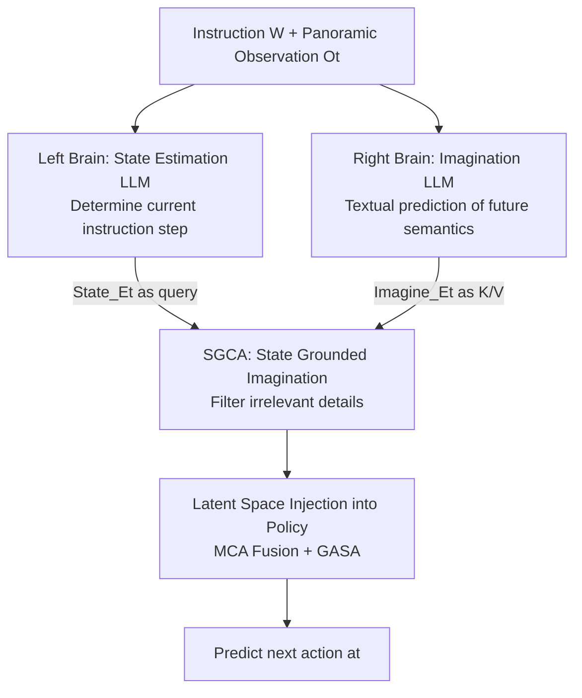

# Cross from Left to Right Brain: Adaptive Text Dreamer for Vision-and-Language Navigation

**Conference**: CVPR 2026  
**Paper**: [CVF Open Access](https://openaccess.thecvf.com/content/CVPR2026/html/Zhang_Cross_from_Left_to_Right_Brain_Adaptive_Text_Dreamer_for_CVPR_2026_paper.html)  
**Code**: To be open-sourced (the original text states "The code will be available")  
**Area**: Embodied Navigation / Vision-and-Language Navigation (VLN)  
**Keywords**: Vision-and-Language Navigation, LLM Imagination, Dual-branch Left-Right Brain, Textual Dreamer, State Grounded Cross-Attention  

## TL;DR
Addressing the language-perception alignment challenge caused by "partial observability" in VLN, this paper proposes **imagining future key semantics through language (rather than images)**. It introduces ATD, a dual-branch left-right brain structure: the left-brain LLM estimates the current navigation state, while the right-brain LLM textualizes the imagination of the scene ahead. Irrelevant details are filtered via State Grounded Cross-Attention (SGCA), and the information is injected into a graph navigation strategy via a decoder-free latent vector. With only 1.5B parameters, it achieves a 12%/11% improvement in SR/SPL on R2R val unseen compared to the baseline.

## Background & Motivation
**Background**: Vision-and-Language Navigation (VLN) requires agents to follow natural language instructions to reach targets in unseen 3D environments. The fundamental difficulty is **partial observability**—at each step, only a limited field of view is visible, and landmarks or targets mentioned in instructions might be far beyond the current horizon. Early works used memory mechanisms (topological maps, grid maps, recurrent vectors) to aggregate history, while recent works have shifted toward "imagination": actively simulating observations of unvisited viewpoints to extend the perceptual horizon.

**Limitations of Prior Work**: Existing imagination-based methods almost exclusively rely on **visual generation**—rendering pixel-level images or feature-level representations along candidate trajectories (e.g., PathDreamer, DreamWalker, HNR, and UnitedVLN use NeRF/3DGS). This introduces three specific problems: high computational overhead for rendering; generated images often contain blur or redundant areas that complicate alignment; and the requirement to encode full panoramic views introduces significant distracting, irrelevant information.

**Key Challenge**: The authors argue that **effective navigation does not rely on "reconstructing the entire scene," but on "identifying task-relevant key environmental semantics."** Given the instruction "walk down the stairs toward the red sofa," the critical inference is "where the red sofa might appear," while other visual content is mostly irrelevant. Visual generation methods waste substantial computation on reconstructing these irrelevant details.

**Key Insight**: Language is inherently **compositional and abstract**, making it particularly suitable for "selective and abstract" target imagination—a single sentence like "The living room might be ahead, where a sofa, TV, and table will be visible" can compactly encode future key semantics far more efficiently than rendering an image.

**Core Idea**: Replace "imagining the future" from the visual domain to the linguistic domain and mimic the functional specialization of the human brain's left and right hemispheres—the left brain handles logical integration (estimating the current step in the instructions), and the right brain handles divergent imagination (predicting future scene semantics). The two interact in a shared latent space to guide the navigation strategy.

## Method

### Overall Architecture
ATD (Adaptive Text Dreamer) consists of two parts: a **dual-branch left-right brain vision-language reasoning structure** and a **topological graph-based navigation expert**. The task is modeled as an undirected graph $G=(V,E)$, where $V=\{V_i\}_{i=1}^{K}$ are navigable nodes. At each step $t$, the agent observes a set of RGB views of adjacent nodes $O_t=\{\langle o_i,a_i\rangle\}_{i=1}^{N}$, and the policy $\pi(a_t\mid W,O_t;\Theta)$ predicts the next action.

The pipeline is as follows: Instructions $W$ and current panoramic observations $O_t$ are fed simultaneously to the left brain (state estimation LLM) and the right brain (imagination LLM). These two branches **share weights**, but each has a Q-Former to extract visual tokens for a frozen InstructBLIP/Flan-T5. The left brain outputs a hidden vector for the current navigation state $\text{State}\_E_t$, and the right brain outputs a hidden vector for future imagination $\text{Imagine}\_E_t$. Subsequently, SGCA (State Grounded Cross-Attention) uses the **state to constrain the imagination**, filtering out irrelevant details to obtain grounded ATD node embeddings. Finally, this latent vector is injected into the node embeddings of the graph navigation strategy in a decoder-free manner (passing only through the encoder without calling the LLM decoder) via multi-head cross-attention, followed by Graph-Aware Self-Attention (GASA) to predict the next target node.

### Key Designs

**1. Textual Imagination instead of Visual Generation: Abstracting future key semantics with language**

This is the core of the paper. Visual imagination methods render images of future candidate viewpoints, which is slow and wastes computation on task-irrelevant textures. The right brain of ATD does not generate pixels; instead, it uses **natural language descriptions** of what might appear ahead—e.g., "Walking forward, you will see a sofa, a TV, and a table." During training, the authors collected detailed captions $\{C^i_{\text{candidate }t}\}_{i=1}^{N}$ for $N$ candidate nodes at each sampled position on Matterport3D's navigation graphs using Qwen2.5-VL-7B as ground truth. The right brain is trained to predict these candidate semantics using cross-entropy loss $L_{\text{rightbrain}}=-\sum_{t=1}^{T}\sum_{i=1}^{N}\{C^i_{\text{candidate }t}\}\log(I_t)$. This ensures imagination is naturally compact, compositional, and semantically focused.

**2. Dual-branch Left-Right Brain Structure: Logical left brain + Divergent right brain, tuning only Q-Formers**

Imagination alone is insufficient; if it focuses on completed parts of the instruction (e.g., imagining stairs after already climbing them), it misleads decision-making. Borrowing from brain lateralization, the left brain performs **state estimation**: determining the current stage of the instruction to exclude interference from finished segments. The GT for the left brain is obtained by GPT-4V reasoning over the current observation and instruction, then distilled into the smaller LLM with loss $L_{\text{leftbrain}}=-\sum_{t=1}^{T}R_t\log(\hat R_t)$. The two branches are structurally symmetrical:

$$Q'_{lb}=\text{Q-former}_{lb}(W,O_t,Q_{lb}),\quad \langle \hat R_t,\ \text{State}\_E_t\rangle=\text{LLM}_{\text{frozen}}(\text{Prompt}(W,Q'_{lb}))$$
$$Q'_{rb}=\text{Q-former}_{rb}(W,O_t,Q_{rb}),\quad \langle I_t,\ \text{Imagine}\_E_t\rangle=\text{LLM}_{\text{frozen}}(\text{Prompt}(W,Q'_{rb}))$$

Crucially, efficiency is maintained by **fine-tuning only the Q-Formers of each branch** (learnable query tokens $Q_{lb},Q_{rb}\in\mathbb{R}^{n\times d_1}$), while the InstructBLIP LLM and visual backbone remain frozen.

**3. SGCA State Grounded Cross-Attention: State-driven imagination filtering**

Right-brain imagination is "unconstrained" and can hallucinate details irrelevant to the current navigation. SGCA (State Grounded Cross-Attention) uses the left-brain state information to ground "important and relevant" parts of the imagination. It uses the state embedding $\text{State}\_E_t$ as the query and the imagination embedding $\text{Imagine}\_E_t$ as the key/value:

$$Q_S=\text{State}\_E_t W_Q,\quad \langle K_I,V_I\rangle=\text{Imagine}\_E_t\langle W_K,W_V\rangle$$
$$A=\text{SoftMax}(\text{Sim}_{\cos}(Q_S,K_I)),\quad \text{SGCA}(Q_S,K_I,V_I)=A\cdot V_I$$

The attention matrix $A$ acts as a "constraint weight from state to imagination." **As the navigation state changes, $A$ adjusts accordingly**, automatically filtering imaginations that do not match the current phase.

**4. Decoder-free Latent Injection: Preserving LLM reasoning without losing navigation expertise**

To integrate LLM linguistic imagination into a mature navigation policy without mutual interference, the authors use a decoder-free latent interface. The SGCA output, node ATD embedding $V^{ATD}_t$, is fused with the graph node visual embedding $V^{vis}_t$ (average pooling of views) via Multi-Head Cross-Attention (MCA), where $V^{vis}_t$ acts as the query:

$$V^{\text{fusion}}_t=\text{MCA}(V^{ATD}_t,\ V^{vis}_t)$$

The fused embedding enters a cross-modal transformer based on a dynamic topological graph (following DUET). It first undergoes cross-attention with the LLM-encoded instruction and then passes through Graph-Aware Self-Attention (GASA), which incorporates a pairwise distance matrix $E$ between nodes into the attention mechanism:

$$\text{GASA}(V)=\text{Softmax}\!\left(\frac{VW_q(VW_k)^T}{\sqrt{d}}+EW_e\right)VW_v$$

## Key Experimental Results

### Main Results (R2R)
ATD is based on InstructBLIP + Flan-T5-xl (1.5B). All fine-tuning was performed on a single GPU.

| Method | Params/Feature | Val Unseen SR↑ | Val Unseen SPL↑ | Test SR↑ | Test SPL↑ |
|:---|:---|:---:|:---:|:---:|:---:|
| NaviLLM (Vicuna-7B) | Full Fine-tune 7B | 67 | 59 | 68 | 60 |
| NavGPT2 (FlanT5-XL-1.5B) | Single Brain Latent | 70 | 59 | 71 | 60 |
| BEVBert | Extra Depth/BEV | 75 | 64 | 73 | 62 |
| DUET+ScaleVLN† | 4.9M Extra Data | 79 | 70 | 77 | 68 |
| **ATD (FlanT5-XL-1.5B)** | **MP3D only, 1.5B** | **75** | **63** | **74** | **63** |

- Among LLM-based methods, ATD uses the fewest parameters (1.5B) but achieves the best performance, outperforming the full-finetuned 7B NaviLLM by +6% SR on the test set.
- Without any external data, it approaches DUET+ScaleVLN and surpasses BEVBert (which uses extra depth information) on the test split.

### Ablation Study

| Configuration | Val Unseen SR↑ | Val Unseen SPL↑ | Description |
|:---|:---:|:---:|:---|
| Baseline (No SEM/IM) | 63 | 52 | DUET w/o local branch |
| + SEM only (State) | 72 | 61 | Left brain only |
| + IM only (Imagine) | 73 | 60 | Right brain only |
| **Full ATD (SEM+IM Interaction)** | **75** | **63** | Complete Left-Right brain |
| Cross Right to Left | 73.95 | 63.08 | Imagination grounds State (reversed) |
| Parallel | 74.41 | 61.89 | Parallel addition |

### Key Findings
- **Synergy is critical**: Adding SEM or IM individually significantly outperforms the baseline, but their interaction yields the best results. Compared to the baseline, ATD improves SR by 12% and SPL by 11% on val unseen.
- **Directionality of grounding matters**: Grounding must be "State → Imagination." Reversing or parallelizing both lead to performance drops, proving the asymmetric constraint design is core.
- **Faster Convergence**: ATD surpasses the peak SPL of NavGPT2 in approximately 80k iterations, nearly 100k iterations faster.

## Highlights & Insights
- **"Language over images for imagination" is a powerful intuition flip**: While most assume future imagination requires pixels, this paper highlights that navigation primarily requires "task-relevant key semantics," which language handles naturally with less noise.
- **The decoupling of "State Estimation" and "Imagination"** via a dual-brain architecture, coupled with SGCA, effectively solves the problem of "imagination drift" toward already completed instruction parts.
- **The decoder-free latent interface** is a highly transferable trick. For integrating LLM reasoning into specialized downstream policies without heavy overhead, aligning latent vectors via encoders is a clean and effective paradigm.

## Limitations & Future Work
- The ground truth for imagination relies on offline collection via GPT-4V and Qwen2.5-VL-7B; quality is thus bounded by potential hallucinations or biases in these teacher models.
- Results are primarily validated in **discrete environments (R2R)**. Whether textual imagination holds up as well in continuous environments (VLN-CE) without redesigned candidate semantic collection remains to be seen.
- A gap still exists compared to models using massive external data (e.g., ScaleVLN), suggesting that the "efficient but data-light" path's upper bound is currently limited by the scale of MP3D.

## Related Work & Insights
- **vs. Visual Imagination (DreamWalker / UnitedVLN)**: These methods render RGB observations which are costly and noisy. ATD uses compact textual semantics that do not require future poses.
- **vs. NavGPT2**: While both use latent bridging, NavGPT2 is a single-brain structure. ATD's dual-branch approach with SGCA yields +3% SR/SPL at the same 1.5B scale.
- **vs. NaviLLM**: NaviLLM treats the task as QA and fine-tunes the entire 7B LLM. ATD preserves LLM generation logic while tuning only Q-Formers, surpassing it with fewer parameters.

## Rating
- **Novelty**: ⭐⭐⭐⭐⭐ (Language-based imagination + dual-brain lateralization is a very clean reframe).
- **Experimental Thoroughness**: ⭐⭐⭐⭐ (Solid R2R/R4R/REVERIE results, though lacks continuous environment testing).
- **Writing Quality**: ⭐⭐⭐⭐ (Clear motivation and formulas, memorable metaphor).
- **Value**: ⭐⭐⭐⭐⭐ (Practical paradigm for deploying embodied LLMs with high efficiency and faster convergence).

<!-- RELATED:START -->

## Related Papers

- [\[CVPR 2026\] Cross-Hand Latent Representation for Vision-Language-Action Models](cross-hand_latent_representation_for_vision-language-action_models.md)
- [\[CVPR 2026\] Adaptive Action Chunking at Inference-time for Vision-Language-Action Models](adaptive_action_chunking_at_inference-time_for_vision-language-action_models.md)
- [\[CVPR 2026\] Towards Training-Free Scene Text Editing](towards_training-free_scene_text_editing.md)
- [\[CVPR 2026\] MergeVLA: Cross-Skill Model Merging Toward a Generalist Vision-Language-Action Agent](mergevla_cross-skill_model_merging_toward_a_generalist_vision-language-action_ag.md)
- [\[CVPR 2026\] AT-VLA: Adaptive Tactile Injection for Enhanced Feedback Reaction in Vision-Language-Action Models](at-vla_adaptive_tactile_injection_for_enhanced_feedback_reaction_in_vision-langu.md)

<!-- RELATED:END -->
