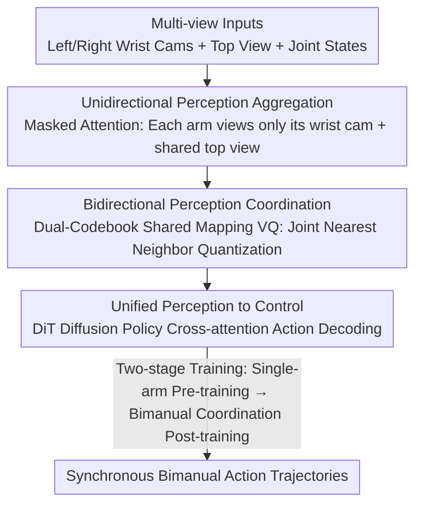

# CUBic: Coordinated Unified Bimanual Perception and Control Framework

**Conference**: CVPR 2026  
**Paper**: [CVF Open Access](https://openaccess.thecvf.com/content/CVPR2026/html/Wang_CUBic_Coordinated_Unified_Bimanual_Perception_and_Control_Framework_CVPR_2026_paper.html)  
**Code**: Not released  
**Area**: Robotics / Embodied AI  
**Keywords**: Bimanual manipulation, Visuomotor policy, Diffusion policy, Vector quantization, Shared codebook  

## TL;DR
CUBic reformulates "bimanual coordination" as a unified perception representation problem—using a pair of shared-mapping VQ codebooks to bind the perception tokens of the left and right arms in the same latent space, followed by a DiT diffusion policy to output actions. Both "arm independence" and "bimanual coordination" emerge naturally from the architecture, achieving an average success rate on RoboTwin 12% higher than SOTA visuomotor policies.

## Background & Motivation
**Background**: Visuomotor policies already enable robots to predict actions end-to-end from raw images, but the vast majority of work focuses on single-arm scenarios—where both perception and control are modeled for a single manipulator.

**Limitations of Prior Work**: Extending end-to-end learning from single-arm to bimanual collaboration is extremely difficult. The challenge lies in the requirement for each arm to perform perception and action **independently** while maintaining spatial and temporal consistency with the other. The joint action space of two arms explodes combinatorially with degrees of freedom, and coordination requires reasoning under multiple spatio-temporal constraints, making ordinary end-to-end imitation learning hard to scale.

**Key Challenge**: Existing bimanual methods are divided into two factions with conflicting goals. One (e.g., AnyBimanual) **decouples** the perception and control flows of the two arms to emphasize independence and reduce interference, but sacrifices cross-arm consistency. The other uses mechanisms like cross-attention to **force-couple** the arms to promote information exchange, improving coordination at the cost of decoupled robustness. One seeks to "separate" and the other to "combine," yet neither offers a unified approach.

**Goal**: Can the opposing goals of "independence" and "coordination" be unified into a single coherent framework, rather than making a structural trade-off between the two?

**Key Insight**: The authors argue that independence and coordination should not be imposed through manually designed coupling mechanisms (role assignment, cross-attention), but should be an emergent property of a **shared token representation**. If the perception of both the left and right arms is quantized into a shared-mapping discrete latent space, then "retaining independent semantics" and "mutual awareness of context" can exist simultaneously within the same structure.

**Core Idea**: Reformulate bimanual coordination from a "structural trade-off problem" into a "unified perception modeling problem"—building a bridge with a pair of shared-mapping VQ codebooks to let coordination emerge endogenously from the model structure rather than being injected externally.

## Method

### Overall Architecture
CUBic is a unified pipeline from multi-view images directly to bimanual actions, with the core being the inclusion of both perception and control into a shared tokenized latent space. The inputs are the left/right wrist cameras + a top-down camera along with the joint states of both arms; the output consists of synchronous, physically consistent action trajectories. The process occurs in three steps: first, local perception for each arm is aggregated into arm-specific latent tokens (isolated from each other, using the shared top-down view as a global anchor); second, a pair of shared-mapping VQ codebooks is used to quantize and bind the tokens of both arms, allowing coordination to occur implicitly in the latent space; finally, the coordinated tokens are fed into a DiT diffusion policy to generate actions, utilizing two-stage training to transition from "perception-level collaboration" to "control-level collaboration."

### Key Designs

**1. Unidirectional Perception Aggregation: Separating Local Precision and Global Context**

The information from different cameras in multi-view inputs varies in nature: the top/external view provides coarse-grained global context (seeing both arms and relative positions), while wrist cameras provide fine-grained local observations (object-gripper relations, surface details) along with the joint states of that arm. Mixing them all at once dilutes local-global cues and introduces redundant correlations. The authors classify perception inputs as: wrist camera + joint states as "arm-specific information" for local perception, and the top-down view as "shared global context" for cross-arm collaboration.

The implementation uses a Transformer with a **unidirectional self-attention mask**. Each RGB path uses an independent ResNet-18 for feature extraction, and proprioceptive signals pass through a lightweight MLP to project to the same dimension. Two sets of learnable latent action tokens $a_q^{\text{left}}, a_q^{\text{right}} \in \mathbb{R}^{N \times d}$ are defined as the initialization for the latent action spaces (where $N=4$ in experiments). The masking rule is: the left arm's latent tokens can only attend to its own arm-specific tokens (concatenated global average features of the wrist camera + proprioceptive embeddings $c^{\text{left}}$) and the shared top-down features; the arm-specific tokens can only attend to the shared features; the top-down view only attends to itself to prevent information leakage. The right arm is mirrored symmetrically. This **strictly isolates the two arms to prevent early cross-arm interference** while anchoring both latent action spaces to the same global foundation of the top-down view.

**2. Bidirectional Perception Coordination: Achieving "Separation" and "Combination" via Shared-Mapping VQ**

Isolation alone is insufficient; the two arms must coordinate. This step establishes the coordination relationship between the left and right latent actions. After masked self-attention, $a_q^{\text{left}}$ and $a_q^{\text{right}}$ each encode implicit information from the shared top-down view and are then quantized using two codebooks $Z^{\text{left}}, Z^{\text{right}} \in \mathbb{R}^{K \times d_z}$ ($K=256, d_z=32$ in experiments). The key is that these two codebooks **share a unified mapping space**: quantization does not calculate independent nearest neighbors but selects indices jointly:

$$d_{\text{left},i} = \|a_q^{\text{left}} - a_{z,i}^{\text{left}}\|_2^2,\quad d_{\text{right},i} = \|a_q^{\text{right}} - a_{z,i}^{\text{right}}\|_2^2,\quad i^* = \arg\min_i (d_{\text{left},i} + d_{\text{right},i})$$

The optimal quantization index $i^*$ minimizes the sum of the distances for both arms, forcing the latent representations to converge to a **cross-arm joint consistent** codeword. The authors also stack Residual Vector Quantization (RVQ) to enhance codebook expressiveness and stabilize training. This shared quantization allows the dual codebooks to learn the joint distribution of features, establishing endogenous coupling between two otherwise decoupled perception flows: aligning semantics to the same latent manifold while preserving individual functional independence.

**3. Unified Perception to Control + Two-stage Training: DiT Diffusion toward Action Collaboration**

Once perception features with coordination context are obtained, they are translated into executable actions. The quantized tokens $a_z^{\text{left}}, a_z^{\text{right}}$ enter an encoder with their corresponding arm-specific and top-down tokens to be transformed into rich semantic embeddings $Q_{\text{left}} = \text{concat}(a_z^{\text{left}}, c_{\text{left}})$ (similarly for $Q_{\text{right}}$). The action decoding uses a Diffusion Transformer (DiT), where $Q$ is injected via cross-attention. In the forward diffusion, noise is added as $a_H^k = \sqrt{\bar{\alpha}_k}\, a_H^0 + \sqrt{1-\bar{\alpha}_k}\,\epsilon$, and the model learns a denoising function $D_\theta(a_H^k, k, Q)$ by optimizing the standard diffusion objective $\mathcal{L}_{\text{diff}} = \mathbb{E}_{a_H^0, \epsilon, k}\big[\|D_\theta(a_H^k, k, Q) - \epsilon\|^2\big]$.

The **two-stage training recipe** facilitates a smooth transition from perception collaboration to action collaboration via "isolated-then-fused self-attention layers." **Phase 1: Single-arm Pre-training**: Policy branches train independently with separate self-attention/cross-attention/FFN modules. Coordination is learned via VQ with straight-through gradient estimation $a_z = \text{sg}[a_z - a_q] + a_q$ and a codebook loss $\mathcal{L}_{\text{VQ}} = \|\text{sg}[a_q] - a_z\|_2^2 + \beta\|a_q - \text{sg}[a_z]\|_2^2$. **Phase 2: Bimanual Coordination Post-training**: All perception modules are frozen to preserve the learned collaborative representations. The self-attention layers in the DiT are **merged into a single unified module shared by both arms**, allowing arms to be visible to each other at the policy level and introducing structured correlation in the diffusion noise.

## Key Experimental Results

### Main Results
Evaluation on the RoboTwin simulation benchmark (based on ManiSkill, 100 expert demonstrations per task). Observation horizon $O=1$, prediction horizon $H=8$.

| Method | Mean Success Rate | Pick Apple Messy | Blocks Stack Easy | Dual Bottles Pick (Hard) | Dual Shoes Place |
|------|-----------|------------------|-------------------|--------------------------|------------------|
| GR-MG | 8.0% | 8.0 | 30.3 | 0.0 | 0.0 |
| DP | 38.5% | 29.3 | 85.7 | 8.0 | 3.0 |
| DP3 (with Point Cloud) | 39.8% | 9.7 | 55.3 | — | 12.0 |
| **CUBic (Ours)** | **51.8%** | **40.0** | 84.3 | **16.0** | 10.0 |

CUBic outperforms DP3 by 12.0% and DP by 13.3% on average, notably without requiring **any 3D perception**.

Real-world results using Agibot with 3 D435 cameras:

| Setup | DP Avg Score | CUBic Avg Score | Gain |
|------|-----------|--------------|------|
| In-Domain | 19.5 | 43.1 | +23.6 |
| Out-of-Domain | 12.7 | 34.7 | +22.0 |

### Ablation Study

| Shared Mapping | Two-stage Training | Mean Success Rate | Gain |
|----------|------------|-----------|----------|
| ✗ | ✗ | 32.6% | — |
| ✓ | ✗ | 42.1% | +9.5 |
| ✗ | ✓ | 40.1% | +7.5 |
| ✓ | ✓ | **51.8%** | +19.2 |

| latent tokens $N$ | Codebook Size $K$ | Mean Success Rate |
|---------------------|--------------|-----------|
| 0 | 256 | 0.0% |
| 4 | 256 | **51.8%** |
| 8 | 512 | 40.2% |

### Key Findings
- **Shared mapping and two-stage training are mutually reinforcing pillars**: Activating both yields a +19.2% gain, which exceeds the sum of individual gains (+9.5 and +7.5).
- **Latent tokens are essential**: $N=0$ leads to complete failure (0%), proving these tokens are necessary intermediaries for bimanual coordination.
- **Capacity matching**: Increasing $N$ and $K$ too much (e.g., $N=8, K=512$) degrades performance to 40.2%, suggesting that excessive capacity weakens the shared mapping constraint.

## Highlights & Insights
- **Reframing "Independence vs. Coordination"**: Instead of choosing between decoupling or strong coupling, CUBic uses shared-mapping dual codebooks to allow both to emerge, avoiding manual role division.
- **Joint Nearest Neighbor Quantization**: The mechanism $\arg\min_i (d_{\text{left},i} + d_{\text{right},i})$ is lightweight yet effective at forcing cross-arm consistency.
- **Curriculum Learning**: Stage 1 learns independent skills and Stage 2 learns synergy, providing a clean engineering paradigm for bimanual tasks.

## Limitations & Future Work
- Complexity remains a challenge: absolute success rates on difficult handover tasks (e.g., Dual Bottles Block Handover 10%) remain low. CUBic is not the top performer in every individual task (e.g., it trails DP slightly in Blocks Stack Easy).
- Training cost: Stage-wise training for 900 epochs per stage on 4x4090 GPUs is computationally expensive.
- Scaling: Extending to more than two arms or heterogeneous robots remains an open question for the shared codebook design.

## Related Work & Insights
- **vs. AnyBimanual (Decoupling Faction)**: Unlike methods that isolate modules to retain independence, CUBic achieves consistency via latent constraints without sacrificing individual arm autonomy.
- **vs. Coupling Faction (Cross-attention)**: CUBic avoids the potential loss of robustness associated with "hard-coded" information exchange by embedding coordination into discrete latent codebooks.
- **vs. Diffusion Policy / DP3**: CUBic introduces a VQ-bridge and a two-stage DiT training strategy specifically for bimanual coordination, outperforming single-arm-centric designs even without 3D modalities.

## Rating
- Novelty: ⭐⭐⭐⭐
- Experimental Thoroughness: ⭐⭐⭐⭐
- Writing Quality: ⭐⭐⭐⭐
- Value: ⭐⭐⭐⭐

<!-- RELATED:START -->

## Related Papers

- [\[CVPR 2026\] EnergyAction: Unimanual to Bimanual Composition with Energy-Based Models](energyaction_unimanual_to_bimanual_composition_with_energy-based_models.md)
- [\[AAAI 2026\] TouchFormer: A Robust Transformer-based Framework for Multimodal Material Perception](../../AAAI2026/robotics/touchformer_a_robust_transformer-based_framework_for_multimodal_material_percept.md)
- [\[CVPR 2026\] CycleManip: Enabling Cycle-based Manipulation via Effective History Perception and Understanding](cyclemanip_enabling_cycle-based_manipulation_via_effective_history_perception_an.md)
- [\[CVPR 2026\] Motus: A Unified Latent Action World Model](motus_a_unified_latent_action_world_model.md)
- [\[CVPR 2026\] Do You Have Freestyle? Expressive Humanoid Locomotion via Audio Control](do_you_have_freestyle_expressive_humanoid_locomotion_via_audio_control.md)

<!-- RELATED:END -->
