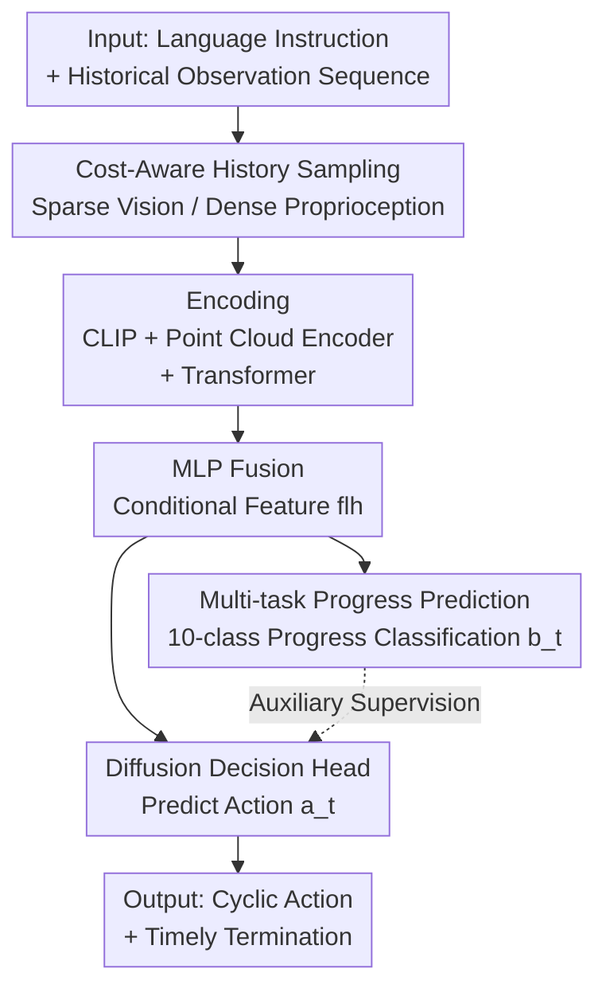

# CycleManip: Enabling Cycle-based Manipulation via Effective History Perception and Understanding

**Conference**: CVPR 2026  
**Paper**: [CVF Open Access](https://openaccess.thecvf.com/content/CVPR2026/html/Wei_CycleManip_Enabling_Cycle-based_Manipulation_via_Effective_History_Perception_and_Understanding_CVPR_2026_paper.html)  
**Code**: Project Page https://isee-laboratory.github.io/CycleManip/ (Public GitHub not yet available)  
**Area**: Robotics  
**Keywords**: Robot manipulation, cyclic tasks, history modeling, imitation learning, diffusion policy  

## TL;DR
Addressing cyclic manipulation tasks such as "shaking a bottle three times" or "hammering a nail eight times," which require precise cycle counting and timely termination, CycleManip introduces "Cost-Aware Sampling" to efficiently expand history perception and "Multi-task Progress Prediction" to force the model to understand cycle stages within end-to-end imitation learning. It increases success rates on cyclic tasks from single-digit/low percentages to 53–97% in both simulation and real-world experiments.

## Background & Motivation
**Background**: Current mainstream robotic manipulation policies—whether diffusion-based (DP, DP3) or Vision-Language-Action (VLA) models (Pi-0, RDT)—excel at predicting the next action based on current observations and show strong performance in sequential long-horizon tasks.

**Limitations of Prior Work**: However, they collectively fail at **cyclic manipulation** tasks. Cyclic tasks involve repeating the same action a specific number of times and stopping exactly after the requirement is met (e.g., shaking a bottle five times, hammering eight times). The difficulty lies in the fact that visual observations look almost identical after each cycle, making it impossible for the model to distinguish the current cycle count, resulting in either infinite loops or premature termination.

**Key Challenge**: Cyclic tasks are inherently **non-Markovian**—the decision to continue or stop depends on the "accumulated progress within cycles" rather than the current frame. Existing imitation policies generally use very short observation windows (Pi-0 even uses only the current frame) for action prediction, inherently lacking historical context. An intuitive fix is to extend history, but encoding and fusing high-dimensional visual observations at every step causes computational and latency explosions. The contradiction is: **cyclic tasks require long history, but high-dimensional visual encoding for long history is too expensive.**

**Goal**: Enable imitation policies to both **perceive** a sufficiently long history and **understand** the specific cycle stage in an end-to-end manner without introducing extra models, hierarchical structures, or significant computational overhead.

**Key Insight**: Decouple the utilization of historical information into perception and understanding—using **Cost-Aware Sampling** to cheaply extend the observation horizon (sparse visual sampling, dense proprioceptive sampling) and using **Multi-task Progress Prediction** as auxiliary supervision to force the model to learn discriminative features that distinguish cycle stages.

## Method

### Overall Architecture
CycleManip takes a user language instruction $lan$ and a sequence of historical observations $\{o_i\}_{i=1}^t$ as input, outputting the next action $a_t$ to execute and terminate cyclic actions in a closed-loop manner. The base policy follows $a_t = \pi(lan, \{o_i\}_{i=1}^t)$.

The pipeline consists of three stages: **(1) Cost-Aware Sampling** categorizes historical observations by encoding cost and applies different sampling strategies to cheaply extend the horizon; **(2) Encoding and Fusion** uses CLIP for language, point cloud encoders for vision, and Transformers for low-overhead observations, followed by an MLP to fuse them into conditional features; **(3) Dual-head Output**—fused features are fed to a diffusion model for action prediction (decision-making) and an auxiliary head for current progress prediction (understanding). The two core innovations reside in the first stage (perception) and the third stage's auxiliary head (understanding). The backbone remains a standard diffusion policy, making it plug-and-play for other imitation policies.

### Key Designs

**1. Cost-Aware History Sampling: Cheaply extending the observation horizon through differentiated sampling**

This step directly addresses the conflict between the need for long history and the high cost of visual encoding. The authors categorize historical observations into **high-cost observations** $o_i^h$ (RGB images / Point Clouds, expensive to encode) and **low-cost observations** $o_i^l$ (proprioception, cheap to encode). Different sampling strategies $H_h$ and $H_l$ are applied: $a_t = \pi\big(H_h(\{o_i^h\}_{i=1}^t),\, H_l(\{o_i^l\}_{i=1}^t)\big)$.

For low-cost observations, **dense and full-range** sampling is used—incorporating all past low-cost observations since they are computationally cheap. Crucially, proprioception is represented by **end-effector pose differences** rather than joint angles or absolute poses. This is because end-effector cyclic patterns are more intuitive and easier to model, and pose differences eliminate absolute position bias, allowing the model to focus on the "periodicity itself." This approach significantly extends the temporal horizon at minimal cost, providing the history needed for cycle counting.

For high-cost visual observations, a **heuristic frame sampling** $H_h$ is employed. While keeping the number of sampled frames $K_{high}$ constant, it covers a longer horizon. Specifically, given the first frame 0 and current frame $t$, it performs right-side bisection sampling for $0.5\cdot K_{high}$ frames, and exponential sampling from the latest frame $t$ moving backward as $t - 2^k$ (where $k$ is the index) for the remaining $0.5\cdot K_{high}$ frames. This results in dense sampling for the near past and sparse sampling for the distant past, extending the horizon to cover multiple cycles without increasing computational load. In experiments, $K_{high}=6$.

**2. Multi-task Progress Prediction: Forcing model understanding via auxiliary classification**

Simply extending the horizon is insufficient—too much information can burden feature encoding. A fundamental issue is that under standard imitation supervision, the ground-truth signals for the same action (e.g., "one hammer strike") are **identical** across different cycles. However, their corresponding histories differ. This forces the model to converge features from different stages to the same local optimum, losing discriminative power regarding cycle progress.

To solve this, the authors add an **auxiliary task: predicting the current stage of the entire process**. Ground-truth progress $b_t$ is calculated as the current frame index divided by the total frames for that task (a 0–1 value). This $[0,1]$ range is uniformly split into ten intervals and discretized into class labels $y_t$ for a **10-class classification**. Since the supervision signal varies with progress, the model is forced to learn **distinct and discriminative feature representations** for different cycle stages, enabling more reliable judgment of whether to continue or stop. Implementation-wise, to avoid overfitting the multi-task head, features are first fused via multi-layer MLPs (the same fused features used for diffusion) before entering a single MLP layer for progress prediction.

### Loss & Training
The fused conditional features serve both the diffusion decision and the auxiliary task. Language features are concatenated with fused observation features as conditions for the diffusion model, which uses FiLM to condition the action prediction output. The total loss is the sum of the MSE for action regression and the cross-entropy loss for progress classification:

$$L = \alpha \cdot \mathrm{MSE}(a_t, a_t^*) + \beta \cdot \mathrm{CE}(b_t, b_t^*)$$

where $a_t^*$ and $b_t^*$ are ground truths for actions and the auxiliary task, with weights $\alpha=1$ and $\beta=0.1$. The DDIM sampler is used (100 steps for training, 10 for inference), action horizon is 8, and the model is trained for 300 epochs with a batch size of 128 on a single RTX 4090.

## Key Experimental Results

### Main Results
Evaluated on the self-built CycleManip simulation benchmark (based on RoboTwin 2.0, 8 cyclic tasks, 200 expert demonstrations per task, 1–8 cycles), comparing against DP, DP3, RDT, and Pi-0. Metrics include Success Rate (Suc., requiring both task completion and correct cycle count) and Cycle Deviation (Cyc., mean absolute error of executed cycles vs. ground truth, lower is better).

| Task | DP3 Suc./Cyc. | RDT Suc./Cyc. | Pi-0 Suc./Cyc. | Ours Suc./Cyc. |
|------|------|------|------|------|
| Block Hammering | 23 / 5.55 | 20 / 2.15 | 13 / 3.44 | **86 / 0.25** |
| Bottle Shaking | 16 / 4.58 | 15 / 1.53 | 19 / 2.00 | **95 / 0.29** |
| Roller Rolling | 33 / 1.44 | 35 / 1.55 | 14 / 3.80 | **97 / 0.03** |
| Carrot Slicing | 38 / 1.92 | 36 / 1.24 | 8 / 2.54 | **86 / 0.81** |
| Chem Stirring | 18 / 1.41 | 12 / 2.0 | 2 / 2.37 | **53 / 0.76** |
| Morse Tapping | 1 / – | 0 / – | 0 / – | **91 / –** |

Ours significantly outperforms in success rate and cycle deviation across all 8 tasks: success rates are mostly between 53–97%, while baselines are generally in the single digits to low 40s. Cycle deviation is mostly below 1 (e.g., 0.03 for Roller), while baselines often deviate by 2–8 cycles. The authors attribute baseline failures to short observation windows—Pi-0, which uses only 1 frame, has the lowest success rate.

Real-world experiments (6 tasks, across various embodiments: single gripper, dexterous hand, humanoid) compared with DP3:

| Task (Embodiment) | DP3 Suc. | w/o Task Suc. | Ours Suc. |
|------|------|------|------|
| Block Hammering (Single) | 37.5 | 62.5 | **93.75** |
| Bottle Shaking (Single) | 12.5 | 31.25 | **68.75** |
| Drumming (Dual Gripper) | 0 | 60 | **90** |
| Table Cleaning (Dexterous) | 20 | 40 | **100** |
| Pumping (Humanoid) | 10 | 20 | **50** |
| Cutting (Dexterous) | 0 | 25 | **75** |

### Ablation Study
The `w/o Task` configuration in the real-world table (removing history understanding/progress prediction but keeping cost-aware sampling) shows the contribution of each component:

| Configuration | Hammer Suc. | Drumming Suc. | Cutting Suc. | Description |
|------|------|------|------|------|
| DP3 (Baseline, short horizon) | 37.5 | 0 | 0 | Neither perception nor understanding |
| w/o Task (Perception only) | 62.5 | 60 | 25 | Adds history perception, significant gain |
| Ours (Perception + Understanding) | **93.75** | **90** | **75** | Adds multi-task understanding, further gain |

### Key Findings
- **History perception is the foundation**: Adding only cost-aware sampling to the baseline (w/o Task) results in massive success rate jumps (e.g., 0→60 for Drumming), confirming that a long observation horizon is a prerequisite for cyclic tasks.
- **History understanding is the finishing touch**: Adding progress prediction on top of perception further boosts success rates (e.g., 62.5→93.75 for Hammering), verifying that auxiliary supervision pushes the model from "passively seeing history" to "actively understanding cycle stages."
- **Negligible computational increase**: Efficiency analysis (Carrot Slicing, RTX 4090) shows that compared to DP3, training time (0.073→0.102), inference time (0.0893→0.0953), and VRAM usage (16796→17342 MB) increase only slightly, while success rate jumps from 38 to 86.
- **Generalization and Plug-and-play**: Ours also leads in 4 general (non-cyclic) tasks in RoboTwin 2.0. Integrating the method into Pi-0 (VLA) improved Bottle Shaking from 19 to 72 and Dual Cutting from 1 to 41, proving its value as a plug-and-play component.

## Highlights & Insights
- **Heuristic sampling based on encoding cost is a clever optimization**: Densifying cheap proprioception while sparsifying expensive vision integrates long history at near-zero cost—a key to resolving the "long history vs. compute" conflict.
- **Using end-effector pose differences for proprioception**: This representation highlights cyclic patterns and removes absolute position bias, a subtle but highly effective design choice.
- **Progress prediction as an auxiliary task "forces discriminative features"**: In cyclic tasks, imitation signals repeat across cycles, causing feature collapse. Explicitly supervised progress prediction restores stage-wise discriminability. This insight regarding "repeated supervision causing collapse" is valuable for other repetitive tasks.
- **No extra models or hierarchical structures**: The solution simply adds a sampling strategy and an auxiliary head to standard diffusion policies, making it end-to-end trainable and easy to deploy.

## Limitations & Future Work
- **Progress GT relies on frame ratios**: Defining $b_t$ as current/total frames assumes linear temporal progress. This might be inaccurate when movement speeds are inconsistent or cycle lengths vary significantly (⚠️ This assumption's boundaries are not deeply discussed).
- **Small real-world sample size**: With only 16 trials per real-world task, statistical noise is non-negligible; conclusions for some tasks (e.g., humanoid pumping at 50%) should be interpreted cautiously.
- **Evaluation depends on task-specific rules**: Cycle counting relies on state-machine collision detection or pose peak detection tailored to each task, requiring custom evaluation tools for new task types.
- **Gaps in highly dynamic tasks**: Success rates for complex contact/dynamic tasks like stirring or pumping are still around 50–53%, suggesting history + progress supervision alone may not fully cover highly dynamic cyclic manipulation.

## Related Work & Insights
- **vs. History Modeling Methods (Visual Memory/Large Kernels/Caches)**: While previous robotic history modeling focused on long-range tasks and high-dimensional visual fusion, this work targets harder cyclic tasks using cheap proprioception and cost-aware sampling rather than stacking visual memory.
- **vs. Traditional Cyclic Task Methods**: Early control-based methods adapt poorly to dynamic environments. Recent deep learning methods either fix the cycle count, are limited to specific scenarios, or rely on external models. Ours supports arbitrary counts and diverse tasks end-to-end.
- **vs. Short-horizon Imitation/VLA (DP, DP3, Pi-0, RDT)**: These fail at cyclic tasks due to an inability to distinguish current cycles. Ours serves as an enhancement—both outperforming them and acting as a plug-and-play module to boost their performance significantly.

## Rating
- Novelty: ⭐⭐⭐⭐ First to systematically define and solve cycle-based manipulation; the "Perception + Understanding" decomposition and cost-aware sampling are clean and effective.
- Experimental Thoroughness: ⭐⭐⭐⭐ Comprehensive coverage across 8 simulation tasks, 6 real-world tasks, general tasks, and plug-and-play/efficiency analysis, though real-world trial counts are low.
- Writing Quality: ⭐⭐⭐⭐ Problem motivation is intuitive (e.g., Fig 2 "looks the same / cannot count"), with clear mapping between methodology and results.
- Value: ⭐⭐⭐⭐ Cyclic tasks are common in daily life; the method is lightweight, embodiment-agnostic, and plug-and-play, making it highly deployment-friendly.

<!-- RELATED:START -->

## Related Papers

- [\[ICLR 2026\] Manipulation as in Simulation: Enabling Accurate Geometry Perception in Robots](../../ICLR2026/robotics/manipulation_as_in_simulation_enabling_accurate_geometry_perception_in_robots.md)
- [\[CVPR 2026\] Affordance Field Intervention: Enabling VLAs to Escape Memory Traps in Robotic Manipulation](affordance_field_intervention_enabling_vlas_to_escape_memory_traps_in_robotic_ma.md)
- [\[CVPR 2026\] DynBridge: Bridging Imagination and Control through Interaction Dynamics for Robot Manipulation](dynbridge_bridging_imagination_and_control_through_interaction_dynamics_for_robo.md)
- [\[CVPR 2026\] DiffuView: Multi-View Diffusion Pretraining for 3D-Aware Robotic Manipulation](diffuview_multi-view_diffusion_pretraining_for_3d_aware_robotic_manipulation.md)
- [\[CVPR 2026\] CUBic: Coordinated Unified Bimanual Perception and Control Framework](cubic_coordinated_unified_bimanual_perception_and_control_framework.md)

<!-- RELATED:END -->
