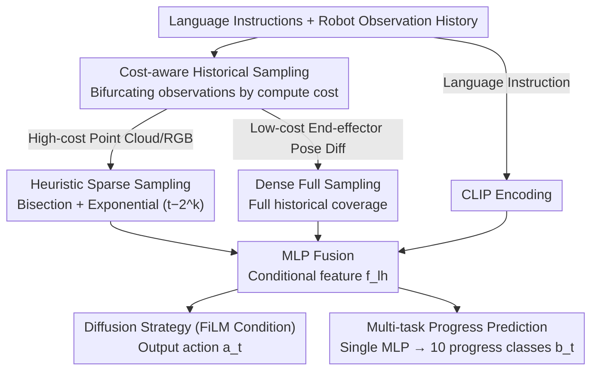

# CycleManip: Enabling Cyclic Task Manipulation via Effective Historical Perception and Understanding

**Conference**: CVPR 2026  
**arXiv**: [2512.01022](https://arxiv.org/abs/2512.01022)  
**Code**: [https://isee-laboratory.github.io/CycleManip/](https://isee-laboratory.github.io/CycleManip/)  
**Area**: Robotics  
**Keywords**: Cyclic Manipulation, Robot Manipulation, Imitation Learning, Historical Perception, Multi-task Learning

## TL;DR
CycleManip represents the first systematic approach to robotic cyclic manipulation tasks (e.g., shaking a bottle $N$ times). It enhances historical perception via a cost-aware historical sampling strategy and improves historical understanding through multi-task learning auxiliary objectives, achieving controllable cycle-count manipulation within an end-to-end imitation learning framework.

## Background & Motivation
1. **Background**: While imitation learning and VLA models in robotics show excellent performance in sequential tasks, research on cyclic tasks—requiring repeated actions and accurate termination—is nearly non-existent.
2. **Limitations of Prior Work**: (i) Policies with short observation windows cannot distinguish between different stages of a cycle (visual observations are nearly identical after each shake); (ii) There is a lack of cyclic task benchmarks containing sufficient data and automated evaluation tools.
3. **Key Challenge**: Cyclic tasks are non-Markovian processes where correct decision-making depends not only on current observations but also on accumulated progress. However, extending the observation window significantly increases computational overhead.
4. **Goal**: Design an end-to-end imitation learning framework that enables robots to perform cyclic actions and terminate at the correct moment.
5. **Key Insight**: Bifurcate observations into high-cost (visual) and low-cost (proprioceptive) streams for differentiated sampling; utilize multi-task learning to facilitate understanding of cyclic stages.
6. **Core Idea**: Cost-aware sampling (sparse visual + dense proprioceptive) + progress prediction auxiliary task = cycle-aware policy.

## Method

### Overall Architecture
The core challenge CycleManip addresses is that cyclic tasks (e.g., stopping after shaking a bottle $N$ times) are non-Markovian processes—visual observations after each shake are nearly identical, making it impossible to count repetitions from the current frame alone. While expanding the visual observation window could recover history, point clouds and RGB frames are computationally expensive. The pipeline follows two paths: "partitioned historical supplementation" and "forcing the model to understand history." First, cost-aware historical sampling fills the history with inexpensive end-effector pose differences while sparsely sampling expensive visual history. These, along with language instructions, are encoded and fused via MLP into conditional features for a diffusion policy to predict actions. Simultaneously, these fused features are fed into an auxiliary branch to predict current progress, using this supervisory signal to force the model to learn stage differences from repeated observations. Additionally, the CycleManip benchmark was developed to support training and automated evaluation.

### Key Designs

**1. Cost-aware historical sampling: Substituting expensive visual history with free proprioception**

Since the difficulty in cyclic tasks lies in the inability of short windows to perceive progress, the most direct fix is extending the observation range. However, the cost of visual frames makes full-history sampling infeasible. The Key Insight of CycleManip is that the cyclic rhythm is primarily carried by the end-effector trajectory rather than RGB: it moves back and forth during shaking, a periodicity that is more distinct and easier to model than joint angles. Thus, observations are split by computational cost: low-cost end-effector poses (using **pose differences** between adjacent frames rather than absolute positions to avoid drift) are **densely sampled** to cover the full history. High-cost point clouds/RGB are **sparsely sampled**—half the frames use bisection sampling for coarse coverage of the entire history, and the other half use exponential sampling (at times $t-2^k$) to maintain dense recent details. This ensures clear recent perception and continuous long-term history with minimal visual computation. For example, after dozens of frames, specific frames are picked for vision, while every pose difference is retained, feeding the full periodic waveform into the model.

**2. Multi-task progress prediction: Adding a "counting" supervisory signal to repeated observations**

Pure imitation learning faces a risk: in every cycle, expert labels are "continue execution," making the supervisory signals identical. The model has no incentive to distinguish the first cycle from the fifth, failing to learn when to stop. CycleManip adds an auxiliary task to create this pressure: the model predicts current progress $b_t$, defined as the current frame index divided by the total trajectory length, discretized into 10 intervals for classification. This progress loss forces the model to extract discriminative features from "identical-looking" observations to distinguish stages. This enables the policy to recognize when the cycle is nearing completion.

**3. CycleManip Benchmark: Removing the obstacle of unstandardized evaluation**

The lack of systematic research on cyclic tasks is partly due to the absence of automated evaluation platforms. Based on RoboTwin 2.0, 8 cyclic manipulation tasks were built (e.g., hammering nails, shaking bottles, cutting carrots), each with 200 demo trajectories spanning 1–8 cycles. Evaluation considers not just task success but also cycle count accuracy—**a trial passes only if the manipulation succeeds and the cycle count matches exactly**, highlighting the core difficulty of cyclic tasks compared to sequential ones.

### Loss & Training
The model is trained within a diffusion policy framework. The total objective is the sum of action regression and progress classification:

$$\mathcal{L} = \alpha \cdot \text{MSE}(a_t, a_t^*) + \beta \cdot \text{CE}(b_t, b_t^*)$$

Where the first term is the MSE for diffusion action prediction and the second is the cross-entropy for 10-class progress classification. $\alpha, \beta$ are the respective weights.

## Key Experimental Results

### Main Results

| Task | CycleManip Success | Baseline Success | Cycle Accuracy |
|------|--------------------|------------------|----------------|
| Hammering | High | Low | High |
| Shaking | High | Very Low | High |
| Cutting Carrots | Medium-High | Low | Medium-High |

### Ablation Study

| Configuration | Key Metric | Description |
|------|---------|------|
| Full CycleManip | Optimal | Complete framework |
| w/o Progress Prediction | Significant drop | Auxiliary task is critical |
| w/o Dense Proprioception | Drop | Historical perception is important |
| Visual Extension Only | High cost, limited gain | Validates cost-aware sampling necessity |

### Key Findings
- The method shows high adaptability to general manipulation tasks, not limited to cyclic ones.
- It can serve as a plug-and-play module for VLA models (e.g., Pi0).
- Cross-platform validation (dual-arm grippers, dextrous hands, humanoid robots) demonstrates generalizability.
- The computational overhead of dense proprioceptive sampling is negligible, making it a highly cost-effective historical modeling approach.

## Highlights & Insights
- **First systematic definition of cyclic manipulation tasks**, filling a gap in robotic research.
- **Cost-aware sampling** provides excellent design intuition: leveraging free proprioception instead of expensive vision to capture cyclic patterns.
- The progress prediction auxiliary task is a simple yet effective trick.

## Limitations & Future Work
- Discretizing progress into 10 classes may lack precision.
- Currently supports only fixed cycle counts; dynamic termination conditions like "until mixed well" remain unexplored.
- Complex physical interactions (e.g., friction of different materials) may require finer force feedback.

## Related Work & Insights
- **vs Diffusion Policy**: Standard diffusion policies use short observation windows and fail at cyclic tasks. CycleManip extends their capacity through historical perception and understanding.
- **vs VLA models**: VLA models also rely on short-term observations. The plug-and-play design of CycleManip can directly enhance them.

## Rating
- Novelty: ⭐⭐⭐⭐ First to define cyclic manipulation; practical yet straightforward method.
- Experimental Thoroughness: ⭐⭐⭐⭐⭐ 8 tasks + 3 platforms + Simulation + Real + VLA integration.
- Writing Quality: ⭐⭐⭐⭐ Clear problem definition and sound experimental design.
- Value: ⭐⭐⭐⭐ Fills a significant gap; valuable for practical robot deployment.

<!-- RELATED:START -->

## Related Papers

- [\[CVPR 2026\] CycleManip: Enabling Cycle-based Manipulation via Effective History Perception and Understanding](cyclemanip_enabling_cycle-based_manipulation_via_effective_history_perception_an.md)
- [\[CVPR 2026\] DynBridge: Bridging Imagination and Control through Interaction Dynamics for Robot Manipulation](dynbridge_bridging_imagination_and_control_through_interaction_dynamics_for_robo.md)
- [\[CVPR 2026\] Rethinking Camera Choice: An Empirical Study on Fisheye Camera Properties in Robotic Manipulation](rethinking_camera_choice_an_empirical_study_on_fisheye_camera_properties_in_robo.md)
- [\[CVPR 2026\] Unifying Perception and Action: A Hybrid-Modality Pipeline with Implicit Visual Chain-of-Thought for Robotic Action Generation (VITA)](unifying_perception_and_action_a_hybrid-modality_pipeline_with_implicit_visual_c.md)
- [\[CVPR 2026\] Affordance Field Intervention: Enabling VLAs to Escape Memory Traps in Robotic Manipulation](affordance_field_intervention_enabling_vlas_to_escape_memory_traps_in_robotic_ma.md)

<!-- RELATED:END -->
