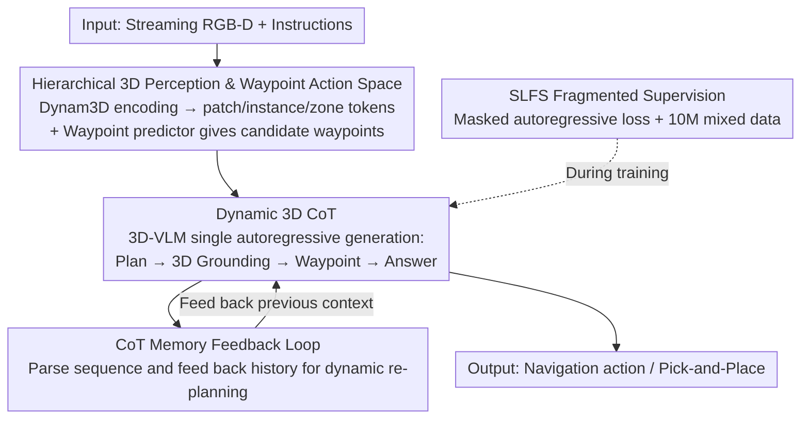

# D3D-VLP: Dynamic 3D Vision-Language-Planning Model for Embodied Grounding and Navigation

**Conference**: CVPR 2026  
**Paper**: [CVF Open Access](https://openaccess.thecvf.com/content/CVPR2026/html/Wang_D3D-VLP_Dynamic_3D_Vision_Language_Planning_Model_for_Embodied_Grounding_and_Navigation_CVPR_2026_paper.html)  
**Code**: https://github.com/MrZihan/D3D-VLP (Available)  
**Area**: Embodied AI / 3D Vision / Vision-Language Navigation  
**Keywords**: Embodied Navigation, 3D Vision-Language Model, 3D Chain-of-Thought, Dynamic Re-planning, Fragmented Supervision  

## TL;DR
D3D-VLP reformulates "planning, 3D grounding, and navigation" into a unified internal autoregressive 3D Chain-of-Thought (3D CoT) within a 3D-VLM, complemented by a CoT memory feedback loop for dynamic re-planning. By utilizing a "Fragmented Supervision" strategy, the model jointly trains on 10 million samples with incomplete annotations (e.g., navigation-only labels), achieving new SOTA results on multiple embodied navigation and grounding benchmarks, including R2R-CE, REVERIE-CE, HM3D-OVON, and SG3D.

## Background & Motivation
**Background**: There are currently two mainstream approaches to enabling embodied agents to "understand instructions, find targets, and navigate" in large scenes. One is the end-to-end route (e.g., StreamVLN, NaVILA, Dynam3D), which directly maps instructions and video streams to navigation actions. The other is modular systems (e.g., InstructNav, AO-Planner), which use an LLM as a high-level planner connected to a 3D grounding module and a navigation policy in a staged pipeline.

**Limitations of Prior Work**: End-to-end models act as black boxes—they bypass explicit 3D grounding and reasoning, failing to output precise target locations. They struggle with long-horizon planning or multi-objective tasks and lack interpretability. Conversely, modular systems suffer from siloed components: the planner receives no real-time feedback from the grounding/navigation modules, preventing dynamic plan adjustments when blocked. Furthermore, modules are often trained separately on different datasets, leading to domain gaps and lack of coordination.

**Key Challenge**: There is a disconnect between interpretability/explicit 3D reasoning (where modular systems excel) and high performance/joint optimization (where end-to-end systems excel). One must typically sacrifice interpretability for performance or lose cross-component synergy and dynamic feedback for modular clarity.

**Goal**: To build a unified model that retains explicit 3D grounding and planning (visible intermediate reasoning) while enabling joint optimization and dynamic adjustments like end-to-end models, capable of operating in large-scale, unseen, and dynamic real environments based on real-time incomplete observations.

**Key Insight**: The authors observed that planning, grounding, and navigation can all be expressed as "generating a sequence of tokens." Rather than splitting these into three models, they can be integrated into a single autoregressive generation pass of one 3D-VLM. This allows the three tasks to naturally share context and condition on each other, enabling automatic synergy.

**Core Idea**: A "3D Chain-of-Thought"—comprising textual planning → explicit 3D grounding tokens → navigation waypoint tokens → answer text—is generated autoregressively within a single 3D-VLM. A CoT memory loop feeds history back to achieve dynamic re-planning. Training utilizes a fragmented supervision strategy with masked autoregressive loss to leverage massive datasets with incomplete labels.

## Method

### Overall Architecture
The core objective of D3D-VLP is to merge dispersed embodied capabilities into a unified, self-correcting reasoner. At each timestep, the system uses a Dynam3D encoder to maintain streaming posed RGB-D images as a **hierarchical 3D memory** (patch, instance, and zone tokens). Simultaneously, a waypoint predictor provides several candidate waypoints. These 3D tokens, instructions, candidate waypoints, and the **CoT memory** from the previous timestep are fed into the core 3D-VLM (based on NVILA-Lite-2B). The model then performs a **single autoregressive generation** of a unified 3D CoT sequence: Next Plan → Locked Target Token → Selected Navigation Waypoint → Answer Text. Once generated, the sequence is parsed to update the CoT memory for the next step, forming a stateful, re-plannable closed loop. During training, the SLFS strategy allows a mixture of 10 million samples with partial annotations to contribute to the gradient.

### Key Designs

**1. Hierarchical 3D Perception & Waypoint Action Space: A Persistent, Aligned 3D World for Reasoning**

For 3D CoT to perform explicit grounding and navigation, it requires a structured 3D representation addressable by the language model rather than temporary 2D observations. This work follows the Dynam3D encoder to construct a hierarchical scene representation: 2D patch features are projected into 3D space to obtain 3D feature points $M_\text{patch}$ with semantic and geometric info. These are aggregated via transformer into object-level **Instance tokens** $M_\text{inst}$ and coarse-grained **Zone tokens** $M_\text{zone}$. A generalizable feature field renders **Panoramic patch tokens** $V_\text{patch}$ from the current pose for local fine-grained perception. Combined, these form $M_t=(V_\text{patch}, M_\text{inst}, M_\text{zone})$.

Regarding the action space, the authors intentionally avoid textual actions like "move forward 0.5m." Instead, they train a **waypoint predictor**: $V_\text{patch}$ and 12 query tokens (spaced at 30°) are fed into a transformer to output reachable waypoints. A unified **3D spatial embedding** aligns 3D tokens and waypoints. For each timestep $t$, global coordinates are transformed to the agent-centric camera frame. Relative distance $D_t$ and horizontal angle $\theta_t$ are calculated, and $(P_t, D_t, \cos\theta_t, \sin\theta_t)$ are fed into an MLP spatial encoder. This ensures navigation actions and 3D perception tokens reside in the **same spatial semantic coordinate system**.

**2. Dynamic 3D Chain-of-Thought: Planning, Grounding, and Navigation in One Pass**

This directly addresses the lack of coordination in modular systems. The core approach reformulates the entire embodied task—from high-level task decomposition (planning) and target localization (grounding) to low-level execution (navigation)—into a **single unified autoregressive generation problem**. The 3D-VLM generates a structured multimodal sequence $S_t=(T_\text{plan}, T_\text{ground}, T_\text{nav}, T_\text{answer})$ guided by $p(S_t \mid I, M_t\oplus P_t, C_{t-1})$. $T_\text{plan}$ is the next plan in natural language. $T_\text{ground}$ is not pure text; it emits an implicit `<target>` token, which passes through an MLP grounding head to compute dot-product similarity with all 3D tokens. The most similar token is selected as the anchored target and fed back to continue generation—**forcing the model to make an explicit, interpretable grounding decision during CoT**. Similarly, $T_\text{nav}$ uses a `<waypoint>` token and a navigation head to select the next waypoint. 

The essential difference from "textual CoT" is that this is **multimodal**: linguistic reasoning ($T_\text{plan}$) is **immediately** followed by a grounding action anchored to real 3D tokens and a navigation action anchored to candidate waypoints, all within a single autoregressive pass. 

**3. CoT Memory Feedback Loop: Turning One-shot Prediction into a Self-Correcting Closed Loop**

A fatal flaw of modular systems is that the "planner is static"—once a plan is set, it does not adapt to real-time feedback. This work adds memory feedback to the 3D CoT: generated $S_t$ sequences are parsed and appended to a historical memory $C_t = \text{Concat}(C_{t-1}, \text{Parse}(S_t))$. $\text{Parse}(S_t)$ records completed sub-instructions (from $T_\text{plan}$), locked target tokens/locations (from $T_\text{ground}$), and visited waypoint locations (from $T_\text{nav}$). $C_t$ is fed back into the 3D-VLM as input for the next step.

This makes the agent **explicitly stateful**, forcing it to re-read its past plans, grounding decisions, and trajectories. If a sub-instruction cannot be met—if the target cannot be grounded or navigation is blocked—the VLM can read these failure signals in $C_t$ and autoregressively propose a corrected plan $S_{t+1}$. 

**4. Fragmented Supervision (SLFS): Leveraging "Half-Labeled" Data at Scale**

A practical barrier to training a unified 3D CoT is data scarcity: labeling every sample with a full plan/ground/nav triplet is economically infeasible. The authors constructed a mixture dataset of 10 million samples, where only ~175,000 are "gold" samples with all fields labeled. The remaining ~9.9 million have partial labels (e.g., 5.8M grounding-only, 1.6M navigation-only). SLFS addresses this at the **loss level**: the model generates a full sequence $S_\text{pred}$ for every sample, while missing fields in the ground truth are filled with `<mask🏻>`. The loss is calculated only on labeled fields:

$$L_\text{CoT} = \sum_{i\in\text{Batch}} \sum_{k\in\text{CoT}} H_{i,k}\cdot L_k(S_{\text{pred},i}, S_{\text{gt},i})$$

where $H_{i,k}$ is an indicator mask (1 if sample $i$ has a valid label for component $k$, 0 otherwise). The beauty lies in the autoregressive dependency: even for a "navigation-only" sample, the loss $L_\text{nav}$ on $T_\text{nav}$ is **conditioned on** the model's internally generated $T_\text{plan}$ and $T_\text{ground}$. Thus, the gradient from $L_\text{nav}$ passes through the shared 3D-VLM, **implicitly supervising and strengthening** the planning and grounding modules.

### Loss & Training
- The total loss is the masked autoregressive cross-entropy $L_\text{CoT}$ shown above.
- Data is sampled from different types with roughly equal probability.
- Training lasted 100K episodes (~14 days) on 4x RTX 6000 Ada GPUs. The 3D-VLM was initialized from a pre-trained NVILA-Lite-2B.

## Key Experimental Results

### Main Results
D3D-VLP (System Type: "E2E w/ CoT") achieved SOTA across three VLN benchmarks and OVON:

| Benchmark | Metric | D3D-VLP | Prev. SOTA | Gain |
|-----------|--------|---------|------------|------|
| R2R-CE | SR↑ / SPL↑ | 61.3 / 56.1 | InternVLA-N1 58.2 / 54.0 | +3.1 / +2.1 |
| R2R-CE (vs Perception Baseline) | SR↑ / SPL↑ | 61.3 / 56.1 | Dynam3D 52.9 / 45.7 | +8.4 / +10.4 |
| REVERIE-CE | SR↑ / SPL↑ | 47.5 / 34.7 | Dynam3D 40.1 / 28.5 | +7.4 / +6.2 |
| NavRAG-CE | SR↑ / SPL↑ | 31.1 / 23.9 | Dynam3D 24.7 / 18.8 | +6.4 / +5.1 |
| HM3D-OVON | SR↑ / SPL↑ | 47.3 / 30.4 | NavFoM 43.6 / 31.3 | +3.7 SR |

Notably, when compared to its perception backbone Dynam3D, D3D-VLP improves R2R-CE by +8.4 SR / +10.4 SPL. This indicates that the gains primarily stem from the 3D CoT and unified architecture rather than the perception backbone itself.

On the long-horizon SG3D task (requiring online grounding + sequential consistency):

| Method | s-SR↑ | t-SR↑ | SPL↑ | s-ACC↑ | t-ACC↑ |
|--------|-------|-------|------|--------|--------|
| MTU3D (E2E) | 23.8 | 8.0 | 16.5 | - | - |
| Dynam3D-VisTA (Modular) | 26.4 | 9.3 | 15.4 | 21.4 | 4.2 |
| **Ours** | **33.7** | **13.8** | **21.6** | **28.3** | **9.3** |

The t-ACC (success only if the entire task is correct) increased from 4.2% to 9.3% (+121% relative). 

### Ablation Study
Ablations on R2R-CE (Navigation) and SG3D (Grounding):

| Configuration | R2R SR↑ | R2R SPL↑ | SG3D s-ACC↑ | SG3D t-ACC↑ | Description |
|---------------|---------|----------|-------------|-------------|-------------|
| Full Model | 61.3 | 56.1 | 28.3 | 9.3 | Full |
| Only Planning Labels | 46.2 | 38.7 | 22.5 | 5.5 | Too little gold data |
| No Planning Labels | 60.8 | 55.4 | 24.3 | 5.3 | Nav holds, but t-ACC drops |
| w/o CoT Memory | 56.5 | 48.7 | 19.4 | 4.1 | Long-horizon t-ACC collapses |
| Text Actions | 56.4 | 48.8 | 27.8 | 8.6 | Nav significantly drops |

### Key Findings
- **CoT memory is the bottleneck for long-horizon tasks**: Removing it causes R2R-CE SR to drop 4.8 points, while SG3D t-ACC collapses from 9.3% to 4.1%.
- **SLFS provides complementary benefits**: Massive partially labeled data (Types 4-6) is sufficient for strong navigation (60.8% SR), while the small amount of gold planning data is critical for complex tasks, raising SG3D t-ACC from 5.3% to 9.3%.
- **Waypoint Space > Text Actions**: Replacing waypoints with text actions leads to a drop in R2R-CE SR to 56.4%, proving that aligning actions with 3D tokens better leverages 3D reasoning.

## Highlights & Insights
- **Compressing three models into one autoregressive pass**: The most significant insight is that grounding and navigation are not text, but implicit tokens that select real 3D tokens/waypoints via heads. This paradigm allows language reasoning to be directly followed by actions anchored in 3D representations.
- **Implicit supervision via fragmented labels**: The gradient from navigation-only samples back-propagates through the shared VLM, implicitly supervising the internal planning and grounding. This converts "expensive labeling" into "leveraging conditional dependencies for free supervision."
- **Memory feedback as self-correction**: Instead of an external re-planner, parsing and re-feeding history into the context allows the VLM to modify plans based on failure signals.

## Limitations & Future Work
- The current SLFS relies on implicit gradients to guide unannotated CoT; this could be improved by introducing RL to explore and optimize based on environmental rewards.
- ⚠️ The SG3D evaluation follows the original setup of providing ground-truth planning text as input, which may not fully reflect end-to-end autonomous planning.
- Real-world deployment (Hello Robot) showed promise but still low task success rates; training costs remain a significant barrier for reproducibility.

## Related Work & Insights
- **vs. End-to-End Models**: StreamVLN/NaVILA lack explicit 3D grounding. D3D-VLP's +8.4 SR gain over its same perception backbone (Dynam3D) proves the value of the unified CoT architecture.
- **vs. Modular Systems**: InstructNav/Dynam3D-VisTA suffer from siloed modules and static plans. D3D-VLP's 121% relative gain in SG3D t-ACC demonstrates the superiority of unified coordination and dynamic re-planning.
- **vs. Text/2D CoT**: Unlike NavCoT (textual hallucinations) or Embodied CoT (2D boxes), D3D-VLP anchors its CoT in persistent hierarchical 3D representations.

## Rating
- Novelty: ⭐⭐⭐⭐⭐ 
- Experimental Thoroughness: ⭐⭐⭐⭐⭐ 
- Writing Quality: ⭐⭐⭐⭐ 
- Value: ⭐⭐⭐⭐⭐ 

<!-- RELATED:START -->

## Related Papers

- [\[CVPR 2026\] Bridging the 2D-3D Gap: A Hierarchical Semantic-Geometric Map for Vision Language Navigation](bridging_the_2d-3d_gap_a_hierarchical_semantic-geometric_map_for_vision_language.md)
- [\[ICLR 2026\] From Spatial to Actions: Grounding Vision-Language-Action Model in Spatial Foundation Priors](../../ICLR2026/robotics/from_spatial_to_actions_grounding_vision-language-action_model_in_spatial_founda.md)
- [\[CVPR 2026\] OctoNav: Towards Generalist Embodied Navigation](octonav_towards_generalist_embodied_navigation.md)
- [\[CVPR 2026\] AwareVLN: Reasoning with Self-awareness for Vision-Language Navigation](awarevln_reasoning_with_self-awareness_for_vision-language_navigation.md)
- [\[CVPR 2026\] HTNav: A Hybrid Navigation Framework with Tiered Structure for Urban Aerial Vision-and-Language Navigation](htnav_a_hybrid_navigation_framework_with_tiered_structure_for_urban_aerial_visio.md)

<!-- RELATED:END -->
