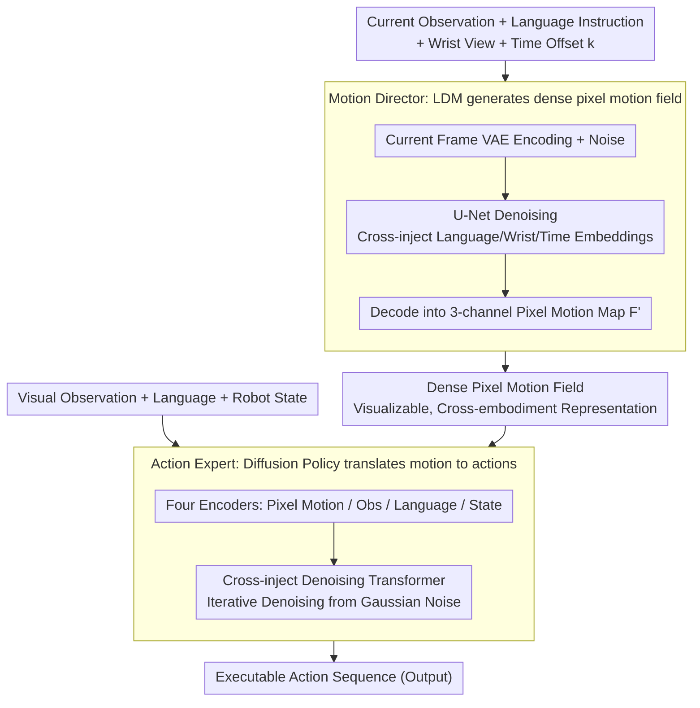

# DAWN: Pixel Motion Diffusion is What We Need for Robot Control

**Conference**: CVPR 2026  
**arXiv**: [2509.22652](https://arxiv.org/abs/2509.22652)  
**Code**: [https://eronguyen.github.io/DAWN/](https://eronguyen.github.io/DAWN/)  
**Area**: Multi-modal VLM / Robot Control  
**Keywords**: Pixel motion diffusion, Vision-Language-Action, Robot manipulation, Two-stage diffusion, Optical flow representation  

## TL;DR
Proposes DAWN, a two-stage all-diffusion vision-language-action framework—Motion Director (Latent Diffusion Model) generates dense pixel motion fields as an interpretable intermediate representation, and Action Expert (Diffusion Transformer policy) converts pixel motion into executable robot actions; achieves SOTA on the CALVIN benchmark (average length 4.00) and demonstrates strong generalization in real-world single-arm/dual-arm manipulation.

## Background & Motivation
While Vision-Language-Action (VLA) models have achieved significant results, most directly map visual observations to actions, lacking explicit modeling of motion intent. Some approaches use video prediction as an intermediate step, but operating in RGB space increases learning difficulty. Although pixel trajectories have proven effective as motion representations, existing methods use sparse pixel tracking or indirectly extract motion from generated videos—which is less concise and efficient than directly predicting dense pixel motion.

## Core Problem
How to design a structured, interpretable, and efficient intermediate motion representation to bridge high-level language intent and low-level robot actions?

## Method

### Overall Architecture

DAWN aims to add a "visible" layer of motion intent to VLA, preventing the model from jumping from observation to action as a black box. It employs two-stage full diffusion: the Motion Director (Latent Diffusion Model, LDM) first paints a dense pixel motion field based on current observations and language instructions; the Action Expert (Diffusion Transformer policy) then translates this motion field, along with observations, language, and robot states, into executable action sequences. This intermediate dense pixel motion serves as the pivot for the entire method—it can be directly visualized and is not bound to specific robot configurations. Furthermore, both stages use RAFT optical flow as ground truth, allowing for decoupled parallel training and independent upgrades.

### Key Designs

**1. Motion Director: Generating Dense Pixel Motion Fields with Pre-trained LDM**

High-level motion planning is assigned to a U-Net based on a pre-trained Stable Diffusion: the current frame is encoded by a VAE and concatenated with noise as input. Language embeddings (CLIP text encoder), wrist-view embeddings (CLIP vision encoder), and a time offset $k$ are injected via cross-attention. The output is decoded into a 3-channel pixel motion map $F'_{t,k} = [u, v, (u+v)/2]$. During training, the ground truth is generated by a RAFT optical flow model. Only the U-Net is updated while all encoders and the VAE are frozen—maximizing the reuse of large-scale image generation pre-training capabilities without learning how to "draw" motion from scratch.

**2. Action Expert: A Diffusion Policy for Translating Motion to Action**

Low-level execution is a Transformer-based diffusion policy. Four encoders separately process pixel motion (DINOv3 ConvNeXt-S), visual observations, language instructions (T5-small), and robot states (2-layer MLP). All conditional tokens are concatenated and injected into a denoising Transformer via cross-attention to iteratively denoise Gaussian noise into an action sequence. Essentially, it answers the question: "Given that the scene should move this way, how should the robot joints move?"

**3. Why Dense Pixel Motion as an Intermediate Representation?**

Direct mapping from observation to action lacks explicit modeling of motion intent, while using RGB video prediction as an intermediate step requires difficult learning in pixel space. Dense pixel motion hits the sweet spot: it is more structured than RGB video prediction (directly encoding motion direction and magnitude), more information-dense than sparse pixel tracking (densely covering the entire scene), and can be directly visualized to show "how the model intends the scene to move" without depending on specific robot joint configurations. One representation simultaneously satisfies the requirements of being structured, interpretable, and cross-embodied.

**4. Modular and Parallel Training**

The Motion Director and Action Expert can be trained in parallel using RAFT optical flow as GT. Subsequently, the Action Expert can optionally be fine-tuned on the real outputs of the Motion Director. Thus, high-level and low-level components can be upgraded independently for rapid iteration without requiring end-to-end retraining every time.

### Loss & Training
- Both models use MSE noise estimation loss.
- Motion Director: 100k steps, batch=16/GPU, 4×A6000.
- Action Expert: 10k steps, batch=64/GPU.
- AdamW lr=1e-4, mixed-precision training.
- Inference: 25-step diffusion for Motion Director.

## Key Experimental Results

### main Results: CALVIN ABC→D (No external data)

| Method | 1st ↑ | 2nd ↑ | 3rd ↑ | 4th ↑ | 5th ↑ | Avg Len ↑ |
|------|-------|-------|-------|-------|-------|-----------|
| Diffusion Policy | 0.40 | 0.12 | 0.03 | 0.01 | 0.00 | 0.56 |
| MoDE | 0.92 | 0.79 | 0.67 | 0.56 | 0.45 | 3.39 |
| Seer-Large | 0.96 | 0.89 | 0.80 | 0.71 | 0.60 | 3.96 |
| **Ours (DAWN)** | **0.97** | **0.89** | **0.82** | **0.72** | **0.60** | **4.00** |

### main Results: MetaWorld (11 tasks)

| Method | Average Success Rate ↑ |
|------|------------|
| LTM | 57.7% |
| ATM | 52.0% |
| **Ours (DAWN)** | **65.4%** |

### Real-world Single-arm Manipulation (xArm7, 1000 episodes, 6 object types)

| Method | Overall Success Rate | Inference Latency |
|------|----------|---------|
| Enhanced DP | Lower | 112.77ms |
| $\pi_0$ | Moderate (Often wrong object) | 571.89ms |
| VPP | High | 190.55ms |
| **Ours (DAWN)** | **Highest** | 319.82ms |

Ours achieves the highest success rate across nearly all object categories with extremely low mis-grasping rates.

### Ablation Study

- **Pixel Motion vs. RGB Goal**: Pixel motion (4.00) >> RGB goal image (3.21) >> No intermediate representation (2.78).
- **Pre-training vs. Training from Scratch**: Pixel motion from pre-trained LDM (4.00) > Training from scratch (3.42)—pre-trained image generation models significantly aid pixel motion prediction.
- **Wrist View**: Performance drops to 3.74 after removing the wrist view (loss of occlusion and hand-object interaction information).
- **Diffusion Steps**: 2 steps (3.88) → 25 steps (4.00) → 40 steps (3.95); 25 steps is optimal.
- **Dual-arm Manipulation**: Pixel motion similarly reduces action prediction MSE in dual-arm scenarios.

## Highlights & Insights
- **Dense Pixel Motion as a General Motion Representation**: Cleaner than RGB prediction, richer than sparse trajectories, and more universal than keypoints.
- **First Adaptation of Pre-trained LDM for Dense Pixel Motion Generation**: Fully leverages the capabilities of large-scale image generation pre-training.
- **Modular Interpretability**: The output of the Motion Director can be directly visualized, providing transparent understanding of the model's decisions.
- **Data Efficiency**: Strong generalization is achieved with only 1000 real-world episodes, reflecting the advantages of structured intermediate representations.
- **Dual-arm Extension**: The universality of the method is validated on the Galaxea R1-Lite dual-arm platform.

## Limitations & Future Work
- Inference latency is relatively high (319ms vs 113ms for Enhanced DP) due to the two-stage diffusion.
- RAFT-dependent optical flow GT for the Motion Director may be inaccurate in textureless or fast-moving scenes.
- Performance with external data (DROID) is better than without but does not reach the peak levels of VPP or DreamVLA.
- Currently supports surface manipulation tasks; contact-rich tasks (e.g., assembly) have not been validated.

## Related Work & Insights
- **vs. VLA (OpenVLA, RT-2, $\pi_0$)**: VLAs use end-to-end mapping and lack interpretable intermediate representations; DAWN provides transparent motion planning via pixel motion.
- **vs. Gen2Act (Video Prediction → Motion Extraction)**: Gen2Act generates RGB video first and then tracks pixels to extract motion, leading to two-step chained errors; DAWN predicts motion directly in latent space.
- **vs. VPP (Video Diffusion Features)**: VPP uses video diffusion models to extract predictive features without explicitly generating motion; DAWN's motion field is more interpretable and advantageous in small-data scenarios.

## Related Papers
- Pixel motion as a general intermediate representation for robot control can be combined with VLM visual reasoning—enabling VLMs to understand and generate motion intent.
- Successful adaptation of pre-trained image diffusion models to pixel motion prediction suggests more LDM application possibilities for non-RGB outputs.
- Modular design allows for independent upgrades of high-level and low-level components, suitable for rapid iteration.

## Rating
- Novelty: ⭐⭐⭐⭐ Dense pixel motion as a unified intermediate representation + dual diffusion architecture is an effective new design.
- Experimental Thoroughness: ⭐⭐⭐⭐⭐ CALVIN + MetaWorld + Real single-arm + Real dual-arm, complete ablation.
- Writing Quality: ⭐⭐⭐⭐ Clear structure and detailed method description.
- Value: ⭐⭐⭐⭐ Provides a concise and effective structured intermediate representation for robot learning.

<!-- RELATED:START -->

## Related Papers

- [\[CVPR 2026\] Iterative Closed-Loop Motion Synthesis for Scaling the Capabilities of Humanoid Control](iterative_closed-loop_motion_synthesis_for_scaling_the_capabilities_of_humanoid_.md)
- [\[CVPR 2026\] StaMo: Unsupervised Learning of Generalizable Robot Motion from Compact State Representation](stamo_unsupervised_learning_of_generalizable_robot_motion_from_compact_state_rep.md)
- [\[CVPR 2026\] CoMo: Learning Continuous Latent Motion from Internet Videos for Scalable Robot Learning](como_learning_continuous_latent_motion_from_internet_videos_for_scalable_robot_l.md)
- [\[CVPR 2026\] DynBridge: Bridging Imagination and Control through Interaction Dynamics for Robot Manipulation](dynbridge_bridging_imagination_and_control_through_interaction_dynamics_for_robo.md)
- [\[CVPR 2026\] Rethinking Visual Rearrangement from A Diffusion Perspective](rethinking_visual_rearrangement_from_a_diffusion_perspective.md)

<!-- RELATED:END -->
