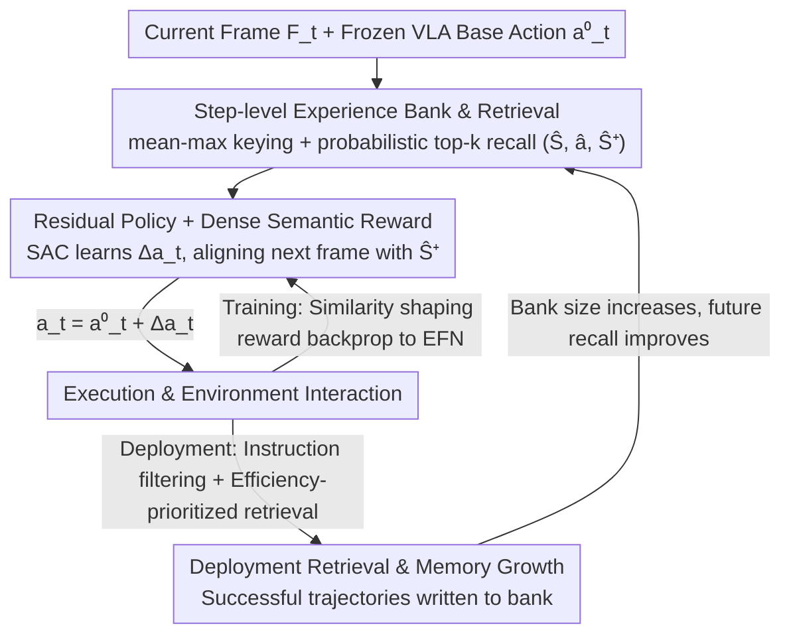

# Dejavu: Towards Experience Feedback Learning for Embodied Intelligence

**Conference**: CVPR 2026  
**Paper**: [CVF Open Access](https://openaccess.thecvf.com/content/CVPR2026/html/Wu_Dejavu_Towards_Experience_Feedback_Learning_for_Embodied_Intelligence_CVPR_2026_paper.html)  
**Code**: Project Page https://dejavu2025.github.io/  
**Area**: Embodied Intelligence / Robotics  
**Keywords**: VLA, Experience Replay Retrieval, Residual Policy, Post-deployment Learning, Soft Actor-Critic  

## TL;DR
An Experience Feedback Network (EFN) is attached to a **frozen VLA policy**. It retrieves semantically similar historical trajectories from an "experience bank" that grows continuously during deployment. Using reinforcement learning, it predicts a **residual correction** added to the original action. This allows robots to improve through "accumulating and invoking memory" without updating any backbone weights. Success rates for LIBERO long tasks increased from 53.7% to 76.5%, and average real-world success rates improved from 25.8% to 70.2%.

## Background & Motivation

**Background**: Unified Vision-Language-Action (VLA) models, trained on large-scale offline data, can perform manipulation tasks with cross-task generalization. However, once deployed, these models have frozen weights—they essentially "stop learning" in real environments unless expensive fine-tuning is conducted on newly collected data.

**Limitations of Prior Work**: When facing new problems, humans do not rewrite core knowledge in the brain but rather **recall and reuse past experiences** (the episodic memory mechanism behind "déjà vu"). Existing VLAs lack this capability; improvement requires weight modification. Existing "retrieval-augmented RL / retrieval-augmented embodied agent" methods mostly: (i) still require continuous updates to the weights of a **trainable** policy during deployment; (ii) retrieve from **static offline corpora** rather than a living memory bank that grows with deployment; (iii) perform retrieval on compressed state/task abstractions instead of the rich, open-vocabulary vision-language interfaces used by modern VLAs.

**Key Challenge**: Enabling an **already strong but flawed frozen policy** to improve continuously after deployment without modifying its massive backbone—a mechanism for "plug-and-play deployment-time improvement through memory growth" is missing.

**Goal**: Design an external module that allows a frozen VLA to: (a) store successfully executed trajectories in a growing experience bank, (b) retrieve experiences related to the current context online, and (c) correct the current action accordingly, all with **zero gradient updates to the backbone**.

**Key Insight**: The authors treat the VLA as a "frozen backbone" and delegate improvements to a lightweight external controller—a residual policy. The key observation is that a good correction does not require relearning an action but only a small, experience-guided offset to the original action. "Which way to offset" can be defined as "making the next frame look like the successor frame in the retrieved experience," effectively converting sparse success/failure feedback into dense similarity-based shaping signals.

**Core Idea**: Replace fine-tuning of the backbone with "retrieving a similar experience → predicting a residual action → aligning the result with the successor state of the experience," achieving self-improvement post-deployment through memory growth rather than weight updates.

## Method

### Overall Architecture

The Experience Feedback Network (EFN) wraps a frozen VLA and consists of three components: **Experience Bank Design** (how to store and retrieve), **Residual Policy Learning** (how to train the correction via RL), and **Deployment Retrieval & Experience Growth** (how to invoke memory and insert new successful trajectories during deployment). At each control step $t$, the system takes current visual features $F_t$ and the base action $a^{(0)}_t$ provided by the frozen VLA to retrieve a matching experience step $(\hat F, \hat a, \hat F^+)$ from the experience bank. The EFN outputs a residual $\Delta a_t$, resulting in the final executed action $a_t = a^{(0)}_t + \Delta a_t$. During the training phase, Soft Actor-Critic (SAC) with a dense semantic similarity reward is used to learn this residual; during deployment, all weights (VLA and EFN) are frozen, and the adaptation capability stems **entirely from the growth and recall of the memory bank**.

### Key Designs

**1. Step-level Experience Bank + mean-max keying + probabilistic top-k retrieval: Converting "rich vision-language interfaces" into retrievable memory**

Existing retrieval-augmented methods retrieve on compressed state abstractions, which are insufficient for the token-level rich representation of VLAs. EFN organizes experiences as full rollouts $\tau=(s_1,a_1,\dots,s_T,a_T)$ and stores every step $(s_t,a_t)$ where an action was executed. Each rollout also stores a fixed instruction embedding $\ell_\tau$ (encoded at the start of the episode using the VLA's language model). At the step level, three items are stored: VLA vision encoder features $F_t\in\mathbb{R}^{L\times C}$, a compact key vector $k_t$ for retrieval, and the original base action $a^{(0)}_t$.

Key construction uses **mean-max fusion + per-token $L_2$ normalization**: each token feature is channel-normalized, then the mean and max are taken along the token dimension and individually normalized to get $m_t, x_t$. These are finally averaged and normalized:

$$k_t = \frac{\tfrac12 m_t + \tfrac12 x_t}{\left\lVert \tfrac12 m_t + \tfrac12 x_t \right\rVert_2 + \varepsilon}\in\mathbb{R}^{d_k}.$$

During retrieval, a query $q_t$ is formed using the same fusion. Cosine similarity $s_i=\cos(q_t,k_i)$ is calculated for all keys to find the top-$k$, followed by **sampling one entry** via similarity-biased softmax: $p(i\mid q_t)=\exp(s_i/\tau)/\sum_{j\in N_k}\exp(s_j/\tau)$. This "retrieve then sample" approach maintains exploration within neighbors while favoring semantically similar experiences. Mean captures global semantics while max captures salient local cues; fusion creates compact local neighborhoods in visual space, ensuring retrieval is relevant without overfitting to a single memory.

**2. Residual Policy + Dense Semantic Matching Reward: Converting sparse signals into dense signals by "making the next frame like the experience's successor frame"**

Directly copying nearest-neighbor actions (kNN-RAG) is fragile, while pure residuals (ResAct) learn slowly without episodic context. The EFN actor outputs only a residual $\Delta a_t$, and the executed action is $a_t=a^{(0)}_t+\Delta a_t$. $a^{(0)}_t$ maintains the base capability, while $\Delta a_t$ provides a small correction modulated by retrieved experience.

The core is the **dense semantic matching reward**: after executing $a_t$, the environment returns $s_{t+1}$. Its semantic similarity to the successor frame $\hat F^+$ of the retrieved experience is calculated: $r^{\mathrm{sem}}_t=\cos\big(u(F_{t+1}),u(\hat F^+)\big)$, where $u(\cdot)$ is the mean-max fusion. This guides the agent to "approach the next step of a successful experience." Since the reward relies on feature similarity rather than success/failure flags, **both successful and failed trajectories can be used for training** (as long as they contain meaningful transitions). A residual magnitude regularization $r_t=\lambda_{\mathrm{sem}}r^{\mathrm{sem}}_t-\lambda_{\mathrm{res}}\lVert\Delta a_t\rVert_2^2$ is added to prevent deviating too far from the base behavior.

Training uses SAC: current and retrieval contexts are encoded as $c_t=\mathrm{enc}(F_t,a^{(0)}_t,\hat F,\hat a, \ell)$. The residual policy is $\pi_\phi(\Delta a_t\mid c_t)$, with two Q-networks evaluating the corrected action. SAC's entropy regularization and off-policy efficiency are well-suited for repeatedly reusing experiences from the bank.

Furthermore, the reward is **anti-idling shaped**: defining $s^{\mathrm{next}}_t=\mathrm{sim}(F_{t+1},\hat F^+)$, $s^{\mathrm{cur}}_t=\mathrm{sim}(F_t,\hat F)$, and $s^{\mathrm{stay}}_t=\mathrm{sim}(F_{t+1},F_t)$, the progress term $p_t=s^{\mathrm{next}}_t-s^{\mathrm{cur}}_t$ and motion term $m_t=1-s^{\mathrm{stay}}_t$ are used to form the final reward:

$$r_t = w_{\mathrm{abs}}s^{\mathrm{next}}_t + w_{\mathrm{prog}}[p_t]_+ + w_{\mathrm{mot}}m_t - w_{\mathrm{lazy}}\big(s^{\mathrm{next}}_t\, n_t\, s^{\mathrm{stay}}_t\big) - \lambda_{\mathrm{time}}.$$

This rewards progress toward the successor state ($[p_t]_+$), encourages non-trivial motion ($m_t$), and penalizes "staying at a good viewpoint without progress" to prevent degenerate idling behavior.

**3. Deployment Retrieval & Online Experience Growth: Instruction filtering + efficiency priority + success-only writeback**

Retrieving across the entire bank without task distinction during deployment can recall irrelevant memories. EFN's deployment pipeline differs in three ways: First, **Instruction Filtering**: the current task description is encoded into $\ell^\star$ to select the top-$n$ rollouts based on cosine similarity $R_n=\mathrm{Top}\text{-}n\{\cos(\ell^\star,\ell_{\tau_j})\}$. Only steps from these rollouts enter the candidate pool $C$.

Second, **Efficiency Priority**: a length prior is added to the similarity: $\tilde s_i=\lambda s_i+(1-\lambda)g(L_{\rho(i)})$, where $g(L)=\exp[-\beta L/\bar L]$ decreases with rollout length. This favors memories from shorter/more efficient trajectories. Third, **Online Growth**: after each episode, the rollout is written to the bank, but **only successful trajectories are added during deployment** (whereas training can tolerate near-success or failure). This ensures future retrieval is based on high-quality references. As the bank grows, retrieval becomes more accurate, enabling adaptation without weight updates.

### Loss & Training
- **Critic**: $\mathcal{L}_{\mathrm{critic}}=\sum_{i=1,2}\mathbb{E}\big[(Q_{\theta_i}(c_t,a^{(0)}_t+\Delta a_t)-y_t)^2\big]$, where $y_t=r_t+\gamma\,\mathbb{E}[\min_i Q_{\bar\theta_i}(c_{t+1},a^{(0)}_{t+1}+\Delta a_{t+1})-\alpha\log\pi_\phi(\Delta a_{t+1}\mid c_{t+1})]$.
- **Actor**: Minimizes the entropy-regularized objective $\mathcal{L}_{\mathrm{actor}}=\mathbb{E}[\alpha\log\pi_\phi(\Delta a_t\mid c_t)-\min_i Q_{\theta_i}(c_t,a^{(0)}_t+\Delta a_t)]$.
- When integrated with UniVLA, residuals are predicted in the **latent action space**, added to the base latent action, and decoded by the frozen action head.

## Key Experimental Results

### Main Results

On the LIBERO benchmark, EFN was attached to three frozen backbones: OpenVLA, UniVLA, and GO-1. It was compared against four types of baselines: kNN-RAG (retrieval only), ResAct (residual only), R2A (retrieval-augmented RL updating backbone), and GC-TTT (test-time training updating backbone). Success rates (%) and average steps (lower is better) are reported.

| Backbone / Method | Spatial Succ↑ | Object Succ↑ | Goal Succ↑ | Long Succ↑ | Avg Succ↑ | Avg Steps↓ |
|------|------|------|------|------|------|------|
| OpenVLA (Frozen) | 84.7 | 88.4 | 79.2 | 53.7 | 76.5 | 160.2 |
| +R2A (Updates backbone) | 87.5 | 91.1 | 84.6 | 63.2 | 81.6 | 156.3 |
| +EFN (Vol=300) | 88.5 | 91.3 | 85.7 | 72.1 | 84.4 | 160.0 |
| +EFN (Vol=1000) | **89.9** | **92.2** | **89.2** | **76.5** | **87.0** | 156.7 |
| UniVLA (Frozen) | 96.5 | 96.8 | 95.6 | 92.0 | 95.2 | 164.2 |
| +EFN (Vol=1000) | **98.2** | **98.2** | **97.6** | **94.6** | **97.2** | **151.3** |
| GO-1 (Frozen) | 96.3 | 97.4 | 95.6 | 89.3 | 94.7 | 163.1 |
| +EFN (Vol=1000) | **98.1** | **98.5** | **97.3** | **92.8** | **96.7** | **154.8** |

The most significant improvement occurs in **long tasks (Long)**: success on OpenVLA jumped from 53.7% to 76.5% (+22.8pt), outperforming R2A (63.2%) without backbone updates.

Real-world results (AgiBot-G1 + GO-1) show even larger gaps:

| Method | BottlePlace Succ↑ | ShelfSort Succ↑ | StockLift Succ↑ | DrawerStore Succ↑ | Avg Succ↑ | Avg Steps↓ |
|------|------|------|------|------|------|------|
| GO-1 (Frozen) | 47.3 | 34.0 | 16.0 | 5.3 | 25.8 | 491.8 |
| +R2A (Updates backbone) | 61.3 | 51.3 | 31.3 | 14.0 | 39.5 | 469.1 |
| +EFN (Vol=300) | 69.3 | 54.7 | 42.0 | 37.3 | 50.8 | 454.1 |
| +EFN (Vol=1000) | **82.0** | **74.7** | **65.3** | **58.7** | **70.2** | **435.1** |

On the most difficult task, DrawerStore, frozen GO-1 scored 5.3%, while EFN(Vol=1000) reached 58.7%. Per-step latency increased by only +4.2%, but total episode time decreased by -7.9% due to fewer steps needed.

### Ablation Study

| Configuration | Impact | Description |
|------|------|------|
| Full (Complete EFN) | — | Best success rate and efficiency |
| w/o SAC | Drop in success and efficiency | Replacing with pure value critic loses entropy-based exploration |
| w/o dense (No similarity reward) | Slower learning, worse final performance | Sparse rewards lack frequent shaping signals |
| w/o instr (No instruction filtering) | Performance drop | Retrieval pool contaminated with irrelevant task memories |
| w/o anti-idle (No anti-idling terms) | Performance drop | Degenerate behavior of "idling at good viewpoints" emerges |

### Key Findings
- **Retrieval-only is detrimental**: kNN-RAG often performed worse than the base model, suggesting direct copying is fragile and requires residual correction.
- **Backbone updates are not cost-effective**: R2A and GC-TTT require weight updates; GC-TTT even degraded on non-i.i.d. rollouts. EFN outperformed them under the same budget without updates.
- **Dense semantic rewards are the engine**: Removing them significantly slows down learning.
- **Diminishing returns for bank capacity**: The gap between Vol=300 and Vol=1000 was smaller in real experiments, suggesting medium-sized banks cover most task variations.

## Highlights & Insights
- **Shifting "Post-deployment Learning" from weights to memory**: EFN is (according to the authors) the first post-deployment learning framework for frozen VLAs that adapts via experience accumulation and residual correction—a paradigm applicable whenever 
there is a strong but frozen base model.
- **"Successor frame similarity" as dense reward**: Converting sparse success signals into "how much the next frame resembles the successful next frame" provides dense supervision and allows learning from failed trajectories.
- **Residuals over replacement**: Latent space visualizations show EFN makes small offsets, preserving base capabilities while correcting errors.
- **Anti-idling reward terms**: A practical trick to prevent agents from exploiting similarity rewards by staying stationary, using $s^{\mathrm{next}}/s^{\mathrm{cur}}/s^{\mathrm{stay}}$ to balance progress and motion.

## Limitations & Future Work
- **Dependency on initial bank quality**: Since it relies on "retrieval + reuse," the gains are limited if the bank contains no relevant experiences for a completely new task.
- **Proxy risk of similarity rewards**: The reward is based entirely on feature similarity; "looking more like the successor frame" does not always equate to task success.
- **Comparison caveat**: R2A/GC-TTT follow the "update backbone" paradigm, while EFN follows "frozen backbone"; comparisons should consider whether weights are modified and the interaction budget.
- **Management of memory**: Strategies for reservoir sampling or forgetting under budget constraints were not explored in depth for long-term deployment.

## Related Work & Insights
- **vs Retrieval-augmented RL (e.g., R2A)**: These update the trainable policy weights and use static offline retrieval; EFN uses a **frozen backbone**, **living memory**, and retrieves on VLA visual-language interfaces.
- **vs Residual Policy Learning (e.g., ResAct)**: EFN adds situational retrieval contexts and dense similarity-shaping rewards, leading to more stable improvements.
- **vs Test-time Training (GC-TTT)**: GC-TTT can be unstable or degrade during online updates; EFN is more robust as it does not update weights.

## Rating
- Novelty: ⭐⭐⭐⭐ The combination of "frozen VLA + living bank + retrieval-conditioned residual" is new for post-deployment learning.
- Experimental Thoroughness: ⭐⭐⭐⭐ Extensive benchmarks across models, simulation tasks, and real-world robots.
- Writing Quality: ⭐⭐⭐⭐ Clear methodological partitioning; reward shaping logic is well-explained.
- Value: ⭐⭐⭐⭐ Provides a clean framework for online improvement without backbone updates, highly practical for real-world robotics.

<!-- RELATED:START -->

## Related Papers

- [\[CVPR 2026\] AT-VLA: Adaptive Tactile Injection for Enhanced Feedback Reaction in Vision-Language-Action Models](at-vla_adaptive_tactile_injection_for_enhanced_feedback_reaction_in_vision-langu.md)
- [\[ICML 2026\] Plan in Sandbox, Navigate in Open Worlds: Learning Physics-Grounded Abstracted Experience for Embodied Navigation](../../ICML2026/robotics/plan_in_sandbox_navigate_in_open_worlds_learning_physics-grounded_abstracted_exp.md)
- [\[CVPR 2026\] Test-Time Perturbation Tuning with Delayed Feedback for Vision-Language-Action Models](test-time_perturbation_tuning_with_delayed_feedback_for_vision-language-action_m.md)
- [\[CVPR 2026\] TrajRAG: Retrieving Geometric-Semantic Experience for Zero-Shot Object Navigation](trajrag_retrieving_geometric-semantic_experience_for_zero-shot_object_navigation.md)
- [\[AAAI 2026\] Towards Reinforcement Learning from Neural Feedback: Mapping fNIRS Signals to Agent Performance](../../AAAI2026/robotics/towards_reinforcement_learning_from_neural_feedback_mapping_.md)

<!-- RELATED:END -->
