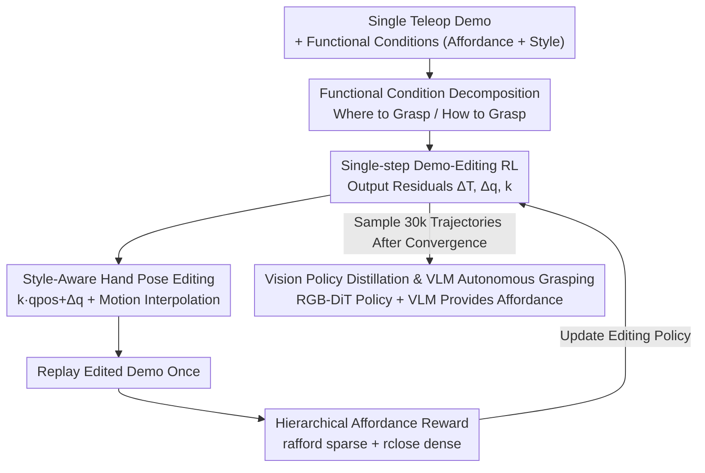

# DemoFunGrasp: Universal Dexterous Functional Grasping via Demonstration-Editing Reinforcement Learning

**Conference**: CVPR 2026  
**Paper**: [CVF Open Access](https://openaccess.thecvf.com/content/CVPR2026/html/Mao_DemoFunGrasp_Universal_Dexterous_Functional_Grasping_via_Demonstration-Editing_Reinforcement_Learning_CVPR_2026_paper.html)  
**Code**: See the project page in the paper (GitHub was not provided in the CVF version, ⚠️ refer to the official project page)  
**Area**: Robotics / Embodied AI (Dexterous Functional Grasping)  
**Keywords**: Functional Grasping, Dexterous Hands, Reinforcement Learning, Demonstration Editing, Sim-to-Real

## TL;DR
This work decomposes "functional grasping" into two conditions: affordance (where to grasp) and grasping style (how to grasp). By employing "Single-step Demonstration-Editing RL"—which collects only one demonstration and requires the policy to output residual corrections—it bypasses the multi-step, multi-task exploration challenges of high-DOF dexterous hands. A universal functional grasping policy is trained on 3,200 objects and achieves zero-shot transfer to real-world robots (64.4% success rate under VLM guidance).

## Background & Motivation
**Background**: In recent years, dexterous hand grasping has achieved significant stability and generalization through large-scale simulation RL, enabling closed-loop, adaptive tabletop grasping. However, most existing methods prioritize "grasp stability" (mechanical stability) over "functional appropriateness."

**Limitations of Prior Work**: Downstream tasks (using a spray bottle, holding a hammer handle, or gripping a cup handle) require **functional grasping**—grasping the correct functional area with a hand pose suited for the intended use. Current functional grasping approaches suffer from two main issues: (1) Generative methods (synthesizing human hand poses or learning from human data) rely heavily on manual supervision and high-quality data, often resulting in open-loop planning that is brittle during execution. (2) RL approaches provide closed-loop control, but the extremely high-dimensional action space of dexterous hands, combined with the multi-task optimization required for diverse objects and styles, leads to an explosion in the exploration space and suboptimal performance.

**Key Challenge**: Functional grasping is essentially a **multi-step, multi-task, high-dimensional** RL problem. It requires long-sequence exploration across a massive combination of objects $\times$ styles $\times$ affordances. Standard multi-step RL suffers from low sampling efficiency and unstable optimization in this setting.

**Goal**: To develop a unified policy covering arbitrary objects, affordances, and styles, capable of zero-shot sim-to-real transfer.

**Key Insight**: The authors observe that the success and functional precision of a grasp can be optimized efficiently by **performing residual editing on a single high-quality demonstration**, rather than synthesizing the entire motion from scratch.

**Core Idea**: Decompose functional conditions into affordance and style to be injected into the observation, reward, and action spaces. Rewrite RL as "one-step editing of a single demonstration," compressing high-dimensional multi-step RL into single-step residual refinement.

## Method

### Overall Architecture
The input to DemoFunGrasp consists of a teleoperated demonstration, a target object (point cloud + pose), and a set of functional conditions (affordance points + style category). The output is a policy that performs closed-loop functional grasping. The pipeline consists of four steps: first, the demonstration is **edited** based on object geometry and target style to create a new trajectory; a functional-condition-aware **single-step RL** is used to train this editing policy; the state-based policy is then **distilled** into a vision-only (RGB) policy for transfer; finally, a **VLM** provides affordance points on the real robot for autonomous language-guided grasping.

The key is modeling the RL problem as a **single-step MDP**: the policy only observes $(s_r, s_o, x_o, p_{\text{afford}}, l_{\text{style}})$ (robot end-effector 6D pose, object pose, full point cloud, 3D affordance point, and style one-hot) and outputs an action $a=(\Delta T, \Delta q, k)$. After editing the demonstration once, the entire trajectory is replayed, using the reward as the sole learning signal.

### Key Designs

**1. Functional Condition Decomposition: Decoupling "Where" and "How"**

Specifying targets and rewards for functional grasping was previously difficult because "functional grasp" was an ambiguous holistic concept. The authors break it into two complementary components: **affordance** $p_{\text{afford}}\in\mathbb{R}^3$, which specifies the functional region to contact (handle, cap edge—where to grasp), and **grasping style** $l_{\text{style}}$, a one-hot vector specifying the reference hand pose category (how to grasp). Together, they describe the functional intent. The value of this decomposition is that it turns "goal specification" into two variables that can be independently sampled in parallel simulations, allowing a single policy to learn the entire object $\times$ affordance $\times$ style space.

**2. Single-step Demo-Editing RL: Compressing Exploration into Residual Correction**

This is the core of the paper, addressing the exploration explosion in multi-step multi-task RL. A demonstration is recorded as a continuous trajectory $D=\{(p^{\text{ee-obj}}_t, q^{\text{ref-hand}}_t)\}_{t=0}^{T_D}$, representing the target end-effector trajectory and joint sequence in the object frame. Unlike traditional static "pre-grasp/grasp/post-grasp" data, the authors preserve **continuous time evolution** (finger closing timing, compliant micro-adjustments during contact), allowing one-step editing to produce physically plausible interpolations. The policy predicts $\{\Delta T, \Delta q, k\}$ as residual corrections: $\Delta T$ modifies the end-effector pose (the "where"), while $\Delta q$ and the scaling factor $k$ adjust the hand shape (the "how"). Since the edited trajectory is executed once and trained via RL, the task becomes a solvable refinement problem rather than full motion synthesis.

**3. Style-Aware Geometric Hand Pose Editing: Generalizing to Unseen Geometries**

Grasping feasibility is sensitive to local geometry. To adapt a single demonstration to different objects, the authors make the residual scaling and joint adjustment $(k, \Delta q)$ adaptive to the sampled object geometry $x_o$. The target hand pose is defined as $q^*_{\text{pos}} = k\cdot q_{\text{pos}} + \Delta q$, where $q_{\text{pos}}$ is the standard joint configuration for that style. To balance success rate and style intent, a style reward is designed:
$$r_{q_{\text{pos}}} = \exp\!\left(-\lVert q_{\text{pos}} - q^*_{\text{pos}}\rVert_2\right).$$
Motion interpolation is performed using a fraction coefficient $f = \dfrac{q^*_{\text{pos}} - q^{\text{ref}}_0}{q^{\text{ref}}_{T_l} - q^{\text{ref}}_0}$ to ensure smooth trajectories and temporal consistency.

**4. Hierarchical Affordance Reward: Guiding Policies with Sparse and Dense Signals**

Relying solely on "grasp success" rewards causes policies to revert to the most stable zones rather than functional ones. The authors estimate an affordance likelihood distribution using surface normals and coordinate alignment, sampling one candidate per episode. They use a hierarchical reward: a sparse proximity term
$$r_{\text{afford}} = \mathbb{I}(\text{success})\,\mathbb{I}\!\left(d_{T-1} < \tfrac{\text{obj}_{bb}}{\gamma}\right)\exp(-d_{T-1}),\qquad r_{\text{close}} = \mathbb{I}\!\left(d^{\min}_{0:T-1} < \text{threshold}\right),$$
where $\text{obj}_{bb}$ is the longest side of the object bounding box and $\gamma$ is a hyperparameter. **Object scale normalization** via $\text{obj}_{bb}$ is a key trick—ensuring that large objects are not penalized for larger absolute distances. The total reward $r = \lambda_{\text{afford}} r_{\text{afford}} + \lambda_{\text{close}} r_{\text{close}} + \lambda_{q_{\text{pos}}} r_{q_{\text{pos}}} + r_{\text{success}}$ uses $r_{\text{close}}$ to pull the hand toward the affordance region early on and $r_{\text{afford}}$ for fine alignment later.

**5. Vision Policy Distillation and VLM Deployment: From State to Zero-Shot Real World**

The state-based policy is distilled into a pure RGB vision policy by sampling 30k successful trajectories with heavy domain randomization (textures, lighting, camera extrinsics). The policy uses a **VLM encoder + DiT** architecture. For deployment, an external VLM (Embodied-R1) performs Object Functional Grounding, automatically generating affordance points from language instructions, with DemoFunGrasp acting as the low-level executor.

## Key Experimental Results

Training was conducted in IsaacGym using PPO. The state policy was trained on YCB + DexGraspNet (3,200 objects). Evaluation metrics included GSR (Grasp Success Rate), SAD (Success Affordance Distance), SD (Style Diversity), and SA (Style Accuracy).

### Main Results

Affordance Alignment (SAD in cm, lower is better):

| Model | Train | Seen Cat. | Unseen Cat. |
|------|------|------|------|
| DemoGrasp | 6.29 | 6.27 | 6.20 |
| **Ours** | **3.03** | **3.02** | **3.21** |

The affordance distance is reduced by **over 3 cm** compared to DemoGrasp across all categories.

Success Rate and Style Diversity vs. UniDexGrasp:

| Method | Seen GSR↑ | Seen SD↑ | Unseen GSR↑ | Unseen SD↑ |
|------|------|------|------|------|
| UniDexGrasp | 74.3 | 1.00 | 70.8 | 1.00 |
| **Ours** | **76.26** | **1.48** | **71.65** | **1.44** |

Ours achieves approximately **1.5$\times$** the style diversity of UniDexGrasp while maintaining or slightly improving the success rate.

### Ablation Study

Ablation results on the state policy (GSR↑ / SAD↓ / SA↑):

| Configuration | GSR↑ | SAD↓ | SA↑ | Description |
|------|------|------|------|------|
| DemoFunGrasp (Full) | 77.04 | 3.02 | 94.74 | — |
| w/o affordance reward | 78.28 | 4.60 | 95.02 | GSR rises slightly but SAD worsens |
| w/o obj size clipping | 81.67 | 3.63 | 93.28 | Alignment for large objects degrades |
| w/o close reward | 76.44 | 3.79 | 90.58 | Accuracy and style both decline |
| w/o qpos reward | 74.38 | 2.98 | 95.36 | Significant drop in GSR |
| w/o style disturbance | 58.67 | 3.61 | 100 | **GSR crashes to 58.67%** |

### Key Findings
- **Style disturbance is the lynchpin**: Removing it causes GSR to crash from 77% to 58.67%. Disturbance-based exploration ensures both robustness and diversity.
- **Affordance reward is a trade-off**: Removing it improves GSR (78.28) but significantly worsens SAD (4.60). This confirms that the reward successfully pulls the policy toward functional regions at a minor cost to raw success rate.
- **Object scale normalization** is critical for large objects; without it, SAD rises to 3.63.
- **Sim-to-Real**: The RGB policy achieves 81.2% GSR and 3.79 cm SAD in simulation. On the real robot, it achieves 71% success with manual affordances and 64% with VLM predictions.

## Highlights & Insights
- **Decomposition + One-step Editing**: This combination makes universal functional grasping trainable and transferable from a single demonstration.
- **Preserved Temporal Continuity**: Keeping the continuous demonstration instead of static fragments ensures physically plausible motion during interpolation.
- **Object-Scale Normalized Reward**: Balancing rewards across object sizes via bounding box normalization is a simple but effective trick for multi-object RL.

## Limitations & Future Work
- Perception issues: Small/thin objects (e.g., forks) cause camera occlusion, and VLM point prediction errors remain a bottleneck.
- The style set was empirically pruned (9/4 styles) for specific hands; adapting to new hands or tasks may require manual tuning.
- Comparison baselines are limited as few methods address the same "functional" scope; comparisons with general grasping policies like UniDexGrasp are approximate.

## Related Work & Insights
- **vs. DemoGrasp**: While both use demo-editing, DemoGrasp focuses on mechanical stability; Ours emphasizes functional precision, reducing SAD by over 3 cm.
- **vs. UniDexGrasp**: Ours provides 1.5$\times$ more style diversity and better generalization to unseen categories.
- **vs. Open-loop Generative Methods**: Ours offers closed-loop RL robustness, avoiding the brittleness of traditional optimization-based synthesis.

## Rating
- Novelty: ⭐⭐⭐⭐⭐ 
- Experimental Thoroughness: ⭐⭐⭐⭐½ 
- Writing Quality: ⭐⭐⭐⭐ 
- Value: ⭐⭐⭐⭐⭐ 

<!-- RELATED:START -->

## Related Papers

- [\[CVPR 2025\] DexGrasp Anything: Towards Universal Robotic Dexterous Grasping with Physics Awareness](../../CVPR2025/robotics/dexgrasp_anything_towards_universal_robotic_dexterous_grasping_with_physics_awar.md)
- [\[CVPR 2026\] General Process Reward Modeling for Robotic Reinforcement Learning](general_process_reward_modeling_for_robotic_reinforcement_learning.md)
- [\[CVPR 2026\] GeoDexGrasp: Geometry-aware Generation for Data-efficient and Physics-plausible Dexterous Grasping](geodexgrasp_geometry-aware_generation_for_data-efficient_and_physics-plausible_d.md)
- [\[CVPR 2026\] Towards Training-Free Scene Text Editing](towards_training-free_scene_text_editing.md)
- [\[CVPR 2026\] AdaDexTrack: Dynamic Modulation for Adaptive and Generalizable Dexterous Manipulation Tracking](adadextrack_dynamic_modulation_for_adaptive_and_generalizable_dexterous_manipula.md)

<!-- RELATED:END -->
