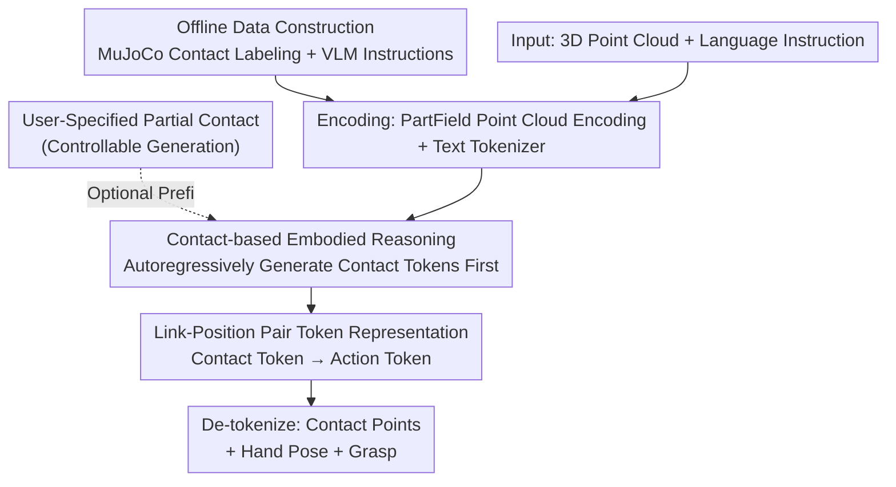

# DextER: Language-driven Dexterous Grasp Generation with Embodied Reasoning

**Conference**: CVPR 2026  
**arXiv**: [2601.16046](https://arxiv.org/abs/2601.16046)  
**Code**: https://junha-l.github.io/dexter (Project Homepage)  
**Area**: Robotics / Embodied AI / Dexterous Grasping / Vision-Language-Action  
**Keywords**: Dexterous Grasping, Embodied Reasoning, Contact Prediction, Autoregressive Generation, Controllable Generation

## TL;DR
DextER reformulates "language-driven multi-finger dexterous grasping" into an autoregressive sequence—the model first generates **contact tokens** (specifying which finger link contacts which 3D position on the object surface) and then generates grasp action tokens. By using "contact reasoning" as an intermediate step for an embodied Chain-of-Thought, the success rate on DexGYS is pushed to 67.14% (+3.83 p.p.), and the intent alignment metric P-FID improved by 96.4% relative to the Prev. SOTA.

## Background & Motivation
**Background**: Multi-finger dexterous hands have 20+ degrees of freedom (DoF). Achieving stable grasping that complies with task semantics is significantly harder than using parallel grippers. Recent mainstream approaches involve connecting Vision-Language Models (VLM) to dexterous grasping, fusing 3D geometry with language instructions to directly predict grasp parameters.

**Limitations of Prior Work**: Existing methods fall into two paradigms, each with significant drawbacks. Two-stage pipelines (using a VLM to find task-relevant regions/affordance first, then feeding them into an independent grasp generator) offer interpretable intermediate products, but semantic understanding and physical synthesis are **trained separately and do not learn from each other**. End-to-end methods (mapping multimodal inputs directly to grasp parameters) offer fast inference and implicit alignment but **lack explicit physical interaction reasoning**, making failures difficult to explain and the model hard to adapt to new tasks.

**Key Challenge**: Both paradigms overlook the most fundamental physical principle of dexterous grasping—grasp success depends on **where the hand is and how it contacts the object**. Directly mapping observations to grasp parameters discards the structural prior of "how a multi-fingered hand interacts with an object."

**Goal**: Find a suitable intermediate representation for "embodied Chain-of-Thought (CoT)" in dexterous grasping that bridges high-level task semantics ("grasp the handle of the cup") while being constrained by the robot embodiment and object geometry.

**Key Insight**: Embodied CoT has been proven effective in mobile manipulation and parallel grippers, but their intermediate representations (textual plans, bounding boxes, trajectories) are powerless regarding multi-finger contact geometry. The authors' key observation is: **the contact pattern itself is the intermediate representation that best fits dexterous manipulation**.

**Core Idea**: Use "predicting which finger links contact which 3D positions on the object surface" as a proprioceptive intermediate reasoning step. Grasp generation is factorized as $p(\mathbf{a},\mathcal{C}\mid\mathbf{P},\mathbf{T})=p(\mathcal{C}\mid\mathbf{P},\mathbf{T})\cdot p(\mathbf{a}\mid\mathcal{C},\mathbf{P},\mathbf{T})$—reasoning about contact first, then generating the grasp, all within a unified next-token prediction framework for autoregressive generation.

## Method

### Overall Architecture
Given a target object point cloud $\mathbf{P}\in\mathbb{R}^{N\times 3}$ and a language instruction $\mathbf{T}$ describing the desired grasp, the goal is to predict the dexterous hand's grasp pose $\mathbf{a}\in\mathbb{R}^{D}$ ($D$ is the DoF). DextER does not map inputs directly to grasp parameters; instead, it splits the prediction into two steps: "contact first, action second." Point clouds are encoded by PartField, and text is encoded by a tokenizer. These are concatenated and fed into an LLM backbone. The LLM **first autoregressively outputs contact tokens** (link-position pairs) and then outputs action tokens. Finally, these are de-tokenized into contact points, hand joint configurations, and grasp poses. The entire chain is a sequence generation problem where contact prediction acts as an interpretable intermediate reasoning step.

An offline branch exists for data construction: the MuJoCo physics engine is used to automatically label contacts for two grasp datasets, and VLMs provide language descriptions, providing supervision for the contact reasoning mentioned above. During inference, users can also insert partial contact constraints to let the model complete the remaining sequence, achieving controllable generation.

### Key Designs

**1. Contact-based Embodied Reasoning: Conceiving "which finger hits where" before generating the grasp**

To address the lack of physical reasoning in end-to-end parameter output, DextER explicitly factorizes generation into $p(\mathcal{C}\mid\mathbf{P},\mathbf{T})\cdot p(\mathbf{a}\mid\mathcal{C},\mathbf{P},\mathbf{T})$. The model must predict a contact set $\mathcal{C}$ before generating the full grasp $\mathbf{a}$. Contact is designed as an embodiment-aware intermediate representation—it connects task semantics (e.g., "grasp handle" corresponds to contact in the handle region) to physical constraints (where finger links can land and where the object surface is). To induce the model to perform this reasoning, a set of diverse meta-prompts (e.g., "Think step-by-step: first predict which links contact where, then predict the grasp pose") is prepended during training, with varied phrasing to prevent overfitting to fixed sentences. This step turns "contact reasoning" into an embodied CoT specific to dexterous manipulation. Ablations show that removing it (w/o ECoT) degrades P-FID from 0.20 to 0.30, success rate from 67.14% to 62.37%, and force closure quality $Q_1$ from 0.89 to 0.66, demonstrating that explicit contact reasoning improves both intent alignment and physical stability.

**2. Discrete Token Representation of Link-Position Pairs: Integrating contact and action into a unified vocabulary for autoregressive generation**

To run contact reasoning and grasp generation within the same next-token prediction framework, continuous values must be discretized. Contact is represented as a set of link-position pairs $\mathcal{C}=\{(l_i,\mathbf{p}_i)\}$, where $l_i$ is a hand link (e.g., thumb base `thbase`, index distal `ffdistal`) and $\mathbf{p}_i\in\mathbb{R}^3$ is a 3D contact position on the object surface. Position coordinates are normalized to a fixed bounding box and uniformly discretized into $N_{\text{pos}}=256$ bins per dimension. Each contact is encoded as a sequence $\langle l_i\rangle\langle p_{ix}\rangle\langle p_{iy}\rangle\langle p_{iz}\rangle$, delimited by `contact_start/end`. Grasp actions $\mathbf{a}$ (6D wrist pose + finger joint angles) are similarly discretized into $N_{\mathbf{a}}=256$ bins after 1%/99% quantile normalization, wrapped by `action_start/end`. All links, bins, and delimiters are registered as special tokens in a pre-trained tokenizer, expanding the vocabulary while preserving language understanding. Training also utilizes **mixed attention**: point cloud tokens use bidirectional attention to capture global geometric context, while language and action tokens use causal attention to maintain autoregressive generation.

**3. Contact Position Dropout and Controllable Generation: Training regularization unlocking fine-grained control**

To prevent the model from overfitting to fixed token patterns and to allow user intervention, the authors use a probability $p_{\text{drop}}$ during training to drop position tokens $\langle p_{ix}\rangle\langle p_{iy}\rangle\langle p_{iz}\rangle$ while keeping link tokens $\langle l_i\rangle$. This exposes the model to samples where "only the contacting links are known, but not the specific positions," forcing it to learn reasoning from various levels of detail. This benefits generalization: ablations show $p_{\text{drop}}=0.5$ yields the best results (w/o dropout P-FID is 0.22; $p_{\text{drop}}=1.0$ degrades to near w/o ECoT). More importantly, this "partial contact completion" capability naturally supports **controllable generation**—at inference, users provide a partially filled ECoT prefix (specifying 1-2 links and their contact positions), and the model completes the remaining contact and action tokens while respecting these constraints.

**4. Physics Engine Contact Labeling + VLM Instruction Generation: Automating large-scale contact supervision**

Contact reasoning requires large-scale labeling, which is costly for humans. The authors use the MuJoCo physics engine to automatically generate structured contact data: loading hand and object models, performing forward kinematics, and extracting contacts from the physics buffer. This yields two types of labels: contact anatomy (which finger links contact) and contact positions (3D coordinates on the surface). This is applied to the DexGYS and Dexonomy datasets. As Dexonomy lacks language descriptions, the authors supplement it using VLMs: each grasp is rendered from 5 views and fed into a VLM along with the contact anatomy to identify the object category, infer contacted functional parts (handle, rim), and generate grasp descriptions. These datasets are complementary—DexGYS provides scale and language, while Dexonomy provides structured grasp variations.

### Loss & Training
The model is trained end-to-end using standard next-token prediction. The sequence order is: point cloud tokens → task description → contact tokens → action tokens. The vision encoder uses a pre-trained PartField (based on 2D SAM mask contrastive learning for part segmentation), which is naturally part-geometry aware. The language backbone is initialized from Qwen2.5-0.5B. Triplane features from the PartField bottleneck are downsampled to 768 visual tokens with a 2-layer MLP projector. Training used a batch size of 64, 100K iterations, AdamW, 1e-4 learning rate with cosine decay, bfloat16 mixed precision, and gradient clipping at 1.0, taking approximately 48 hours on 8×A6000.

## Key Experimental Results

### Main Results
Evaluation on the DexGYS validation set (unseen objects) across intent consistency (P-FID / CD / Con.), physical quality (Success / $Q_1$ / Pen.), and diversity ($\delta_t/\delta_r/\delta_q$):

| Method | P-FID↓ | CD↓ | Success↑(%) | $Q_1$↑ | Pen.↓ | $\delta_q$↑ |
|------|--------|------|-------------|--------|-------|-------------|
| SceneDiffusers | 7.93 | 1.68 | 62.24 | 0.83 | 0.25 | 0.39 |
| DGTR | 15.77 | 2.90 | 51.91 | 0.78 | 0.16 | 4.30 |
| DexGYSNet (Prev. SOTA) | 5.60 | 1.20 | 63.31 | 0.83 | 0.22 | 6.12 |
| DextER (w/o ER) | 0.30 | 1.95 | 62.37 | 0.66 | 0.44 | 13.77 |
| **DextER** | **0.20** | **1.46** | **67.14** | **0.89** | 0.37 | **13.63** |

Success rate of 67.14% exceeds the Prev. SOTA DexGYSNet (63.31%) by +3.83 p.p. P-FID improved 96.4% (0.20 vs 5.60), and diversity $\delta_q$ is roughly double that of DexGYSNet, indicating coverage of broader grasp modalities rather than collapsing to dense GT modes.

### Ablation Study
Key insights from the DexGYS validation set:

| Configuration | P-FID↓ | Success↑(%) | Description |
|------|--------|-------------|------|
| Full (Default) | 0.20 | 67.14 | Complete model |
| w/o ECoT | 0.30 | 62.37 | No contact reasoning; P-FID +50%, Success -4.77 p.p. |
| $N_{\mathbf{a}}/N_{\text{pos}}=128$ | 0.21 | 66.19 | Coarse discretization hurts precision |
| $N_{\mathbf{a}}=512$ | 0.26 | 65.24 | Finer discretization increases vocabulary complexity |
| $p_{\text{drop}}=0.0$ | 0.22 | 65.68 | No dropout degrades generalization |
| $p_{\text{drop}}=1.0$ | 0.30 | 63.33 | Dropping all positions ≈ w/o ECoT |
| Uni3D Encoder | 0.52 | 59.07 | Non-part-aware encoder causes significant drops |
| Qwen2.5-1.5B | 0.18 | 67.55 | 3× larger model yields marginal gain |

### Key Findings
- **Embodied Reasoning (ECoT) is the primary contributor**: Removing it causes a 50% P-FID degradation and a nearly 5 p.p. drop in success rate, with $Q_1$ failing from 0.89 to 0.66. It simultaneously improves intent alignment and physical stability.
- **256 bins is the sweet spot**: Optimal for both action and position discretization.
- **PartField's part-awareness is crucial**: Replacing it with Uni3D spikes P-FID to 0.52 and success drops to 59.07%, as part-level features align naturally with "link-position" contact localization.
- **Performance stems from contact reasoning, not model scale**: Scaling to 1.5B only slightly increases success (67.14% to 67.55%), suggesting "thinking before acting" is more cost-effective than stacking parameters in embodied tasks.
- **Controllable Generation**: On Dexonomy, specifying more contact links improves quality—success rate starts at 10.40% with 1 link and rises to 21.35% with 5 links (baseline 12.24%).

## Highlights & Insights
- **Selecting "contact" as the intermediate representation for embodied CoT** is the most insightful contribution: while text or trajectories fail for multi-finger geometry, link-position pairs encode both "where to touch" (semantics) and "how to touch" (physics).
- **Dropout as a regularization tool naturally enables a controllable interface**: By training on "link-only" samples, user constraints are respected during inference, unifying robustness and interactive control.
- **Unified serialization offers strong transferability**: Discretizing contact, action, and language into the same vocabulary means any VLA task with an "intermediate physical state" can adopt this "reasoning then action" framework.
- **Small models + right representation beat large models**: A 0.5B backbone outperforms the SOTA via contact reasoning.

## Limitations & Future Work
- **Reliance on simulated contact labels**: Supervision comes from MuJoCo; sim-to-real gaps and object mesh quality affect accuracy. Real-world verification is missing.
- **Absolute success rates on Dexonomy are low** (approx. 8-12%); the authors attribute this to sparse GT grasp labels, which makes distance metrics like CD misleading. This indicates significant room for improvement in cross-dataset generalization.
- **Resolution of contact representation**: 256 bins may be insufficient for tiny objects or high-precision pinches.
- Future work: Incorporating real-world closed-loop or differentiable simulation, extending contact to forces/normals, and exploring dynamic manipulation.

## Related Work & Insights
- **vs. Two-stage pipelines (e.g., DexGYSNet)**: These use VLMs for regions first, then a separate generator. DextER unifies contact reasoning and grasp generation in a single autoregressive sequence, allowing them to learn from each other while maintaining interpretability.
- **vs. End-to-end VLA**: Direct mapping lacks physical reasoning and is hard to interpret. DextER's intermediate contact tokens provide an explainable representation proven to enhance both alignment and stability.
- **vs. General VLA Frameworks**: General VLAs lack specialized designs for high-dimensional dexterous control. This work fills the gap by designing intermediate representations tailored for multi-finger contact geometry.

## Rating
- Novelty: ⭐⭐⭐⭐⭐ Establishing "contact" as an embodied CoT specific to dexterous manipulation is clear and convincing.
- Experimental Thoroughness: ⭐⭐⭐⭐ Includes main experiments, extensive ablations, and cross-dataset testing, though lacks real-world verification.
- Writing Quality: ⭐⭐⭐⭐⭐ Motivation and tokenization design are explained clearly; the factorization formula is a highlight.
- Value: ⭐⭐⭐⭐⭐ The "reasoning-then-action" paradigm is transferable to broader embodied tasks.

<!-- RELATED:START -->

## Related Papers

- [\[CVPR 2026\] MaskDexGrasp: Generative Masked Modeling for Part-Aware Dexterous Grasp Synthesis](maskdexgrasp_generative_masked_modeling_for_part-aware_dexterous_grasp_synthesis.md)
- [\[CVPR 2026\] GeoDexGrasp: Geometry-aware Generation for Data-efficient and Physics-plausible Dexterous Grasping](geodexgrasp_geometry-aware_generation_for_data-efficient_and_physics-plausible_d.md)
- [\[ICCV 2025\] DexVLG: Dexterous Vision-Language-Grasp Model at Scale](../../ICCV2025/robotics/dexvlg_dexterous_vision-language-grasp_model_at_scale.md)
- [\[CVPR 2026\] Recurrent Reasoning with Vision-Language Models for Estimating Long-Horizon Embodied Task Progress](recurrent_reasoning_with_vision-language_models_for_estimating_long-horizon_embo.md)
- [\[NeurIPS 2025\] MesaTask: Towards Task-Driven Tabletop Scene Generation via 3D Spatial Reasoning](../../NeurIPS2025/robotics/mesatask_towards_task-driven_tabletop_scene_generation_via_3d_spatial_reasoning.md)

<!-- RELATED:END -->
