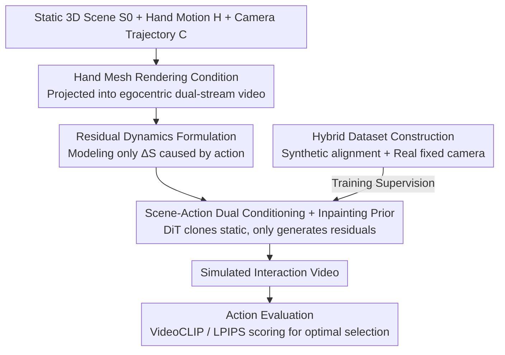

# Dexterous World Models

**Conference**: CVPR 2026  
**Paper**: [CVF Open Access](https://openaccess.thecvf.com/content/CVPR2026/html/Kim_Dexterous_World_Models_CVPR_2026_paper.html)  
**Code**: https://snuvclab.github.io/dwm/ (Project Page)  
**Area**: Robotics/Embodied AI  
**Keywords**: World Models, Dexterous Manipulation, Video Diffusion, First-person, Residual Dynamics  

## TL;DR
Given a static 3D scene and a sequence of first-person dexterous hand movements, DWM utilizes a scene-action conditioned video diffusion model to generate only the residual visual changes (grasping, opening doors, moving objects) caused by hand manipulation. While maintaining camera motion and unaffected regions unchanged, it enables static digital twins to "move" for the first time and serves as a visual world model for evaluating candidate actions.

## Background & Motivation
**Background**: 3D reconstruction can easily create realistic "digital twins" from daily environments, but these twins are mostly static—supporting only navigation and novel view synthesis, lacking embodied interaction capabilities. To transform them into true world models, it is necessary to maintain a consistent representation of static scene parts, accept action commands, and generate action-induced dynamic changes while faithfully preserving unaltered areas.

**Limitations of Prior Work**: Directly using video generation models as world models has three specific flaws. First, mainstream video models attempt to synthesize the entire scene (static + dynamic) simultaneously, making it difficult to focus on the specific changes caused by actions. Second, most video models accept **text** as "action input," which is inherently imprecise and cannot characterize hand poses or fine-grained timing crucial for real manipulation. Third, many world models treat **camera motion** as action input, but camera motion is not the primary source of world dynamics—major changes in daily scenes come from dexterous hand interactions (grasping, manipulating objects), which are precisely ignored by existing methods.

**Key Challenge**: When a model is required to generate both the static scene $S_0$ and dynamic changes $\Delta S$ simultaneously, scene generation and dynamic generation become coupled, breaking causal consistency—the model tends to make arbitrary changes in regions that should remain static and fails to accurately model the intended state changes.

**Goal**: To construct a world model that can both maintain a known static environment and accept dexterous hand action sequences to generate only interaction-induced dynamics.

**Key Insight**: Humans perceive and internalize the static world before acting upon it. Therefore, the authors **explicitly provide static scene renderings as input to the model**, paired with hand trajectories captured from a first-person perspective. This egocentric setting naturally captures the user's focus of attention and hand movements during manipulation, providing intrinsic grounding for interactions.

**Core Idea**: Rephrase the task from "reconstructing the entire video" to "learning only the residual dynamics $\Delta V$ caused by hand actions," and initialize it with a pre-trained video inpainting model as an approximate identity mapping, forcing the diffusion process to focus entirely on generating interaction changes.

## Method

### Overall Architecture
The problem DWM addresses is: given a static 3D scene $S_0$ and an embodied action $A_{1:F}=\{C_{1:F}, H_{1:F}\}$ (camera trajectory $C$ + hand manipulation trajectory $H$), generate a temporally coherent video showing reasonable human-scene interaction. The mechanism involves projecting both the static scene and hand movements into **two-stream egocentric videos** (static scene video + hand mesh video), which are then fed into a DiT video diffusion model initialized from an inpainting model. This allows the model to **generate only action-induced residual dynamics** while maintaining static appearance and camera motion, finally decoding the simulated interaction video. This simulator can be used in reverse: running simulations for a batch of candidate actions and scoring them based on their proximity to the goal for simulation-based action selection.

### Key Designs

**1. Residual Dynamics Formula: Stripping static scene from generation to model only action-induced changes**

The general form of a world model is $p_\theta(S_{1:F}\mid S_0, A_{1:F})$. The authors define each future state as $S_t = S_0 + \Delta S_t$, where $\Delta S_t$ is the residual dynamic change relative to the initial static scene. The limitation is that prior work incorporating human motion (e.g., $p_\theta(V_{1:F}\mid I_0, A_{1:F}=\{C, H\})$) only provides an initial frame $I_0$, forcing the model to synthesize scene appearance and dynamics as an **entangled representation**, causing a causal break. DWM's approach is to provide the complete static scene $S_0$ directly as a condition, learning:

$$p_\theta(V_{1:F}\mid S_0, A_{1:F}) = \int_{\Delta S} p^d_\theta(\Delta S_{1:F}\mid S_0, H_{1:F})\, p^o_\theta(V_{1:F}\mid S_0, \Delta S_{1:F}, C_{1:F})\, d\Delta S$$

Here, the dynamic model $p^d_\theta$ **only produces** dynamic changes $\Delta S$ caused by hand action $H$ (camera motion $C$ does not affect world dynamics and is discarded), and the observation model $p^o_\theta$ renders the evolving world $(S_0, \Delta S)$ into visual frames along the camera trajectory $C$. This defines a clear causal process: **manipulation drives world state transitions, while camera trajectories determine how these changes are observed**. The essential difference from the old formula is that the dynamic model no longer needs to output $S_0$, preventing "arbitrary changes to the static world."

**2. Scene-Action Dual Conditioning + Inpainting Prior: Stabilizing static areas and learning only residuals via approximate identity mapping**

In rendering space, the residual is further expressed as $V_{1:F} = \Pi(S_0; C_{1:F}) + \Delta V_{1:F}$, i.e., "static scene rendering + action residual." A key observation is that when $\Delta S_t$ only affects a small area, $\Delta V_t$ is also small, and the resulting frame should be close to the static rendering. Therefore, an ideal model needs both the **identity mapping capability to preserve static regions** and a **strong generative prior for dynamic regions**. The authors consequently reinterpret a pre-trained video inpainting diffusion model as an "identity function with generative priors" and use it to initialize DWM. The inpainting model reproduces the input video almost exactly when the mask is all 1s (all pixels known), yet it is not a trivial identity mapping; it has learned spatial structure, temporal smoothness, and appearance continuity. Using the static scene video as input establishes a baseline output that "preserves camera motion and scene appearance without introducing interaction." By overlaying hand conditions, the diffusion process is guided to **only synthesize interaction-induced residuals** $\Delta V$. The model operates in the latent space of a video VAE, concatenating the static scene latent $c_s$ and hand mesh latent $c_h$ with the noisy latent $z_t$ along the channel dimension for the DiT $\epsilon_\theta$. The training objective is the standard latent diffusion loss: $L_{LDM}=\mathbb{E}_{z_0,t,\epsilon}\big[\lVert \epsilon - \epsilon_\theta(z_t, t\mid c_s, c_h)\rVert_2^2\big]$.

**3. Hand Mesh Rendering Condition: Characterizing hand-object contact via pixel-aligned meshes instead of text/masks**

Text inputs are too vague, and camera motion is not the source of dynamics. Therefore, DWM defines the action signal as **first-person rendered hand mesh videos** $\Pi(H_{1:F}; C_{1:F})$, which encode both hand geometry and motion cues under the same camera perspective. In ablations, the authors compare three hand conditioning methods: parameter injection (AdaLN, injecting MANO pose parameters via adaptive layer normalization, both global and per-frame) lacks pixel alignment and struggles with detailed contact; hand binary masks provide pixel alignment but lack precise joint articulation; whereas **rendered hand meshes explicitly provide joint articulation and contact geometry**, allowing the model to directly correlate hand motion with scene appearance changes. This explicit and spatially consistent conditioning leads to significant improvements. For real-world fixed camera videos, hand meshes are predicted using HaMeR.

**4. Hybrid Interaction Video Dataset: Synthetic for precision, Real for physical diversity**

Training requires triplets: (i) static scene videos rendered along camera trajectories, (ii) first-person hand mesh videos, and (iii) corresponding interaction videos. In reality, it is difficult to capture static scenes and dynamic interactions simultaneously under perfectly aligned first-person trajectories. The authors solve this by **combining two types of data**: ① Synthetic data using TRUMANS (with full-body SMPL-X control and a virtual camera rigidly attached to the head joint), rendering three synchronized outputs for each action: interaction video, a static scene video replaying the same trajectory without changing object states, and a hand mesh video. This ensures strict spatio-temporal alignment. ② Real-world data using the fixed-camera TASTE-Rob, where the static scene video is time-invariant, $\Pi(S_0; C_t)=\Pi(S_0; C_0)=V_0$. By repeating the first frame $V_0$ for $F$ frames, a static video perfectly aligned with the interaction perspective is constructed, paired with HaMeR predicted meshes. Synthetic data provides precise paired supervision and diverse camera motion, while real data supplements high-fidelity physical dynamics like fluids and deformations. Additionally, the authors collected 60 dynamic first-person real samples using Aria glasses (with built-in SLAM for millimeter-level trajectories) specifically for evaluation.

### Loss & Training
Training uses the latent diffusion loss $L_{LDM}$ mentioned above, with conditional latents concatenated channel-wise into the DiT. During inference, iterative denoising yields $\hat z_0$, which is decoded by the VAE into an interaction video. For each test sample, 3 videos are generated with different random seeds and averaged.

## Key Experimental Results

A 144-sample benchmark was constructed: Synthetic Dynamic (48 sequences from TRUMANS), Real-World Static (48 from TASTE-Rob), and Real-World Dynamic (48 from Aria). Metrics include perceptual similarity (LPIPS / DreamSim, lower is better) and pixel quality (PSNR / SSIM, higher is better).

### Main Results

| Setting | Metric | CVX SDEdit | CVX-Fun Fine-tuned | InterDyn | **Ours** |
|------|------|-----------|--------------------|----------|----------------|
| Synthetic·Dyn Cam | PSNR↑ / SSIM↑ | 19.42 / 0.675 | 20.54 / 0.767 | – | **25.03 / 0.844** |
| Synthetic·Dyn Cam | LPIPS↓ / DreamSim↓ | 0.464 / 0.257 | 0.370 / 0.175 | – | **0.289 / 0.086** |
| Real·Stat Cam | PSNR↑ / SSIM↑ | 16.19 / 0.586 | 18.95 / 0.780 | 19.33 / 0.744 | **21.55 / 0.816** |
| Real·Stat Cam | LPIPS↓ / DreamSim↓ | 0.446 / 0.224 | 0.265 / 0.089 | 0.240 / 0.135 | **0.227 / 0.057** |
| Real·Dyn Cam | PSNR↑ / SSIM↑ | 19.15 / 0.507 | 18.13 / 0.472 | – | **21.65 / 0.550** |
| Real·Dyn Cam | LPIPS↓ / DreamSim↓ | 0.676 / 0.492 | 0.591 / 0.328 | – | **0.557 / 0.225** |

DWM achieves the **best performance across all settings and metrics**. The real dynamic camera scenes were never seen during training (some categories like "opening a window" had no training samples), yet DWM still generates coherent simulations, demonstrating strong generalization. In baseline comparisons: CVX-SDEdit struggles to generate meaningful interaction while maintaining appearance; CVX-Fun Fine-tuned often acts on wrong targets or hallucinates objects; InterDyn aligns hands with masks but fails to build object dynamics.

### Ablation Study

| Configuration | Real Static LPIPS↓ | Real Static DreamSim↓ | Description |
|------|----------------|---------------------|------|
| TRUMANS Only (Synthetic) | 0.304 | 0.124 | Trained only on synthetic data |
| **Ours (Hybrid)** | **0.227** | **0.057** | Included real fixed camera data |

| Hand Condition | PSNR↑ | SSIM↑ | LPIPS↓ | DreamSim↓ |
|--------------|-------|-------|--------|-----------|
| AdaLN (global) | 21.96 | 0.806 | 0.306 | 0.127 |
| AdaLN (per-frame) | 22.79 | 0.827 | 0.288 | 0.110 |
| Hand Mask | 22.88 | 0.797 | 0.338 | 0.137 |
| **Ours (Hand Mesh)** | **24.15** | **0.834** | 0.304 | **0.094** |

### Key Findings
- **Value of hybrid datasets is magnified by real data**: Adding TASTE-Rob real fixed-camera data not only improved synthetic testing but also significantly improved Aria dynamic camera real-world data (Real Static LPIPS 0.304 to 0.227). Notably, real training data only contained fixed cameras, yet it enabled strong generalization to complex dynamic camera scenes.
- **Hand mesh rendering is clearly the optimal conditioning**: Parameter injection (AdaLN) lacks pixel alignment, and masks lack joint information. Rendered hand meshes, by explicitly encoding articulation and contact geometry, reduced DreamSim from 0.110–0.137 to 0.094.
- **Navigation and manipulation are decouplable**: Without hand conditions, DWM degrades to a pure navigator; with hand conditions, it generates manipulation-induced dynamics—indicating that residual modeling successfully separates "perceiving" from "acting."
- **Scalable action evaluator**: By simulating multiple candidate actions, DWM can score them using VideoCLIP cosine similarity for text goals $s^{(i)}_{text}=\text{sim}_{VC}(V^{(i)}_{1:F}, g_{text})$ or LPIPS for image goals $s^{(i)}_{img}=-\text{LPIPS}(I^{(i)}_F, I_{goal})$, selecting the best action via $A^*=\arg\max_{A^{(i)}} s^{(i)}$ without explicit reward functions or real-world trial and error.

## Highlights & Insights
- **Providing the static scene is the pivot**: Treating $S_0$ as a conditional input instead of letting the model generate it directly severs the coupling between scene generation and dynamic generation, ensuring causal consistency and making the "residual learning" objective lightweight.
- **Reinterpreting inpainting as an "identity function with generative priors" is ingenious**: Under full masks, inpainting approximates the input, providing "static preservation" while retaining spatio-temporal generative priors. This trick is transferable to any video editing or world modeling task where "output ≈ input + small residual."
- **Mocking paired data with fixed cameras**: Since static videos are time-invariant under fixed cameras, repeating the first frame creates aligned static-interaction pairs, circumventing the difficulty of separately capturing static and dynamic versions of the same scene.
- **Hand Mesh vs. Mask vs. Params**: The comparison provides a clear conclusion: pixel alignment + explicit geometry = better contact modeling, which serves as a reference for any generative task driven by hands or tools.

## Limitations & Future Work
- **Dependency on known static 3D scenes**: The method assumes $S_0$ is pre-reconstructed (real-world evaluation even requires Aria scanning for 3D Gaussian Splatting), making it unsuitable for unreconstructed or dynamic background environments.
- **Scarcity of real paired training data**: Dynamic first-person paired data is difficult to acquire at scale; the authors rely on synthetic alignment + fixed camera approximations. Real dynamic camera data is only used for evaluation (60 samples), leaving the upper bound of real-world generalization to be verified with larger datasets.
- **Plausible but not explicitly physical**: The model generates visually plausible dynamics but does not explicitly model contact forces or articulation structures. The physical accuracy of complex articulations or long-horizon counterfactuals remains questionable.
- **Action evaluation via proxy metrics**: Using perceptual/semantic similarity to approximate "goal achievement" may fail when semantic differences are subtle or when goals and simulations are view-inconsistent.

## Related Work & Insights
- **vs. Navigation-only World Models (e.g., [6,63])**: These assume $\Delta S=\emptyset$ and focus on novel view prediction; DWM argues camera motion is not the primary dynamic and introduces dexterous manipulation to model true state transitions.
- **vs. Human-motion Driven Dynamic Scene Models [5,40]**: These typically perform image-to-video, hallucinating the entire scene and evolution from a single frame, leading to entangled background and motion; DWM provides the static scene explicitly to separate residuals.
- **vs. Robotic Arm World Models [13,19,62]**: These usually assume fixed camera perspectives and cannot handle tasks requiring joint "navigation + manipulation"; DWM's first-person setting naturally supports joint modeling.
- **vs. InterDyn [2]**: Also injects hand information (masks via ControlNet) but only aligns hands and fails to build object dynamics; DWM's mesh condition directly associates hand motion with scene appearance changes.

## Rating
- Novelty: ⭐⭐⭐⭐⭐ Decoupling dexterous interaction from static scenes in video diffusion world models, using "residual learning + inpainting priors," is a clean formulation.
- Experimental Thoroughness: ⭐⭐⭐⭐ Comprehensive comparison across three data types and solid ablations, though lacks real-robot closed-loop verification and has limited real dynamic data.
- Writing Quality: ⭐⭐⭐⭐⭐ The mathematical derivation of why static separation is necessary is very clear and the motivation is well-structured.
- Value: ⭐⭐⭐⭐⭐ Pushes static digital twins toward interactive simulation, offering insights for embodied AI, action evaluation, and world modeling.

<!-- RELATED:START -->

## Related Papers

- [\[ICLR 2026\] World-In-World: World Models in a Closed-Loop World](../../ICLR2026/robotics/world-in-world_world_models_in_a_closed-loop_world.md)
- [\[CVPR 2026\] Structural Action Transformer for 3D Dexterous Manipulation](structural_action_transformer_for_3d_dexterous_manipulation.md)
- [\[CVPR 2026\] AdaDexTrack: Dynamic Modulation for Adaptive and Generalizable Dexterous Manipulation Tracking](adadextrack_dynamic_modulation_for_adaptive_and_generalizable_dexterous_manipula.md)
- [\[ICML 2026\] WestWorld: Scalable Trajectory World Models with Knowledge Encoding](../../ICML2026/robotics/westworld_a_knowledge-encoded_scalable_trajectory_world_model_for_diverse_roboti.md)
- [\[ICLR 2026\] Empowering Multi-Robot Cooperation via Sequential World Models](../../ICLR2026/robotics/empowering_multi-robot_cooperation_via_sequential_world_models.md)

<!-- RELATED:END -->
