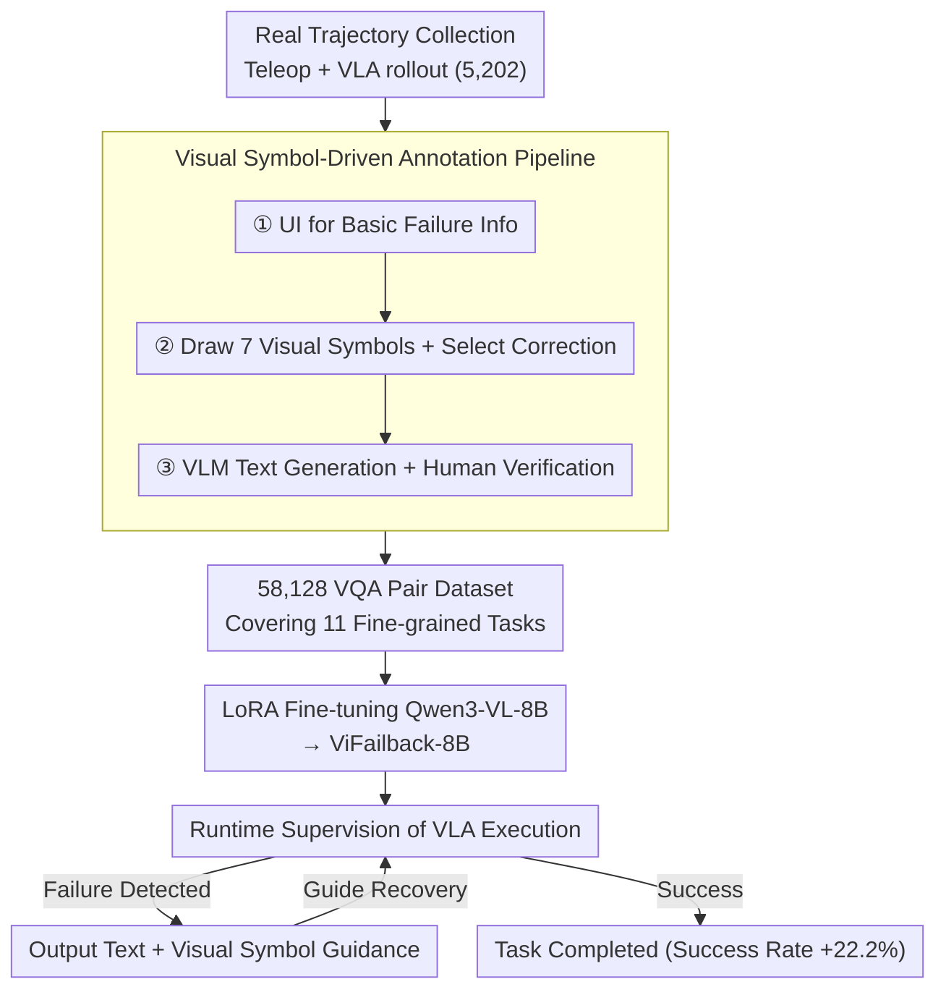

# Diagnose, Correct, and Learn from Manipulation Failures via Visual Symbols

**Conference**: CVPR 2026  
**arXiv**: [2512.02787](https://arxiv.org/abs/2512.02787)  
**Code**: [Project Page](https://vifailback.github.io/)  
**Area**: Robotics  
**Keywords**: Robot Manipulation Failure, Visual Symbols, VLM Failure Diagnosis, VLA Recovery, Real-world Dataset

## TL;DR
The ViFailback framework is proposed to efficiently annotate real-world robot manipulation failures using visual symbols (arrows, crosshairs, labels, etc.), constructing a dataset of 58,128 VQA pairs. ViFailback-8B VLM is trained to achieve failure diagnosis and visual+textual correction guidance, which, when integrated with VLA, achieves a 22.2% improvement in task success rate.

## Background & Motivation
**Background**: VLA models perform excellently in robot manipulation but inevitably fail in OOD (Out-of-Distribution) scenarios. While VLMs are used for task planning and reasoning, they lack capability in **failure diagnosis and correction**.

**Limitations of Prior Work**: (1) Existing failure datasets are primarily generated in simulation by injecting perturbations, limited by the sim-to-real gap; (2) Annotating real-world failure data is extremely time-consuming, especially for abstract categories (task planning errors, failure causes) that require extensive textual descriptions.

**Key Challenge**: Real-world failure data is precious but expensive to annotate; simulation data is cheap but unrealistic. How can real failure data be utilized efficiently?

**Goal**: Establish a low-cost framework for real-world robot failure diagnosis and correction, including efficient annotation methods, a dataset, and trained VLMs.

**Key Insight**: Use visual symbols (e.g., colored arrows for movement direction, crosshairs for target position) to annotate directly on video frames, combined with VLM-automated text generation to significantly reduce annotation costs.

**Core Idea**: Visual symbols serve as an intermediate representation that is both easy for humans to annotate quickly (mouse drag-and-drop) and provides structured correction guidance signals for VLMs.

## Method

### Overall Architecture
The paper addresses the challenge of scarce and hard-to-annotate "real-world robot manipulation failure" data. VLA inevitably fails in OOD scenarios, but training a VLM to "diagnose what went wrong and how to fix it" requires massive annotated real-world data. ViFailback connects the entire pipeline: first, 5,202 real trajectories are collected via teleoperation and VLA rollouts; then, a "visual symbol + VLM-assisted text" pipeline annotates these into 58,128 VQA pairs. Subsequently, Qwen3-VL-8B is fine-tuned on this data to obtain ViFailback-8B. This model acts as an external runtime supervisor for VLA, providing both textual and visual symbol correction guidance to lead the robot to recovery. The key is the "visual symbol" intermediate representation, which enables both rapid human annotation and structured action instructions for the robot.

### Key Designs

**1. Seven Visual Symbol Systems: Compressing 3D Corrections into 2D Frames**

The most expensive part of real failure annotation is describing "which direction to move" in text. ViFailback breaks this by drawing symbols directly on video frames. The symbols are categorized into three groups: motion symbols use colored linear arrows to encode translation (Red = X-axis, Green = Y-axis, Blue = Z-axis) and semicircular arrows for rotation; spatial relation symbols use dual crosshairs with dashed lines for alignment and single crosshairs for target areas; state symbols use ON/OFF labels for gripper state, a "Prohibited" icon for stop, and a "Rewind" icon for backoff. The use of color to encode 3D directions on 2D frames is particularly clever, as it compensates for the missing dimension in 2D space. Collectively, these seven symbols cover all basic action primitives needed for manipulation correction.

**2. Visual Symbol-Driven Annotation Pipeline: Reducing Real-World Data Costs**

To handle the high cost of annotating abstract failure causes, ViFailback splits the pipeline into three steps: ① Using UI controls for basic info like failure detection, keyframes, and types; ② Dragging and dropping the seven visual symbols and selecting correction actions; ③ Automating text description completion via VLM (Qwen2.5-Max for sub-task decomposition, Qwen3-VL-235B for high-level descriptions), followed by human verification. This replaces the expensive text writing process with "drawing symbols + VLM padding," resulting in 58,128 VQA pairs at low cost.

**3. Fine-grained Task Definition and ViFailback-Bench**

Ability is decomposed into 11 VQA tasks: failure diagnosis (detection, keyframe localization, sub-task localization, type identification, cause analysis) and correction guidance (low-level text, high-level text, visual symbolic guidance). The ViFailback-Bench (500 trajectories × 22 tasks, including 5 fully OOD tasks) categorizes tests into Lite (multiple-choice/judgment) and Hard (open-ended CoT format). This allows for precise identification of model shortfalls—whether the model merely recognizes a failure or truly "understands" why it happened.

**4. Closed-Loop Failure Correction: ViFailback-8B as a Runtime Supervisor**

ViFailback-8B is integrated into the VLA execution loop. While the VLA performs the task, ViFailback-8B monitors the progress. Upon detecting a failure, it outputs simultaneous textual and visual symbol guidance, leading the VLA to adjust its actions and recover. Unlike methods that only overlay 2D trajectories (e.g., TracVLA), visual symbolic correction provides real-time instructions that the robot can consume directly. Real-world experiments show a 22.2% success rate increase.

### Loss & Training
- Fine-tuning Qwen3-VL-8B using LoRA (rank=32, $\alpha=64$), 1 epoch, $lr=1e-5$.
- Unfrozen LLM backbone and adapter parameters.
- DeepSpeed ZeRO Stage 2, 4 × NVIDIA Hopper GPUs.
- Temperature = 0, Max generation length 2048 tokens.

## Key Experimental Results

### Main Results (ViFailback-Bench Overall Accuracy %)

| Model | Lite↑ | Hard↑ | Average↑ |
| :--- | :--- | :--- | :--- |
| Qwen3-VL-8B (base) | 38.33 | 33.04 | 35.92 |
| GPT-4o | 48.21 | 40.00 | 44.47 |
| Gemini-2.5-Pro | 54.64 | 32.45 | 44.54 |
| RoboBrain2.0-32B | 49.92 | 29.22 | 40.50 |
| **ViFailback-8B (Ours)** | **Outperforms all** | **Outperforms all** | **Significant improvement** |

### Ablation Study (Real-world Robot Experiments)

| Configuration | Success Rate Gain | Description |
| :--- | :--- | :--- |
| VLA alone | baseline | No external supervision |
| **VLA + ViFailback-8B** | **+22.2%** | External supervisor intervenes for failure recovery |

### Key Findings
- ViFailback-8B significantly outperforms the base Qwen3-VL-8B on all 11 VQA tasks, validating the dataset's efficacy.
- Even top-tier closed-source models like GPT-4o and Gemini-2.5-Pro perform poorly in robot failure analysis, highlighting the necessity of specialized data and training.
- Visual symbol output serves as both an intuitive human-readable representation and a direct guidance signal for VLA action adjustment.
- Among failure types, gripper 6d-pose errors are most common, with task planning errors also being significant.

## Highlights & Insights
- **Visual symbols as intermediate representation** is the core innovation: it reduces annotation cost while providing structured action guidance for robots. The color-coded 3D arrow design is ingenious.
- **Real-world Data > Simulation Data**: The 5,202 real trajectories hold value far exceeding large-scale simulation data.
- **Diagnosis-to-Recovery Closed Loop**: Ours does not just analyze failures; it guides VLA to recover via visual symbols, with a 22.2% success rate gain proving practical utility.
- **ViFailback-Bench** fills a gap in robot VLM evaluation regarding "failure reasoning."

## Limitations & Future Work
- Currently collected using the ALOHA dual-arm platform; generalization to other robot platforms needs verification.
- 100 tasks, while diverse, may still be insufficient to cover all manipulation skills.
- The instruction-following capability of the VLA is a bottleneck—even with correct guidance, the VLA might fail to execute precisely.
- Drawing visual symbols still requires human involvement (though significantly faster than text).
- Online learning—real-time policy updates from failures—has not been explored.
- Real-time performance of failure detection (latencies in video processing) is not fully discussed.

## Related Work & Insights
- Compared to YAY (human-in-the-loop): ViFailback reduces the complexity of human involvement via visual symbols.
- Compared to simulation datasets (AHA, RACER): Ours avoids the sim-to-real gap.
- Difference from Robo2VLM, ManipBench: The latter categories evaluate "what/how to do," whereas ViFailback evaluates "where/why it went wrong."
- The visual symbol concept can be extended to other human-robot interaction scenarios (e.g., remote operation guidance).
- TracVLA and similar models overlay 2D trajectories but cannot revise them; ViFailback provides real-time revision.

## Technical Details
- **Data**: 4,995 teleop + 207 $\pi_{0.5}$ rollouts, 657 success + 4,545 failure.
- **4 Failure Types**: Task Planning / Gripper 6D-pose / Gripper State / Human Intervention.
- **Annotation Stages**: 1. UI for basic info → 2. Symbolic drawing + correction choice → 3. VLM text augmentation + human check.
- **VLM Support**: Qwen2.5-Max for task decomposition, Qwen3-VL-235B for high-level description.
- **Bench**: 500 trajectories × 22 tasks, 5 fully OOD.
- **Evaluation**: Lite (Accuracy) + Hard (GPT-4o scoring on Semantic/Completeness/Equivalence).

## Rating
- Novelty: ⭐⭐⭐⭐⭐ Visual symbolic annotation framework + Real-world failure dataset + Diagnosis-correction loop.
- Experimental Thoroughness: ⭐⭐⭐⭐⭐ 16 model benchmarks + real-world robot recovery.
- Writing Quality: ⭐⭐⭐⭐ Clear framework and task definitions.
- Value: ⭐⭐⭐⭐⭐ Provides a practical solution to the critical problem of robots learning from failure.

<!-- RELATED:START -->

## Related Papers

- [\[CVPR 2026\] MM-ACT: Learn from Multimodal Parallel Generation to Act](mm-act_learn_from_multimodal_parallel_generation_to_act.md)
- [\[CVPR 2026\] Action-Sketcher: From Reasoning to Action via Visual Sketches for Robotic Manipulation](action-sketcher_from_reasoning_to_action_via_visual_sketches_for_robotic_manipul.md)
- [\[CVPR 2026\] VIRAL: Visual Sim-to-Real at Scale for Humanoid Loco-Manipulation](viral_visual_sim-to-real_at_scale_for_humanoid_loco-manipulation.md)
- [\[CVPR 2026\] Visual-RRT: Finding Paths toward Visual-Goals via Differentiable Rendering](visual-rrt_finding_paths_toward_visual-goals_via_differentiable_rendering.md)
- [\[ICLR 2026\] ReCAPA: Hierarchical Predictive Correction to Mitigate Cascading Failures](../../ICLR2026/robotics/recapa_hierarchical_predictive_correction_to_mitigate_cascading_failures.md)

<!-- RELATED:END -->
