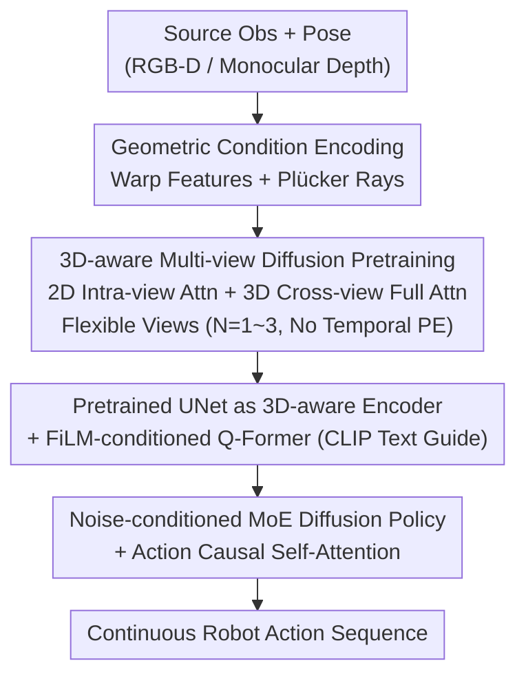

# DiffuView: Multi-View Diffusion Pretraining for 3D-Aware Robotic Manipulation

**Conference**: CVPR 2026  
**Paper**: [CVF Open Access](https://openaccess.thecvf.com/content/CVPR2026/html/Zhang_DiffuView_Multi-View_Diffusion_Pretraining_for_3D_Aware_Robotic_Manipulation_CVPR_2026_paper.html)  
**Code**: Not yet public  
**Area**: Robotics / Embodied AI  
**Keywords**: Multi-view diffusion pretraining, visual representation, imitation learning, view robustness, diffusion policy

## TL;DR
DiffuView treats "multi-view diffusion generation" as a 3D-consistent visual pretraining task—teaching the network to "generate a target view given source view observations and camera poses" to implicitly recover scene geometry. The pretrained diffusion UNet is then utilized as a visual backbone for a diffusion action policy, enabling stable robot arm manipulation even under camera view shifts. It achieves a success rate nearly 20% higher than existing methods in view-offset scenarios.

## Background & Motivation
**Background**: The mainstream approach in robotic visuomotor control involves extracting features from visual observations to generate actions. Due to the scarcity of large-scale data with paired "vision + action" annotations, many recent works have shifted toward using self-supervised or large-scale visual pretraining to obtain transferable representations for downstream policy learning.

**Limitations of Prior Work**: Existing pretraining paradigms follow two main paths, but both fail to learn "cross-view unified 3D representations." One path involves MAE-based methods (MVP, 3D-MVP, LIFT3D, EmbodiedMAE), which learn features by reconstructing masked regions but lack global 3D consistency. The other involves neural rendering (GNFactor, SPA, PDFactor), which lifts 2D features into 3D latent spaces like triplanes, voxels, or Gaussians; however, these require per-scene optimization and struggle to generalize across different views and sensor configurations. Crucially, most methods assume identical fixed camera configurations for training and inference, failing when cameras move.

**Key Challenge**: Manipulation tasks inherently require an understanding of 3D spatial structures, but pure 2D encoders lack 3D awareness. Conversely, explicit 3D representations (rendering/reconstruction) are tied to specific scenes and views, failing to form a unified representation recognizable across different camera setups.

**Goal**: Learn a consistent 3D-aware visual representation across views and sensors while ensuring downstream policy robustness to new views, all while allowing single-view deployment.

**Key Insight**: The authors observe that multi-view diffusion models (Free3D, CAT3D, ViewCrafter, Bolt3D, etc.) are already powerful at 3D-aware novel view synthesis—they can "imagine" geometrically consistent target views from source perspectives. Since generating target views requires implicit modeling of cross-view geometric correspondences, their internal representations are naturally 3D-consistent, making them ideal view-robust visual backbones.

**Core Idea**: Use "conditional multi-view generation" $p_\theta(\hat O_j \mid O_i, P_i, P_j)$ as a pretraining task to force the network to learn 3D-consistent representations, then connect this diffusion backbone to a diffusion action policy for imitation learning.

## Method

### Overall Architecture
DiffuView is a two-stage framework. **Stage 1** involves multi-view diffusion pretraining: given a source observation and camera pose, the model generates a target view, forcing it to implicitly recover scene geometry and learn cross-view aligned 3D-consistent latents. **Stage 2** involves policy learning: the pretrained diffusion UNet is reused as a 3D-aware visual encoder. Extracted features are compressed into task-relevant tokens via a FiLM-conditioned Q-Former and fed into a diffusion policy with noise-conditioned MoE to generate continuous actions via imitation learning. A key design is that it uses multi-view information during training (with the number of source views $N$ randomly sampled from 1-3) but **requires only a single view for deployment**.

### Key Designs

**1. Geometric Condition Encoding: Injecting "Camera Geometry" into Generation using Warp Features and Plücker Rays**

To ensure the diffusion model generates geometrically correct target views, providing only the source image is insufficient; the "geometric relationship between two cameras" must be explicitly defined. DiffuView employs two mechanisms. First is **warp features**: given source observation $O_i=\{I_i, D_i\}$, pose $P_i$, and intrinsics $K_i$, 3D points are back-projected and re-projected onto the target camera to obtain warped RGB and depth $(\tilde I_{i\rightarrow j}, \tilde D_{i\rightarrow j}) = \mathrm{Warp}(I_i, D_i, P_i, P_j, K_i, K_j)$. RGB-D cameras use measured depth, while pure RGB setups use a metric depth estimation network to provide $\hat D_i$ as a geometric condition. Second is **dense Plücker ray embedding**: for each pixel $u(x,y)$, the ray direction $d_{i,xy}=R_i^T K_i^{-1}u$ and origin are calculated and represented in Plücker coordinates:

$$\mathbf r_{i,xy} = \langle \mathbf d_{i,xy}, \mathbf m_{i,xy}\rangle, \qquad \mathbf m_{i,xy}=\mathbf o_i \times \mathbf d_{i,xy},$$

concatenated as $\mathbf e_{i,xy}=[\mathbf d_{i,xy}; \mathbf m_{i,xy}]\in\mathbb R^6$, forming a pixel-wise geometric camera context $\mathbf E_i\in\mathbb R^{6\times H\times W}$. These geometric cues are added to the VAE latents via a lightweight convolutional encoder: $z_\text{source}=\mathcal E(I_i)+\mathrm{CNN}(I_i, D_i, \mathbf E_i)$, $z_\text{target}=\mathcal E(I_j)+\mathrm{CNN}(\tilde I_{i\rightarrow j}, \tilde D_{i\rightarrow j}, \mathbf E_j)$. This ensures the network "knows" camera placement and ray correspondences during denoising, which is critical for learning geometrically consistent representations—removing Plücker embeddings drops the success rate from 89.2% to 76.2%.

**2. 3D-aware Multi-view Diffusion and Flexible Perspectives: Capturing Geometry via Dual-layer Attention**

The pretraining objective is conditional generation $p_\theta(\hat O_j\mid O_i, P_i, P_j)$: Gaussian noise is added to the target view VAE latent $\mathcal E(I_j)$ during training, and the model denoises it using source view conditions. Internally, the network uses two types of attention: **2D spatial attention** to capture intra-view dependencies and **3D full attention** to reason cross-view geometric correspondences. The total number of views is $N+M=8$ (source $N$, target $M$), but the authors **intentionally vary $N$** between 1 and 3 during training and **omit temporal positional encodings** to prevent the network from memorizing "absolute view positions." This allows the model to generalize to any $N$ or $M$ during inference—enabling "multi-view training, single-view deployment."

**3. Pretrained UNet as 3D-aware Encoder + FiLM-conditioned Q-Former: Transforming Generative Models into Task-Specific Visual Interfaces**

Post-pretraining, the diffusion UNet is reused as a visual encoder rather than for generation. Following VPP, **only one diffusion forward pass** (as opposed to full denoising) is performed during inference to extract multi-scale features from UNet upsampling layers, which retain fine-grained geometric and semantic information. These features are passed to a **FiLM-conditioned Q-Former** to be compressed into compact visual tokens $z_\text{obs}$, where FiLM modulation is guided by the end-of-text (EoT) token from a CLIP text encoder. This step ensures visual features are "color-graded" by the semantic intent of the language instruction, serving as a unified interface between pretrained representations and downstream action learning. Removing the FiLM condition drops success from 89.2% to 73.3%.

**4. Noise-conditioned MoE Diffusion Policy + Action Causal Self-Attention: Efficient and Temporally Consistent Denoising**

The action head is a diffusion policy $\varepsilon_\psi$ conditioned on observation tokens $z_\text{obs}$ and language tokens $l_\text{emb}$. Forward noise injection follows $\mathbf a^{(t)}=\sqrt{\bar\alpha_t}\,\mathbf a_0+\sqrt{1-\bar\alpha_t}\,\boldsymbol\varepsilon$, with the training objective to predict noise:

$$\mathcal L_\text{policy}=\mathbb E_{(\mathbf a_0, z_\text{obs}, l), t, \boldsymbol\varepsilon}\Big[\big\|\boldsymbol\varepsilon-\boldsymbol\varepsilon_\psi(\mathbf a^{(t)}, t, z_\text{obs}, l_\text{emb})\big\|^2\Big].$$

Inputs are injected into transformer blocks via cross-attention with RMSNorm for stability. Two improvements are added: **Action Causal Self-Attention**, which uses causal masking to ensure each action token only attends to preceding ones, making multi-step trajectories more physically plausible; and **Noise-timestep conditioned MoE** (MoDE), where each block has 4 experts and a router dynamically activates the Top-2 based on the noise level token $\eta(\sigma_t)$, speeding up denoising without performance loss.

### Loss & Training
Pretraining: Multi-view diffusion is fine-tuned on robot-centric datasets including RH20T (approx. 100 multi-view tasks, metric depth supplemented by MapAnything) and RoboSuite/CoppeliaSim simulations (>5000 random views). Images are resized to 512×512, trained on 8x A100 for ~2 days. Policy: Uses DDIM sampler with 10 denoising steps; 8 transformer blocks with latent dimension 768; input includes 2 frames of single-view observation + CLIP language embedding; outputs a chunk size of 10 actions.

## Key Experimental Results

### Main Results
Comparison on Libero and MetaWorld benchmarks (Success Rate).

| Benchmark | Subset/Difficulty | DiffuView | Prev. Best | Note |
|------|-----------|-----------|----------|------|
| Libero | Libero-10 | 89.2 | 84.8 (VQVLA) | — |
| Libero | Libero-90 | 92.5 | 92.7 (π0.5-ki) | Slightly below best baseline |
| Libero | Average (100 tasks) | 92.2 | 91.9 (π0.5-ki) | Overall Best |
| MetaWorld | Average (50 tasks) | 0.706 | 0.682 (VPP) | — |
| MetaWorld | Hard & Very Hard (11) | 0.537 | 0.526 (VPP) | Leading on hard tasks |

View Generalization (Mv-Bench, trained on fixed agent view, inferred with z-axis rotation):

| View Angle | 0° | 15° | 30° | 45° | 60° | Average |
|----------|------|------|------|------|------|---------|
| OpenVLA | 84.7 | 54.8 | 26.4 | 12.6 | 8.2 | 39.3 |
| DiffuView | 86.2 | 72.9 | 55.3 | 44.9 | 34.6 | 59.2 |

The gap widens as the view offset increases: at 60°, OpenVLA nearly fails (8.2%), while DiffuView maintains 34.6%, averaging nearly 20 points higher. Real-world experiments (Franka Research 3) show an average success rate of 0.65, outperforming DP (0.51).

### Ablation Study
On Libero-10, metrics represent success rate (%).

| Configuration | Success Rate | Note |
|------|--------|------|
| DiffuView (Full) | 89.2 | Full model |
| w/o Robot Data Pretraining | 63.3 | Gain: -25.9, largest drop |
| w/o Plücker Embedding | 76.2 | Gain: -13.0, geometric cues are key |
| w/o FiLM in Q-Former | 73.3 | Gain: -15.9, semantic modulation is vital |
| Noise MoE Top-1 | 87.7 | Only 1.5 drop, sparse activation is efficient |

### Key Findings
- **Robot-centric data pretraining is the biggest contributor**: Removing it causes a drop from 89.2 to 63.3, showing that fine-tuning general diffusion models on robot scenes is the performance foundation.
- **FiLM language conditioning is more critical than Plücker rays**: Removing FiLM (-15.9) hurts more than removing Plücker (-13.0), indicating that visual representations require semantic alignment to translate into policy performance.
- **Flexible view design supports generalization**: Random $N$ and lack of temporal PE allow single-view deployment ($N=M=1$) and stability on Mv-Bench, though extreme offsets with occlusions still cause degradation.
- **Extrapolation to wrist views**: Despite not being trained on wrist-mounted views, the model can generate wrist-view results, demonstrating OOD generalization.

## Highlights & Insights
- **Generation as Representation Pretraining**: The core insight is that the ability to generate geometrically consistent novel views necessitates learning 3D-consistent representations. DiffuView ignores the generated image and harvests the internal visual backbone.
- **Decoupled Training (Multi-view) and Deployment (Single-view)**: This is highly practical. By randomizing source view counts and removing temporal constraints, the model breaks the dependency on multiple cameras during runtime.
- **Diffusion UNet Single Forward Pass**: Reusing the UNet as an encoder via a single pass avoids the high overhead of iterative denoising, a clever trick for using large generative models in perception.
- **Dual Geometric Conditioning**: Combining warp features (content correspondence) and Plücker rays (camera geometry) provides a robust recipe for injecting 3D awareness into 2D diffusion frameworks.

## Limitations & Future Work
- **Limitations**: The framework lacks explicit modeling of dynamic temporal information, making it difficult to reason about long-horizon motion continuity. Future work aims to expand DiffuView into "flexible view + time" joint pretraining for unified spatio-temporal learning.
- **Extreme Angle Degradation**: Success drops to 34.6% at 60° on Mv-Bench, as large offsets introduce geometric occlusions that the model cannot fully resolve.
- **Dependency on Depth and Pose**: Geometric encoding requires depth (RGB-D or estimate) and accurate poses. Metric depth errors in uncalibrated open scenes may affect performance.
- **High Data Engineering Costs**: Pretraining requires extensive fine-tuning on diverse multi-view robot data, representing a significant computational and dataset curation investment.

## Related Work & Insights
- **vs MAE-based (MVP, etc.)**: These focus on reconstructing occluded 2D regions and lack global 3D consistency. DiffuView uses conditional generation to force cross-view geometric alignment.
- **vs Neural Rendering (GNFactor, etc.)**: These tether to specific scenes/views via explicit 3D volumes. DiffuView implicitly encodes 3D consistency into the diffusion latent, allowing easier cross-sensor generalization.
- **vs Generation-augmented (SuSIE, VPP)**: While VPP also uses diffusion representations, DiffuView specifically focuses on **cross-view 3D consistency** rather than temporal dynamics, giving it a significant edge in view-robustness.
- **vs VLA (OpenVLA, π0.5)**: VLAs assume fixed camera configurations. DiffuView is specifically pretrained for view robustness, significantly outperforming OpenVLA on Mv-Bench.

## Rating
- Novelty: ⭐⭐⭐⭐⭐ First to use multi-view diffusion as a view-robust representation pretraining for robotics.
- Experimental Thoroughness: ⭐⭐⭐⭐ Covers various benchmarks and real-world tests; however, lacks quantitative analysis of depth estimation sensitivity.
- Writing Quality: ⭐⭐⭐⭐ Clear explanation of the two-stage framework and geometric conditions.
- Value: ⭐⭐⭐⭐⭐ High practical value; the ~20% improvement in view-offset scenarios directly addresses major real-world deployment pain points.

<!-- RELATED:START -->

## Related Papers

- [\[CVPR 2026\] Learning Surgical Robotic Manipulation with 3D Spatial Priors](learning_surgical_robotic_manipulation_with_3d_spatial_priors.md)
- [\[CVPR 2026\] Learning to See and Act: Task-Aware Virtual View Exploration for Robotic Manipulation](learning_to_see_and_act_task-aware_virtual_view_exploration_for_robotic_manipula.md)
- [\[CVPR 2025\] 3D-MVP: 3D Multiview Pretraining for Robotic Manipulation](../../CVPR2025/robotics/3d-mvp_3d_multiview_pretraining_for_manipulation.md)
- [\[CVPR 2026\] Expanding Spatial and Temporal Context for Robotic Imitation Learning With Scene Graphs](expanding_spatial_and_temporal_context_for_robotic_imitation_learning_with_scene.md)
- [\[CVPR 2026\] CycleManip: Enabling Cycle-based Manipulation via Effective History Perception and Understanding](cyclemanip_enabling_cycle-based_manipulation_via_effective_history_perception_an.md)

<!-- RELATED:END -->
