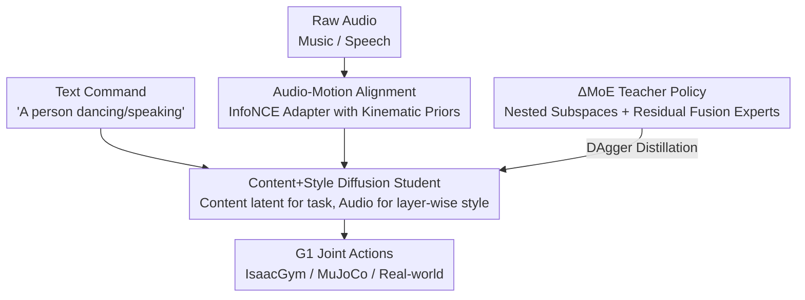

# Do You Have Freestyle? Expressive Humanoid Locomotion via Audio Control

**Conference**: CVPR 2026  
**Paper**: [CVF Open Access](https://openaccess.thecvf.com/content/CVPR2026/html/Li_Do_You_Have_Freestyle_Expressive_Humanoid_Locomotion_via_Audio_Control_CVPR_2026_paper.html)  
**Code**: None (Not released)  
**Area**: Robotics / Embodied AI  
**Keywords**: Humanoid robot, audio-driven motion, diffusion policy, Mixture of Experts, motion tracking  

## TL;DR
RoboPerform establishes an end-to-end, retargeting-free generative framework for "audio-to-humanoid motion." It aligns audio latents with the motion latent space via contrastive learning, trains a teacher policy using Residual Mixture of Experts ($\Delta$MoE), and distills a diffusion student policy that decouples "content" (text-specified task) and "style" (audio rhythm/prosody). This enables the Unitree G1 to directly dance to music or perform co-speech gestures with latency significantly lower than conventional cascaded pipelines that rely on intermediate human motion reconstruction.

## Background & Motivation

**Background**: Current humanoid full-body control primarily follows the "motion tracking" paradigm, where a policy is trained via reinforcement learning (RL) to imitate reference motions sourced from mocap or text-to-motion generation. Control signals are typically either predefined motion clips (e.g., DeepMimic, ExBody2, GMT lineages) or sparse linguistic commands (e.g., LangWBC, RLPF).

**Limitations of Prior Work**: Humans naturally move in response to sound—a drumbeat triggers a step, a melody inspires a leap, and linguistic emphasis naturally leads to gestures. Existing systems lack such improvisational expressivity. A naive approach to audio-driven robotics involves a cascaded pipeline: Audio $\to$ Motion Generator (Human) $\to$ Retargeting $\to$ Tracking Controller. The authors identify three systematic flaws in this approach: (1) Sequential execution of decoding, retargeting, and tracking causes errors to accumulate, compromising both expressivity and physical consistency; (2) Multi-stage inference leads to high latency, hindering real-world deployment; (3) High-level acoustic cues and low-level joint actuation are loosely coupled, causing fine-grained nuances in style, timing, and dynamics to be lost during transmission.

**Key Challenge**: Audio is a signal with high temporal density yet compact representational structure—music encodes beat and tempo, while speech carries prosody and rhythm. These elements dictate *how* a motion is performed. However, inserting an explicit step for "human motion reconstruction" often smooths out these delicate temporal styles during the retargeting process.

**Goal**: The paper redefines humanoid locomotion control as a **generative problem**. Given conditional signals, the goal is to directly synthesize motions that are physically feasible, style-aligned, and semantically grounded, treating audio as a first-class control signal while bypassing explicit human motion reconstruction.

**Core Idea**: `motion = content + style`. "Content" is defined as high-level motion latents encoded from text commands (e.g., "a person dancing") via a text-to-motion model, specifying the core task. "Style" is defined by audio signals (musical beats / speech prosody), determining **how** the task is executed. Audio is thus injected as an implicit style modulation signal rather than being converted into an explicit intermediate motion sequence.

## Method

### Overall Architecture

RoboPerform utilizes a two-stage "Teacher-Student" framework. The input consists of raw audio (music or speech) and robot proprioception, while the output consists of joint actions executable in simulation or on hardware. The pipeline consists of three main components:

1.  **Audio-Motion Alignment**: An adapter with temporal attention is trained using InfoNCE loss to pull the audio latent $l_{audio}$ closer to the motion latent $l_{motion}$. This "injects" kinematic priors into the audio latent, eliminating the need for a separate "audio-to-motion generator."
2.  **$\Delta$MoE Teacher Policy**: An oracle policy is trained in simulation via RL with access to privileged information. The core design splits the conditional input into nested subspaces handled by four experts, which are then fused via residual connections to cover diverse motion patterns.
3.  **Diffusion Student Policy**: The teacher is distilled into a student via DAgger. The student is a diffusion-based motion generator that uses the "fixed content latent" as the primary denoising condition, while the aligned audio style latent is injected layer-wise for modulation. The student relies only on proprioception (excluding privileged info) for direct deployment on the Unitree G1.

### Key Designs

**1. Audio-Motion Alignment Adapter: Kinematic-aware Audio Latents**

To bypass the errors inherent in cascaded pipelines, the authors avoid translating audio into explicit human motion. Instead, a 6-layer Transformer with temporal attention is trained as an adapter to align the audio latent $l_{audio}$ with a motion latent $l_{motion}$ from a pre-trained VAE. Alignment is achieved using the InfoNCE contrastive loss:

$$\mathcal{L}_{\text{InfoNCE}} = -\frac{1}{N}\sum_{i=1}^N \log \frac{\exp\big(\text{sim}(l_{audio}^{(i)}, l_{motion}^{(i)})\big)}{\sum_{j=1}^N \exp\big(\text{sim}(l_{audio}^{(i)}, l_{motion}^{(j)})\big)}$$

where $\text{sim}(u,v)=\frac{u^\top v}{\tau}$ is the scaled cosine similarity. This ensures the audio latent "knows" its corresponding motion in the latent space, maintaining rhythmic consistency while removing the need for an intermediate generator.

**2. $\Delta$MoE Teacher Policy: Nested Subspaces and Residual Fusion**

Standard Mixture of Experts (MoE) often suffers from expert redundancy, where specialists learn overlapping signals. The authors solve this by treating the conditional input as a 3D vector $c=[c_1,c_2,c_3]^\top$ and defining a chain of nested subspaces $\{0\}=S_1\subset S_2\subset S_3\subset S_4=\mathbb{R}^3$. Each of the four experts observes only one subspace: $e_1$ sees null input (unconditional prior), $e_2$ sees $\{c_1,0,0\}$, etc. Final actions are fused via **residual fusion**:

$$\mathbf{a} = w_1\mathbf{a}_1 + \sum_{i=2}^{4} w_i(\mathbf{a}_i - \mathbf{a}_{i-1})$$

where $\Delta\mathbf{a}_i = \mathbf{a}_i - \mathbf{a}_{i-1}$ represents the marginal contribution of the $i$-th conditional dimension. This is a structural generalization of Classifier-Free Guidance (CFG).

**3. Decoupled Content-Style Diffusion Student**

The student uses a diffusion model where generation is split into two conditional paths. **Content** uses a pre-trained generator (LaMP-T2M) to encode a text prompt into a motion latent $l_{motion}$, which serves as the primary denoising condition. **Style** uses the aligned audio latent $l_{audio}$, injected layer-wise into the diffusion backbone:

$$\mathbf{o}_i = \text{Layer}_i(\mathbf{o}_{i-1}, l_{motion}) + \alpha\, l_{audio}$$

where $\alpha$ controls style intensity. Inference uses 2-step DDIM sampling to maintain real-time performance.

### Loss & Training
- **Adapter**: InfoNCE contrastive loss for audio-motion alignment.
- **Teacher**: RL training in IsaacGym with privileged info and reference motions, optimized via gated MLP experts.
- **Student**: DAgger distillation with diffusion MSE loss ($x_0$-prediction) and AdaLN condition injection.

## Key Experimental Results

Experiments used Unitree G1, training on FineDance (7.7h dance) and BEAT2 (76h speech).

### Main Results: Motion Tracking (vs. Cascaded Baseline)

The baseline uses EMAGE/FineNet for motion generation and PBHC for retargeting.

| Dataset | Method | Succ↑ (IsaacGym) | Empjpe↓ | Succ↑ (MuJoCo) | Empjpe↓ |
|--------|------|------|------|------|------|
| BEAT2 | Baseline | 0.98 | 0.07 | 0.94 | 0.13 |
| BEAT2 | **Ours** | **0.99** | **0.05** | **0.96** | **0.10** |
| FineDance | Baseline | 0.88 | 0.24 | 0.61 | 0.32 |
| FineDance | **Ours** | **0.93** | **0.18** | **0.67** | **0.26** |

Ours shows significant Gain in high-dynamic tasks (FineDance), demonstrating the benefits of a retargeting-free design.

### Ablation Study

| Configuration | Succ↑ (FineDance/IsaacGym) | Empjpe↓ |
|------|------|------|
| **Ours** (Full) | 0.93 | 0.18 |
| − Adaptor | 0.79 | 0.49 |
| Vanilla MoE | 0.89 | 0.24 |
| − Content | 0.91 | 0.20 |

### Key Findings
- **Adapter is critical**: Removing it caused the most significant performance drop, confirming that kinematics-aware audio latents are the foundation of the framework.
- **$\Delta$MoE reduces redundancy**: t-SNE analysis shows that while vanilla MoE experts overlap, the residual components of $\Delta$MoE are learn independent, non-redundant information.
- **Content Latent improves grounding**: Removing the content condition leads to lower tracking accuracy, proving the effectiveness of the "content skeleton + style modulation" abstraction.

## Highlights & Insights
- **Clean Decoupling**: The $motion=content+style$ abstraction allows tasks to be defined by text while the performance style is driven by audio.
- **Theoretical Elegance**: $\Delta$MoE generalizes CFG into an MoE structure, providing a principled way to eliminate expert redundancy in multi-condition control.
- **Low Latency**: By bypassing explicit reconstruction and using 2-step DDIM, the system achieves the responsiveness required for real-time interaction.

## Limitations & Future Work
- **Closed Source**: Implementation details such as specific reward functions and privileged info features are currently restricted to the appendix/not public.
- **Static Content Latents**: During training, the content latent is often treated as a constant, which may limit the system's ability to transition between complex semantic tasks.
- **Sim-to-Sim Gap**: Success rates drop significantly when transferring from IsaacGym to MuJoCo, indicating that further work is needed on cross-platform robustness.

## Related Work & Insights
- **Comparison with RoboGhost**: Both use latent-driven, retargeting-free motion, but this work is the first to introduce **audio** as a control signal for synced robotic performance.
- **Comparison with Cascaded Pipelines**: RoboPerform outperforms traditional EMAGE/FineNet + Retargeting pipelines by reducing accumulated errors and lowering inference latency.

## Rating
- Novelty: ⭐⭐⭐⭐⭐ 
- Experimental Thoroughness: ⭐⭐⭐⭐ 
- Writing Quality: ⭐⭐⭐⭐ 
- Value: ⭐⭐⭐⭐⭐

<!-- RELATED:START -->

## Related Papers

- [\[ICLR 2026\] From Language to Locomotion: Retargeting-free Humanoid Control via Motion Latent Guidance](../../ICLR2026/robotics/from_language_to_locomotion_retargeting-free_humanoid_control_via_motion_latent_.md)
- [\[ICLR 2026\] HWC-Loco: A Hierarchical Whole-Body Control Approach to Robust Humanoid Locomotion](../../ICLR2026/robotics/hwc-loco_a_hierarchical_whole-body_control_approach_to_robust_humanoid_locomotio.md)
- [\[CVPR 2026\] Beyond Mimicry: Learning Whole-Body Human-Humanoid Interaction from Human-Human Demonstrations](beyond_mimicry_learning_whole-body_human-humanoid_interaction_from_human-human_d.md)
- [\[CVPR 2026\] Gallant: Voxel Grid-based Humanoid Locomotion and Local-navigation across 3D Constrained Terrains](gallant_voxel_grid-based_humanoid_locomotion_and_local-navigation_across_3-d_con.md)
- [\[CVPR 2026\] End-to-End Language-Action Model for Humanoid Whole Body Control](end-to-end_language-action_model_for_humanoid_whole_body_control.md)

<!-- RELATED:END -->
