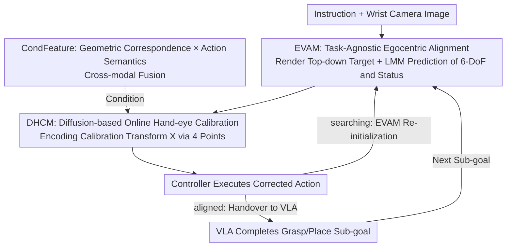

# EgoRoC: Towards Egocentric Robotic Control via Task-Agnostic Visual Alignment

**Conference**: CVPR 2026  
**Paper**: [CVF Open Access](https://openaccess.thecvf.com/content/CVPR2026/html/Feng_EgoRoC_Towards_Egocentric_Robotic_Control_via_Task-Agnostic_Visual_Alignment_CVPR_2026_paper.html)  
**Code**: Not disclosed  
**Area**: Embodied AI / Robotic Control  
**Keywords**: Embodied AI, VLA, Egocentric Visual Alignment, Online Hand-eye Calibration, Conditional Diffusion  

## TL;DR
EgoRoC decouples "how the robot sees" from "how the robot acts" by introducing a plug-and-play egocentric alignment head. Before manipulation, it aligns the wrist camera view to the target, outputting only a 6-DoF pose interface to the downstream VLA. A diffusion-based online hand-eye calibration module then transforms or corrects the alignment action into the end-effector coordinate system. Trained once using only static image pairs, it enhances the success rates of various VLAs across tasks and hardware in a zero-shot manner (especially for long-horizon and out-of-distribution tasks).

## Background & Motivation
**Background**: Current mainstream Vision-Language-Action (VLA) models (such as OpenVLA, RT-2, π0) utilize end-to-end architectures to directly map images and language to robotic actions. These models exhibit strong performance on predefined manipulation tasks under third-person camera views.

**Limitations of Prior Work**: This end-to-end paradigm faces three specific challenges. First, **visual understanding and task actions are entangled**—changing to a new task requires retraining both perception and control, which is computationally expensive. Second, **data costs are high**—task-oriented VLAs rely on massive, task-specific "complete manipulation trajectory" datasets (comprising localization, grasping, and placement), with RT-2 requiring 560K and OpenVLA requiring 970K episodes. Third, **third-person cameras imply a fixed hand-eye assumption**; any change in the relative configuration between the camera and the robotic arm necessitates extensive fine-tuning, as a visual-servo coupling is formed between the camera and the robot.

**Key Challenge**: The root cause is that the ability to "see" is treated as a byproduct of "doing." Each task must re-learn visual alignment from complete trajectories, leading to implicit cross-task redundancy. The authors argue that VLA systems lack a primitive: **the separation of "how to see" from "how to do."**

**Goal**: To abstract egocentric visual alignment into a reusable, plug-and-play, task-agnostic capability placed upstream of manipulation policies. It is trained only on static image pairs without modifying any structure of the downstream VLA.

**Key Insight**: The authors draw inspiration from human manipulation intuition—technicians adjusting microscopes or surgeons positioning arthroscopes **align their view first before acting**. Existing VLAs implicitly benefit from this division: the "Put Eggplant into Pot" task in OpenVLA has an "Easy Version" where the end-effector is manually initialized above the target before running the policy. This suggests that "alignment first" is a universal and effective pre-processing step.

**Core Idea**: Enable robots to "learn to see before learning to do." A wrist-mounted (egocentric) camera alignment head establishes task-agnostic visual consistency, followed by a diffusion-based online hand-eye calibration to transfer alignment results to the end-effector frame. The entire system is integrated into any off-the-shelf VLA with minimal modifications.

## Method

### Overall Architecture
EgoRoC serves as an alignment frontend placed upstream of a VLA, exposing only a "thin" 6-DoF pose interface. it consists of two serial modules: **EVAM** (Egocentric Visual Alignment Module), which estimates a 6-DoF relative transform to align the current egocentric observation with the task-target view; and **DHCM** (Diffusion-based Hand-eye Calibration Module), which transforms/corrects EVAM's output into the end-effector coordinate system while compensating for minor EVAM deviations.

During deployment, the system runs **interchangeably** with the downstream VLA. Given a natural language instruction, EVAM first parses the task into an ordered sequence of sub-goals (e.g., "put the carrot on the plate" → align to carrot, then align to plate) and renders a set of ordered top-down target images using a third-person camera (this step is performed only once per inference). For each sub-goal, EVAM predicts the relative transform and provides an alignment status (aligning / aligned / searching). DHCM corrects this transform for execution by the robot controller. When the status becomes **aligned**, control is handed to the downstream VLA to complete the grasp/place operation before moving to the next sub-goal. If the target leaves the field of view (searching), EVAM re-initializes alignment. This ⟨alignment → manipulation⟩ loop allows long-horizon tasks to be executed without retraining the policy.

### Key Designs

**1. EVAM: Making "View Alignment" a Task-Agnostic 6-DoF Alignment Head**

To address the entanglement of visual understanding and task actions, EVAM isolates "alignment" as an independently learnable capability. Its inputs are the current wrist camera image $I_{cur}$, a task-related target image $I_{tar}$, and a text prompt $T$ describing the alignment goal. The output is a 6-DoF relative transform $A \in SE(3)$, where $A \simeq \langle R, t\rangle$ ($R \in SO(3)$, $t \in \mathbb{R}^3$), along with a dedicated **alignment status token** (aligning / aligned / searching). The target images are not provided arbitrarily: EVAM uses an LMM to parse instructions into an ordered object sequence, then uses VGGT with third-person cameras to build point maps and render the ordered sequence of top-down target images $I^{tar}_{carrot} \to I^{tar}_{plate}$. To perform real-time and clean rendering of these images, the authors fine-tuned pix2pix-turbo via distillation from Gemini 2.5 Flash Image for inpainting. The backbone uses Qwen2.5-VL-7B (capable of handling varying resolutions) and follows the RT-2 approach of discretizing continuous action parameters into 256 tokens per dimension using percentile bins (1%–99%). The training objective is next-token cross-entropy over action tokens. Crucially, **only the injected LoRA adapters are trained** (vision encoder, multi-modal projection layers, parts of the LLM layers), while the remaining weights are frozen, and the downstream VLA remains unchanged. This is the source of its "plug-and-play + data efficiency": training requires only static image pairs with relative poses, not full manipulation trajectories.

**2. DHCM: Moving Alignment Actions to the End-Effector Frame via Conditional Diffusion**

EVAM provides relative poses in the camera view, but the **hand-eye relationship between the wrist camera and the robotic arm introduces deviations** in these adjustments. Traditional hand-eye calibration (Tsai–Lenz, Horaud solutions for $AX=XB$) requires controlled environments and fails if the camera moves. DHCM treats hand-eye calibration $X \in SE(3)$ as an online generation problem and simultaneously compensates for small EVAM prediction errors. The core idea is to **encode $X$ using 4 points $P=\{p_1,p_2,p_3,p_4\}$**: $p_1,p_2,p_3$ lie on a unit sphere and are mutually orthogonal to encode the rotation $R_X$, while $p_4$ has no geometric constraints and encodes translation $t_X$ via decimeter-scale normalization. Calibration is thus formulated as conditional point generation:

$$\mathcal{P} = \mathcal{D}_{\theta}(\mathbf{CondFeature})$$

Where $\mathcal{D}_{\theta}$ is a diffusion generator implemented with Concatsquash MLP, conditioned on a descriptor CondFeature carrying hand-eye information. It denoises a noisy point set $z_t$ over $T$ steps to the target distribution. The authors' key insight is that hand-eye system deviations are **implicitly encoded in the inputs**—the pair of current and target images, along with the actions already executed by the robot. Compared to classic calibration, DHCM performs calibration "on-the-fly" without CAD models or measurement tools, generalizing to any camera-robot assembly.

**3. CondFeature: Cross-modal Conditional Features for Geometric Correspondence × Action Semantics**

The accuracy of DHCM calibration depends on the quality of the CondFeature, which must fuse "where to move" (visual geometry) and "how to move" (action kinematics). On the visual side, zero-shot correspondence is used: a fixed $4\times4$ grid $G_{tar}$ is sampled on the target image and matched to the current image using COTR to obtain a deformed grid $G_{cur}$. Fourier positional encoding is applied, followed by two Image-MLP branches to perform Gaussian noise suppression at diffusion timesteps $t$ and $t{+}1$, resulting in geometric difference features $f^{geo}_{(t)}, f^{geo}_{(t+1)} \in \mathbb{R}^{128}$ which are concatenated into $f^{img}$. This **gridded correspondence decouples geometry from semantics**, fitting the task-agnostic philosophy as it learns spatial relationships regardless of the object. On the action side, the 6D action increment $\Delta A \simeq \langle \Delta R, \Delta t\rangle$ (Euler angles + translation) from $t \to t{+}1$ is mapped to $f^{txt} \in \mathbb{R}^{128}$ via Text-MLP. Fusion is achieved via cross-attention inspired by Q-Former: instead of using $f^{txt}$ as the query and $f^{img}$ as key/value, they are concatenated into $F=[f^{txt};f^{img}] \in \mathbb{R}^{256}$ as key-value pairs, with $K{=}8$ learnable queries $Q \in \mathbb{R}^{8\times256}$ for attention. Finally, a linear projection yields $\mathbf{CondFeature} \in \mathbb{R}^{256}$. To distinguish different hand-eye configurations in the embedding space, **Rank-N-Contrast** contrastive learning is applied (temperature $\tau{=}2$): it constructs positive and negative samples ranked by "label distance," defined by the rotation angle difference $\theta = \arccos\big(\frac{\mathrm{tr}(R)-1}{2}\big)$ ($R = R_i R_j^\top$) between two transformation matrices. This avoids fragile binary classification of continuous rotations and aligns embedding distances with true rotational distances.

### Loss & Training
The total loss for DHCM combines contrastive, diffusion, and geometric constraints:

$$\mathcal{L}_{DHCM} = \mathcal{L}_{rank} + \mathcal{L}_{diff} + (\mathcal{L}_{sphere} + \mathcal{L}_{ortho} + \mathcal{L}_{dist})$$

- $\mathcal{L}_{rank}$: Rank-N-Contrast loss to differentiate distinct calibration matrices.
- $\mathcal{L}_{diff} = \mathbb{E}_{q(z_t|\mathcal{P})}\|\mathcal{P} - \hat{\mathcal{P}}_\theta(z_t, \mathbf{CondFeature})\|_2^2$: Diffusion denoising reconstruction loss.
- Three geometric regularizations: $\mathcal{L}_{sphere}=\sum_{i=1}^3(\|p_i\|_2^2-1)^2$ forces $p_1,p_2,p_3$ onto the unit sphere; $\mathcal{L}_{ortho}=\sum_{i\neq j,\,i,j\le3}(p_i^\top p_j)^2$ ensures orthogonality (maintaining rotation matrix properties); $\mathcal{L}_{dist}=\sum_{i=1}^3\|p_i-q_i\|_2^2$ keeps generated points close to the original output $q_i$ before denoising to minimize adjustment magnitude.

**Two-stage Training**: All training data consists of "egocentric-target image pairs with relative poses" extracted from complete manipulation episodes, split into two subsets. **Stage 1**: EVAM and DHCM are trained separately on one subset. EVAM learns relative poses under direct supervision from episode labels; DHCM samples random calibration matrices $X$, transforms ground-truth relative poses $P$ into $P'$ for the Text-MLP branch, and uses $X$ as labels for contrastive/diffusion/geometric constraints. **Stage 2**: End-to-end refinement. The Geo-MLP branches in EVAM and DHCM are frozen, and only the cross-modal fusion and diffusion generator are trained. At this stage, the Text-MLP input is replaced with actual 6-DoF poses predicted by EVAM, while supervision remains the relative pose derived from episodes. This step teaches DHCM to **correct EVAM deviations during deployment to suit the current hand-eye configuration**.

## Key Experimental Results

The dataset includes 2.3M egocentric-target image pairs (taken from 60k episodes in BridgeData + DROID, both part of Open X-Embodiment). The default backbone is Qwen2.5-VL-7B (LoRA rank 64). Baselines include 5 SOTA VLAs: OpenVLA, TinyVLA, SpatialVLA, Pi-0, and OpenVLA-OFT. Four task abbreviations: Lift (Task-L), Put A onto B (Task-Po), Put all into (Task-PA), and Put into drawer (Task-PD), with the latter two being long-horizon. Main comparisons (Radar Chart in Fig. 4, Data Efficiency Curve in Fig. 5) show that integrating EgoRoC consistently improves the success rates of all 5 baselines in both simulation and real-world environments, with particularly significant gains in long-horizon and out-of-distribution tasks.

### Main Results

Comparison of hand-eye calibration strategies (Real-world, Success Rate %, baseline is fine-tuned OpenVLA):

| Method | Task-L | Task-Po | Task-PA | Task-PD |
|------|--------|---------|---------|---------|
| Tsai–Lenz (Classic) | 67.0 | 52.0 | 40.0 | 17.0 |
| DHCM (Stage 1 only) | 66.0 | 49.0 | 37.0 | 15.0 |
| **DHCM (Full Training)** | **72.0** | **52.0** | **43.0** | **20.0** |

DHCM trained only in the first stage performed slightly worse than Tsai–Lenz on most tasks, but outperformed all methods after full two-stage training. This indicates that while Stage 1 learns the hand-eye configuration representation, joint optimization in Stage 2 is necessary to learn **correcting EVAM deviations during execution**.

Plug-and-play variants with shared LMM (Real-world, Success Rate %): The LMM of EVAM is reused from the downstream OpenVLA base (DINOv2+SigLIP+Llama-2-7B), training only a new LoRA for EVAM:

| EVAM LMM | Task-L | Task-Po | Task-PA | Task-PD | Avg. |
|-------------|--------|---------|---------|---------|------|
| Qwen2.5-VL-7B | 26.0 | 19.0 | 14.0 | 3.0 | 15.5 |
| OpenVLA (Shared) | 28.0 | 20.0 | 12.0 | 3.0 | **15.8** |

Shared backbones achieved minor improvements without changing data/training pipelines (15.8 vs 15.5), mainly in short-horizon tasks, with a slight trade-off in Task-PA, while maintaining plug-and-play attributes.

### Ablation Study

Ablation of DHCM components (Real-world, first two tables Success Rate %, last table Rotation Angle Error RAE / Standard Deviation SD, lower is better):

| Configuration | Task-L | Task-Po | Task-PA | Task-PD | Speed (s) | Description |
|------|--------|---------|---------|---------|---------|------|
| w/o grid | 61.0 | 40.0 | 32.0 | 11.0 | - | No explicit geometric signals |
| COTR 2×2 grid | 69.0 | 48.0 | 38.0 | 15.0 | 0.11 | Small grid prone to mismatch noise |
| **COTR 4×4 grid (Ours)** | 72.0 | 52.0 | 43.0 | 20.0 | 0.19 | Trade-off between speed/accuracy |
| COTR 8×8 grid | 77.0 | 54.0 | 46.0 | 23.0 | 0.87 | Most accurate but too slow per step |

| Configuration | RAE(°) | SD(°) | Description |
|------|--------|-------|------|
| Full DHCM | 2.03 | 0.89 | Reference |
| w/o Rank-N-Contrast | 12.78 | 1.35 | Rotation error jumps 6x without contrastive learning |
| w/o Diffusion (MLP Regression) | 6.27 | 1.76 | Both error and variance significantly increase |

Geo-MLP Ablation (Success Rate %): With Geo-MLP, Task-L/Po/PA/PD = 72/52/43/20; without it = 71/52/41/17. The improvement is small but stable, as it helps diffusion outputs satisfy unit sphere and orthogonality constraints, reducing rotation representation conversion errors.

### Key Findings
- **Rank-N-Contrast is vital for calibration accuracy**: Removing it caused the RAE to jump from 2.03° to 12.78° (approx. 6x), as binary classification for continuous rotations is fragile. Supervising via rotation angle distance ranking is more stable.
- **Diffusion generators outperform direct regression**: RAE 2.03° vs 6.27°, attributed to diffusion's ability to model multi-modal calibration distributions and mitigate axis ambiguity in rotation parameterization.
- **Bigger gains in long-horizon/out-of-distribution tasks**: The ⟨alignment → manipulation⟩ alternation reduces cumulative perception-control drift and enhances instruction following under distribution shifts. Distribution-out tasks (Task-Po/PA) showed wider gaps in data efficiency curves.
- **Grid size is a trade-off**: 8×8 is the most accurate but too slow (0.87s/step), while 2×2 is prone to noise. 4×4 is the optimal point.

## Highlights & Insights
- **"Learning to see before learning to do" is a clean decoupling primitive**: Isolating visual alignment as an upstream, reusable, task-agnostic capability reduces training from "full trajectories" to "static image pairs," addressing data costs and cross-task redundancy.
- **Thin 6-DoF interface with zero changes to downstream VLA**: This engineering posture allows plug-and-play functionality across various backbones like OpenVLA/π0/TinyVLA, ensuring high transferability.
- **4-point encoding for SE(3) calibration + geometric regularization**: Transforming hand-eye calibration into conditional point generation (spherical-orthogonal trio + translation point) with diffusion denoising is a clever way to embed rigid-body constraints into generative models, transferable to other rigid-body estimation scenarios.
- **Insight that the hand-eye deviation is implicitly encoded**: Solving geometry from runtime data (image pairs + executed actions) rather than external targets makes it suitable for arbitrary hardware assemblies.

## Limitations & Future Work
- **Reliance on static image pairs**: The authors admit this limits handling highly dynamic environments. Future work aims for temporal alignment and more efficient online calibration to reduce latency.
- **Absolute success rates remain relatively low** (⚠️ average success across 4 tasks in the shared LMM table was only 15.5–15.8%, with long-horizon Task-PD at 3%). These numbers primarily show relative gains from EgoRoC. Absolute values may relate to task difficulty and baseline capabilities; success rates across different tables (e.g., 72% for Task-L in ablation) use different criteria and are not directly comparable.
- **Missing task-specific numerical tables for main comparisons**: Fig. 4/5 lack precise numerical tables, making it difficult to align specific improvement magnitudes during reproduction.
- **Heavy target image rendering chain**: The pre-rendering workflow involving VGGT point maps and pix2pix-turbo inpainting (distilled from Gemini) is complex, and its robustness or failure modes are not extensively discussed.

## Related Work & Insights
- **vs End-to-end VLA (OpenVLA / RT-2 / π0)**: These entangle perception and control, requiring full episodes per task (RT-2 560K, OpenVLA 970K). EgoRoC pulls alignment upstream, uses only static image pairs, and adds an enhancement without replacing the policy.
- **vs Classic Hand-eye Calibration (Tsai–Lenz / Horaud)**: Classic methods solving $AX=XB$ require controlled environments and tools, failing if the camera moves relative to the base. DHCM performs online calibration from egocentric wrist images without CAD or markers, outperforming Tsai–Lenz in full training experiments.
- **vs Learning-based Calibration**: Prior learning methods often rely on third-person views and measurement tools. This work fuses correspondence cues with executed actions into compact calibration descriptors using only egocentric views, supporting hardware-agnostic deployment.

## Rating
- Novelty: ⭐⭐⭐⭐⭐ Decoupling "visual alignment" as a plug-and-play primitive + 4-point encoding + diffusion for online hand-eye calibration are both highly innovative.
- Experimental Thoroughness: ⭐⭐⭐⭐ Broad coverage across 5 VLA backbones, Sim/Real, and short/long-horizon tasks with solid ablation. However, lacks numerical tables for main results and absolute success rates are low.
- Writing Quality: ⭐⭐⭐⭐ Motivation and modules are clear. Fig. 1/2 convey the "decoupling" idea effectively. Some metric criteria require careful reading.
- Value: ⭐⭐⭐⭐⭐ Plug-and-play, no downstream modification, and data efficiency provide strong practical value for real-world robot deployment.

<!-- RELATED:START -->

## Related Papers

- [\[CVPR 2026\] Spatial-Aware VLA Pretraining through Visual-Physical Alignment from Human Videos](spatial-aware_vla_pretraining_through_visual-physical_alignment_from_human_video.md)
- [\[CVPR 2026\] Action-Sketcher: From Reasoning to Action via Visual Sketches for Robotic Manipulation](action-sketcher_from_reasoning_to_action_via_visual_sketches_for_robotic_manipul.md)
- [\[CVPR 2026\] FLARE: A Failure-Aware Framework for Autonomous Correction and Recovery in Visual-Language Robotic Manipulation](flare_a_failure-aware_framework_for_autonomous_correction_and_recovery_in_visual.md)
- [\[CVPR 2026\] Unifying Perception and Action: A Hybrid-Modality Pipeline with Implicit Visual Chain-of-Thought for Robotic Action Generation (VITA)](unifying_perception_and_action_a_hybrid-modality_pipeline_with_implicit_visual_c.md)
- [\[CVPR 2026\] Learning to See and Act: Task-Aware Virtual View Exploration for Robotic Manipulation](learning_to_see_and_act_task-aware_virtual_view_exploration_for_robotic_manipula.md)

<!-- RELATED:END -->
