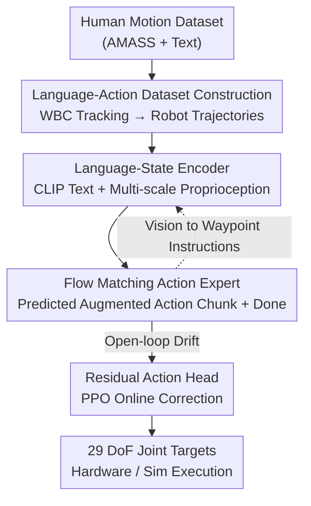

# End-to-End Language-Action Model for Humanoid Whole Body Control

**Conference**: CVPR 2026  
**Paper**: [CVF Open Access](https://openaccess.thecvf.com/content/CVPR2026/html/Wang_End-to-End_Language-Action_Model_for_Humanoid_Whole_Body_Control_CVPR_2026_paper.html)  
**Code**: Not disclosed  
**Area**: Robotics / Embodied AI  
**Keywords**: Humanoid Whole Body Control, Language-Action Model, Flow Matching, Residual Reinforcement Learning, End-to-End  

## TL;DR
SENTINEL is the first fully end-to-end "language → humanoid low-level action" model. It generates a large-scale language-action dataset by using a pre-trained whole-body controller to track human motions with text annotations in simulation. It then employs a flow matching action expert to map language instructions and proprioception directly to 29-dimensional joint targets, with a residual reinforcement learning head to correct open-loop drift. It achieves significantly better semantic alignment and execution success rates (99.45% in simulation) on both simulation and the Unitree G1 hardware compared to two-stage "text-to-motion + controller" baselines.

## Background & Motivation
**Background**: Currently, the mainstream approach for humanoid robots to perform whole-body actions (walking, jumping, waving, playing instruments) based on natural language is two-stage: first, a text-to-motion model (e.g., MDM, T2M-GPT) generates a human motion sequence from text, which is then retargeted to the robot and executed by a physical whole-body controller (WBC). Language understanding and physical execution are treated as two independently optimized modules.

**Limitations of Prior Work**: The intermediate representation of the two-stage approach (human motion sequences) is misaligned with the controller's input space. Since both parts are trained separately, generated actions are often physically unfeasible—for instance, an MDM-generated "jumping turn" with large rotation might cause the robot to lose balance and fall during retargeted execution. Even UH-1 (which generates robot poses directly to bypass retargeting) or LangWBC (which distills expert policies via CVAE) either still rely on intermediate representations or suffer from poor semantic alignment and lack of generalization to unseen instructions due to small MLP capacities.

**Key Challenge**: As long as "language understanding" and "physical execution" are separated by an artificial intermediate representation (motion sequence / pose / latent variable), feedback gradients from the execution end cannot flow back to the language end. This prevents joint optimization and naturally limits semantic-kinematic consistency.

**Goal**: Eliminate all intermediate motion representations. Directly map language instructions and proprioception to low-level joint actions while solving two engineering challenges: (1) whole-body control requires long-term temporal reasoning (e.g., "stop after four steps"), and (2) open-loop drift caused by action chunking undermines sim-to-real transfer.

**Core Idea**: Utilize a flow-matching action expert as an end-to-end "language-action model" to predict low-level action chunks directly, topped with a residual RL head for online drift correction. This allows gradients to flow back from execution feedback all the way to language understanding, enabling joint optimization.

## Method

### Overall Architecture
SENTINEL integrates three stages. **Stage 1 (Data Construction)**: A Mixture-of-Experts whole-body controller is first trained using PPO in IsaacLab to track various human motions on Unitree G1. This controller is then used to rollout a human motion dataset with text annotations (an AMASS subset filtered by PHC), tracking each human motion $m_i$ into a "physically feasible robot trajectory $\tau_i$." Retaining the original text $l_i$ yields the language-action dataset $D_{\text{robot}}=\{(\tau_i, l_i)\}$, where each step in the trajectory is a state-action pair $(s_t, a_t)$. **Stage 2 (Pre-training)**: An end-to-end language-action model is trained. A language-state encoder encodes text and proprioceptive history into a context, from which a flow matching action expert predicts a future $H$-step action chunk. **Stage 3 (Post-training)**: The language-action model is frozen, and a lightweight residual action head is trained separately using PPO and domain randomization to fix open-loop drift online and adapt to the real robot. Furthermore, other modalities like vision can be extended to navigation tasks by converting them into "language waypoint instructions."

The pipeline is illustrated below:

### Key Designs

**1. Physically Grounded Language-Action Dataset: Translating "Human Motion" to "Robot-Feasible Actions"**

The root cause of failure in two-stage methods is that text-to-motion models generate "human actions" that are physically impossible for robots after retargeting. Instead of training on human motion directly, this work first trains an MoE WBC to realistically track each human motion $m_i$ in simulation. The physically feasible robot trajectories $\tau_i=\{(s_t,a_t)\}$ actually rolled out by the controller are recorded and paired with original text to form $D_{\text{robot}}$. This ensures data is "physically validated" by design. Domain randomization (randomizing COG, friction, external pushes, torque noise) is used during collection to expand data coverage and robustness. Ultimately, ~200,000 language-annotated robot trajectories and ~100 million state-action pairs were collected from 12,422 motions in AMASS. This provides the data foundation for the end-to-end approach, as every action label encountered by the model is physically stable.

**2. Flow Matching Action Expert + Multi-scale Observation: Low-level Action Chunk Generation and Long-term Reasoning**

The model consists of two components: a **Language-State Encoder** (Transformer) that encodes semantic tokens from a CLIP text encoder along with robot state history $s^{\text{hist}}_t$ into a context $c_t=[l, s^{\text{hist}}_t]$, exposed to the action expert via KV cache; and an **Action Expert**, which is a flow matching model predicting a future $H$-step action chunk $A_t=[a_t,\dots,a_{t+H-1}]$. Given a ground-truth action chunk $A_t$ and interpolation coefficient $\beta\sim\text{Beta}(1.5,1.0)$, a noisy sample $A^\beta_t=\beta\epsilon+(1-\beta)A_t$ ($\epsilon\sim\mathcal N(0,I)$) is constructed. The velocity field $v_\theta$ is trained to approximate the target velocity $u(A^\beta_t|A_t)=\epsilon-A_t$:

$$L(\theta)=\mathbb E\,\big\|v_\theta(A^\beta_t,\beta,c_t)-u(A^\beta_t|A_t)\big\|^2$$

During inference, the action chunk is obtained by integrating along the learned flow from $\beta=1$ to $\beta=0$ (step $\Delta t=0.1$). Execution follows a receding-horizon approach, performing the first $K$ actions before regenerating.

This design addresses the "long-term temporal reasoning" requirement of whole-body control. Simple manipulation tasks may only need the current frame, but "walking four steps then stopping" requires knowing how many steps have already been taken. The authors construct **multi-scale state history** $s^{\text{hist}}_t=[s^{\text{long}}_t, s^{\text{short}}_t]$: short-term $s^{\text{short}}_t$ takes the last 10 frames at 50 Hz for high-resolution feedback; long-term $s^{\text{long}}_t$ takes the past 10 seconds at a low 4 Hz sampling rate to provide temporal context for action progress. Removing long-term observations (leaving only 0.2s) caused R@1 to plummet from 0.582 to 0.153, proving long-term context is vital for semantic alignment.

**3. Dynamics-Aware Prediction + Done Prediction: Physical Consistency and Termination**

Predicting actions without explicit dynamics constraints can lead to physically incoherent trajectories. The authors **augment** the action expert's output to $\tilde a_t=[a_t, v^{\text{root}}_{t+1}, \omega^{\text{root}}_{t+1}, q_{t+1}]$, predicting the next root linear velocity, root angular velocity, and joint positions alongside the actions. This acts as auxiliary supervision for "environment transition prediction," regularizing the policy toward physically grounded behavior.

Additionally, text control lack a fixed horizon, requiring the model to decide when to stop. A binary **done token** is introduced, predicted by an MLP head on the latent state of the encoder's last token, indicating if the "instruction will be completed within the next $H$ steps." Current instructions terminate if the done probability exceeds 0.5 for $\lceil H/K\rceil$ consecutive chunks. Ablations show that without done prediction, MMD degrades from 3.438 to 5.852 (erratic movement after task completion).

**4. Residual Action Head Post-training: Correcting Open-loop Drift from Action Chunking**

Action chunking is executed open-loop (generating $H$ steps but executing $K$ steps), which accumulates drift in high-dynamic actions, impacting sim-to-real. The entire language-action model is frozen, and a lightweight residual head $\pi_\Delta$ is trained. Given the current state $s_t$ and the augmented action $\tilde a_t$ predicted by the expert, it outputs a residual $\Delta a_t=\pi_\Delta(s_t,\tilde a_t)$, resulting in the final action $a^{\text{final}}_t=a_t+\Delta a_t$. This is trained in IsaacLab using PPO and domain randomization. The reward comprises tracking terms (pulling future joint positions toward the original prediction $\hat q$, $\exp(-\|q_t-\hat q_t\|/0.09)$) and regularization terms (limiting residual magnitude $\exp(-\|\Delta a_t\|/0.09)$, action change rates, and a $-100$ penalty for falling). It preserves semantic intent while providing closed-loop corrections for high-dynamic motions. Post-training improved success rates from 95.44% to 99.11% in environments with domain randomization.

### Loss & Training
Pre-training uses the flow matching velocity field regression loss (see above) for behavior cloning. The action expert shares a backbone with the language-state encoder but has smaller hidden dimensions, with alternating cross-attention and self-attention layers. Post-training freezes the main model and uses PPO to optimize the residual head. Reward terms are shown below:

| Reward Term | Expression | Weight |
|-------------|------------|--------|
| DoF Tracking | $\exp(-\|q_t-\hat q_t\|/0.09)$ | 2.0 |
| Residual Action Norm | $\exp(-\|\Delta a_t\|/0.09)$ | 2.0 |
| Action Change Rate | $-\|a^{\text{final}}_t-a^{\text{final}}_{t-1}\|$ | 0.2 |
| Termination (Fall) | $-1$ if fall down | 100 |

## Key Experimental Results

### Main Results
The dataset is an AMASS subset (PHC filtered) with 12,422 text-action pairs, evaluated on Unitree G1. Generation quality uses features from a TMR retrieval model trained on $D_{\text{robot}}$, reporting MM-Dist, R@K, Diversity, and MMD. Physical feasibility is reported as simulation success rate (not falling).

| Method | MM-Dist ↓ | R@1 ↑ | R@3 ↑ | MMD(1e-2) ↓ | Success Rate(%) ↑ |
|--------|-----------|-------|-------|-------------|-------------------|
| Ground Truth | 0.110 | 0.969 | 0.999 | - | - |
| MDM + Retarget | 0.703 | 0.338 | 0.559 | 8.910 | 94.94 |
| T2M-GPT + Retarget | 0.577 | 0.481 | 0.714 | 4.115 | 89.33 |
| UH-1 | 0.644 | 0.394 | 0.585 | 4.729 | 86.95 |
| LangWBC | 0.682 | 0.435 | 0.622 | 8.642 | 81.78 |
| **SENTINEL (ours)** | **0.487** | **0.582** | **0.766** | **3.438** | **99.45** |

SENTINEL leads across all metrics: semantic alignment (R@1 0.582 vs. 0.481) and physical execution (99.45% vs. 94.94%). Core conclusions: (1) training on physically grounded robot trajectories is significantly more stable than "human motion generation + retargeting"; (2) the Transformer architecture far exceeds LangWBC's MLP in semantic understanding and zero-shot generalization.

### Ablation Study

| Configuration | R@1 ↑ | MMD ↓ | Success ↑ | Description |
|---------------|-------|-------|-----------|-------------|
| Base | 0.582 | 3.438 | 99.45 | Full model |
| w/ 0.2s Observation | 0.153 | 72.468 | 99.50 | Semantic collapse without long-term obs |
| w/ 2.0s Observation | 0.489 | 3.956 | 99.56 | 20 frames @ 10Hz (like LangWBC); performance drops |
| w/o State Prediction | 0.589 | 3.587 | 98.67 | Slight drop in success/MMD without dynamics-awareness |
| w/o Done Prediction | 0.522 | 5.852 | 99.44 | MMD worsens due to post-task movement |

Model scaling (Table 4): Shrinking from 600M → 200M → 60M caused R@1 to drop from 0.582 to 0.371 and then 0.099, while success rate fell from 99.45% to 22.73%—capacity is essential for "language-state-dynamics" relationships. Residual post-training (Table 5): Under domain randomization, Base success was 95.44%, while adding the residual head achieved 99.11% and improved R@1 from 0.315 to 0.392.

### Key Findings
- **Long-term observation is the lifeblood**: Without low-frequency long-term observation, R@1 collapsed and MMD spiked. Whole-body control relies heavily on long-range temporal reasoning.
- **Long chunks are better, but execution should be short**: $K=5$ was optimal for all chunk sizes; performance improved as $H$ increased from 5 to 50, even if only a small part was executed. Long-horizon training forces the model to learn long-range semantic dependencies.
- **Residual head targets sim-to-real**: Its value became evident in randomized environments (success 95.44%→99.11%), confirming it fixes open-loop action chunking drift.
- Zero-shot sim-to-real was achieved on Unitree G1 hardware for upper-body (violin playing), locomotion (straight walk), and complex whole-body actions (double jump). Navigation experiments reduced average distance from 5.06m to 1.99m over two iterations.

## Highlights & Insights
- **The "WBC data generation" trick is key for end-to-end viability**: Learning physically grounded robot trajectories instead of raw human motion moves physical feasibility into the data itself. This methodology is transferable to any "high-level intent → low-level control" task.
- **Augmented action chunks serve as low-cost physical regularization**: Predicting root velocity and joint positions alongside actions acts as auxiliary supervision that regularizes the policy toward physically grounded behavior without significant architectural changes.
- **Residual RL head decouples "semantics" and "stability"**: The main model handles semantics, while the lightweight residual head fixes physical drift online. This provides closed-loop correction for high-dynamic actions without destroying semantic intent.
- **Multimodal extension via "language waypoint instructions"**: Vision-based goal poses from FoundationPose are converted into "walk to (x, y)" text templates, reusing the language-action model without retraining for each modality—a benefit of the end-to-end language interface.

## Limitations & Future Work
- Evaluation is primarily simulation-based. Hardware demonstrations are qualitative (violin, walking, jumping) and lack quantitative success rates/comparisons.
- Performance is capped by the tracking capability of the pre-trained MoE WBC used for data generation; actions it cannot track will not appear in the training data.
- Multimodal "extension" is only verified for navigation (vision → waypoint), and a ~2m error remains after two iterations. Language instructions may be insufficient for precision manipulation.
- Full performance requires a 600M parameters (collapsing at 60M), presenting high computational barriers for real-time hardware deployment.

## Related Work & Insights
- **vs. MDM/T2M-GPT + Retarget**: Two-stage methods produce human actions that are physically unreliable after retargeting. Ours predicts physically feasible action chunks directly at the control layer, improving success from 89-95% to 99.45% and achieving higher R@1.
- **vs. UH-1**: UH-1 generates robot poses from text but remains open-loop and uses retargeted data. Ours uses simulation-interaction trajectories and features closed-loop residual correction.
- **vs. LangWBC**: LangWBC uses CVAE + DAgger for distillation, but its MLP architecture has low capacity. SENTINEL's Transformer + flow matching leads in both semantics and physics.
- **Insight**: The primary value of an end-to-end language interface for low-level control is allowing execution feedback to reached language understanding. The three-stage paradigm (offline expert data → BC pre-training → residual RL online correction) may become a standard for deploying generative policies on hardware.

## Rating
- Novelty: ⭐⭐⭐⭐⭐ First fully end-to-end language → low-level humanoid control framework; clear methodology.
- Experimental Thoroughness: ⭐⭐⭐⭐ Complete simulation comparisons/ablations, but hardware lacks quantitative benchmarking.
- Writing Quality: ⭐⭐⭐⭐⭐ Motivation, three-stage method, and ablations are well-explained with clear visuals.
- Value: ⭐⭐⭐⭐⭐ Provides a scalable end-to-end paradigm for humanoid language control; reusable data and drift-correction strategies.

<!-- RELATED:START -->

## Related Papers

- [\[CVPR 2026\] RoboTAG: End-to-end Robot Pose Estimation via Topological Alignment Graph](robotag_end-to-end_robot_pose_estimation_via_topological_alignment_graph.md)
- [\[CVPR 2026\] Beyond Mimicry: Learning Whole-Body Human-Humanoid Interaction from Human-Human Demonstrations](beyond_mimicry_learning_whole-body_human-humanoid_interaction_from_human-human_d.md)
- [\[ICLR 2026\] HWC-Loco: A Hierarchical Whole-Body Control Approach to Robust Humanoid Locomotion](../../ICLR2026/robotics/hwc-loco_a_hierarchical_whole-body_control_approach_to_robust_humanoid_locomotio.md)
- [\[ICLR 2026\] RAVEN: End-to-end Equivariant Robot Learning with RGB Cameras](../../ICLR2026/robotics/raven_end-to-end_equivariant_robot_learning_with_rgb_cameras.md)
- [\[CVPR 2026\] Scalable Trajectory Generation for Whole-Body Mobile Manipulation](scalable_trajectory_generation_for_whole-body_mobile_manipulation.md)

<!-- RELATED:END -->
