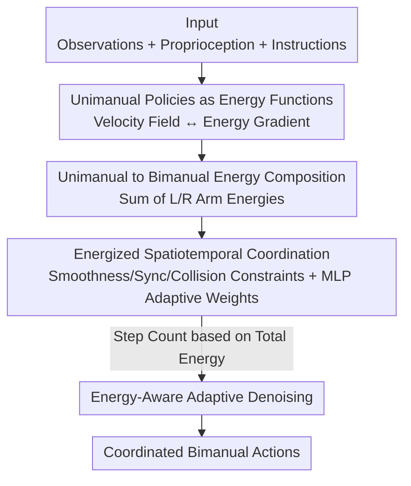

# EnergyAction: Unimanual to Bimanual Composition with Energy-Based Models

**Conference**: CVPR 2026  
**Paper**: [CVF Open Access](https://openaccess.thecvf.com/content/CVPR2026/html/Song_EnergyAction_Unimanual_to_Bimanual_Composition_with_Energy_Based_Models_CVPR_2026_paper.html)  
**Code**: https://github.com/codeshop715/EnergyAction  
**Area**: Robotics / Embodied AI  
**Keywords**: Bimanual Manipulation, Energy-Based Models (EBM), Compositional Transfer, Flow Matching, Adaptive Denoising  

## TL;DR
Two pre-trained unimanual policies are treated as energy functions and "composed" into a bimanual policy via energy summation. Spatiotemporal coordination is ensured through energy constraints, and an energy-aware adaptive denoising scheme determines the number of steps. This achieves coordinated bimanual manipulation with minimal dual-arm demonstration data (77.3% success rate on RLBench2 with only 20 demonstrations, outperforming the runner-up by 32.5%).

## Background & Motivation
**Background**: Unimanual manipulation policies have achieved significant success using large-scale demonstration data and mature architectures (RT series, Octo, Diffusion Policy, etc.). However, bimanual manipulation requires simultaneous control of two arms, leading to an exponentially larger action space and the challenge of temporal synchronization and spatial collision avoidance.

**Limitations of Prior Work**: Methods that directly model the joint bimanual action space (e.g., PerAct2) struggle to implicitly learn physical constraints from limited demonstrations, often resulting in collisions or desynchronization. Methods with fixed role assignments lack transferability. Furthermore, collecting high-quality bimanual teleoperation data is prohibitively expensive, making it difficult to train foundation models solely on bimanual data.

**Key Challenge**: Scarcity of bimanual data ↔ High-dimensional joint bimanual action space. Learning from scratch is inherently data-inefficient given the lack of data and the increased complexity compared to unimanual tasks.

**Goal**: Transfer the rich operational knowledge from existing unimanual policies to bimanual tasks with almost no additional bimanual demonstrations, while explicitly ensuring coordination and maintaining fast inference.

**Key Insight**: The authors leverage a classical tool often overlooked in modern robotics—Energy-Based Models (EBM). A key property of EBMs is **compositionality**: the sum of two energy functions corresponds to the "composition of concepts" in the probability distribution. Applying this to transfer learning allows bimanual action generation to be decomposed into a composition of two unimanual policies, following a "divide and conquer" approach.

**Core Idea**: Treat the left and right unimanual policies as individual energy functions. **Summing the energies composes them into a bimanual policy**. On top of this, spatiotemporal coordination energy constraints and energy-aware adaptive denoising are integrated to form EnergyAction.

## Method

### Overall Architecture
The input to EnergyAction consists of shared visual observations $o_t$, proprioceptive states of both arms $p_t^i$, and language instructions $l$. The output is the coordinated actions $a_t=(a_t^L, a_t^R)$ for both arms at each timestep (comprising 6D end-effector poses and gripper states). The pipeline does not retrain a joint bimanual policy. Instead, it reuses two **pre-trained unimanual Flow Matching policies** as energy functions: their conditional velocity fields are translated into energy gradients, and these energies are summed. Since the composed actions might violate coordination constraints, a coordination energy term—encoding temporal smoothness, bimanual synchronization, and collision avoidance—is added. During inference, the number of denoising steps is adaptively determined based on the current energy value: simple actions use one step, while complex ones use more.

### Key Designs

**1. Unimanual Policies as Energy Functions for Bimanual Composition: Using EBM Compositionality to Turn "Policy Composition" into "Energy Addition"**

The key challenge is the difficulty of training joint bimanual policies. The authors mathematically align a unimanual Flow Matching policy with EBMs. Flow Matching inference follows a deterministic ODE update $a_{t+\Delta t}^i = a_t^i + \Delta t\cdot v_\theta(a_t^i,t,c^i)$, while Langevin sampling in EBMs, in the deterministic limit without noise and with $\eta=\Delta t$, is $a_{t+\Delta t}^i = a_t^i - \Delta t\cdot \nabla_{a^i}E_\theta(a_t^i,c^i)$. The forms are identical, leading to the core correspondence $v_\theta(a_t^i,t,c^i) = -\nabla_{a^i}E_\theta(a_t^i,c^i)$—**the velocity field is the negative energy gradient**. Thus, a unimanual policy is interpreted as an implicit energy function $E_\theta(a_t^i,c^i):=-\log p_t(a_t^i|c^i)+\text{const}$.

With this equivalence, composition is simply the summation of the energies of both arms:

$$E_{comp}(a_t^L,a_t^R\mid c^L,c^R) = E_{\theta_L}(a_t^L,c^L) + E_{\theta_R}(a_t^R,c^R)$$

The corresponding bimanual distribution is $p(a_t\mid c^L,c^R)\propto p(a_t)\frac{p(a_t^L\mid c^L)}{p(a_t^L)}\frac{p(a_t^R\mid c^R)}{p(a_t^R)}$. By relating the ratio of conditional/unconditional distributions to classifier-free guidance, a composable velocity field is obtained for sampling:

$$v_{comp}(a_t,t)=v_\theta(a_t,t)+\sum_{i\in\{L,R\}}w_i\big[v_\theta^i(a_t^i,t,c^i)-v_\theta^i(a_t^i,t)\big]$$

The guidance weight $w_i$ is set to 1. This composition preserves the modular structure and parameters of pre-trained unimanual policies, making knowledge transfer nearly cost-free.

**2. Energized Spatiotemporal Coordination Constraints + MLP Adaptive Weights: Preventing Conflict and Jitter in Composed Actions**

Simply summing energies might lead to independent actions that are temporally incoherent or spatially conflicting. Coordination is modeled as additional energy terms. Temporally, end-effector poses use finite differences for hierarchy: first-order for velocity $\mathcal{E}_{vel}=\sum_i\|a_t^i-a_{t-1}^i\|^2$, second-order for acceleration, and third-order for jerk. A synchronization term $\mathcal{E}_{sync}=\big\|\|v_t^L\|_2-\|v_t^R\|_2\big\|^2+\|\hat v_t^L-\hat v_t^R\|^2$ constrains the magnitude and direction of both arms' velocities. Spatially, a smooth collision avoidance energy $\mathcal{E}_{ee}=\max(0,d_{safe}-d_{ee}(a_t^L,a_t^R))^2$ prevents the end-effectors from colliding (safe distance $d_{safe}=0.001$m). Inverse kinematics (IK) is used to calculate joint configurations $j_t^i=\text{IK}(a_t^i,j_{t-1}^i)$ for a similar constraint in joint space. The $\max(0,\cdot)^2$ form ensures continuous gradients for end-to-end optimization.

Instead of manual tuning, weights for the six constraints are predicted by a lightweight MLP: $\{w_1,\dots,w_6\}=\text{softmax}(\text{MLP}([a_t^L;a_t^R;v_t^L;v_t^R]))$. This allows the model to prioritize collision avoidance when arms are close or smoothness during rapid velocity changes. The total energy $E_{total}^{(t)}=E_{comp}^{(t)}+E_{coord}^{(t)}$ governs both "semantic correctness" and "coordination feasibility," with the update $a_{t+\Delta t}=a_t+\Delta t\cdot v_{total}(a_t,t)$.

**3. Energy-Aware Adaptive Denoising: Using Energy as a "Difficulty Meter" to Optimize Inference**

Fixed-step denoising is computationally wasteful for simple actions. The authors observe that $E_{total}$ naturally characterizes action difficulty: low energy indicates a simple action where constraints are met, while high energy indicates uncertainty or constraint violations. Two strategies are proposed. **Algorithm 1 (Adaptive Denoising)**: Step count is determined by initial energy, where $E_{total}<\tau_{low}$ uses 1 step and $E_{total}>\tau_{high}$ uses the maximum (5 steps for Flow Matching), with linear interpolation in between ($\tau_{low}=4, \tau_{high}=10$). **Algorithm 2 (Early-Stop Denoising)**: Energy is monitored during denoising, stopping immediately if it falls below $\tau_{low}$. These strategies reduce average steps to 1.79/1.27 and 2.13/2.32 while maintaining success rates.

### Loss & Training
Unimanual policies are pre-trained on 18 RLBench tasks using the Flow Matching objective $\mathcal{L}_\theta=\mathbb{E}_{t,X_1}[\|v_\theta(X_t,t)-v_t^*(X_t)\|^2]$. When composing for bimanual tasks, the joint policy is not trained; only the coordination energy and adaptive weight MLP are fitted on small bimanual demonstration sets (1/5/10/20/100 demos). Vision is processed from 6 RGB-D cameras at 256×256 resolution.

## Key Experimental Results

### Main Results
Evaluation on 13 language-conditioned bimanual tasks in RLBench2, reporting mean success rates (%) over 3 random seeds. EnergyAction achieves the highest success rates in both 20 and 100 demo settings, with a significant advantage in low-data scenarios.

| Setting | Metric | EnergyAction | 3DFA (Runner-up) | Gain |
|------|------|------|----------|------|
| 100 demo | Mean Success Rate | 86.4 | 81.8 | +4.6 |
| 20 demo | Mean Success Rate | 77.3 | 44.8 | +32.5 |
| 20 demo · Handover item | Success Rate | 68.0 | 43.0 | +25.0 |
| 20 demo · Take Tray out of Oven | Success Rate | 90.0 | 13.0 | +77.0 |

With 20 demonstrations, EnergyAction outperforms 3DFA by 32.5%, demonstrating that compositional transfer effectively utilizes unimanual knowledge and bypasses the optimization difficulties of high-dimensional bimanual spaces.

### Ablation Study
Stepwise removal of the three energy components (E-Compose / E-Temporal / E-Spatial) on mean success rate:

| E-Compose | E-Temporal | E-Spatial | 20 demo | 100 demo | Note |
|:-:|:-:|:-:|:-:|:-:|------|
| ✓ | ✓ | ✓ | 77.3 | 86.4 | Full Model |
| ✓ | ✓ | ✗ | 76.6 | 85.3 | Without spatial constraints |
| ✓ | ✗ | ✓ | 76.1 | 84.9 | Without temporal constraints |
| ✓ | ✗ | ✗ | 73.4 | 82.1 | Composition only |
| ✗ | ✗ | ✗ | 35.1 | 50.5 | Significant collapse |

### Key Findings
- **Energy composition is the foundation**: Removing all energy components causes a drop from 77.3% to 35.1% (20 demos), proving the energy framework is critical for transfer. Composition alone without coordination is insufficient (73.4%).
- **Effective even without unimanual pre-training**: Varying pre-training tasks from 0 to 18 shows consistent improvement, but even with **zero unimanual pre-training**, the model achieves 52.3%, surpassing the bimanual-specific 3DFA (44.8%).
- **Decoupled from unimanual policy selection**: Replacing L/R arm policies with combinations of DDPM/DDIM/Flow Matching yields similar results, showing the framework does not depend on a specific implementation.
- **Real-world verification**: On a Galaxea R1 lite for Handover and Pick up Plate tasks, EnergyAction (20 demos) achieved 52.5%, significantly higher than 3DFA (35.0%), π0-keypose (27.5%), and AnyBimanual (22.5%).

| L/R Arm Policy | 20 demo | 100 demo |
|------|:-:|:-:|
| Flow Matching / Flow Matching | 77.3 | 86.4 |
| DDPM / DDPM | 76.2 | 86.1 |
| DDIM / DDIM | 75.3 | 82.1 |
| DDPM / DDIM | 74.5 | 83.7 |

## Highlights & Insights
- **Turning "Policy Composition" into "Energy Addition"**: The most elegant contribution is proving that the Flow Matching velocity field equals the negative energy gradient, allowing for simple energy addition. This "reuse of old parts for new functions" can be extended to other multi-agent or multi-skill scenarios.
- **Versatile Use of Energy Values**: $E_{total}$ serves both as an optimization target for coordination and a "difficulty meter" for adaptive denoising, saving the need for an extra difficulty estimation module.
- **Adaptive Weights**: Using an MLP+softmax to handle the six physical constraint weights avoids manual tuning, serving as a practical engineering solution.

## Limitations & Future Work
- The method relies on **high-quality pre-trained unimanual policies**; poor unimanual performance limits the transfer potential (zero pre-training results in only 52.3%).
- Constraints like $d_{safe}=0.001$m and thresholds $\tau_{low}=4, \tau_{high}=10$ are fixed/empirical and may require retuning for different robot platforms or task scales. ⚠️ Sensitivity analysis across different tasks is missing.
- The assumption that bimanual tasks can be cleanly split into "L/R subtasks" might not hold for strongly coupled tasks where joint planning is indispensable.
- Real-world testing was limited to 2 tasks with 20 trials each, providing restricted evidence for broad generalization.

## Related Work & Insights
- **vs AnyBimanual**: While both aim to transfer unimanual knowledge, AnyBimanual relies on skill scheduling and visual alignment. Ours performs composition in energy space with explicit spatiotemporal constraints, leading to a 53.0% average gain and better collision avoidance.
- **vs 3DFA**: 3DFA is trained end-to-end for bimanual tasks using 3D scene representations. EnergyAction reuses unimanual policies, showing superior data efficiency (77.3% vs 44.8% with 20 demos).
- **vs Joint Modeling (PerAct2)**: Direct modeling of joint action spaces often fails to learn physical constraints from limited data. This work decomposes the high-dimensional problem into two unimanual sub-problems plus differentiable energy constraints.
- **vs EBM Composition in Other Fields**: While prior work used energy summation for image or human motion generation, this is the first to formulate bimanual manipulation as a composition of unimanual energy functions.

## Rating
- Novelty: ⭐⭐⭐⭐⭐ Elegant derivation of the velocity field/energy gradient equivalence for bimanual composition.
- Experimental Thoroughness: ⭐⭐⭐⭐ Coverage of various data regimes, ablations, and policy decoupling, though real-world scale is small.
- Writing Quality: ⭐⭐⭐⭐ Clear progression from motivation to method with well-defined innovations.
- Value: ⭐⭐⭐⭐⭐ Highly practical for bimanual manipulation where data is expensive, enabling reuse of unimanual knowledge.

<!-- RELATED:START -->

## Related Papers

- [\[ICCV 2025\] AnyBimanual: Transferring Unimanual Policy for General Bimanual Manipulation](../../ICCV2025/robotics/anybimanual_transferring_unimanual_policy_for_general_bimanual_manipulation.md)
- [\[CVPR 2026\] CUBic: Coordinated Unified Bimanual Perception and Control Framework](cubic_coordinated_unified_bimanual_perception_and_control_framework.md)
- [\[CVPR 2026\] ActiveGrasp: Information-Guided Active Grasping with Calibrated Energy-based Model](activegrasp_information-guided_active_grasping_with_calibrated_energy-based_mode.md)
- [\[CVPR 2026\] BiPreManip: Learning Affordance-Based Bimanual Preparatory Manipulation through Anticipatory Collaboration](bipremanip_learning_affordance-based_bimanual_preparatory_manipulation_through_a.md)
- [\[CVPR 2026\] QuantVLA: Scale-Calibrated Post-Training Quantization for Vision-Language-Action Models](quantvla_scale-calibrated_post-training_quantization_for_vision-language-action_.md)

<!-- RELATED:END -->
