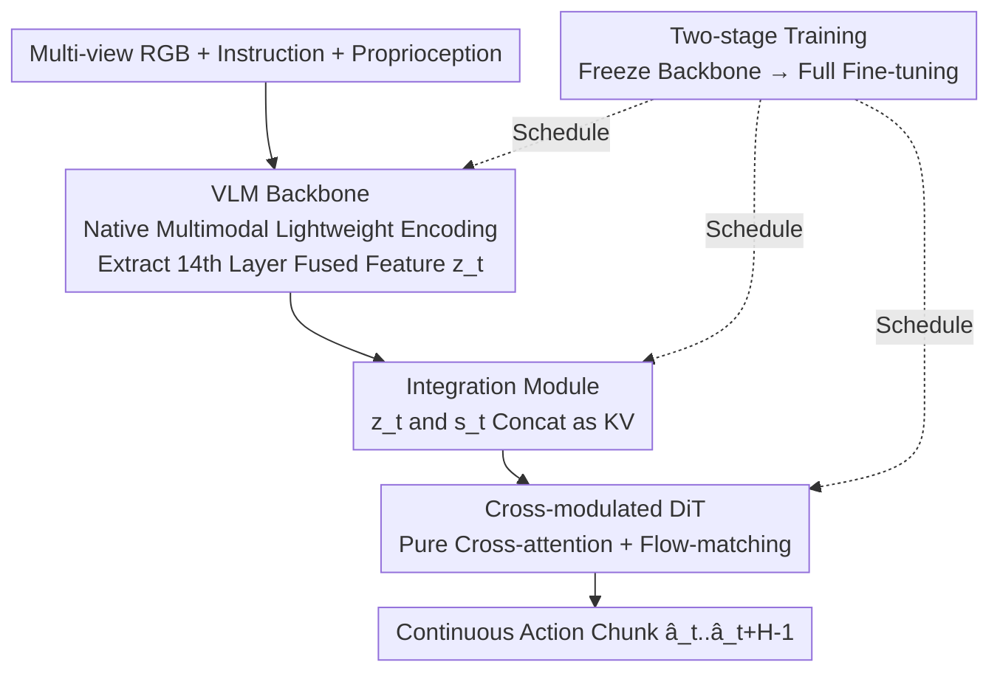

# Evo-1: Lightweight Vision-Language-Action Model with Preserved Semantic Alignment

**Conference**: CVPR 2026  
**Paper**: [CVF Open Access](https://openaccess.thecvf.com/content/CVPR2026/html/Lin_Evo-1_Lightweight_Vision-Language-Action_Model_with_Preserved_Semantic_Alignment_CVPR_2026_paper.html)  
**Code**: https://github.com/MINT-SJTU/Evo-1 (Available)  
**Area**: Embodied AI / Vision-Language-Action (VLA)  
**Keywords**: Lightweight VLA, Semantic Alignment Preservation, Flow-matching Diffusion, Cross-attention DiT, Two-stage Training  

## TL;DR
Evo-1 utilizes a native multimodal VLM with only 0.77B parameters as the backbone, paired with a pure cross-attention flow-matching diffusion action expert and a "freeze-then-fine-tune" two-stage training strategy. Without any robot data pre-training, it achieves SOTA on Meta-World, RoboTwin, and LIBERO by preserving the VLM's semantic space, reaching a 78% success rate in real-world tests with 16.4 Hz inference and only 2.3 GB VRAM.

## Background & Motivation
**Background**: Vision-Language-Action (VLA) models unify perception, language, and control into a multimodal framework, enabling robots to "see images, hear instructions, and perform actions." Mainstream approaches (OpenVLA, $\pi_0$, GR00T, etc.) typically employ large VLMs with billions of parameters as backbones and undergo extensive pre-training on large-scale robot datasets like OXE/DROID to gain strong generalization.

**Limitations of Prior Work**: This path faces four specific issues: ① Billion-parameter scales consume massive VRAM and compute; ② High computational load leads to low control frequency and slow real-world reaction; ③ Standard end-to-end joint training tends to **destroy the representation space of the VLM backbone**, leading to downstream overfitting and poor generalization; ④ Heavy reliance on expensive and labor-intensive large-scale robot data pre-training. Existing lightweight solutions (TinyVLA, SmolVLA) reduce parameters but lack performance and robustness in complex manipulation tasks.

**Key Challenge**: There is an overlooked tension between **preserving pre-trained VLM multimodal semantics** and **adapting to downstream action generation**. Direct end-to-end joint training allows noisy gradients from randomly initialized action heads to backpropagate into the VLM, disrupting the pre-aligned vision-language attention (the paper illustrates this "semantic drift" via attention maps).

**Goal**: Achieve high success rates and inference frequency under the constraints of no robot data pre-training and < 1B parameters, while preserving the backbone's generalization capability.

**Key Insight**: Rather than using a stitched backbone (pure-text LLM with a post-hoc vision aligner), it is more effective to use a **native multimodal** pre-trained compact VLM (InternVL3-1B), where vision-language representations are already tightly aligned. Furthermore, a training schedule is needed to prevent the action head from "polluting" the backbone.

**Core Idea**: A tripartite system consisting of a "native multimodal lightweight backbone + pure cross-attention flow-matching action expert + two-stage (freeze → fine-tune) training." By prioritizing "semantic alignment" as a protected asset, the model matches or exceeds large models despite small parameters and zero robot pre-training.

## Method

### Overall Architecture
Evo-1 is a modular VLA: given multi-view RGB observations $\{I_t^i\}_{i=1}^N$, language instructions $L_t$, and robot proprioception $s_t$, it outputs a continuous action vector $a_t \in \mathbb{R}^{d_a}$, formulated as $a_t = f_{\text{Evo-1}}(\{I_t^i\}_{i=1}^N, L_t, s_t; \theta)$. It consists of three core components: ① A **VLM backbone** encoding images and instructions into a fused representation $z_t$; ② An **integration module** aligning and concatenating $z_t$ with $s_t$ for the controller; ③ A **Cross-modulated Diffusion Transformer** (action expert) generating a sequence of future actions via flow-matching under these conditions. A **two-stage training** schedule determines which parts are frozen or thawed.

### Key Designs

**1. Native Multimodal Lightweight Backbone: Replacing Stitched Backbones with Tightly Aligned Small VLMs**

Addressing limitations ①② (large parameters, low frequency) and ③ (representation destruction), Evo-1 selects InternVL3-1B as the backbone instead of stitched 7B backbones like OpenVLA. InternVL3 learns vision and language jointly under a **single-stage native multimodal paradigm**, resulting in better cross-modal alignment. Consequently, after downstream training, its attention maps (Fig. 2) maintain spatial consistency and semantic focus, while Prismatic-7B exhibits significant drift. Specifically, it uses InternViT-300M (distilled from InternViT-6B), where RGB images are scaled to 448×448 and pixel-unshuffled to reduce vision tokens to 1/4, providing compact yet spatially granular patch embeddings. The language side uses Qwen2.5-0.5B. During fusion, patch-level image embeddings replace `` placeholder tokens in the sequence, passing through a shared decoder to obtain $z_t = f_{\text{VLM}}(\{I_t^i\}, L_t)$. A key trade-off is **keeping only the first 14 layers of the language branch**—the middle layers were found to have the strongest cross-modal alignment and are most useful for visual motor control; removing deeper layers saves compute without losing alignment info.

**2. Cross-modulated Diffusion Transformer: Pure Cross-attention Flow-matching Action Expert**

To efficiently generate coherent continuous actions, Evo-1's action expert is a DiT composed **only of stacked cross-attention layers**, intentionally omitting the alternating self-attention and cross-attention structure used in $\pi_0$/SmolVLA. The authors demonstrate that such alternation can interrupt the continuous propagation of multimodal information. It follows the flow-matching paradigm, learning a time-dependent velocity field to gradually push initial noise toward the ground-truth action. During training, ground-truth actions $A_t$ and random noise $\epsilon$ are linearly interpolated:

$$A_t^\tau = \tau A_t + (1-\tau)\epsilon,$$

where interpolation weight $\tau$ is sampled from a Beta distribution and clipped to $[0.02, 0.98]$ for stability. The action expert learns a velocity field $v_\theta$ conditioned on $z_t$ and $s_t$, with the objective:

$$\mathcal{L}^\tau(\theta) = \mathbb{E}\left[\,\left\| v_\theta(A_t^\tau, z_t, s_t) - u(A_t^\tau \mid A_t) \right\|^2\,\right],$$

where $u(A_t^\tau \mid A_t)$ is the target flow direction. At inference, it predicts an action chunk of length $H$: $\hat A_t = f_{\text{AE}}(z_t, s_t, A_t^\tau)$. The pure cross-attention and action chunking enable a compact structure and high inference frequency (16.4 Hz).

**3. Integration Module: "Concatenation" vs. "Projection" of Mid-layer Features and Proprioception**

To prevent loss of perceptual information, the integration module extracts fused features $z_t$ from the **14th layer** of the VLM (mid-layer semantics balancing vision and language). It then **directly concatenates** $z_t$ with proprioception $s_t$ rather than projecting them into a shared embedding space, preserving the integrity of both. The combined features serve as the key-value input for all DiT layers in the action expert, while noisy actions $A_t^\tau$ act as the query. Ablations compare this (Module A: Mid-Layer Cross-Attention) with three variants: B (alternating self/cross-attention), C (layer-wise injection of VLM features), and D (concatenating all as joint KV). Module A is optimal as it provides the most **continuous multimodal information propagation**.

**4. Two-stage Training: Freeze Backbone then Full Fine-tune to Protect Semantic Space**

This is the core design addressing the destruction of representations. Direct joint training forces gradients from the random action head into the VLM, distorting pre-trained semantics and causing overfitting. Evo-1 splits training: **Stage 1 (Action Expert Alignment)**—Freeze the entire VLM backbone and train only the integration module and action expert, allowing the action head to align with the multimodal embedding space without polluting the backbone. **Stage 2 (Full Fine-tuning)**—Thaw the VLM after alignment stabilizes, jointly fine-tuning the entire architecture to deeply couple the backbone and action head. Attention visualizations (Fig. 7) show that after two-stage training, attention remains focused on task-relevant regions, whereas single-stage training leads to attention scattering.

### Loss & Training
The core training objective is the flow-matching velocity regression loss $\mathcal{L}^\tau(\theta)$. The training follows the two-stage schedule. Simulation tasks use ~50 demonstrations per task, and real-world tasks use 100 teleoperated demonstrations, without any large-scale robot pre-training.

## Key Experimental Results

### Main Results
Simulation benchmarks (Success Rate %, higher is better; Evo-1 0.77B without robot pre-training):

| Benchmark | Metric | Evo-1 (0.77B) | Prev. SOTA | Gain |
|-----------|--------|---------------|------------|------|
| Meta-World | Average SR | **80.6** | SmolVLA 68.2 (2.25B) | +12.4 |
| RoboTwin | Average SR | **37.8** | $\pi_0$ 30.9 (3.5B) | +6.9 |
| LIBERO | Average SR | **94.8** | $\pi_0$ 94.2 (3.5B) | +0.6 |

On Meta-World, Evo-1 leads across all four difficulty levels; in "very hard," it achieves 79.2% (vs. SmolVLA 64.0%). In RoboTwin's "Click Alarmclock" (hard), it reaches 58% (vs. $\pi_0$ 11%), showing strong bimanual coordination.

Real-world tasks (xArm6, 20 trials/task) + Inference efficiency (RTX 4090d):

| Model | Params (B) | VRAM (GB) | Frequency (Hz) | Real-world SR (%) |
|-------|------------|-----------|----------------|-------------------|
| SmolVLA | 0.45 | 2.0 | 12.7 | 50.0 |
| OpenVLA | 7.0 | 15.1 | 7.9 | 55.0 |
| $\pi_0$ | 3.5 | 17.9 | 11.5 | 73.0 |
| **Ours** | **0.77** | **2.3** | **16.4** | **78.0** |

Evo-1 outperforms $\pi_0$ in VRAM, frequency, and success rate with approximately 1/4 of the parameters.

### Ablation Study

| Configuration | Validation Benchmark | Conclusion |
|---------------|-----------------------|------------|
| Integration Module A (Ours) | LIBERO-Long | Optimal - continuous info propagation |
| Integration Module B (Alt. SA/CA) | LIBERO-Long | Self-attention interrupts propagation |
| Integration Module C (Layer-wise) | LIBERO-Long | Inconsistent layer conditions |
| Integration Module D (Joint KV) | LIBERO-Long | Cross-layer inconsistency |
| Two-stage Training (Ours) | Meta-World | Outperforms single-stage across all difficulties |
| Single-stage Training | Meta-World | Semantic drift, scattered attention |

### Key Findings
- **Information propagation continuity is the key to integration module success**: Module A wins because a consistent mid-layer feature + state is fed to all DiT layers.
- **Two-stage training gains come from "preserving semantics"**: Attention maps show single-stage training causes the model to attend to irrelevant regions, whereas two-stage training preserves focus on task entities.
- **Generalization Robustness**: In real-world Pick-and-Place distractor experiments, Evo-1 outperforms SmolVLA with unseen distractors (80% vs. 65%), background color changes (75% vs. 60%), and target displacement.
- **Small Backbone + Native Multimodal > Large Backbone + Stitched Alignment**: InternVL3-1B produces more stable attention maps than Prismatic-7B, validating the value of "native alignment."

## Highlights & Insights
- **Treating "Semantic Alignment" as a protected first-class citizen**: While most VLAs default to end-to-end training, this work freezes the backbone first and quantifies "semantic drift," making the training schedule itself a core contribution.
- **Counter-intuitive choice of pure cross-attention DiT**: Removing self-attention is better because it prevents interrupting the continuous propagation of multimodal conditions.
- **Concatenation instead of Projection**: Using concat for the integration module avoids information compression caused by shared-space projection.
- **Engineering Friendly**: 0.77B + 2.3GB VRAM + 16.4Hz makes real-time control feasible on consumer-grade GPUs.

## Limitations & Future Work
- The paper does not provide fine-grained decoupling of design points (e.g., specific contributions of "native backbone" vs. "two-stage training").
- ⚠️ Real-world generalization tests were performed only on a single Pick-and-Place task; robustness to more dramatic distribution shifts remains to be verified.
- Hyperparameters like extracting the 14th layer are empirical; optimal layers might need to be re-searched for different backbones.
- Still relies on dozens to hundreds of demos per task; few-shot/zero-shot capability for entirely new tasks is not yet demonstrated.

## Related Work & Insights
- **vs. OpenVLA**: OpenVLA uses 7B Prismatic + discrete action modeling + OXE pre-training; Evo-1 uses 0.77B native multimodal backbone + continuous flow-matching + zero robot pre-training, achieving higher success (78% vs. 55%) with an order of magnitude fewer parameters.
- **vs. $\pi_0$**: $\pi_0$ is based on PaliGemma (3.5B) + flow-matching with robot pre-training; Evo-1 uses a pure cross-attention DiT with ~1/4 the parameters and outperforms it in both simulation and real-world tests.
- **vs. SmolVLA/TinyVLA**: These share the sub-billion parameter scale but lack robustness in complex tasks; Evo-1 differentiates itself via the native alignment backbone and semantic-preserving two-stage training.

## Rating
- Novelty: ⭐⭐⭐⭐ Combinatorial innovation (native backbone + pure cross-attention DiT + two-stage training) with a clear semantic focus.
- Experimental Thoroughness: ⭐⭐⭐⭐⭐ Comprehensive evaluation across three benchmarks, real-world tasks, and efficiency/generalization/ablations.
- Writing Quality: ⭐⭐⭐⭐ Clear structure; strong evidence via attention maps.
- Value: ⭐⭐⭐⭐⭐ SOTA results with 0.77B parameters and zero robot pre-training; highly deployable.

<!-- RELATED:START -->

## Related Papers

- [\[AAAI 2026\] Continuous Vision-Language-Action Co-Learning with Semantic-Physical Alignment for Behavioral Cloning](../../AAAI2026/robotics/continuous_vision-language-action_co-learning_with_semantic-.md)
- [\[CVPR 2026\] Mantis: A Versatile Vision-Language-Action Model with Disentangled Visual Foresight](mantis_a_versatile_vision-language-action_model_with_disentangled_visual_foresig.md)
- [\[CVPR 2026\] Counterfactual VLA: Self-Reflective Vision-Language-Action Model with Adaptive Reasoning](counterfactual_vla_self-reflective_vision-language-action_model_with_adaptive_re.md)
- [\[CVPR 2026\] MergeVLA: Cross-Skill Model Merging Toward a Generalist Vision-Language-Action Agent](mergevla_cross-skill_model_merging_toward_a_generalist_vision-language-action_ag.md)
- [\[CVPR 2026\] Progress-Think: Semantic Progress Reasoning for Vision-Language Navigation](progress-think_semantic_progress_reasoning_for_vision-language_navigation.md)

<!-- RELATED:END -->
