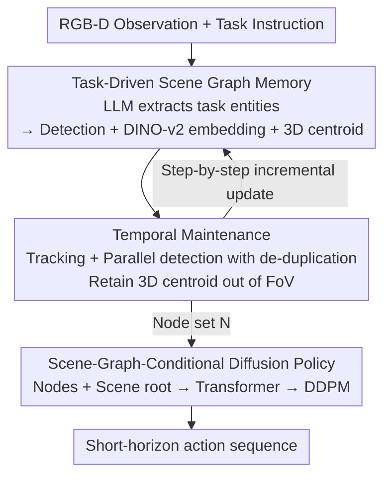

# Expanding Spatial and Temporal Context for Robotic Imitation Learning With Scene Graphs

**Conference**: CVPR 2026  
**Paper**: [CVF Open Access](https://openaccess.thecvf.com/content/CVPR2026/html/Qian_Expanding_Spatial_and_Temporal_Context_for_Robotic_Imitation_Learning_With_CVPR_2026_paper.html)  
**Code**: https://sites.google.com/view/objgraph (Project page, including code and videos)  
**Area**: Robotics / Embodied AI  
**Keywords**: Imitation Learning, Scene Graphs, Partially Observable, Long-horizon Tasks, Diffusion Policy

## TL;DR
Addressing the partially observable challenge where robots "cannot see everything or remember everything" in large spaces like homes or offices, this paper uses a **task-driven dynamic scene graph** as an explicit structured memory for imitation learning policies. By tracking only task-relevant objects and maintaining their evolving appearance and 3D positions over time, the entire graph is encoded into tokens and fed into a diffusion policy, significantly improving success rates in mobile and tabletop manipulation tasks requiring long-horizon reasoning.

## Background & Motivation
**Background**: Imitation learning (e.g., Diffusion Policy, ACT) has succeeded in learning dexterous, multimodal physical skills from hundreds of demonstrations. However, most achievements are concentrated on **small-scale, short-horizon** desktop manipulation, where partial observability is rarely an issue.

**Limitations of Prior Work**: When scaling up to large environments like multi-room or multi-floor homes and offices, or when tasks span hundreds or thousands of steps and concatenate multiple sub-tasks, the performance of existing policies degrades sharply. The root cause is **partial observability**. Robots rely on on-board cameras (body-mounted on mobile platforms, wrist-mounted on desktop arms) with highly restricted fields of view, which often fail to capture key decision-making objects during execution. For instance, the step of "pushing the microwave door open and putting a cup inside" depends heavily on how the microwave was opened in the first sub-task hundreds of steps prior—visuals of which have long left the camera frame.

**Key Challenge**: To successfully perform such tasks, robots must reason over information **currently outside their field of view**, which necessitates some form of memory. However, what should this memory look like? Modern vision can construct dense metric maps aggregating all historical viewpoints, but this "over-complete" memory introduces new challenges for policy learning: how can such massive maps be processed in neural policies, and how can they be trained sample-efficiently?

**Goal**: Design a **compact, incrementally updatable scene memory representation that can be directly used as input to neural policies**, enabling the policy to make decisions based on all task-relevant information in the scene, even if observed long ago.

**Key Insight**: Taking inspiration from cognitive science, humans maintain **abstract, task-relevant semantic memory** rather than pixel-level maps when performing long-horizon tasks. Correspondingly, **scene graphs** can sparsely store key scene information in large spaces. The graph structure naturally facilitates incremental updates as the environment changes, and tracking only task-relevant objects enables efficient learning in cluttered, large-scale environments.

**Core Idea**: Construct and dynamically maintain a **task-driven 3D semantic scene graph**, which is directly encoded as a sequence of tokens and fed into a diffusion policy. This represents a novel paradigm, as previous works either applied scene graphs to planning/navigation or mapped human demonstrations to robots, but none used dynamically maintained scene graphs as direct model inputs for imitation learning.

## Method

### Overall Architecture
The method consists of two major components: **(A) Task-Driven Scene Graph Construction and Temporal Maintenance**, which converts each frame of RGB-D observation into a set of object-centric node memories; and **(B) Scene-Graph-Conditional Diffusion Policy**, which encodes this set of nodes into a sequence of tokens to condition a Transformer + diffusion model for generating short-horizon actions.

Specifically, given a natural language task description, a Large Language Model (LLM) first extracts a list of "task-relevant noun entities." In the first frame, Grounding DINO detects and localizes objects from this list to initialize node structures. Each object node $n_i = [e_i, b_i, c_i]$ consists of three components: a DINO-v2 appearance embedding $e_i$, a 2D bounding box $b_i$ when currently visible, and a 3D centroid $c_i$ in the world frame. At each subsequent timestep, two operations run in parallel: updating existing nodes with a visual tracker and running detection on new observations to de-duplicate them using mask intersection-over-union (IoU), ensuring persistent object identity across frames. If an object leaves the field of view, $b_i$ is zeroed out, but the 3D centroid $c_i$ is **retained** (under the assumption that it remains stationary) and updated once it reappears. Finally, all nodes, along with a global "scene root node," are encoded as tokens and processed by a Transformer self-attention module for relational reasoning. This aggregates a compact scene representation $R_{sg}$, which conditions the diffusion policy to output action sequences.

### Key Designs

**1. Task-Driven Scene Graph Memory: Sparsifying the "Over-complete Map" into Relevant Nodes**

Simply put, the pain point is that dense metric maps store everything, making them difficult to ingest into neural policies and sample-efficiently to train. This paper does the opposite: it **tracks only task-relevant objects**. Given a language instruction, an LLM (e.g., GPT-5) extracts a list of potentially important noun entities, which are then localized and tracked in the scene. Each object is represented as a node $n_i = [e_i, b_i, c_i]$: the appearance embedding $e_i$ is obtained by average-pooling DINO-v2 features within the mask area, $b_i$ is the 2D bounding box, and $c_i$ is the 3D centroid estimated via depth back-projection (utilizing camera intrinsics, extrinsics, and odometry). The aggregate graph $N = \{n_i\}$ serves as a sparse, compact, and interpretable abstraction of the scene.

Why it works: The authors **do not explicitly parameterize edges**. Instead, relational structures are implicitly encoded via "joint processing of node attributes within a shared coordinate system." Since all $c_i$ reside within the same world coordinate system, spatial relationships and relative distances between objects can be inferred directly from the node features. This preserves spatial structure while avoiding the complexity of explicit mapping or edge learning, rendering the formulation inherently suitable for incremental updates across large environments (e.g., handles multi-room or multi-floor scenarios by adding a few more nodes).

**2. Temporal Maintenance: Tracking + Parallel Detection, Discarding Box but Retaining Centroid Out of Field of View**

The core challenge under partial observability is remembering the location of objects once they leave the field of view. The maintenance mechanism in this paper integrates two components: initializing a visual tracker for each existing node in the graph to ensure persistent identifiers across frames, and **running object detection in parallel at each step**. Newly detected candidate nodes $n_j$ are compared to existing nodes using mask overlap; if the overlap with all existing nodes remains below a threshold $\tau_m$, they are integrated into the graph as new objects (mirroring the reality of new objects appearing dynamically under partial observability).

The key design choice resides in out-of-field handling: when an object moves out of the field of view, its 2D bounding box $b_i$ is zeroed, but the **3D centroid $c_i$ is preserved unchanged**. It is assumed stationary until observed again, at which point $b_i$ and $c_i$ are updated. This decision to "discard the 2D bounding box while retaining the spatial location" enables the policy to locate previously seen but currently unobserved objects hundreds of steps later (such as the microwave door before being manipulated). This also highlights two essential differences between this method and using transient object tokens: nodes possess persistent identities over time with incremental updates, and spatial relationships are preserved via shared coordinates.

**3. Scene-Graph-Conditional Transformer + Diffusion Policy: Graph as Token Sequence to Condition DDPM**

Given the node set, the policy needs to ingest it. Each node is encoded as $E_i = [e_i,\ \mathrm{MLP}(b_i),\ \mathrm{MLP}(c_i)]$, where geometric attributes (2D bounding box and 3D centroid) are processed through separate multi-layer perceptrons (MLPs). Additionally, a **global scene root node** is introduced: the CLS token of the DINO-v2 ViT is designated as $e_{scene}$, paired with a full-image coverage bounding box $b_{scene}=[0,1,0,1]$ and origin coordinate $c_{scene}=[0,0,0]$ to yield $E_{scene}$. The complete scene graph representation is the token sequence

$$R_{sg} = [E_{scene},\ E_1,\ \dots,\ E_i,\ \dots]$$

This sequence is passed to a Transformer encoder, utilizing positional embeddings to designate the structural role of the nodes (e.g., differentiating the scene root). Self-attention enables comprehensive interaction among objects and between objects and the global scene, which is then aggregated into a compact representation via an MLP head to condition the downstream policy. Finally, a diffusion policy generates short-horizon actions: during training, forward noise is added to expert actions, and the denoising network $\epsilon_\theta(a_k, R_{sg}, k)$ predicts the injected noise under the DDPM objective

$$L(\theta) = \mathbb{E}_{a_0,\ k\sim U(1,K),\ \epsilon\sim\mathcal{N}(0,I)}\Big[\big\|\epsilon - \epsilon_\theta(a_k, R_{sg}, k)\big\|^2\Big]$$

During inference, beginning with Gaussian noise, action sequences are generated via iterative reverse diffusion utilizing a DDIM sampler. While the scene graph in current tasks typically assumes a shallow structure of "scene root + object nodes," it proves highly sufficient to characterize the object-centric states and spatial relations necessary for decision making.

### Loss & Training
Policy training follows the DDPM denoising target outlined above. Notably, the method addresses the **locomotion/manipulation mode switching** in mobile manipulation tasks: during demonstration collection, the robot operates strictly in either locomotion mode (frozen arm, controlled velocity of mobile base) or manipulation mode (fixed base, active arm) at any given time, alongside a recorded mode indicator. The network simultaneously predicts joint targets for both the base/arm and the mode indicator. During training, the raw mode signals are smoothed via a sigmoid function; during execution, actions are masked according to the predicted mode to activate the corresponding base or arm controller, achieving smooth transitions between locomotion and manipulation.

## Key Experimental Results

Experiments address three main questions: (1) Does the proposed method outperform existing imitation learning baselines on long-horizon tasks? (2) How well does it generalize across diverse tabletop and mobile manipulation tasks? (3) What are the individual contributions of each component? Since successful rates in the original paper are shown via stacked bar charts without exact numerical tables, task scale, runtime, and failure analysis data verifiable from the text are presented below, with success rate results summarized in qualitative comparison tables.

### Main Results

Task setups (Simulated Spot mobile manipulation + Real-world Franka tabletop manipulation):

| Setup | Task | Horizon (Steps) | Demonstrations | Key Challenges |
|------|------|---------|--------|---------|
| Sim. Mobile | Throw Trash | ~100 | 400/task | Navigation + grasping, random initial positions |
| Sim. Mobile | Heat-up Tea | ~300 | 400/task | Opening microwave door + inserting cup, multiple sub-tasks |
| Sim. Mobile | Heat-up Tea Long | ~1000 | 400/task | Greater distance between microwave and cup |
| Real Tabletop | Pineapple-Bowl | — | 300/task | Bowl leaves wrist camera field of view after lifting |
| Real Tabletop | Feed-Animals | — | 300/task | Remembering primary animal target to pick correct fruit |
| Real Tabletop | Feed-Giraffe | — | 300/task | Scanning shelves to locate giraffe + placing on correct tier |
| Real Tabletop | Clean-Table | — | 300/task | Remembering cleared objects before closing drawer |

Qualitative performance comparison of various methods on long-horizon tasks (the original success rates are depicted as bar charts; ⚠️ please refer to the original paper for exact values):

| Method | Memory Mechanism | Performance on Long-horizon Sub-tasks |
|------|---------|---------------|
| RGB (Vanilla DP) | None, only current dual-camera RGB + proprioception | Frequent failures when bowl/objects are moved far from their initial position |
| Visible-Objects | Object-centric representation solely within the current field of view | Better than RGB, but still lacks historical memory, leading to frequently gathering incorrect fruit |
| PTP [52] | Extended history window (10 frames) + predicting past/future actions | Improves short-term reasoning (first sub-task), but does not resolve the fundamental long-horizon challenge; rarely passes the first phase in real-world evaluations |
| **Ours** | Explicit dynamic scene graph (including 3D centroids) | Significantly higher success rates on subsequent sub-tasks and the full task; more robust over long horizons |

### Ablation Study

| Configuration | Node Representation | Key Results |
|------|---------|---------|
| Full model | $[e_i, b_i, c_i]$ Appearance + 2D box + 3D centroid | Full model, most robust over long horizons |
| w/o 3D | Remove 3D centroid $c_i$ ($e_i$ retained when invisible) | Minimal degradation in first sub-task; success rates on subsequent and final task **drop drastically** |
| w/o object locations | Retain only appearance $e_i$, discard all spatial locations | Similar to above; accuracy drops are even more pronounced over long horizons |

### Key Findings
- **Spatial information is crucial for long horizons**: Removing 3D centroids (or removing both 3D and 2D positions) has **almost no impact on the first sub-task**, but drastically degrades success rates on subsequent sub-tasks and the full task. This indicates that explicitly providing 3D centroids and 2D bounding boxes is essential for the policy to reliably localize and track task-relevant objects over long horizons.
- **Extending the time window $\neq$ Long-horizon memory**: Simply extending historical frames as done in PTP improves short-term reasoning but fails to address the root challenge of long-horizon manipulation. In real-world trials, it rarely progressed past the first stage, causing it to be excluded from real-robot baselines.
- **The bottleneck lies in the policy, not perception**: In 64 real-world episodes, only 4 failures were caused by segmentation errors due to occlusions/blurry boundaries, while LLM object enumeration and tracker initialization registered **zero failures**. The vast majority of failures stemmed from the downstream imitation policy itself during long-horizon execution.

Runtime measurements (Single NVIDIA 3090, proving real-time closed-loop capability):

| Component | Frequency / Latency | Call Frequency |
|------|----------|---------|
| LLM Object Enumeration | — | 1 time per task |
| Grounding DINO | 0.53 s | 1 time per episode |
| Mask Propagation | 0.19 s/frame | Every frame (main bottleneck during execution) |
| Diffusion Policy | 3.5–3.8 Hz (approx. 260–285 ms/step) | Every step |

## Highlights & Insights
- **"Tracking only task-relevant objects" is key to making dense maps learnable**: Utilizing an LLM to translate language instructions into a checklist of noun entities and sparsifying the scene accordingly circumvents the problem of stuffing over-complete maps into policies. This naturally supports incremental updates in large spaces, rendering it a highly transferable "task-conditional memory pruning" strategy.
- **Implicitly encoding relations via a shared coordinate system without explicit edges**: Pointedly avoiding raw edge-learning complexity allows the Transformer to extract relative positions and distances from jointly processed node attributes under a unified frame, maintaining engineering simplicity.
- **The "discard box but retain location" mechanism directly addresses long-horizon pain points**: Setting visual bounding boxes $b_i$ to zero while keeping $c_i$ intact (which ablation runs proved critical for subsequent sub-tasks) delivers a practical solution to "remembering where objects are hundreds of steps later."
- **First to feed a dynamically maintained scene graph directly into imitation learning**: In contrast to works like CLIO that solely perform simple grasping or limit scene graphs to planning/navigation, this work integrates the scene graph directly into the conditioning variables of a diffusion policy, filling a notable research gap.

## Limitations & Future Work
- **Reliance on accurate object recognition**: The authors acknowledge that the method depends heavily on the accuracy of object enumeration, detection, and segmentation, and may fail in **highly cluttered or highly dynamic** environments (e.g., real-world failures owing to occlusion-induced segmentation errors).
- **Shallow scene graph structure**: The graphs in current tasks predominantly follow a two-tier construct ("scene root + object nodes"), leaving the efficacy of deeper, hierarchical scene graphs (representing multi-room or multi-level spatial relationships) under-validated in policy learning.
- **Vulnerability of the stationarity assumption**: The assumption that objects remain stationary once they move out-of-view until re-observed can introduce memory discrepancies if objects are moved by third parties or accidentally displaced by the robot itself.
- **Future directions**: The authors envision incorporating task-relevant scene graphs as interpretable memories into future Vision-Language-Action (VLA) models, as well as modeling node uncertainty or dynamics directly to mitigate static scene assumptions.

## Related Work & Insights
- **vs CLIO [36]**: Both methods leverage hierarchical 3D scene graphs and query task instructions to infer appropriate granularity and sub-graphs. However, CLIO only demonstrates simple grasping, whereas this paper focuses on **using 3D semantic scene graphs to support long-horizon task execution**, passing the graph directly to the policy.
- **vs PTP [52]**: PTP extends the historical frames and predicts past/future actions with auxiliary losses to avoid spurious correlations in long contexts. In contrast, the memory in this work is **explicitly constructed** (rather than implicitly learned across space and time). Experiments demonstrate that simply extending the time window does not address the root issues of long-horizon manipulation.
- **vs State injection like ControlNet [34]**: [34] learns to integrate state information using ControlNet, whereas our scene memory explicitly encodes the large-scale **spatial-temporal** context as input representations for DP.
- **vs Scene graphs for human-to-robot mapping [49]**: [49] leverages scene graphs to map human demonstrations to robotic arms, while this work **directly encodes the scene graph as input to the downstream diffusion policy**.

## Rating
- Novelty: ⭐⭐⭐⭐ First to utilize a dynamically maintained task-driven scene graph as a direct input for imitation learning policies, with a distinct and clear entry point.
- Experimental Thoroughness: ⭐⭐⭐⭐ Combines simulation and real-world experiments, mobile and tabletop setups, ablation studies, and failure/runtime analyses. However, success rates are shown only via bar charts, lacking exact numerical tables.
- Writing Quality: ⭐⭐⭐⭐ Motivation and methods are clearly described with apt analogies to cognitive science.
- Value: ⭐⭐⭐⭐ Provides a compact, interpretable, and real-time memory solution for long-horizon imitation learning under partial observability, offering strong insights for VLA models.

<!-- RELATED:START -->

## Related Papers

- [\[CVPR 2026\] Learning Surgical Robotic Manipulation with 3D Spatial Priors](learning_surgical_robotic_manipulation_with_3d_spatial_priors.md)
- [\[CVPR 2026\] NIL: No-data Imitation Learning](nil_no-data_imitation_learning.md)
- [\[ICLR 2026\] MomaGraph: State-Aware Unified Scene Graphs with Vision-Language Models for Embodied Task Planning](../../ICLR2026/robotics/momagraph_state-aware_unified_scene_graphs_with_vision-language_models_for_embod.md)
- [\[CVPR 2026\] Lifelong Imitation Learning with Multimodal Latent Replay and Incremental Adjustment](lifelong_imitation_learning_multimodal_latent_rep.md)
- [\[ICLR 2026\] Primary-Fine Decoupling for Action Generation in Robotic Imitation](../../ICLR2026/robotics/primary-fine_decoupling_for_action_generation_in_robotic_imitation.md)

<!-- RELATED:END -->
