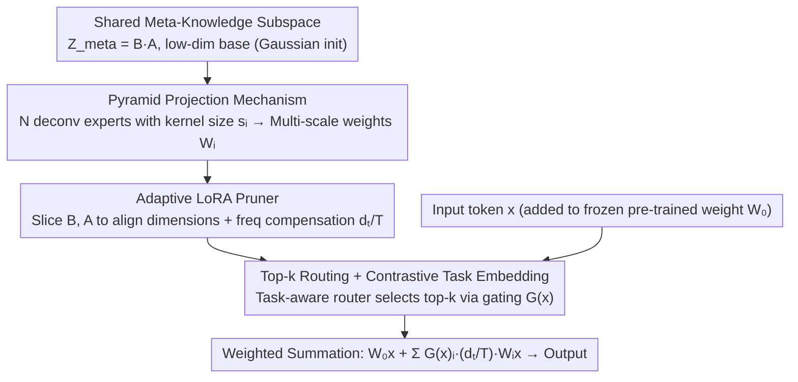

# Expert Pyramid Tuning: Efficient Parameter Fine-Tuning for Expertise-Driven Task Allocation

**Conference**: CVPR 2026  
**arXiv**: [2603.12577](https://arxiv.org/abs/2603.12577)  
**Code**: [https://anonymous.4open.science/r/EPT-B0E4](https://anonymous.4open.science/r/EPT-B0E4)  
**Area**: Robotics  
**Keywords**: [PEFT, LoRA, Mixture-of-Experts, Multi-scale Feature Pyramid, Deconvolutional Projection]

## TL;DR
Addressing the issue where uniform expert structures (fixed rank) in MoE-LoRA methods fail to adapt to tasks of varying complexity, EPT is proposed. By constructing a parameter pyramid using a shared meta-knowledge subspace combined with deconvolutional experts of different kernel sizes, integrated with an Adaptive LoRA Pruner and contrastive task embedding, it achieves an average score of 87.0% on GLUE with only 0.41M parameters per task, outperforming all MoE-LoRA variants.

## Background & Motivation
**Background**: PEFT (especially LoRA) has become the mainstream paradigm for deploying LLMs in multi-task scenarios. To mitigate negative transfer caused by gradient conflicts between tasks, MoE-LoRA methods (e.g., MOELoRA, HydraLoRA, MoRE) utilize gating mechanisms to route tokens to different low-rank experts.

**Limitations of Prior Work**: Most MoE-LoRA methods employ experts with identical structures—the same rank and capacity. However, task complexities vary significantly: simple tasks (e.g., sentiment classification SST-2) require high-level semantic abstraction, while complex tasks (e.g., linguistic acceptability CoLA) require granular syntactic analysis. The authors empirically verified that optimal ranks for T5-base vary across GLUE tasks (e.g., MRPC optimal rank=1, RTE=4, CoLA=8).

**Key Challenge**: Uniform expert architectures cannot capture diverse feature granularities. Low-rank experts lack expressiveness for complex tasks, while high-rank experts lead to over-parameterization and poor generalization on simple tasks. Furthermore, experts learning independent LoRA matrices lack knowledge sharing, leading to parameter redundancy.

**Goal**: (a) Enable different experts to capture varied feature granularities; (b) Share general linguistic knowledge across experts while preserving task specificity; (c) Accurately route tokens to appropriate experts.

**Key Insight**: Drawing from the multi-scale concept of Feature Pyramid Networks in CV—where identifying objects of different sizes requires features of different resolutions—processing NLP tasks of varying complexity requires parameter adaptation at different granularities.

**Core Idea**: Utilize deconvolutional operators with different kernel sizes to project a multi-scale parameter pyramid from a shared low-dimensional meta-knowledge subspace, replacing independent uniform experts in MoE-LoRA.

## Method

### Overall Architecture
EPT addresses the "identical expert" problem in MoE-LoRA. Since different tasks require different adaptation granularities, the experts themselves should have varying capacities. It replaces LoRA modules in Transformer linear layers but avoids maintaining independent low-rank matrices for each expert. Instead, all experts share a low-dimensional meta-knowledge subspace $\mathbf{Z}_{meta}$, which is then "expanded" into weight increments of different scales via deconvolution with varying kernel sizes. For an incoming token, the router selects top-k experts; each selected expert projects its weight increment $\mathbf{W}_i$ from $\mathbf{Z}_{meta}$. These are weighted by gating scores and added to the pre-trained weights $\mathbf{W}_0$. The architecture forms a "parameter pyramid" with a compact shared meta-knowledge base expanded into multi-scale expert weights.

### Key Designs

**1. Shared Meta-Knowledge Subspace: Feeding all experts with a low-dimensional base**

Traditional MoE-LoRA assigns independent LoRA matrices to each expert, which is redundant and fails to capture cross-task commonalities. EPT maintains a single shared base $\mathbf{Z}_{meta} = \mathbf{B} \cdot \mathbf{A}$ (where $\mathbf{A} \in \mathbb{R}^{R \times W_{max}}$, $\mathbf{B} \in \mathbb{R}^{H_{max} \times R}$, and $h, w \ll d_{model}$). All experts start from this base, differing only in how they "interpret" it—analogous to observers viewing the same image at different resolutions. Notably, $\mathbf{A}$ and $\mathbf{B}$ use random Gaussian initialization rather than the zero initialization typical of standard LoRA, ensuring $\mathbf{Z}_{meta}$ carries non-degenerate, information-rich representations from the start.

**2. Pyramid Projection Mechanism: Giving experts distinct scales**

Addressing the "uniform rank" pain point, EPT defines $N$ deconvolutional experts. Each expert's kernel tensor $\mathcal{K}_i$ has a distinct kernel size $s_i$ (with stride $s_i$). The projection $\mathbf{W}_i = \text{Deconv}(\mathbf{Z}_{meta}; \mathcal{K}_i)$ expands the shared base into weight matrices of different sizes. Small-kernel experts have fewer parameters and focus on local fine-grained patterns, while large-kernel experts cover global, long-range semantics. This realizes a "true multi-scale" architecture. In implementation, 8 experts are used with scales $\{2,2,4,4,6,6,8,8\}$. Each kernel $\mathcal{K}_i$ is zero-initialized to avoid perturbing pre-trained weights at the beginning of training.

**3. Adaptive LoRA Pruner: Aligning outputs to target layer dimensions**

Transformer layers have non-uniform target dimensions (e.g., differences between attention projections and FFNs). To align deconvolutional outputs, the pruner slices the meta-knowledge base. For target dimensions $(h_t, w_t)$, it takes the first $h_t$ rows of $\mathbf{B}$ and $w_t$ columns of $\mathbf{A}$ to form a scale-specific meta-seed $\mathbf{Z}_{meta}^{(t)} = \mathbf{B}_{:h_t,:} \cdot \mathbf{A}_{:,:w_t}$. To solve gradient imbalance (where shared parameters update every step but task-specific ones update once per $T$ steps), EPT introduces a dimension-aware scaling factor $d_t/T$, formulating the forward pass as:

$$\mathbf{L} = \mathbf{W}_0 \mathbf{x} + \sum_{i \in \mathcal{P}} G(x)_i \cdot \frac{d_t}{T} \cdot (\mathbf{W}_i \mathbf{x})$$

**4. Top-k Routing + Contrastive Task Embedding: Task-aware routing**

Standard MoE routing relies solely on token features $G(x)_i = \text{softmax}(\mathbf{W}_r \cdot x / \tau)$, which can conflate tokens from different tasks. EPT learns a specific task embedding $\mathbf{e}_t$ for each task and uses a contrastive loss $\mathcal{L}_{con} = -\frac{1}{M}\sum_i \log \frac{e^{s_{i,t_i}}}{\sum_k e^{s_{i,k}}}$ to pull samples of the same task closer in the embedding space. This explicitly encodes task correlations and differences into routing signals. PCA visualization confirms that related tasks (e.g., QNLI and MNLI) cluster together, while distinct tasks (e.g., CoLA and STS-B) separate. The total loss is $\mathcal{L}_{total} = \mathcal{L}_{gen} + \lambda \mathcal{L}_{con}$ with $\lambda = 0.1$.

### Loss & Training
- Total Loss: $\mathcal{L}_{total} = \mathcal{L}_{gen} + \lambda \mathcal{L}_{con}$.
- Optimizer: AdamW, peak learning rate $3 \times 10^{-4}$, linear decay with 500 warmup steps.
- Training: 5 epochs, batch size 32, max sequence length 128.
- Temperature $\tau = 0.05$ for routing distribution smoothing.
- Balanced sampling: Tasks sampled with probability $P_t = 1/T$.
- Re-parameterization: Deconvolutional projections can be merged into pre-trained weights for inference, ensuring zero additional overhead.

## Key Experimental Results

### Main Results (GLUE Benchmark, T5-base)

| Method | Params/Task | MNLI | QQP | QNLI | SST-2 | STS-B | MRPC | RTE | CoLA | AVG |
|------|-----------|------|-----|------|-------|-------|------|-----|------|-----|
| LoRA (r=8) | 0.39M | 85.8 | 89.2 | 93.1 | 93.2 | 90.4 | 89.9 | 76.3 | 62.8 | 85.1 |
| MOELoRA | 0.81M | 86.3 | 90.4 | 93.2 | 94.2 | 89.8 | 90.7 | 79.9 | 65.3 | 86.2 |
| MoRE | 0.81M | 85.6 | 90.2 | 93.1 | 93.9 | 89.9 | 90.7 | 77.7 | 68.7 | 86.2 |
| **EPT** | **0.41M** | **86.4** | 90.2 | **93.6** | **94.5** | 90.0 | **90.7** | **82.0** | **68.9** | **87.0** |

### Common Sense Reasoning (LLaMA2-7B)

| Method | Params/Task | BoolQ | OBQA | ARC-E | ARC-C | AVG |
|------|-----------|-------|------|-------|-------|-----|
| LoRA | 2.1M | 74.0 | 74.0 | 80.9 | 63.5 | 73.1 |
| MoRE | 4.5M | 74.7 | 80.5 | 80.0 | 64.5 | 74.9 |
| **EPT** | **3.3M** | 76.1 | 78.4 | **81.4** | **66.2** | **75.5** |

### Ablation Study

| AB init | Top-K | ALP | AVG |
|---------|-------|-----|-----|
| ✗ | ✗ | ✗ | 86.0 |
| ✗ | ✗ | ✓ | 86.2 |
| ✓ | ✗ | ✓ | 86.5 |
| ✗ | ✓ | ✓ | 86.7 |
| ✓ | ✓ | ✓ | **87.0** |

All components contribute 0.3-0.5 points, with the combined model achieving best performance.

### Pyramid Structure Comparison

| Configuration | Description | AVG |
|------|------|-----|
| EPT-2 | All experts dim=2 | 86.5 |
| EPT-4 | All experts dim=4 | 86.2 |
| EPT-8 | All experts dim=8 | 86.3 |
| EPT-2468 | Mixed {2,2,4,4,6,6,8,8} | **87.0** |

Mixed multi-scale configurations consistently outperform uniform scale configurations.

## Highlights & Insights
- **Novel Parameter Pyramid Concept**: Effectively migrates the multi-scale FPN concept from CV to PEFT.
- **High Parameter Efficiency**: Achieves superior performance with only 0.41M parameters/task (~half of MOELoRA) due to shared meta-knowledge.
- **Re-parameterization**: Zero inference latency as deconvolutional results merge into weights.
- **Expert Allocation Visualization**: Complex tasks (QNLI/QQP) activate high-dimensional experts (7-8), while small/simple tasks activate low-dimensional ones (1-2), validating the hypothesis.
- **Frequency Compensation**: The $d_t/T$ factor addresses the overlooked issue of unbalanced gradient energy in multi-task optimization.

## Limitations & Future Work
- Static expert dimension configurations; dynamic searching via NAS/AutoML could be beneficial.
- Evaluation limited to NLU; generative tasks (summarization, translation) are not explored.
- Scalability to very large models (13B+) is yet to be verified.
- Contrastive learning relies on task labels, limiting use in task-agnostic settings.
- Training speed quantification relative to standard LoRA is missing.

## Related Work & Insights
- **vs Standard LoRA**: EPT uses multi-scale deconvolutional projection instead of uniform rank decomposition, enabling task-sharing via a meta-subspace.
- **vs MOELoRA / MoRE**: These use independent experts with uniform structures. EPT shares a meta-base and projects different scales, reducing parameters (0.41M vs 0.81M).
- **vs HydraLoRA**: While HydraLoRA shares B matrices, its expert architectures remain uniform. EPT introduces structural multi-scale diversity.
- **vs DyLoRA / AdaLoRA**: These perform dynamic rank allocation for single tasks. EPT naturally achieves rank adaptation in a multi-task framework.

## Rating
- Novelty: ⭐⭐⭐⭐ The FPN-to-PEFT analogy is clever and effective.
- Experimental Thoroughness: ⭐⭐⭐⭐ Strong GLUE and reasoning results, though missing generative tasks.
- Writing Quality: ⭐⭐⭐⭐ Clear motivation and systematic method description.
- Value: ⭐⭐⭐⭐ Excellent performance-to-parameter ratio with practical inference benefits.

<!-- RELATED:START -->

## Related Papers

- [\[NeurIPS 2025\] PROFIT: A Specialized Optimizer for Deep Fine Tuning](../../NeurIPS2025/robotics/profit_a_specialized_optimizer_for_deep_fine_tuning.md)
- [\[CVPR 2026\] Test-Time Perturbation Tuning with Delayed Feedback for Vision-Language-Action Models](test-time_perturbation_tuning_with_delayed_feedback_for_vision-language-action_m.md)
- [\[CVPR 2026\] Learning to See and Act: Task-Aware Virtual View Exploration for Robotic Manipulation](learning_to_see_and_act_task-aware_virtual_view_exploration_for_robotic_manipula.md)
- [\[CVPR 2026\] LEAD: Minimizing Learner-Expert Asymmetry in End-to-End Driving](lead_minimizing_learner-expert_asymmetry_in_end-to-end_driving.md)
- [\[CVPR 2026\] DextER: Language-driven Dexterous Grasp Generation with Embodied Reasoning](dexter_language-driven_dexterous_grasp_generation_with_embodied_reasoning.md)

<!-- RELATED:END -->
