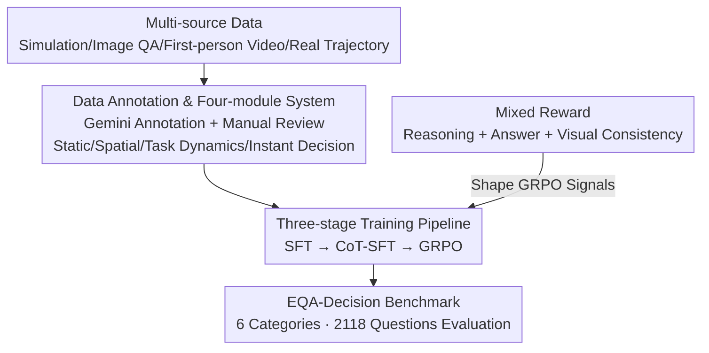

# Extending Embodied Question Answering from Perception to Decision

**Conference**: CVPR 2026  
**Paper**: [CVF Open Access](https://openaccess.thecvf.com/content/CVPR2026/html/Gong_Extending_Embodied_Question_Answering_from_Perception_to_Decision_CVPR_2026_paper.html)  
**Code**: To be confirmed  
**Area**: Robotics / Embodied AI  
**Keywords**: Embodied Question Answering (EQA), Multi-modal Large Language Models (MLLMs), Decision Reasoning, GRPO, Dataset and Benchmark  

## TL;DR
This work constructs EQA-Decision, a 4-million-scale embodied question answering dataset (covering nine sub-tasks across four modules: static scenes, spatial understanding, task dynamics, and instant decision-making). Based on Qwen3-VL-8B, the authors train a strong baseline model, RoboDecision, through a three-stage "SFT → CoT-SFT → GRPO + Mixed Reward" pipeline. This advances embodied QA from "what is seen" to "what should be done now," improving the overall score from 48.84 to 68.06 across six task categories in the self-built benchmark.

## Background & Motivation
**Background**: Multi-modal Large Language Models (GPT-4V, Gemini-2.5, Qwen2.5-VL) have accelerated the development of embodied AI. Researchers are increasingly integrating MLLMs into robotic/embodied environments, leading to various datasets and benchmarks for evaluating perception and reasoning.

**Limitations of Prior Work**: Existing embodied QA datasets are fragmented—some focus only on spatial understanding, while others target procedural planning. These datasets tend to emphasize **static perception or isolated reasoning skills** (spatial grounding, planning), lacking a unified large-scale framework for comprehensive evaluation. Crucially, they almost entirely ignore the **decision-making process that unfolds over time** as an agent interacts with a dynamic environment.

**Key Challenge**: True embodied intelligence requires instant decision-making—knowing "what to do now"—which depends on modeling the temporal linkage between perception, reasoning, and action. Existing benchmarks do not explicitly model this temporal evolution, and thus **cannot characterize instant decision-making**, a core capability of embodied intelligence.

**Goal**: (1) Create a unified, large-scale embodied QA dataset and benchmark covering perception, space, temporal dynamics, and decision-making; (2) Develop a strong baseline model that effectively bridges "perception" to "decision-making."

**Key Insight**: The authors decompose embodied reasoning along the "perception-to-decision" axis into four complementary dimensions. They introduce two novel task formats: **progress estimation** and **context-aware instant decision-making**, allowing benchmarks to evaluate an agent's ability to reason about temporal dynamics and adjust actions in real-time.

**Core Idea**: Use a "hierarchical task system + vision-grounded reinforcement rewards" to extend embodied QA from static perception to temporal decision-making. Systematically cover nine sub-tasks across four modules in the data, and use mixed rewards to force reasoning to anchor on visual evidence rather than textual priors in the model.

## Method

### Overall Architecture
The work presents a tripartite framework: "Dataset + Baseline Model + Benchmark." **Data Side**: Raw data is aggregated from four sources: simulation environments, image QA, first-person videos, and real-robot trajectories. Using Gemini-2.5-pro for assisted annotation plus manual verification, the EQA-Decision dataset was constructed with over 4 million QA pairs (approximately 10% with CoT annotations) organized into four modules and nine sub-tasks. **Model Side**: Using Qwen3-VL-8B as the backbone, the model undergoes three-stage training (SFT → CoT-SFT → GRPO). A "reasoning + answer + visual consistency" mixed reward is applied throughout to derive RoboDecision. **Evaluation Side**: Comparisons are made against open/closed-source VLMs and embodied baselines on the EQA-Decision Benchmark (6 task categories, 2118 questions), which is strictly disjoint from the training set.

### Key Designs

**1. Hierarchical Task System: Decomposing embodied QA into four modules and nine sub-tasks along the "perception → decision" axis**

To address the failure of existing datasets to cover comprehensive skills and decision processes, the authors split the embodied reasoning system into four complementary modules further divided into nine sub-tasks: **Static Scene Construction** (Existence & State, Counting & Localization) → **Spatial Understanding** (Depth & Direction, Grounding & Referring, Affordance) → **Task Dynamics Reasoning** (Sub-task Planning, State Tracking & Causality, Progress Estimation) → **Instant Decision-making**. The first two modules correspond to traditional "what is seen" perception, while the latter two are new temporal/decision capabilities introduced in this work. Each sub-task has a dedicated annotation pipeline: for example, **Progress Estimation** uses AgiBot/Open X-Embodiment trajectories sliced by velocity and direction changes, with normalized progress ratios calculated from frame indices; **Instant Decision-making** randomly samples "intermediate transition frames" from continuous action segments (intervals $\leq 5$s) where Gemini summarizes current steps, completion status, and agent-object spatial relationships to generate context-aware "next action" QA. Of the 4 million QA pairs, Depth & Direction (1.1M), State Tracking & Causality (0.93M), and Instant Decision (1.0M) dominate, intentionally skewing towards spatial, temporal, and decision aspects. Compared to Robo2VLM/RoboVQA/ShareRobot (see Table 1), only EQA-Decision covers all nine sub-tasks with **CoT annotations**.

**2. Three-stage Progressive Training: Injecting knowledge, learning reasoning, and grounding decisions**

To prevent MLLMs from relying on textual priors—where the model outputs similar answers even if visual evidence changes—the authors use a three-stage pipeline to approach decision-making capability. **Stage 1 SFT**: Starting from Qwen3-VL-8B-Instruct, the model is fine-tuned using LoRA. The visual encoder is frozen for stability, optimizing only the language and fusion layers; data is **sampled uniformly** across the four modules to inject embodied domain knowledge and establish foundational spatial/temporal/decision reasoning. **Stage 2 CoT-SFT**: Approximately 10% of the data is uniformly sampled, and Gemini-2.5-pro generates CoT annotations consisting of "rationale" and "answer" fields. LoRA fine-tuning continues on this subset to teach the model to construct coherent multi-step reasoning chains across space and time, providing a warm start for GRPO and stabilizing reward signals. **Stage 3 GRPO**: Group Relative Policy Optimization is used for reinforcement fine-tuning, with mixed rewards (see Design 3) explicitly encouraging vision-grounded reasoning to transform the model from a "text-driven responder" into a "perception-guided decision-maker." The division of labor is clear in the ablation study: CoT-SFT handles multi-step reasoning (grounding/temporal performance collapses without it), while GRPO optimizes decision-making (spatial understanding, grounding, and instant decision-making drop significantly without it).

**3. Mixed Reward: Pinning reasoning to the visual frame with three-way signals**

This is the core of the GRPO stage, designed to prevent "hallucinated reasoning" where logic drifts away from the visual input. The reward is a weighted sum of three components:

$$R_{total} = \alpha R_{reason} + \beta R_{answer} + \gamma R_{visual}$$

where $\alpha, \beta, \gamma$ are weights that adapt based on the task type. Each term serves a specific function: $R_{reason}$ measures the coherence and causal rationality of the reasoning chain—using E5-large to encode both the generated trace and the reference CoT to calculate cosine similarity, encouraging structured reasoning reflecting causality and spatial/temporal dependencies; $R_{answer}$ measures correct answer output—using E5-large embeddings for free-text semantic similarity and rule-based scoring for **structured outputs** like coordinates, bounding boxes, or depth values; $R_{visual}$ is the crucial visual consistency term—using OpenCLIP to calculate similarity between visual observation embeddings and generated reasoning embeddings. High scores are only given when the reasoning **truthfully reflects what is in the frame**, thereby anchoring the thought process to perceptual evidence and resisting textual bias. The joint optimization of these three terms teaches the model to reason directly from images and generate decisions that adapt to spatial layouts and scene dynamics.

## Key Experimental Results

### Main Results
The EQA-Decision Benchmark involves 2118 questions across six categories (Static Scene 264, Spatial-Depth 314, Grounding-Referring 200, Temporal 338, Planning 480, Instant Decision 522), strictly disjoint from the training set. Grounding/referring is evaluated in pixel space (average overlap of predicted points/boxes with GT masks), while other tasks use GPT-5 for LLM-Match (linear mapping of 1–5 scores to [0,100]).

| Model | Overall | Static Scene | Spatial-Depth | Grounding-Ref | Temporal | Planning | Instant Decision |
|------|---------|----------|-----------|----------------|----------|----------|----------|
| Gemini-2.5-Pro | — | 56.54 | 47.56 | 17.42 | 56.35 | 47.56 | 48.68 |
| GPT-5 | — | 47.75 | 45.25 | 25.72 | 54.52 | 62.25 | 51.03 |
| Qwen3-VL-8B-Instruct | — | 54.84 | 35.51 | 23.98 | 54.02 | 54.27 | 48.84 |
| RoboBrain-7B-2.0 | — | 25.62 | 61.93 | 19.25 | 33.70 | 41.90 | 37.32 |
| **RoboDecision-8B** | **81.55** | **70.82** | **68.12** | **52.95** | **65.02** | **69.93** | **68.06** |

> ⚠️ Footnote: There is a slight alignment discrepancy in the original Table 2 regarding the "Overall" column versus module columns (e.g., RoboDecision is marked 81.55 for Overall, yet the text cites the overall score as 68.06, matching the "Instant Decision" value). Values follow the original paper; here, we interpret the overall score as 68.06 based on the text. Regardless of alignment, the conclusion remains: RoboDecision leads across all six categories. Compared to Qwen3-VL-8B-Instruct, the overall score reaches **48.84 → 68.06**, with the largest gains in grounding-referring, temporal stage identification, and planning reasoning, significantly outperforming the embodied baseline RoboBrain-7B-2.0 (overall 37.32).

Cross-benchmark generalization (Table 3): RoboDecision also leads on RoboVQA (long-horizon robot VQA), ERQA (fine-grained embodied reasoning), and Where2Place (free-space placement).

| Model | RoboVQA BLEU-4 | ERQA (All) | Where2Place (All) |
|------|----------------|-----------|--------------------|
| Gemini-2.5-Pro | 23.63 | 48.70 | 18.11 |
| GPT-5 | 24.92 | 49.95 | 25.58 |
| Qwen3-VL-8B-Instruct | 18.64 | 42.50 | 32.45 |
| RoboBrain-7B-2.0 | 12.20 | 39.44 | 63.59 |
| **RoboDecision-8B** | **43.55** | **54.50** | **67.08** |

### Ablation Study
Table 4 analyzes both training stages (w/o GRPO / w/o CoT) and data modules (w/o Scene/Spatial/Task/Decision). Metrics are scores for each module and the Overall score.

| Configuration | Overall | Key Changes |
|------|---------|----------|
| Full | 68.06 | Full model |
| w/o GRPO | 59.85 | Overall drops 8.2; Spatial-Depth (70.82→60.91) and Instant Decision (69.93→59.44) suffer most. |
| w/o CoT | 54.52 | Overall drops 13.5 (largest impact); Grounding (68.12→44.27) and Temporal (52.95→31.46) nearly halved. |
| w/o Scene data | 66.18 | Primarily affects scene perception; impact on other modules is moderate. |
| w/o Spatial data | 59.16 | Spatial-Depth (70.82→58.17) and Grounding (68.12→41.72) drop sharply. |
| w/o Task data | 60.74 | Temporal (52.95→42.74) and Planning (65.02→56.53) decline. |
| w/o Decision data | 64.61 | Instant Decision (69.93→55.84) suffers most. |

### Key Findings
- **CoT-SFT is more critical than GRPO**: Removing CoT results in a 13.5 drop overall, while removing GRPO results in an 8.2 drop. This suggests that structured reasoning supervision is the foundation for multi-step/grounding/temporal capabilities, whereas GRPO specializes in spatial understanding and instant decision-making.
- **Instant Decision-making has strong cross-modular dependencies**: Removing either Spatial or Task data harms instant decision-making, confirming that reliable decisions require the integration of spatial layouts, temporal cues, and task progress—no single piece of evidence is sufficient.
- **Data modules are complementary, not redundant**: Removing a specific module primarily damages the corresponding capability (Spatial → Space, Task → Temporal, Decision → Instant Decision), though Scene data also provides a slight positive transfer to instant decision-making and temporal tasks.
- Qualitative analysis (Fig. 4) shows that removing spatial data leads to misjudging object positions (acting too early), while removing task data leads to misinterpreting task stages (choosing the wrong next step), perfectly aligning with the quantitative dependency patterns.

## Highlights & Insights
- **Explicitly treating "Decision" as a first-class citizen**: Unlike previous embodied QA that focused on describing visible content, this work adds progress estimation and context-aware instant decision tasks, forcing the model to reason about "what to do now" in a dynamic process—the most valuable extension at the data level.
- **Visual consistency reward as a finishing touch**: Using OpenCLIP to calculate similarity between "reasoning text ↔ visual frame" as a reward directly addresses the vulnerability of VLM "hallucinated reasoning" relying on textual priors. This trick is transferable to any multi-modal RL scenario requiring "thought process anchored to evidence."
- **Clear division of labor in the three-stage pipeline**: Ablations clarify that CoT-SFT provides the reasoning foundation while GRPO grounds the decision-making. These are not just stacked training steps but specialized modules for different capability dimensions, serving as a reusable training paradigm for embodied VLMs.
- **Insight into cross-modular dependencies of decision-making**: Decision-making is not a standalone skill but a synthesis of spatial + temporal + task progress, indicating that future work should not focus only on isolated benchmarks.

## Limitations & Future Work
- **Heavily dependent on Gemini-2.5-pro for annotation**: Almost all four-module QA pairs were generated by Gemini (evaluated only by random manual spot checks). The upper bound of data quality is limited by the teacher model, and using GPT-5 for LLM-Match introduces potential bias toward strong VLMs.
- **Specific rules for adaptive reward weights $\alpha, \beta, \gamma$ are not detailed in the main text** (stated only as "varying by task type"), which hinders reproducibility. Details are likely in the supplemental material.
- **Coarse annotation for progress estimation**: Slicing motion stages based on velocity/direction changes and calculating progress via frame indices might introduce noise for tasks that are non-linear or have overlapping stages. ⚠️ *Note: This is an inference based on the method description.*
- **Remains offline QA without closed-loop real-robot control**: RoboDecision outputs linguistic "next actions." Success rates for low-level controller execution on real robots were not verified; a gap remains between "perception → decision" and "decision → execution."

## Related Work & Insights
- **vs RoboVQA / Robo2VLM / ShareRobot**: These move EQA from navigation/scenes to manipulation and task understanding, but each covers only a few reasoning dimensions and lacks CoT annotations. This work is more comprehensive in dimensionality (nine sub-tasks) and includes CoT supervision while adding new temporal tasks.
- **vs General VLA Systems**: Early VLA models performed direct "input → action" mapping or short-term decision-making, with insufficient exploration of long-term planning, causality, and adaptive re-planning. This work takes the "VLM reasoning + grounded reinforcement rewards" route, emphasizing interpretable multi-step reasoning over end-to-end action regression.
- **vs Embodied Baselines like RoboBrain-2.0**: RoboBrain remains strong in specific spatial/placement tasks (e.g., Where2Place 63.59), but lags significantly behind RoboDecision on comprehensive benchmarks requiring temporal and multi-step planning (37.32 vs 68.06), showing that specialized strength does not equate to decision-making capability.

## Rating
- Novelty: ⭐⭐⭐⭐ The combination of the four-module/nine-subtask system and visual consistency reward is innovative, though individual components (GRPO, CoT-SFT, Gemini annotation) are assemblies of existing paradigms.
- Experimental Thoroughness: ⭐⭐⭐⭐ The main tables cover open/closed-source and embodied baselines, generalize across three external benchmarks, and include robust ablations of both training stages and data modules. Questionable alignment in Table 2 is a minor deduction.
- Writing Quality: ⭐⭐⭐⭐ Motivations and pipelines are clear; the framework diagram is intuitive. However, key details like reward weights are relegated to the supplement.
- Value: ⭐⭐⭐⭐ Providing a 4-million-scale CoT-annotated decision-oriented embodied QA dataset, a unified benchmark, and a strong baseline offers substantial infrastructure value for advancing "perception-to-decision" research.

<!-- RELATED:START -->

## Related Papers

- [\[CVPR 2026\] Predict Before You Explore: Predictive Planning with Specialized Memory for Embodied Question Answering](predict_before_you_explore_predictive_planning_with_specialized_memory_for_embod.md)
- [\[CVPR 2026\] When Robots Should Say "I Don't Know": Benchmarking Abstention in Embodied Question Answering](when_robots_should_say_i_dont_know_benchmarking_abstention_in_embodied_question_.md)
- [\[CVPR 2026\] OctoNav: Towards Generalist Embodied Navigation](octonav_towards_generalist_embodied_navigation.md)
- [\[CVPR 2026\] CUBic: Coordinated Unified Bimanual Perception and Control Framework](cubic_coordinated_unified_bimanual_perception_and_control_framework.md)
- [\[CVPR 2026\] ProFocus: Proactive Perception and Focused Reasoning in Vision-and-Language Navigation](profocus_proactive_perception_and_focused_reasoning_in_vision-and-language_navig.md)

<!-- RELATED:END -->
