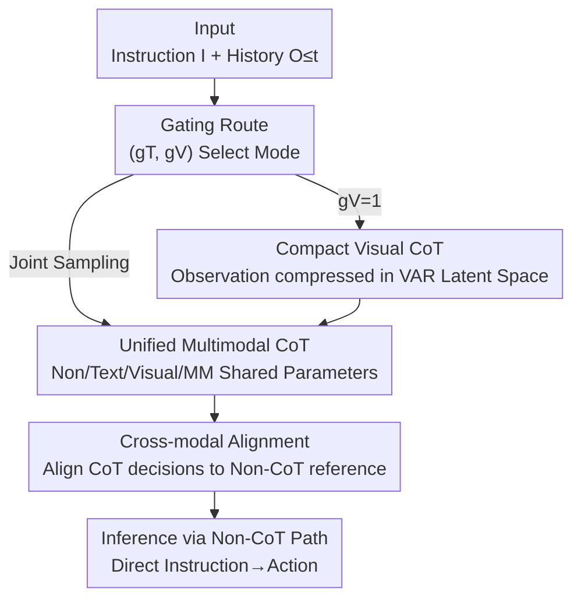

# FantasyVLN: Unified Multimodal Chain-of-Thought Reasoning for Vision-and-Language Navigation

**Conference**: CVPR 2026  
**Paper**: [CVF Open Access](https://openaccess.thecvf.com/content/CVPR2026/html/Zuo_FantasyVLN_Unified_Multimodal_Chain-of-Thought_Reasoning_for_Vision-and-Language_Navigation_CVPR_2026_paper.html)  
**Code**: https://github.com/Fantasy-AMAP/fantasy-vln  
**Area**: Robotics / Embodied AI (Vision-and-Language Navigation VLN)  
**Keywords**: VLN, Multimodal CoT, Implicit Reasoning, VAR Latent Space, Cross-modal Alignment

## TL;DR
FantasyVLN enables a VLN model to learn textual, visual, and multimodal Chain-of-Thought (CoT) during training. It compresses "imagined future observations" into a Visual AutoRegressive (VAR) latent space to avoid token explosion. Through cross-modal alignment constraints, these reasoning capabilities are distilled into a "direct decision-making" path that bypasses explicit CoT generation during inference. This achieves instruction-to-action mapping with zero explicit reasoning overhead while retaining reasoning power. On the long-horizon LH-VLN benchmark, the Success Rate (SR) improved from 0.65 to 2.44, with inference latency roughly an order of magnitude faster than explicit CoT methods.

## Background & Motivation

**Background**: Vision-and-Language Navigation (VLN) requires embodied agents to understand natural language instructions, perceive multi-view visual observations, and plan long action sequences. Recent works (NavCoT, NavGPT-2, OctoNav-R1, CoT-VLA) have introduced CoT reasoning into navigation to improve explainability and long-range planning, serving as a promising path toward human-like navigation.

**Limitations of Prior Work**: Existing CoT navigation faces a trade-off dilemma. Text-only CoT (NavCoT, NavGPT-2, Aux-Think) translates visual observations into captions for reasoning, losing genuine visual perception and suffering from poor generalization due to overfitting on sparse human-annotated reasoning steps—navigation often involves multiple valid action sequences for one instruction, making CoT supervision extremely hard to label. Multimodal CoT (CoT-VLA, WorldVLA) explicitly generates "imagined future observations" at each step, leading to token explosion: a reasoning step spanning 5–7 actions can swell to 3k–5k tokens, an order of magnitude larger than text-only CoT (<500 tokens), making real-time navigation impossible even on high-end GPUs.

**Key Challenge**: There is a structural conflict between CoT "reasoning quality" and navigation "real-time performance + generalization." Visual perception requires explicit image token generation at the cost of latency, while saving tokens necessitates reverting to text-only modes that lose visual information. Furthermore, explicit CoT supervision is naturally prone to overfitting.

**Goal**: Retain the benefits of CoT reasoning (especially multimodal visual reasoning) without increasing token overhead during inference, achieving both "capable of reasoning" and "real-time execution."

**Key Insight**: Ours draws inspiration from the "train-with-CoT, infer-without-CoT" paradigm of Aux-Think—reasoning capabilities can be internalized into representations during training without requiring explicit output during inference. Additionally, information from "imagined observations" does not need to reside in pixel space; it can be compressed into the early-scale latent space of a Visual AutoRegressive (VAR) model, where structured semantics of a frame can be encoded in just a few dozen tokens.

**Core Idea**: Internalize the capabilities of textual, visual, and multimodal CoT into a shared-parameter "non-CoT direct decision" path via unified multi-CoT joint training, VAR latent space compression for visual CoT, and cross-modal alignment constraints. During inference, only the non-CoT path is utilized.

## Method

### Overall Architecture
FantasyVLN models VLN as a sequential decision process: at each time $t$, the agent $\pi_\theta$ receives instruction $I$ and historical observations $\{O_{\le t}\}$, predicts the next action $A_{t+1}\in S$, and transitions states until a stop signal or the step limit $T$ is reached. The core is enabling **a single shared-parameter model to support four reasoning modes**: Non-CoT (for real-time inference), Text CoT (semantic planning), Compact Visual CoT (future imagination in latent space), and Multimodal CoT (fusion of both). A gating mechanism seamlessly switches between these four modes, while cross-modal alignment constraints force consistent action decisions across modes during training.

The entire pipeline follows a "multi-mode joint training → alignment distillation → non-CoT inference" structure. Inputs are routed by gating signals $(g_T, g_V)$; the visual path compresses imagined observations into VAR latent space; finally, alignment constraints align decisions from all reasoning paths to the non-CoT reference path, allowing the non-CoT path to "implicitly" inherit reasoning capabilities.

### Key Designs

**1. Compact Visual CoT: Eliminating Token Explosion with VAR Latent Space**

The fatal flaw of visual CoT is the explicit generation of future observations—predicting hundreds to thousands of tokens per frame in pixel space creates a computational bottleneck. Ours does not decode to pixel space but uses a **pre-trained and frozen VAR (Visual AutoRegressive) model** as the image decoder for the VLM, constructing a joint vocabulary. The VLM inputs $I$ and $\{O_{\le t}\}$ to predict the **early-scale latent variables** $\hat V_{t+1}$ of the VAR and the action $\hat A_{t+1}$. When visualization is needed, the frozen VAR decodes $\hat V_{t+1}$ into a pixel image $\hat O_{t+1}$ via next-scale prediction. During training, the VAR is frozen, and only the VLM learns to predict actions based on latent future imagination; during inference, the VAR decoder is not invoked.

The key is "selecting scale by information density": VAR is a multiscale autoregressive model. Empirical results show scale 4 is optimal (see Ablation). Early scales (1–2) contain too little information for the model to fit anything but noise, while large scales (≥6) encode high-frequency textures redundant for navigation decision-making, which interferes with the "visual imagination ↔ action" correlation. Encoding a frame with only a few dozen tokens makes training convergence approximately 4.6× faster than pixel-level visual CoT (WorldVLA).

**2. Unified Multimodal CoT + Gating: Shared Parameters for Four Reasoning Modes**

To fit three CoT paradigms into one model instead of three, two binary gating signals $g_T, g_V$ are introduced to control whether textual/visual paths are active. Concatenated with standard navigation inputs, the model autoregressively generates the specified reasoning chain $\hat R_{t+1}$ before predicting the action:

$$[\hat R_{t+1},\hat A_{t+1}]=\pi_\theta\big(I,\{O_{\le t}\},g_T,g_V\big)$$

The four combinations correspond to: $(0,0)$ direct non-CoT action, $(1,0)$ Text CoT (breaking instructions into sub-tasks, identifying active tasks, then deciding strategy), $(0,1)$ Compact Visual CoT, and $(1,1)$ Multimodal CoT (generating paired text-visual reasoning steps $\hat M_t=[\hat T_t,\hat V_t]$). During training, **gating signals are randomly sampled** for each sample, dynamically routing the forward pass and forcing the model to internalize multiple CoT capabilities in a shared parameter space. The joint loss is a weighted sum of the task losses for each active mode:

$$L_{\text{Joint}}=\sum_{\text{mode}} \mathbb{1}[\text{mode active}]\cdot L_{CE}\big([\hat R_{t+1},\hat A_{t+1}],[R_{t+1},A_{t+1}]\big)$$

The value of gating lies in "one set of parameters, four modes," avoiding the cost of multiple models and providing a foundation for alignment.

**3. Cross-modal Alignment: Distilling Reasoning into Non-CoT Path for Implicit Reasoning**

Even with joint training, different reasoning paths might produce divergent navigation decisions. The key operation is **designating the non-CoT path as the "primary reference"** (since it satisfies real-time requirements without decoding massive tokens). During training, action decisions from the other three CoT modes are forced to align with it. Specifically, via alternating optimization: first update the non-CoT path using $L_{\text{non-CoT}}=L_{CE}(\hat A_{t+1},A_{t+1})$, then perform a forward pass with the updated $\pi_\theta$ using stop-gradient to get the soft target $\tilde A_{t+1}$, and finally align the action predictions of the T/V/MM paths:

$$L_{\text{Align}}=L_{CE}(\hat A^T_{t+1},\tilde A_{t+1})+L_{CE}(\hat A^V_{t+1},\tilde A_{t+1})+L_{CE}(\hat A^M_{t+1},\tilde A_{t+1})$$

The final joint objective $L^*_{\text{Joint}}=L_{\text{Align}}+L_{\text{CoT}}$ (where $L_{\text{CoT}}$ supervises reasoning chain generation) is minimized alongside the non-CoT objective. All modes share inputs and parameters, embedding diverse CoT modes into a unified latent representation—the source of "implicit reasoning." During inference, only the non-CoT path is used (instruction→action), inheriting textual/visual reasoning gains with zero additional overhead.

### Loss & Training
Two objectives are minimized alternately: (1) the non-CoT objective $L_{\text{non-CoT}}$ to stabilize the reference path; (2) the cross-modal alignment joint objective $L^*_{\text{Joint}}$. The soft target $\tilde A_{t+1}$ is extracted via stop-gradient to prevent alignment terms from disrupting the reference path. The VAR is frozen throughout.

## Key Experimental Results

### Main Results
On the long-horizon multi-stage benchmark **LH-VLN** (unseen environments and tasks, online evaluation), metrics include SR (Success Rate), ISR (Intermediate Success Rate), CSR (Conditional Success Rate), and CGT (CSR weighted by Target length).

| CoT Mode | Method | SR | ISR | CSR | CGT |
|---------|------|----|----|----|----|
| Visual | CoT-VLA / WorldVLA | 0 | 0 | 0 | 0 |
| Memory | MGDM | 0 | 2.34 | 1.65 | 2.91 |
| Textual | Aux-Think | 0.65 | 3.16 | 2.04 | 1.47 |
| **Unified MM** | **Ours** | **2.44** | **11.01** | **9.64** | **8.99** |

Ours achieves SOTA across all four metrics; ISR is approximately 3.5× that of the next best (Aux-Think). Notably, pixel-level visual CoT (CoT-VLA, WorldVLA) **collapsed to zero** on LH-VLN—attributed to limited training data and the difficulty of "future scene video generation" in navigation compared to manipulation, highlighting the advantage of compact visual CoT under data constraints.

Inference Efficiency (APS = Actions Per Second):

| Mode | Method | Size | APS |
|---------|------|---------|-----|
| Explicit | CoT-VLA | 7B | 0.19 |
| Implicit | WorldVLA | 7B | 1.02 |
| Implicit | Aux-Think | 8B | 0.97 |
| Implicit | **Ours** | 7B | **1.03** |

Implicit methods are ~5× faster than explicit CoT-VLA.

### Ablation Study

| Config | SR | ISR | Description |
|------|----|----|------|
| Non-CoT Only | 0 | 2.01 | No high-level reasoning |
| Non-CoT + T-CoT | 0.98 | 8.26 | Adds textual reasoning |
| Non-CoT + V-CoT | 1.46 | 11.19 | Adds visual reasoning |
| Non-CoT + MM-CoT | 0.49 | 7.77 | Adds multimodal reasoning |
| Full | **2.44** | 11.01 | Optimal SR/CGT, modes complement |
| **w/o Alignment** | 0 | 2.39 | SR drops to zero without alignment |

### Key Findings
- **Cross-modal alignment is critical**: Removing it caused SR to drop from 2.44 to 0 and ISR from 11.01 to 2.39, proving that decision consistency alignment for a unified representation space is indispensable.
- **Individual CoTs help, but four modes are best**: Adding V-CoT alone boosted ISR to 11.19, but SR/CGT maximized only when all four modes were used together.
- **VAR scale "Sweet Spot"**: Scale 4 yielded the highest ISR (7.41); smaller scales (1–2) lacked information, while larger scales (≥6) introduced redundant textures that distracted from decision-making.
- **Explicit vs. Implicit decoding depends on modality**: For text, explicit was slightly better (ISR 8.26 vs 6.06), but for visual/multimodal reasoning, implicit was far superior (11.19/11.01 vs 7.34/8.62) due to error accumulation in explicit image generation on the Qwen2.5-VL backbone.
- **4.6× Training Efficiency**: Ours converged in ~3000 steps, whereas WorldVLA reached only 0.5 accuracy at 13800 steps.

## Highlights & Insights
- **The "Imagine but don't speak" paradigm**: Compressing multimodal CoT visual imagination into VAR early-scale latents and distilling it into a non-CoT path allows the model to benefit from visual reasoning with zero inference overhead.
- **Information Density for Scale Selection**: Scale 4 is not just a parameter search result but the "inflection point" where structural semantics are sufficient before high-frequency textures appear.
- **Gate-Unified Four Modes**: Two binary signals $g_T, g_V$ elegantly encode four reasoning paradigms into shared parameters, avoiding multi-model overhead.
- **Failure Cases are Informative**: The collapse of pixel-level visual CoT on long-horizon tasks proves the necessity of "latent space compression" in data-constrained scenarios.

## Limitations & Future Work
- The base model (Qwen2.5-VL) is not natively designed for unified "generation + understanding," so visual CoT (requiring future scene imagination) may not have reached the framework's upper bound.
- LH-VLN data scale is limited. While compact visual CoT outperforms explicit generation in this regime, its scaling behavior on larger datasets remains to be verified.
- Absolute metrics are low (SR 2.44), showing long-horizon multi-stage tasks remain extremely challenging and far from practical deployment.
- Improvement Ideas: Using a unified base natively capable of image generation (e.g., Chameleon/Emu) or introducing multi-teacher/consistency filtering during alignment.

## Related Work & Insights
- **vs. Aux-Think**: Both use implicit reasoning, but Aux-Think is limited to text CoT; Ours incorporates visual/multimodal CoT via latent alignment, raising ISR from 3.16 to 11.01.
- **vs. CoT-VLA / WorldVLA**: They generate pixel-level future frames, which is computationally expensive and prone to collapse on LH-VLN. Ours in VAR latent space is 4.6× faster to train and ~5× faster to infer.
- **vs. NavCoT / NavGPT-2**: They rely on translating observations to captions for textual reasoning; Ours internalizes reasoning through alignment, bypassing CoT generation during inference to avoid overfitting.

## Rating
- Novelty: ⭐⭐⭐⭐⭐ First framework to unify T/V/MM CoT into a single model using latent compression and alignment for implicit reasoning.
- Experimental Thoroughness: ⭐⭐⭐⭐ Extensive analysis on efficiency, mode ablation, and VAR scales; however, limited to one benchmark.
- Writing Quality: ⭐⭐⭐⭐ Clear motivation, complete algorithms, well-explained gating/alignment.
- Value: ⭐⭐⭐⭐ The "latent imagination + alignment distillation" paradigm is valuable for both long-horizon navigation and broader multimodal reasoning.

<!-- RELATED:START -->

- **Aux-Think**: Implicit textual CoT for VLN.
- **WorldVLA**: Explicit pixel-level world modeling for VLA.
- **NavCoT**: Explicit textual reasoning for navigation tasks.

<!-- RELATED:END -->

## Related Papers

- [\[CVPR 2026\] TRM-VLA: Temporal-Aware Chain-of-Thought Reasoning and Memorization for Vision-Language-Action Models](trm-vla_temporal-aware_chain-of-thought_reasoning_and_memorization_for_vision-la.md)
- [\[CVPR 2026\] ACoT-VLA: Action Chain-of-Thought for Vision-Language-Action Models](acot-vla_action_chain-of-thought_for_vision-language-action_models.md)
- [\[CVPR 2026\] Parse, Search, and Confirmation: Training-Free Aerial Vision-and-Dialog Navigation with Chain-of-Thought Reasoning and Structured Spatial Memory](parse_search_and_confirmation_training-free_aerial_vision-and-dialog_navigation_.md)
- [\[CVPR 2026\] AwareVLN: Reasoning with Self-awareness for Vision-Language Navigation](awarevln_reasoning_with_self-awareness_for_vision-language_navigation.md)
- [\[CVPR 2026\] From Manuals to Actions: A Unified VLA Model for Chain-of-Thought Manual Generation and Robotic Manipulation](from_manuals_to_actions_a_unified_vla_model_for_chain-of-thought_manual_generati.md)

<!-- RELATED:END -->
