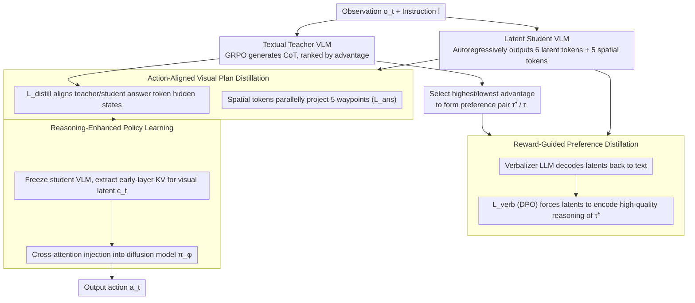

# Fast-ThinkAct: Efficient Vision-Language-Action Reasoning via Verbalizable Latent Planning

**Conference**: CVPR2026  
**arXiv**: [2601.09708](https://arxiv.org/abs/2601.09708)  
**Code**: [Project Page](https://jasper0314-huang.github.io/fast-thinkact/)  
**Area**: Robotics  
**Keywords**: VLA, Reasoning, latent CoT, Knowledge Distillation, Preference Learning, Robotic Manipulation

## TL;DR

Fast-ThinkAct is proposed to compress lengthy textual CoT reasoning (~250 tokens) into 6 verbalizable continuous latent tokens. By combining reward-guided preference distillation with visual trajectory alignment, it achieves an 89.3% reduction in inference latency (9.3× faster than ThinkAct-7B) while maintaining or exceeding the performance of SOTA reasoning VLAs.

## Background & Motivation

Vision-Language-Action (VLA) tasks require agents to reason and execute adaptive actions in complex visual scenes. Recent VLA models, primarily trained via supervised learning on large-scale robotic demonstrations, perform well on basic skills (pick-and-place) but lack generalization in the following areas:

1. **Long-horizon Planning**: Complex tasks requiring multi-step reasoning (e.g., turning on the stove before placing the pot).
2. **Failure Recovery**: Detecting failures during runtime and generating corrective plans.
3. **Few-shot Adaptation**: Quickly adapting to new scenes and tasks.

Reasoning VLAs (e.g., ThinkAct, CoT-VLA, MolmoAct) improve generalization by introducing explicit chain-of-thought reasoning. However, generating long reasoning chains introduces a severe inference latency bottleneck:

- ThinkAct-7B takes approximately 7.5 seconds per step (~0.1 Hz).
- Robotic manipulation requires real-time decision frequencies of 1-15 Hz.
- ECoT-Lite attempts acceleration via reasoning dropout, but directly truncating textual reasoning loses critical information, leading to performance degradation.

**Key Insight**: How to compress lengthy textual CoT into a compact representation while retaining reasoning capabilities and correctly capturing spatio-temporal dynamics?

## Core Problem

- Textual CoT reasoning generates long sequences (~250 tokens), causing multi-second latency that fails to meet real-time control requirements.
- Latent reasoning methods in the LLM domain (e.g., Coconut, CODI) cannot be directly migrated to VLA tasks—they require spatio-temporal understanding and must bridge semantic reasoning with embodied control.
- Compressing reasoning into a continuous latent space lacks direct supervision signals to guide what the latents should encode.

## Method

### Overall Architecture

Fast-ThinkAct addresses the latency issues of reasoning VLAs. The textual CoT of models like ThinkAct (~250 tokens) is too slow for 1-15 Hz robot control. The strategy is to move reasoning from the token space to a continuous latent space, compressing it into 6 latent tokens without sacrificing quality. The framework employs a three-step teacher-student distillation: first, using teacher reward signals to teach the student high-quality latent reasoning; second, aligning teacher/student trajectory-level visual planning representations; and finally, freezing the student VLM to enhance a diffusion action model using its latent reasoning features.

### Key Designs

**1. Reward-Guided Preference Distillation: Using Teacher Rewards as Signals for Unsupervised Latents**

The most difficult aspect of latent reasoning is the lack of direct supervision. Fast-ThinkAct uniquely reuses the teacher's reward: the textual teacher $\mathcal{F}_{\theta^T}$ is trained using GRPO based on a CoT-SFT checkpoint, where its advantage function $A(\tau)$ naturally serves as a metric for reasoning quality. Reasoning chains with the highest/lowest advantage from each rollout group are selected as positive/negative samples:

$$\tau^+ = \arg\max_{\tau \in G} A(\tau), \quad \tau^- = \arg\min_{\tau \in G} A(\tau)$$

The student VLM $\mathcal{F}_\theta$ no longer generates textual tokens but autoregressively outputs $M=6$ continuous latent vectors $\mathbf{z} = \{z_m\}_{m=1}^M,\ z_m \in \mathbb{R}^d$. A verbalizer LLM $\mathcal{V}_\psi$ (Qwen3-0.6B with cross-attention) is introduced to decode latents back into natural language, using a DPO-style objective to increase the likelihood of high-quality reasoning $\tau^+$:

$$\mathcal{L}_{\text{verb}} = -\mathbb{E}\left[\log \sigma\left(\beta \left(\log \frac{p_\psi(\tau^+|\mathbf{z})}{p_{\text{ref}}(\tau^+)} - \log \frac{p_\psi(\tau^-|\mathbf{z})}{p_{\text{ref}}(\tau^-)}\right)\right)\right]$$

$\beta=0.1$ controls the preference strength. This forces the student to encode latents such that the verbalizer can decode them into high-quality reasoning, effectively providing a supervision signal for the latent space.

**2. Action-Aligned Visual Plan Distillation: Aligning Trajectory Representations and Parallelizing Waypoints**

Beyond reasoning, the teacher's visual planning capability must be transferred. This step aligns the hidden states of the teacher and student at the `<answer>` token: $\mathcal{L}_{\text{distill}} = \|h_t^T - h_t\|_2^2$. Simultaneously, $K=5$ learnable spatial tokens $\{s_i\}_{i=1}^K$ are appended after the latent reasoning sequence. Each hidden state is projected via an MLP into a waypoint $p_i \in \mathbb{R}^6$ (format $[x_{\text{single}}, y_{\text{single}}, x_{\text{left}}, y_{\text{left}}, x_{\text{right}}, y_{\text{right}}]$). This parallel prediction replaces the teacher's autoregressive generation of 60-70 waypoint tokens, further reducing latency. The student's total objective is $\mathcal{L}_{\text{student}} = \mathcal{L}_{\text{verb}} + \mathcal{L}_{\text{distill}} + \mathcal{L}_{\text{ans}}$.

**3. Reasoning-Enhanced Policy Learning: Using Early-Layer Latents for the Action Model**

Finally, the student VLM $\mathcal{F}_\theta$ is frozen. Visual latent planning $c_t$ is extracted from the **early-layer** KV cache of the spatial tokens and injected into a Diffusion Transformer action model $\pi_\phi$ (DiT-Policy or RDT) via cross-attention:

$$\mathcal{L}_{\text{IL}}(\phi) = \ell(\pi_\phi(o_t, l, c_t), \hat{a}_t)$$

Selecting early layers is supported by ablation studies (LIBERO 89.7 vs 88.3 vs 87.1), suggesting that visual planning information is already encoded in the shallower layers of the VLM. At inference time, only $\mathcal{F}_\theta + \pi_\phi$ are required; the verbalizer is only used during training or for interpretability.

## Key Experimental Results

### LIBERO & SimplerEnv (Robotic Manipulation)

| Method | LIBERO (avg) | SimplerEnv-Google | Latency (ms) |
|------|-------------|-------------------|--------------|
| OpenVLA-7B | 76.5 | 40.2 | N/A |
| ThinkAct-7B | 84.4 | 68.3 | 7513 |
| MolmoAct-7B | 86.8 | 64.9 | 6723 |
| ThinkAct-3B | 83.1 | 64.7 | 5674 |
| **Fast-ThinkAct-3B (Ours)** | **89.7** | **68.7** | **805** (↓7.0×) |

Ours exceeds ThinkAct-3B by 6.6% on LIBERO and 4.0% on SimplerEnv, with a 7× reduction in latency.

### RoboTwin2.0 (Dual-arm Manipulation)

| Method | Easy Avg | Hard Avg |
|------|----------|----------|
| RDT | 56.4 | 22.8 |
| ThinkAct | 62.4 | 24.7 |
| **Fast-ThinkAct (Ours)** | **65.7** | **26.4** |

Superiority is more pronounced in long-horizon tasks (270+ steps).

### Embodied Reasoning

| Method | EgoPlan-Bench2 | RoboVQA (B-Avg) | OpenEQA | Overall |
|------|---------------|-----------------|---------|---------|
| ThinkAct-3B | 44.0 | 55.3 | 48.9 | 49.4 |
| **Fast-ThinkAct-3B (Ours)** | **46.4** | **60.8** | **51.2** | **52.8** |

It outperforms commercial models like GPT-4V (36.4) and Gemini-2.5-Flash (38.9).

### Ablation Study

- Removing $\mathcal{L}_{\text{verb}}$: Overall 52.8 → 48.5 (-4.3), showing the importance of preference guidance.
- Removing $\mathcal{L}_{\text{distill}}$: Further reduction to 47.7, showing the loss of visual plan transfer.
- Comparison with efficient textual reasoning: teacher direct reasoning (49.8), 6 textual tokens (46.3), RL length-penalty (47.8), **Fast-ThinkAct 6 latent tokens (53.3)**.
- Latent token count: $M=1$ is insufficient, $M=30/100$ introduces noise, $M=6$ is optimal.

## Highlights & Insights

- **Verbalizable Latent Design**: Latents can be decoded into text via the verbalizer. This achieves compression while maintaining interpretability, solving the fundamental problem of lack of direct supervision in latent spaces.
- **Reward-Guided Preference Distillation**: Reusing teacher GRPO reward signals to construct DPO preference pairs provides efficient training signals without additional annotation.
- **Significant Latent Reduction**: Using 6 latent tokens + 5 parallel spatial tokens reduces latency by 89.3%, transforming the model from unusable (0.1 Hz) to real-time capable.
- **Superior Failure Recovery**: Outperforming the runner-up by 10.9-16.4 points on RoboFAC indicates that latent reasoning retains the ability to understand errors and plan corrections.

## Limitations & Future Work

- The verbalizer, based on a pre-trained LLM, inherits hallucination issues; verbalized reasoning may produce plausible but inaccurate descriptions (though this does not affect action inference).
- Evaluations were conducted only in simulated environments; real-world robot deployment results are not yet shown.
- The student utilizes a 3B VLM backbone; ablations for a 7B version are insufficient (only evaluated on reasoning benchmarks, not fully on manipulation).
- Fixed number of spatial tokens ($K=5$); adaptive counts have not been explored.
- Complex training pipeline (SFT → CoT-SFT → Teacher GRPO → Student distillation → Policy learning); there is significant room for end-to-end simplification.

## Related Work & Insights

| Dimension | ThinkAct | MolmoAct | CoT-VLA | ECoT-Lite | Fast-ThinkAct |
|------|----------|----------|---------|-----------|---------------|
| Reasoning Form | Textual CoT | 2D visual trace | Visual goal + Text | Reasoning dropout | Latent CoT |
| Reasoning Length | ~250 tokens | ~250 tokens | - | Variable | 6 latent tokens |
| Inference Latency | 7.5s (7B) | 6.7s (7B) | - | Reduced but unstable | **0.8s (3B)** |
| RL Training | GRPO | None | None | None | Teacher GRPO → DPO distill |
| Interpretability | High (Text) | High (Visual) | Medium | Low | Medium (Optional verbalization) |

**Key Challenge Comparison**: Fast-ThinkAct moves reasoning from the token space to a continuous latent space and uses preference learning instead of direct distillation, balancing efficiency and quality.

## Insights & Related Work

- The verbalizable latent approach is generalizable and could be extended to real-time reasoning scenarios like autonomous driving.
- The Teacher GRPO → Student DPO paradigm avoids labeling difficulties for latent spaces and is transferable to other latent reasoning research.
- The finding that early-layer KV cache is superior to late layers suggests visual planning information is encoded early in the VLM.
- Complements existing LLM latent reasoning works like Coconut and CODI by extending the concept to the VLA domain.

## Rating

- Novelty: 8/10 — The combination of verbalizable latents and reward preference distillation is novel and addresses the supervision bottleneck of latent reasoning.
- Experimental Thoroughness: 9/10 — Comprehensive evaluation across six benchmarks (3 reasoning + 3 manipulation) with detailed ablations and latency analysis.
- Writing Quality: 8/10 — Clear structure, complete mathematical formulation, and intuitive diagrams.
- Value: 9/10 — Reducing reasoning latency from seconds to sub-seconds while improving performance removes a critical bottleneck for reasoning VLA deployment.

<!-- RELATED:START -->

## Related Papers

- [\[ICML 2026\] Latent Reasoning VLA: Latent Thinking and Prediction for Vision-Language-Action Models](../../ICML2026/robotics/latent_reasoning_vla_latent_thinking_and_prediction_for_vision-language-action_m.md)
- [\[NeurIPS 2025\] ThinkAct: Vision-Language-Action Reasoning via Reinforced Visual Latent Planning](../../NeurIPS2025/robotics/thinkact_vision-language-action_reasoning_via_reinforced_visual_latent_planning.md)
- [\[CVPR 2026\] ACoT-VLA: Action Chain-of-Thought for Vision-Language-Action Models](acot-vla_action_chain-of-thought_for_vision-language-action_models.md)
- [\[CVPR 2026\] SemanticVLA: Towards Semantic Reasoning over Action Memorization via Synergistic Explicit Trace and Latent Action Planning](semanticvla_towards_semantic_reasoning_over_action_memorization_via_synergistic_.md)
- [\[CVPR 2026\] Towards Open Environments and Instructions: General Vision-Language Navigation via Fast-Slow Interactive Reasoning](towards_open_environments_and_instructions_general_vision-language_navigation_vi.md)

<!-- RELATED:END -->
