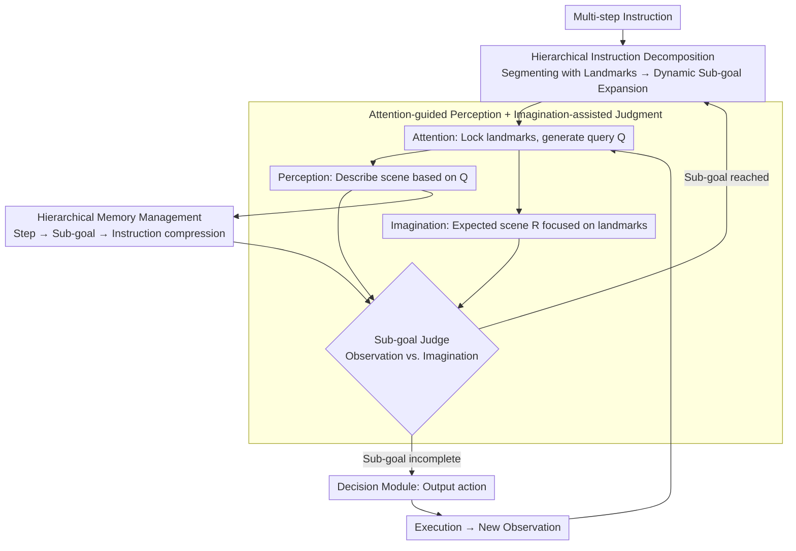

# FineCog-Nav: Integrating Fine-grained Cognitive Modules for Zero-shot Multimodal UAV Navigation

**Conference**: CVPR 2026 Findings  
**arXiv**: [2604.16298](https://arxiv.org/abs/2604.16298)  
**Code**: [Project Page](https://smartdianlab.github.io/projects-FineCogNav)  
**Area**: Robotics  
**Keywords**: UAV Navigation, Vision-Language Navigation, Cognitive Modules, Zero-shot, Hierarchical Memory

## TL;DR
This paper proposes FineCog-Nav, a zero-shot UAV vision-language navigation framework inspired by human cognition. It decomposes navigation into seven fine-grained cognitive modules: language processing, perception, attention, memory, imagination, reasoning, and decision-making. Each module is driven by a medium-scale foundation model, enabling long-range navigation in complex 3D environments without training.

## Background & Motivation

1.  **Background**: UAV Vision-Language Navigation (VLN) requires agents to follow multi-step, ambiguous instructions from a first-person perspective in complex 3D environments. While zero-shot methods exist for ground VLN, UAV scenarios are more challenging due to continuous 3D motion, limited global perception, and low landmark distinguishability.
2.  **Limitations of Prior Work**: Existing zero-shot methods rely heavily on large models (e.g., GPT-4V). Success rates plummet from 28.3% to 1.7% when switched to smaller models (e.g., LLaVA-7B). Most methods use generic prompts and loose module coordination, lacking critical components like hierarchical planning, dynamic sub-goal extraction, and memory mechanisms.
3.  **Key Challenge**: Complex UAV navigation requires deep collaboration between perception, reasoning, and decision-making, but existing frameworks are either monolithic (one model solves everything) or loosely coupled (insufficient interaction between modules).
4.  **Goal**: Design a training-free modular framework that achieves interpretable and generalizable UAV navigation through the collaboration of fine-grained cognitive modules.
5.  **Key Insight**: Organize modules not by agent identity but by cognitive function—each corresponding to an aspect of human cognition (language, perception, attention, memory, imagination, reasoning, decision-making), collaborating through structured input/output protocols.
6.  **Core Idea**: Fine-grained modularization of cognitive functions allows each module to be implemented using a medium-scale model with role-specific prompts, eliminating reliance on ultra-large models while providing interpretability through explicit cognitive dependencies.

## Method

### Overall Architecture
FineCog-Nav addresses the issue where zero-shot UAV navigation collapses when using small models (GPT-4V 28.3% → LLaVA-7B 1.7%). The authors argue the problem is not model size, but treating navigation as a monolithic task. Consequently, they decompose navigation into modules corresponding to human cognitive functions—language, attention, perception, imagination, memory, reasoning, and decision-making—where each performs a narrow task driven by a medium-scale foundation model with specialized prompts.

The pipeline is a closed perception-reasoning-action loop: the language module segments long instructions into sub-goals with landmarks; the attention module identifies which landmark to focus on and generates queries; the perception module describes the scene guided by these queries; the imagination module pre-writes "what should be seen when the sub-goal is completed"; the judge compares the observation and memory against this imagination to decide if the sub-goal is reached; hierarchical memory archives observations; and the decision module outputs actions. The output of each module serves as the input for the next, creating an interpretable and debuggable chain.

### Key Designs

**1. Hierarchical Instruction Decomposition: Reducing long instructions to executable sub-goals**

UAV instructions are often long, multi-step descriptions like "fly over the parking lot, go around the red building, and stop after turning right at the fountain." Giving this directly to a model often leads to lost execution order. The language module splits this into two levels: an instruction parser $\mathcal{S}$ segments instruction $I$ by sentence and pairs them with landmarks to get $\{(I_i, L_i)\}$; then, a sub-goal extractor $\mathcal{E}$ dynamically expands these into sub-goals $\{g_i^{(k)}\}_{k=1}^K$ based on current observations. It organizes sub-goals by **execution order** rather than syntax, minimizing planning complexity for small models.

**2. Attention-guided Perception + Imagination-assisted Judgment: Guiding focus and expectations**

Unguided perception is easily distracted by irrelevant details, and judging sub-goal completion is difficult for small models. This module set solves both. The attention module selects key landmarks $\{L_i, L_{i+1}\}$ to generate targeted queries $\{Q_i\}$, ensuring the perception module describes the scene relevant to landmarks rather than the whole image. The imagination module generates an expected scene description $R^{[g_i^{(k)}]}$ for sub-goal completion. By constraining this to be landmark-centric rather than open-ended, it reduces hallucinations. The judge then compares current observations and sub-goal memory against this reference for a more reliable completion check.

**3. Hierarchical Memory Management: Balancing historical details and global context**

Feeding raw history into models for long-range tasks leads to information overload. FineCog-Nav uses a three-layer hierarchical structure for gradual compression: step memory $M^{[t]}$ records per-frame observations and actions; once a sub-goal is reached, LLMs compress this into a summary $M_\star$ within sub-goal memory $M^{[g_i^{(k)}]}$ finally, these are aggregated into instruction-level memory $M^{[I_i]}$.

$$M^{[t]} \;\xrightarrow{\text{LLM Compression}}\; M^{[g_i^{(k)}]} \;\xrightarrow{\text{Aggregation}}\; M^{[I_i]}$$

Higher layers retain global cues ("where have I been") while filtering out per-frame noise. Ablation studies show this is the most critical module for performance.

### Logic Example: Executing "Fly over the square, turn right at the fountain and stop"

1.  **Language Module** segments the instruction into $I_1$="Fly over the square" (Landmark=Square), $I_2$="Turn right at the fountain and stop" (Landmark=Fountain), and expands $g_1^{(1)}$="Reach the square".
2.  **Attention Module** locks on "Square" and "Fountain", generating the query "Is there an open paved square in view?".
3.  **Perception Module** describes: "Rooftops below, open paved area approx. 50m ahead."
4.  **Imagination Module** provides a reference for $g_1^{(1)}$: "The center of the field should be a large paved square surrounded by buildings."
5.  **Judge** compares observation to imagination—the square is ahead, not in the center → sub-goal incomplete → **Decision Module** outputs "Move forward".
6.  Once the square is centered, the judge marks $g_1^{(1)}$ as complete. Step memory is compressed into a summary and stored; the language module moves to $I_2$, attention shifts to "Fountain", and the loop continues.

### Loss & Training
Completely zero-shot, no training required. Each module is driven by role-specific, carefully designed prompts for medium-scale foundation models (e.g., Qwen2.5-VL-32B paired with 8B–32B LLMs). Capabilities stem from modular division and prompt design rather than gradient updates.

## Key Experimental Results

### Main Results

**AerialVLN-Fine (300 trajectories)**:

| LLM Backbone | Method | SR3D↑ | NE↓ | nDTW↑ |
| :--- | :--- | :--- | :--- | :--- |
| Qwen3-32B | BaseModel | 3.00% | 142.72m | 17.07% |
| Qwen3-32B | **FineCog-Nav** | **4.00%** | **95.31m** | **20.31%** |
| GPT-4o-mini | BaseModel | 0.33% | 325.98m | 8.74% |
| GPT-4o-mini | **FineCog-Nav** | **2.33%** | **100.37m** | **20.45%** |
| ChatGLM-4-32B | BaseModel | 2.00% | 180.66m | 10.59% |
| ChatGLM-4-32B | **FineCog-Nav** | **2.33%** | **94.18m** | **21.25%** |

### Ablation Study

| Configuration | SR3D | nDTW | Description |
| :--- | :--- | :--- | :--- |
| FineCog-Nav Complete | 4.00% | 20.31% | All cognitive modules |
| Replace Hierarchical Memory with Flat History | ~2% | ~15% | Significant drop |
| Remove Imagination Module | ~3% | ~17% | Inaccurate sub-goal judgment |
| Remove Attention Module | ~3% | ~16% | Perception distracted by noise |

### Key Findings
-   **FineCog-Nav consistently outperforms baselines across all LLM backbones**: Significant gains even with 8B small models.
-   **Navigation error reduced by over half**: GPT-4o-mini NE dropped from 325.98m to 100.37m (-69%).
-   **Hierarchical memory is the most critical module**: Ablations show performance plummets when replaced with flat history.

## Highlights & Insights
-   **Organizing modules by cognitive function rather than agent identity** is the core design philosophy. This differs from standard multi-agent role division by mimicking human cognitive processes, offering better interpretability.
-   The **Imagination Module** is an interesting innovation: generating an "expected scene" as a reference for judgment is similar to human mental simulation. Constraining it to landmark-centric descriptions is key to reducing hallucinations.
-   The **AerialVLN-Fine dataset** fills the gap in high-quality, fine-grained evaluation benchmarks for UAV VLN.

## Limitations & Future Work
-   Absolute success rate remains low (max 4.00%), indicating zero-shot UAV VLN is still highly challenging.
-   The multi-module pipeline increases inference overhead and the risk of error propagation between modules.
-   Only validated in AerialVLN (simulator); not tested on real-world drones.
-   Safety module relies on simple depth-based geometric heuristics, which may be insufficient in complex obstacle scenarios.
-   Future work could explore adaptive collaboration between modules and end-to-end optimization.

## Related Work & Insights
-   **vs NavGPT**: NavGPT uses a single LLM for all decisions. FineCog-Nav decomposes tasks into specialized cognitive modules, allowing medium-scale models to perform at the level of larger models.
-   **vs SPF (See, Point, Fly)**: SPF primarily enhances visual localization. FineCog-Nav provides a more comprehensive cognitive framework including memory and imagination.

## Rating
-   Novelty: ⭐⭐⭐⭐⭐ The concept of cognitive function modularization is novel and deep.
-   Experimental Thoroughness: ⭐⭐⭐⭐ 6 LLM backbones + custom high-quality benchmark + ablation analysis.
-   Writing Quality: ⭐⭐⭐⭐ Clear framework descriptions and intuitive information flow diagrams.
-   Value: ⭐⭐⭐⭐ Provides a scalable modular framework for zero-shot UAV navigation.

<!-- RELATED:START -->

## Related Papers

- [\[CVPR 2026\] TrajRAG: Retrieving Geometric-Semantic Experience for Zero-Shot Object Navigation](trajrag_retrieving_geometric-semantic_experience_for_zero-shot_object_navigation.md)
- [\[CVPR 2026\] History to Future: Evolving Agent with Experience and Thought for Zero-shot Vision-and-Language Navigation](history_to_future_evolving_agent_with_experience_and_thought_for_zero-shot_visio.md)
- [\[ECCV 2024\] Prioritized Semantic Learning for Zero-shot Instance Navigation](../../ECCV2024/robotics/prioritized_semantic_learning_for_zero-shot_instance_navigation.md)
- [\[AAAI 2026\] PanoNav: Mapless Zero-Shot Object Navigation with Panoramic Scene Parsing and Dynamic Memory](../../AAAI2026/robotics/panonav_mapless_zero-shot_object_navigation_with_panoramic_scene_parsing_and_dyn.md)
- [\[CVPR 2026\] FantasyVLN: Unified Multimodal Chain-of-Thought Reasoning for Vision-and-Language Navigation](fantasyvln_unified_multimodal_chain-of-thought_reasoning_for_vision-and-language.md)

<!-- RELATED:END -->
