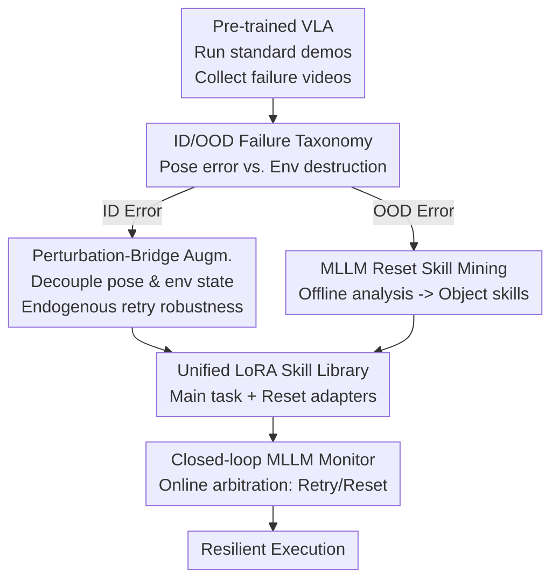

# FLARE: A Failure-Aware Framework for Autonomous Correction and Recovery in Visual-Language Robotic Manipulation

**Conference**: CVPR 2026  
**Paper**: [CVF Open Access](https://openaccess.thecvf.com/content/CVPR2026/html/Zhao_FLARE_A_Failure-Aware_Framework_for_Autonomous_Correction_and_Recovery_in_CVPR_2026_paper.html)  
**Code**: None  
**Area**: Robotic Manipulation / Embodied AI  
**Keywords**: VLA, Failure Recovery, Data Augmentation, MLLM Monitoring, Closed-loop Error Correction

## TL;DR
FLARE categorizes robotic VLA failures into "robot pose error (ID)" and "environmental destruction (OOD)." It uses perturbation-bridge data augmentation to provide models with endogenous "retry" capabilities and MLLM-driven offline mining of failure videos to automatically learn object-level "reset" skills. An online MLLM monitor then orchestrates closed-loop switching between these skills, improving the average success rate of $\pi_{0.5}$ on 9 contact-rich RoboMimic tasks from 72.2% to 84.0%.

## Background & Motivation
**Background**: Vision-Language-Action (VLA) models (e.g., OpenVLA, $\pi_0$, $\pi_{0.5}$) integrate perception, language, and control into a single network. They have shown strong generalization in long-horizon manipulation tasks, becoming a mainstream paradigm in embodied AI.

**Limitations of Prior Work**: These models are extremely "brittle"—a single slip, a dropped object, or an accidental collision can lead to irreversible task failure. While humans naturally retry or tidy the scene after such mishaps, VLAs possess almost no self-correction capability.

**Key Challenge**: The authors trace the root of this fragility to the **data itself** rather than model architecture or control strategies. Human demonstration data is sparse, containing only successful trajectories that are **trajectory-monotonic**: the robot consistently moves along a narrow pose manifold strongly correlated with task progress. Consequently, the policy $\pi_\theta$ learns spurious correlations like "my joint configuration = task stage" instead of inferring progress from environmental states. Once a perturbation places the robot in a state where the environment is valid but the pose is unseen, the policy misinterprets it as out-of-bounds and freezes. Simultaneously, data lacks failure-recovery samples, and standard data synthesis (e.g., MimicGen) only reshuffles success segments, failing to synthesize recovery trajectories.

**Goal**: To equip VLA with a **unified and generalizable** failure recovery mechanism capable of handling both pose-level deviations and environmental disasters.

**Key Insight**: The authors decompose the world state $s_t$ into an environmental state $s_t^e$ (object poses) and a robot state $s_t^r$ (end-effector pose). Based on this, they provide a clear binary definition of failure and propose targeted solutions for both categories.

**Core Idea**: Utilizing a "Retry + Reset" dual paradigm, robotic autonomy is reframed from "pursuing perfect execution" to "resilience after failure." ID errors are addressed via data augmentation for endogenous retry robustness, while OOD errors are resolved through MLLM-bootstrapped reset skills.

## Method

### Overall Architecture
FLARE takes a pre-trained VLA backbone ($\pi_{0.5}$) and a small set of human demonstrations as input, outputting a "skill library + monitor" system capable of closed-loop correction during deployment. The pipeline consists of three phases: first, a VLA is trained on standard demonstrations and run for hundreds of rounds to collect failure videos; second, an MLLM classifies failures into ID/OOD—ID errors undergo "perturbation-bridge" augmentation, while OOD errors undergo "object-level reset skill mining"; finally, original data, retry-augmented data, and reset-augmented data are combined to train a set of LoRA expert adapters (skill library). During deployment, an online MLLM monitor arbitrates switching between the main task and reset skills in a closed loop.

Formally, the VLA is a Markovian policy $a_t \sim \pi_\theta(\cdot|o_t, I)$, predicting action chunks based on visual observations $o_t$ and language instructions $I$. The authors define two failure types: **ID errors** occur when the environment in $s_t=(s_t^e, s_t^r)$ is valid ($s_t^e \in S_{task}^e$) but the robot pose $s_t^r$ falls into a low-probability region of the demonstration distribution $P(s_t^r|s_t^e, \mathcal{D}_{demo})$. The task is still recoverable from $s_t^e$ via a "retry." **OOD errors** occur when the environmental state itself is unrecoverable ($s_t^e \notin S_{task}^e$, e.g., a cup is knocked over), requiring specialized "reset" skills as main task actions cannot succeed.

### Key Designs

**1. ID/OOD Failure Taxonomy: Distinguishing Robot vs. Environment Errors**

Prior self-correction works either relied on vague MLLM semantic feedback or used RL to learn recovery behaviors without a unified framework to distinguish failure types. FLARE's starting point is decomposing the state $s_t=(s_t^e, s_t^r)$: if the environment is valid but the pose is novel, it is an ID error (retryable); if the environment is compromised, it is an OOD error (requires reset). This explains why VLAs lack retry capabilities: policies incorrectly bind task progress to pose. When a robot is in a "place" pose but the object was never grasped, the policy misjudges based on pose that the task has reached the placement stage. Addressing these separately allows for data-level solutions rather than relying solely on larger models.

**2. Perturbation-Bridge Augmentation: Decoupling Robot Pose from Environmental State**

ID errors stem from trajectory monotonicity. Segment stitching alone cannot break this. FLARE uses human sub-task segments to assemble a baseline trajectory $T_{task}=(a_0, a_1, \dots, a_N)$, then **systematically injects perturbation-bridge segments** $d_i$ to create $T_{aug}=(d_{init}, a_0, d_0, a_1, d_1, \dots, a_N)$. Each $d_i$ has two phases: the **perturbation phase** $d_i^A$ uses random velocities to move the arm to an arbitrary out-of-bounds pose, breaking the pose-state correlation; the **bridge phase** $d_i^B$ then brings the robot back to a valid starting pose for the next segment $a_{i+1}$. Both use non-planner kinematic interpolation (LERP for position, SLERP for rotation).

Crucially, **perturbation actions $d_i^A$ are not used as training targets**. The model is trained on the "bridge-to-task" subsequences $(d_i^B, a_{i+1}, a_{i+2}, \dots)$ and original successful trajectories. This explicitly teaches the VLA that regardless of the initial pose in $d_i^B$, the correct next step is $a_{i+1}$, breaking spurious pose-state coupling and granting generalizable retry capabilities.

**3. MLLM-Driven Reset Skill Mining: Self-Bootstrapped Recovery Skills**

Retries do not solve OOD disasters like knocked-over cups, and demonstration data lacks recovery samples for such states. FLARE fills this gap via a pipeline: a retry-enabled model runs for hundreds of rounds to collect success/failure videos; an offline MLLM (Gemini-2.5-Pro) acts as a **failure analyst**, outputting structured JSON—error type, target object, **error group** (objects involved in the error, e.g., "stuck capsule + base"), and timestamps. The "error group" treats interacting objects as a **semantic failure asset**, allowing the entire group to be moved to new layouts while maintaining internal relative poses, ensuring the model learns the semantic essence of the recovery (e.g., "unsticking") rather than a specific location.

For each OOD failure, high-fidelity environment states $s_t$ are extracted from logs using timestamps to form $(s_t, I_{reset})$ pairs. Each reset skill uses only 10–20 human demonstrations $\mathcal{D}_{reset}^{human}$, expanded to 500 via perturbation-bridge augmentation to create $\mathcal{D}_{reset}^{aug}$ robust to initial poses and layouts.

**4. LoRA Expert Skill Library + Closed-loop MLLM Monitor: Modularized Training**

To avoid gradient interference between the main task and reset skills, FLARE uses LoRA to train specialized adapters on a shared VLA backbone. The main task adapter $\pi_{LoRA}^{task}$ is trained on $\mathcal{D}_{task}^{aug}$, while each object-level reset skill has its own adapter $\pi_{LoRA}^{reset,j}$ (e.g., "reset cup"). During deployment, the system defaults to the main task adapter. The online MLLM monitor observes execution: it remains passive during ID errors (handled by endogenous retry) and switches to the corresponding reset adapter for OOD errors. Once the MLLM confirms a valid environment state, it switches back to the main task adapter.

## Key Experimental Results

### Main Results
On 9 contact-rich RoboMimic tasks (D1 suffix denotes harder randomization), FLARE achieved SOTA in 8/9 tasks.

| Method | Coffee D1 | StackThree D1 | Threading D0 | 3Piece D1 | Avg Success |
|------|-----------|---------------|--------------|-----------|-----------|
| OpenVLA | 18% | 20% | 20% | 8% | 38.0% |
| Phoenix | 48% | 20% | 68% | 6% | 57.8% |
| Phoenix-Human (Upper bound) | 100% | 40% | 100% | 40% | 78.9% |
| $\pi_{0.5}$ (Backbone) | 56% | 84% | 42% | 46% | 72.2% |
| **Ours (FLARE)** | **78%** | **90%** | 72% | **58%** | **84.0%** |

The average success rate of 84.0% is 26.2% higher than the previous best correction method, Phoenix (57.8%). Even excluding the gain from the stronger backbone, FLARE adds 11.8% over $\pi_{0.5}$, surpassing Phoenix-Human.

### Ablation Study
Decomposing contributions on Coffee and ThreePieceAssembly:

| Configuration | Coffee D1 | 3Piece D1 | Note |
|------|-----------|-----------|------|
| Ours | 78% | 58% | Full model |
| Ours w/o Reset | 74% | 54% | Retry only, -3.5% avg |
| Ours Reset-Only | 64% | 50% | Reset only, significant drop |
| Ours-Oracle | 90% | 64% | Human feedback (Upper bound), +7% |

### Key Findings
- **Retry augmentation is the primary driver**: Removing reset skills only result in a 3.5% drop, but removing retry augmentation (Reset-Only) leads to a larger decline, highlighting the importance of breaking pose-environment coupling.
- **Reset difficulty depends on manipulability**: Righting a flipped capsule (requiring grasping, re-orientation, and standing) is difficult for the parallel gripper used, achieving only 24% success.
- **MLLM monitoring remains a bottleneck**: Ours-Oracle (human instructions) outperformed the automated version by 7%, suggesting that stronger multimodal LLMs could further improve monitoring quality.

## Highlights & Insights
- **Attributing fragility to data regime**: Decomposing failures via $s_t=(s_t^e, s_t^r)$ intuitively explains why VLAs lack retry capabilities.
- **Perturbation as data, not target**: Using the perturbation phase $d_i^A$ to generate diverse starting poses without making them training targets effectively breaks spurious correlations.
- **Error Groups**: Treating interacting objects as a semantic unit allows reset skills to learn the essence of failure rather than specific coordinate-based recoveries.
- **MLLM Duality**: The same MLLM serves as both an offline failure analyst (bootstrapping data) and an online monitor (decision making).

## Limitations & Future Work
- **Dexterity Constraints**: Low success rates for complex reset tasks (e.g., flipped capsules) suggest a need for better in-hand manipulation.
- **MLLM Dependency**: Online monitoring relies on Gemini-2.5-Pro; the gap between Oracle and Auto versions indicates monitoring precision is still a bottleneck. The impact of MLLM latency on real-time control was not fully explored.
- **Semi-automated Pipeline**: OOD resets still require human collection of a small number of demonstrations after failures are identified.

## Related Work & Insights
- **vs. Phoenix**: Phoenix relies on coarse motion instructions and human feedback. FLARE achieves a 26.2% higher success rate by injecting retry robustness directly at the data level.
- **vs. MLLM-based correction (e.g., REFLECT)**: These methods diagnostic high-level failures but rely on fixed skill sets; FLARE learns reset skills on-demand from failure videos.
- **vs. RL-based correction (e.g., SeRO)**: RL handles OOD well but is sample-inefficient in the real world; FLARE uses data augmentation and imitation learning to avoid RL sampling hurdles.

## Rating
- Novelty: ⭐⭐⭐⭐⭐ The ID/OOD taxonomy combined with perturbation-bridge and MLLM duality creates a unique data-centric resilience framework.
- Experimental Thoroughness: ⭐⭐⭐⭐ Extensive tests across 9 simulation and 2 real-world tasks, though real-robot scale remains small.
- Writing Quality: ⭐⭐⭐⭐⭐ Clear formal definitions and logical flow from root cause to methodology.
- Value: ⭐⭐⭐⭐⭐ Failure recovery is a critical bottleneck for VLA deployment; this data-centric approach is highly reusable.

<!-- RELATED:START -->

## Related Papers

- [\[CVPR 2026\] Action-Sketcher: From Reasoning to Action via Visual Sketches for Robotic Manipulation](action-sketcher_from_reasoning_to_action_via_visual_sketches_for_robotic_manipul.md)
- [\[CVPR 2026\] Language-Grounded Decoupled Action Representation for Robotic Manipulation (LaDA)](lada_robotic_manipulation.md)
- [\[CVPR 2026\] Spatial-Aware VLA Pretraining through Visual-Physical Alignment from Human Videos](spatial-aware_vla_pretraining_through_visual-physical_alignment_from_human_video.md)
- [\[CVPR 2026\] EgoRoC: Towards Egocentric Robotic Control via Task-Agnostic Visual Alignment](egoroc_towards_egocentric_robotic_control_via_task-agnostic_visual_alignment.md)
- [\[CVPR 2026\] DiffuView: Multi-View Diffusion Pretraining for 3D-Aware Robotic Manipulation](diffuview_multi-view_diffusion_pretraining_for_3d_aware_robotic_manipulation.md)

<!-- RELATED:END -->
