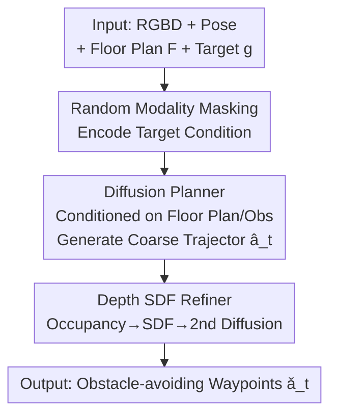

# FloVerse: Floor Plan-Guided Multi-Modal Navigation

**Conference**: CVPR 2026  
**Paper**: [CVF Open Access](https://openaccess.thecvf.com/content/CVPR2026/html/Huang_FloVerse_Floor_Plan-Guided_Multi-Modal_Navigation_CVPR_2026_paper.html)  
**Code**: https://wikiahuang.github.io/floverse/ (Project Page)  
**Area**: Embodied Navigation / Robotics  
**Keywords**: Floor plan prior, Multi-modal navigation, Diffusion policy, Modality masking, Trajectory refinement

## TL;DR
FloVerse utilizes the floor plan as a unified spatial prior and proposes a navigation task and dataset that merges three target modalities—PointNav, ObjectNav, and ImageNav—into a single model. Using a two-stage diffusion strategy called ThreeDiff (a planner with modality masking + a depth-SDF-based refiner), the method achieves higher success rates and path efficiency across all three modalities compared to mapless approaches or single-modality expert models.

## Background & Motivation
**Background**: Embodied navigation has achieved significant progress in PointNav (coordinate-based), ObjectNav (object category-based), and ImageNav (target image-based) tasks. Prevailing approaches are either mapping-based (explicitly constructing maps) or mapless (directly mapping observations to actions).

**Limitations of Prior Work**: Mapping-based methods incur high overhead by continuously building and maintaining maps. Mapless methods lack global guidance when the target is not yet in view, relying instead on exploration, which often leads to short-sighted behavior and inefficient detours. Both categories struggle with efficiency in "unseen" environments.

**Key Challenge**: When an agent enters an unfamiliar indoor environment, it lacks a global understanding of the spatial layout and must rely on incremental local observations. However, a floor plan is a "cheap, readily available, and temporally stable" global spatial prior—it encodes wall geometry and implies semantic regularities such as room functions and typical object distributions. Existing floor plan-guided navigation works are almost exclusively limited to PointNav and validated on small-scale scenes; no systematic study has examined their effectiveness for ObjectNav or ImageNav.

**Goal**: This work addresses three sub-problems: (1) Creating a large-scale task and dataset that unifies three target modalities with floor plans for every scene; (2) Designing a single model capable of processing all three modalities while effectively utilizing floor plan priors; (3) Empirically verifying whether floor plan priors can enhance navigation across different modalities.

**Key Insight**: The authors hypothesize that the geometric structures (from which PointNav directly benefits) and semantic regularities (room connectivity and layout beneficial for ObjectNav/ImageNav) in floor plans can be implicitly learned by a shared encoder. Furthermore, complementarity exists between modalities—geometric spatial knowledge learned from PointNav can transfer to assist semantic target modalities.

**Core Idea**: Use the floor plan as a unified spatial prior + train with random modality masking to allow a diffusion policy to reason about coarse trajectories from targets in a "modality-agnostic" manner, followed by obstacle-avoidance refinement using depth geometry.

## Method

### Overall Architecture
ThreeDiff is a two-stage end-to-end trajectory generation framework. It takes the agent's first-person RGBD observation sequence, historical poses, a global 2D floor plan $F$, and a target $g$ of an arbitrary modality (point / object category / target image) as input, and outputs a sequence of continuous 2D waypoints for the subsequent steps. The first-stage **Planner** concatenates target, floor plan, and observation features to generate a coarse trajectory $\hat{a}_t$ using a diffusion model, reflecting high-level spatial intent and long-term dependencies. The second-stage **Refiner** projects the current depth map into a local occupancy map, computes a Signed Distance Field (SDF), and uses it to fine-tune the coarse trajectory, producing a safe path $\check{a}_t$ that avoids nearby obstacles. During training, target modalities are randomly masked to force the model to learn modality-independent target reasoning.

### Key Designs

**1. Multi-modal Target Condition with Random Modality Masking: One Model for Three Targets**

A major pain point is the need to train separate expert models for PointNav, ObjectNav, and ImageNav, which fragments spatial knowledge. The authors feed only one of the three target modalities to the model in each iteration, masking the other two. The resulting masked target condition is $C_g = m \odot (C_{g_{point}}, C_{g_{object}}, C_{g_{image}})$, where $m=[m_{point}, m_{object}, m_{image}]$ is a one-hot vector. Each modality uses a different encoding: Point targets use an MLP, $C_{g_{point}}=\mathrm{MLP}(g_{point})$; Image targets encode the current RGB observation $I_t$ and the target image $g_{image}$ via EfficientNet, $C_{g_{image}}=\mathrm{MLP}(E(I_t) \oplus E(g_{image}))$; Object targets use a frozen CLIP to encode the current image and the object category text, $C_{g_{object}}=\mathrm{MLP}(\mathrm{CLIP}(I_t) \oplus \mathrm{CLIP}(g_{object}))$.

This approach offers two benefits: first, the three modalities are trained alternately under the same input setting $(s_t, F, \bar{a}_t)$, reinforcing each other and improving the generalization of trajectory generation; second, by encoding "current observation + target" pairs for every condition, the model learns a cross-modally consistent "current-target correspondence," enhancing the stability and sample efficiency of diffusion training. Experiments confirm this complementarity, as joint training consistently outperforms individual single-modality models in ImageNav and ObjectNav.

**2. Floor Plan-Conditioned Diffusion Planner: Injecting Global Spatial Priors into Trajectories**

Mapless methods suffer from a lack of global guidance and tend to explore blindly when the target is invisible. The planner generates actions $\hat{a}_t$ by conditioning on target features $C_g$, floor plan features $C_F$ (extracted via EfficientNet), and current observation features $C_O$. The observation features are fused from historical $l$ frames of RGB, depth, and pose features using multi-head self-attention: $C_O = \mathrm{SA}(f_I^{t-l:t} \oplus f_D^{t-l:t} \oplus f_p^{t-l:t})$. The planning process uses a conditional U-Net with a DDPM scheduler to model $P_\theta(\bar{a}_t \mid C_g, C_F, C_O)$. The training objective is the denoising MSE:

$$L_1 = \mathrm{MSE}\big(\epsilon_k,\ \epsilon_\theta(\bar{a}_t + \epsilon_k,\ k)\big)$$

where $\epsilon_k$ is the noise label at the $k$-th denoising step. By incorporating the floor plan as a condition, the agent can "guess" the target's approximate location and plan long-range paths in unseen scenes without prior exploration or mapping—this is the core value of the floor plan as a prior. Notably, ThreeDiff exhibits an emergent ability: even without explicit supervision of target coordinates, it implicitly infers target positions.

**3. Depth-SDF Trajectory Refiner: Providing Obstacle Avoidance Missing in Diffusion Planning**

A limitation of imitation learning is that expert trajectories used for training are already optimal and collision-free; thus, the model never sees collision feedback, resulting in weak active obstacle avoidance in the planner. The authors train a second diffusion model specifically for safety refinement. It first projects the depth map into a local binary occupancy map in Bird's-Eye View (BEV) (grid $20\times50$, 0.1m resolution; 0 for obstacles, 1 for free space), computes the local Signed Distance Field (SDF), and encodes it via CNN into $f_{SDF}$. This is fed into the second diffusion model alongside the planner's output $\hat{a}_t$ to fit $P_\phi(\check{a}_t \mid \hat{a}_t, f_{SDF})$. Its training objective includes a collision penalty in addition to the reconstruction error:

$$L_2 = \mathrm{MSE}\big(\epsilon_k,\ \epsilon_\phi(a_t + \epsilon_k,\ k)\big) + \lambda L_{collision}$$

where $L_{collision} = \frac{1}{N}\sum_{i=1}^{N} \exp(-\beta \cdot \delta_i)$, and $\delta_i$ is the $l_2$ distance from the $i$-th waypoint to the nearest obstacle (calculated via linear interpolation from the SDF to ensure differentiability). $\lambda$ and $\beta$ control the weight and scale of the collision loss. Waypoints closer to obstacles receive exponentially larger penalties, forcing refined waypoints to stay clear of obstructions. The planner is trained to convergence first, followed by joint training with the refiner. Ablations show that PointNav performance drops the most without the refiner, highlighting its critical role in trajectory safety.

### Loss & Training
Training follows a two-stage process: the planner diffusion model is trained until convergence, then the refiner diffusion model is added for joint fine-tuning. For object targets, a frozen CLIP-ViT-B/32 is used for joint image-text encoding; all other image encoders are EfficientNet-B0 trained from scratch with non-shared weights. Multi-head attention uses 4 heads and 4 layers. AdamW + CosineAnnealingLR are used with a max learning rate of 1e-4 for up to 20 epochs; $\lambda=0.1$ and $\beta=1$. Training was conducted on 4 NVIDIA 4090 GPUs with a batch size of 32 per card. During inference, 16 waypoints are predicted and the first 10 are executed. To reduce stochasticity, 30 trajectories are generated per step and averaged. In case of a collision, the agent backtracks to the previous state, re-orients toward the target, and re-runs inference.

## Key Experimental Results
Setup: Evaluated in the Gibson simulator, where discrete/continuous actions are converted to global poses for execution. Success threshold is $d=1$, max steps $T_{max}=500$, and max collisions $\vartheta_{max}=15$. Metrics are Success Rate (SR) and Success weighted by Path Length (SPL). The FloVerse-1.6K dataset includes 1,627 floor plans, 325 object categories, 299 scenes, ~240K expert trajectories, and 12M RGBD–pose pairs.

### Main Results
ThreeDiff consistently outperforms baselines like FloDiff and DD-PPO on PointNav (Tab. 4), and exceeds NoMad and ZSON on ImageNav/ObjectNav (Tab. 5):

| Task / Data | Metric | ThreeDiff | Strongest Baseline | Gain |
|------|------|------|----------|------|
| PointNav · Gibson 4+ | SR / SPL | 54.4 / 50.0 | FloDiff(pre) 40.0 / 28.8 | +14.4 / +21.2 |
| PointNav · HM3D | SR / SPL | 38.1 / 32.5 | FloDiff(ft) 27.7 / 21.1 | +10.4 / +11.4 |
| ImageNav · HM3D | SR / SPL | 28.9 / 22.4 | NoMad(ft) 22.8 / 17.0 | +6.1 / +5.4 |
| ObjectNav · HM3D | SR / SPL | 28.6 / 22.3 | ZSON 7.2 / 1.1 | +21.4 / +21.2 |

When compared against official baselines on GOAT-Bench (val-seen) (Tab. 6): ThreeDiff leads significantly in ObjectNav (SR 34.5 / SPL 30.8). In ImageNav, while its SR is slightly lower than RL Skill Chain (31.0 vs 42.2), its SPL is 7.6 higher (25.6 vs 18.0), indicating much higher path efficiency. Notably, the mapping-based Modular GOAT also underperforms against ThreeDiff in SPL, which the authors attribute to the inefficiency caused by required initial exploration.

### Ablation Study
Ablations on the floor plan prior ($F$) and the refiner (Tab. 2 / Tab. 7):

| Config | PointNav SR/SPL | ImageNav SR/SPL | ObjectNav SR/SPL | Description |
|------|------|------|------|------|
| ThreeDiff (Full) | 42.0 / 36.6 | 28.9 / 22.4 | 28.6 / 22.3 | Full model |
| w/o Floor Plan F | 25.8 / 25.6 | 22.6 / 18.4 | 20.9 / 16.5 | SR drops by 16.2 / 6.3 / 7.7 |
| w/o Refiner | 34.3 / 29.2 | 27.7 / 21.4 | 25.3 / 19.4 | PointNav shows largest drop |

Cross-modal complementarity (Tab. 3): Single-modality Point-only PointNav yields SR 42.1 / SPL 38.9, slightly higher than the joint ThreeDiff (42.0 / 36.6). However, Image-only (25.4 / 20.7) and Object-only (24.3 / 19.9) are significantly outperformed by joint ThreeDiff (ImageNav 28.9 / 22.4, ObjectNav 28.6 / 22.3).

### Key Findings
- **Floor plan priors benefit PointNav the most**: PointNav SR increased by 16.2 due to the floor plan, far exceeding gains in ImageNav (+6.3) and ObjectNav (+7.7). Explanation: PointNav benefits directly from explicit geometric priors (leading precisely to coordinates), whereas ImageNav/ObjectNav rely on coarse semantic cues like room layout, limiting the potential gain.
- **Cross-modal complementarity with slight interference**: Geometric spatial knowledge from PointNav transfers to help semantic target modalities (room connectivity, coarse layout), resulting in better joint performance for ImageNav/ObjectNav. However, implicit semantic biases from ImageNav/ObjectNav slightly interfere with the explicit geometric learning required for PointNav, causing a minor SPL drop compared to the Point-only model.
- **The refiner is critical for PointNav**: Removing the refiner leads to the largest performance drop in PointNav (SR 42.0 $\rightarrow$ 34.3). Visualizations show refined trajectories successfully avoiding obstacles, proving that local SDF conversion effectively captures traversability cues to generate safer waypoints.

## Highlights & Insights
- **The "Floor Plan as a Unified Prior" perspective is clever**: Floor plans are cheap, stable, and contain both geometry and semantics. The authors are the first to systematically verify that they enhance navigation across three different target modalities, expanding the utility of floor plans beyond PointNav.
- **Random Modality Masking + Shared Encoder** allows a single model to handle three target types. The empirical evidence that PointNav geometric supervision transfers to semantic modalities is a valuable insight for any navigation/manipulation setting requiring shared spatial representations.
- **The two-stage "Plan then SDF Refine" approach addresses an imitation learning blind spot**: Since expert data lacks collisions, models struggle to learn avoidance. Converting depth to occupancy to SDF with a differentiable collision loss is a clean engineering solution applicable to other trajectory generation tasks with "expert-only" data.

## Limitations & Future Work
- **Authors' Admission**: Validated only on residential indoor floor plans; effectiveness on other layouts (offices, malls) is unknown. Not yet deployed in the real world; sim-to-real gap remains to be tested.
- **Observation**: Absolute success rates for ImageNav and ObjectNav remain relatively low (~29%), suggesting that floor plan semantic cues are still used somewhat simplistically. Metrics are primarily from the Gibson simulator; robustness across simulators or on real hardware is unverified.
- **Future Improvements**: Explicitly modeling the semantics of floor plans (room functions, typical object distributions) as reasoned structures (rather than just implicit learning via encoders) may further improve success rates for semantic target modalities.

## Related Work & Insights
- **vs FloNa / FloDiff [18]**: These works introduced end-to-end navigation using monocular cameras and floor plans but were limited to PointNav and small-scale scenes. This paper scales the task to unified PointNav/ObjectNav/ImageNav, builds a 1.6K scale dataset, and adds depth-SDF refinement and multi-modal masking, substantially outperforming FloDiff in PointNav SR/SPL.
- **vs NoMad [28]**: Also utilizes diffusion policies, but NoMad focuses on exploration and image targets without global floor plan priors. ThreeDiff's floor plan conditioning and refiner result in ImageNav SR/SPL gains of approximately 6/5.
- **vs Uni-Goal / GOAT-Bench [15,37]**: These use unified graph structures or skill chains for multi-modal targets without relying on floor plans. This work is the first to unify three target modalities within a "floor plan-guided" framework, even surpassing the mapping-based Modular GOAT in SPL on GOAT-Bench ObjectNav.

## Rating
- Novelty: ⭐⭐⭐⭐ First systematic validation of the universal value of floor plan priors across three target modalities; proposes a unified task, dataset, and two-stage diffusion model.
- Experimental Thoroughness: ⭐⭐⭐⭐ Includes ablations for floor plan/refiner/cross-modal components, multiple baselines, and cross-validation on GOAT-Bench; however, limited to simulators with low absolute success rates.
- Writing Quality: ⭐⭐⭐⭐ Clear structure across task definition, methodology, and experimental comparisons.
- Value: ⭐⭐⭐⭐ The FloVerse-1.6K dataset and the unified framework provide practical value to the embodied navigation community.

<!-- RELATED:START -->

<!-- RELATED:END -->

## Related Papers

- [\[CVPR 2026\] AURA: Multi-modal Shared Autonomy for Urban Navigation](aura_multi-modal_shared_autonomy_for_urban_navigation.md)
- [\[CVPR 2026\] Multi-SpatialMLLM: Multi-Frame Spatial Understanding with Multi-Modal Large Language Models](multi-spatialmllm_multi-frame_spatial_understanding_with_multi-modal_large_langu.md)
- [\[CVPR 2026\] CLaD: Planning with Grounded Foresight via Cross-Modal Latent Dynamics](clad_planning_with_grounded_foresight_via_cross-modal_latent_dynamics.md)
- [\[CVPR 2026\] GeniNav: Generative Model Driven Image-Goal Navigation via Imagination-Guided Consistency Flow Matching](geninav_generative_model_driven_image-goal_navigation_via_imagination-guided_con.md)
- [\[CVPR 2026\] DiffuView: Multi-View Diffusion Pretraining for 3D-Aware Robotic Manipulation](diffuview_multi-view_diffusion_pretraining_for_3d_aware_robotic_manipulation.md)

<!-- RELATED:END -->
