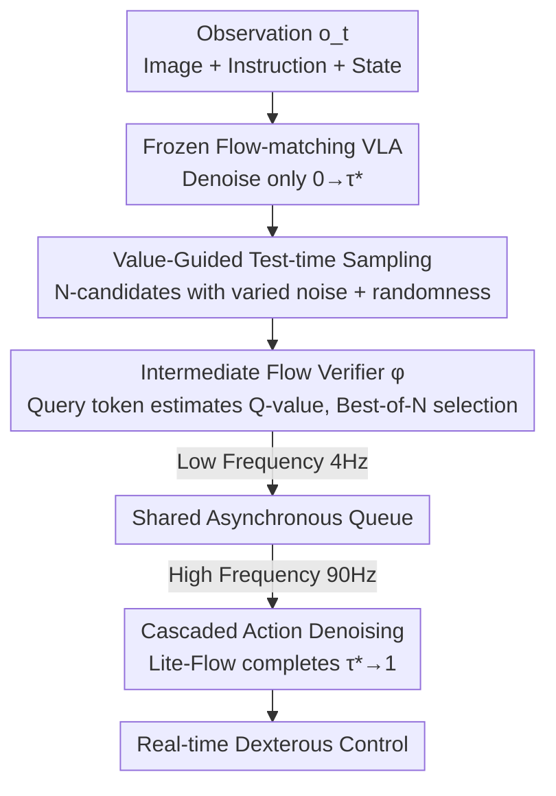

# FM-Steer: Enhance Generalist Policies with Value-Guided Cascaded Denoising

**Conference**: CVPR 2026  
**Paper**: [CVF Open Access](https://openaccess.thecvf.com/content/CVPR2026/html/Song_FM-Steer_Enhance_Generalist_Policies_with_Value-Guided_Cascaded_Denoising_CVPR_2026_paper.html)  
**Code**: https://hume-vla.github.io (Project Page)  
**Area**: Robotics / Embodied AI / VLA  
**Keywords**: Test-time computation, flow-matching VLA, value-guided sampling, cascaded denoising, robotic manipulation  

## TL;DR
FM-Steer introduces a test-time computation framework for flow-matching (FM) VLA generalist policies. It employs an intermediate flow verifier to estimate Q-values for "semi-denoised" candidate actions and selects the optimal one via Best-of-N. Subsequently, a lightweight Lite-Flow denoiser asynchronously completes the remaining denoising steps. This approach enhances π0 performance by +4.4%, +25.9%, and +12.9% on LIBERO, Simpler, and real-world robots respectively, while increasing the control frequency from 4 Hz to 90 Hz without retraining the foundation model.

## Background & Motivation
**Background**: Generalist Robot Policies (VLA) currently prioritize mapping vision-language models to action experts for predicting future action chunks. Autoregressive VLAs (e.g., RT-2, OpenVLA) discretize actions into tokens, whereas **flow-matching VLAs** like π0 and GR00T N1 generate continuous action chunks, showing superior performance in dexterous manipulation. Simultaneously, "test-time scaling"—sampling multiple candidates and selecting the best—has demonstrated significant gains in complex LLM tasks.

**Limitations of Prior Work**: Adapting "sampling + verification" to robotics (e.g., V-GPS, RoboMonkey) faces two major hurdles. First, these methods are designed for **autoregressive VLVs** and cannot be directly applied to flow-matching VLAs, as flow-matching involves deterministic ODEs where naive re-sampling fails to produce diversity. Second, repeated sampling increases inference latency, severely reducing control frequency, which leads to jitter or failure in dynamic tasks.

**Key Challenge**: Robot control possesses a **real-time constraint** where increased inference computation translates into latency. Consequently, there is a natural conflict between "investing more computation for better performance" and "maintaining high control frequency." Prior works like V-GPS often sacrifice frequency for performance.

**Goal**: To decompose the problem into two sub-tasks: (1) devising an effective test-time computation method for **flow-matching VLAs** (solving the diversity issue); and (2) **increasing the control frequency** even as computational expenditure grows.

**Key Insight**: The authors observe that verification does not need to wait for "complete denoising." On the Euler forward trajectory of flow-matching, **intermediate noise actions (flow points)** carry sufficient information for scoring. Thus, expensive "sampling + verification" can be limited to the early stages, while cheap "completion denoising" can be offloaded asynchronously.

**Core Idea**: By using "value-guided sampling on intermediate noise actions + cascading remaining denoising to a lightweight denoiser," the framework decouples "heavy test-time scaling" from "high-frequency control." The slow verifier selects better actions at a low frequency (4 Hz), while the fast Lite-Flow denoiser provides continuous, high-frequency completion (90 Hz).

## Method

### Overall Architecture
FM-Steer builds upon a frozen flow-matching VLA and adds two external modules: an **intermediate flow verifier $\varphi$** (to estimate Q-values and select the optimal candidate) and a **Lite-Flow denoiser $\phi$** (a lightweight transformer for completing the denoising process).

Reviewing the base: Flow-matching VLAs learn a conditional vector field $v_\theta(A_t^\tau, o_t)$. The objective is to minimize $\mathcal{L}_{FM}=\mathbb{E}\lVert v_\theta(A_t^\tau,o_t)-u(A_t^\tau\mid A_t)\rVert^2$, where the true field is $u(A_t^\tau\mid A_t)=\epsilon-A_t$ and noise actions are $A_t^\tau=\tau A_t+(1-\tau)\epsilon$, with $\tau\in[0,1]$ representing the noise level. Inference starts from pure noise $A_t^0\sim\mathcal{N}(0,I)$ and uses forward Euler $A_t^{\tau+\delta}=A_t^\tau+\delta v_\theta(A_t^\tau,o_t)$ to reach $A_t^1$.

FM-Steer splits the denoising trajectory ($0$ to $1$) at $\tau^*$. The base VLA only computes from $0 \to \tau^*$ to generate a batch of **intermediate noise actions** as candidates. The verifier selects the optimal candidate $A_t^{\tau^*}$ with the highest Q-value, which is then sliced and handed to the Lite-Flow to complete $\tau^* \to 1$. In deployment, the verifier side runs at low frequency (4 Hz), while the Lite-Flow side fetches the latest selection from a shared queue to complete denoising at high frequency (90 Hz).

### Key Designs

**1. Value-guided test-time sampling: Best-of-N on intermediate noise actions**

To solve the lack of diversity in deterministic ODEs and the latency of full generation, FM-Steer samples **intermediate flow points** $A_t^{\tau_n}$ instead of final actions. Diversity is ensured through two mechanisms: (1) **Varying noise levels**: The $n$-th candidate's noise level is set to $\tau_n=T-(n-1)\xi$, such that:
$$A_t^{\tau_n}=\int_0^{T-(n-1)\xi} v_\theta(A_t^\tau,o_t)\,d\tau+\epsilon_n,$$
where $T \in (0,1)$ is the upper bound of the noise level. (2) **Noise forcing**: Randomness is injected into the Euler steps by modeling each step as an isotropic Gaussian $p(A_t^{\tau+\delta}\mid A_t^\tau)\sim\mathcal{N}(\mu_\tau,\Sigma_\tau)$, where the variance $\Sigma_\tau$ controls diversity.

**2. Intermediate flow verifier: Estimating state-action value with query tokens**

The verifier $\varphi$ is tightly integrated with the base model via a learnable **special query token $q_t$**. Appended to the VLM input sequence, $q_t$ attends to all preceding vision-language tokens to aggregate the current observation. $q_t$ and the candidate $A_t^{\tau_n}$ are fed into the verifier to estimate $Q_\varphi(q_t,A_t^{\tau_n})$. The optimal candidate is chosen via Best-of-N:
$$A_t^{\tau^*}=\arg\max_{A_t^{\tau_n}} Q_\varphi(q_t,A_t^{\tau_n}).$$
The verifier is trained using calibrated Q-learning on sparse binary rewards. This enables it to identify high-value directions midway through the denoising process.

**3. Cascaded action denoising: Decoupling sampling and high-frequency completion**

The optimal candidate $A_t^{\tau^*}$ is a noisy action chunk with horizon $H$. FM-Steer **uniformly slices it into $K$ sub-chunks** of horizon $h$. For each sub-chunk $A_{t,k}^{\tau^*}$, the Lite-Flow denoiser completes the trajectory:
$$A_{t,k}=\int_{\tau^*}^{1} v_\phi(A_{t,k}^\tau,o_{t,k})\,d\tau+A_{t,k}^{\tau^*}.$$
By splitting the task between two models, the verifier handles slow, high-level selection, while the Lite-Flow provides high-speed, reactive control. Their asynchronous updates ensure that control frequency is improved rather than hampered by the test-time scaling compute.

## Key Experimental Results
Evaluations were conducted across three simulation benchmarks (LIBERO, SimplerEnv WidowX, SimplerEnv Google Robot) and three real-world platforms (WidowX 250s, Franka, AgiBot G-1), covering 15 scenarios and 21 real-world tasks.

### Main Results: LIBERO (Success Rate SR)

| Model | Spatial | Object | Goal | Long | Overall |
|--------|------|------|------|------|------|
| OpenVLA-OFT | 97.6% | 98.4% | 97.9% | 94.5% | 97.1% |
| GR00T N1 | 94.4% | 97.6% | 93.0% | 90.6% | 93.9% |
| π0 (Base) | 96.8% | 98.8% | 95.8% | 85.2% | 94.2% |
| π0.5 | 98.8% | 98.2% | 98.0% | 92.4% | 96.8% |
| **FM-Steer (GR00T N1)** | 97.5% | 99.1% | 97.4% | 95.4% | 97.3% |
| **FM-Steer (π0)** | 98.6% | 99.8% | 99.4% | 96.7% | **98.6%** |

FM-Steer(π0) achieves the highest average SR (98.6%), outperforming the base π0 (94.2%) by +4.4%. Its success with GR00T N1 demonstrates its **plug-and-play** compatibility.

### Main Results: SimplerEnv (vs. Prior Test-time Methods)

| Method | WidowX Overall | Google (Matching) | Google (Aggregation) |
|--------|------|------|------|
| OpenVLA | 37.7% | 35.4% | 30.0% |
| V-GPS | 37.0% | 36.1% | 30.2% |
| RoboMonkey | 47.8% | 37.3% | 30.5% |
| π0 (Base) | 69.2% | 71.4% | 54.7% |
| **FM-Steer (π0)** | **79.5%** | **76.6%** | **60.3%** |

### Ablation Study

| Configuration | LIBERO | SimplerEnv | Overall |
|------|------|------|------|
| FM-Steer (π0) Full | 98.6 | 75.1 | **81.0** |
| w/o Cascaded Denoising ($T=1$) | 95.9 | 72.1 | 78.1 |
| w/o Re-sampling ($N=1$) | 93.8 | 69.1 | 75.3 |
| w/o Lite-Flow Denoiser | 89.8 | 65.8 | 71.8 |
| w/o Flow Verifier (Random) | 84.9 | 61.4 | 67.3 |

### Key Findings
- **Flow Verifier as the Core Component**: Removing the verifier (random selection) lead to the steepest performance drop (−78% on real-world robots).
- **Lite-Flow is critical for Real-world Deployment**: Executing noisy intermediate actions without numerical completion drops real-world SR by 63%.
- **Failure Recovery Capabilities**: FM-Steer can recover from failed states by selecting alternative high-value trajectories via value-guiding.
- **High-frequency Robustness**: Maintains high performance at 20 Hz (Franka) and 30 Hz (AgiBot G-1), significantly outperforming π0.

## Highlights & Insights
- **Early Verification**: Shifting Best-of-N from "final actions" to "intermediate noise actions" solves both the diversity and latency issues of flow-matching strategies.
- **Structural Decoupling**: The asynchronous coordination between the slow verifier (4 Hz) and fast Lite-Flow (90 Hz) is the fundamental differentiator from prior works like V-GPS.
- **Efficiency**: Enhancing performance without retraining heavy base models using a "plug-and-play" architecture is highly efficient for engineering.

## Limitations & Future Work
- **Reliance on Offline RL**: The verifier depends on quality rewards during training; failures in reward definition may limit performance.
- **Hyperparameter Sensitivity**: The choice of noise upper bound $T$, number of candidates $N$, and sampling variance requires manual tuning for different platforms.
- **Asynchronous Stale Data**: Future work should explore whether the "freshness" of actions in the shared queue becomes a bottleneck in extremely dynamic scenarios.

## Related Work & Insights
- **Comparison with V-GPS/RoboMonkey**: Those methods target autoregressive models and final action sampling, leading to low frequencies. FM-Steer applies test-time scaling to flow-matching via intermediate sampling.
- **Comparison with Cascaded Diffusion**: While cascaded denoising was previously used for progressive image resolution, this work applies it to **action generation** to split computational budget and enable real-time control.

## Rating
- Novelty: ⭐⭐⭐⭐⭐ 
- Experimental Thoroughness: ⭐⭐⭐⭐⭐ 
- Writing Quality: ⭐⭐⭐⭐ 
- Value: ⭐⭐⭐⭐⭐ 

<!-- RELATED:START -->

## Related Papers

- [\[ICML 2026\] RoboMME: Benchmarking and Understanding Memory for Robotic Generalist Policies](../../ICML2026/robotics/robomme_benchmarking_and_understanding_memory_for_robotic_generalist_policies.md)
- [\[ICLR 2026\] Scalable Exploration for High-Dimensional Continuous Control via Value-Guided Flow](../../ICLR2026/robotics/scalable_exploration_for_high-dimensional_continuous_control_via_value-guided_fl.md)
- [\[CVPR 2026\] OctoNav: Towards Generalist Embodied Navigation](octonav_towards_generalist_embodied_navigation.md)
- [\[CVPR 2026\] InternData-A1: Pioneering High-Fidelity Synthetic Data for Pre-training Generalist Policy](interndata-a1_pioneering_high-fidelity_synthetic_data_for_pre-training_generalis.md)
- [\[CVPR 2026\] REACH: Explicit Recovery Behavior for Diffusion Policies](reach_explicit_recovery_behavior_for_diffusion_policies.md)

<!-- RELATED:END -->
