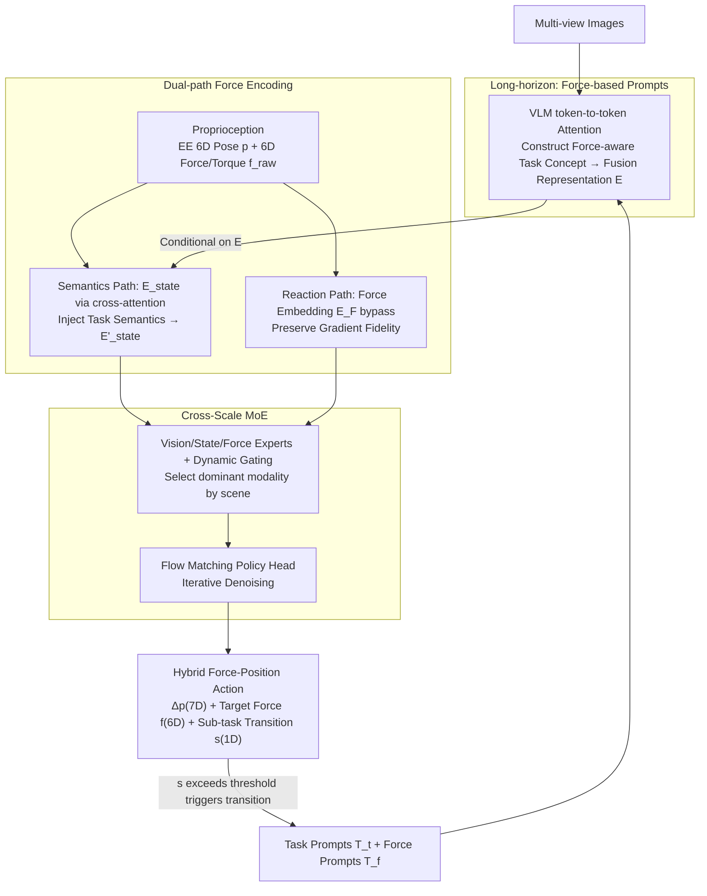

# ForceVLA2: Unleashing Hybrid Force-Position Control with Force Awareness for Contact-Rich Manipulation

**Conference**: CVPR 2026  
**arXiv**: [2603.15169](https://arxiv.org/abs/2603.15169)  
**Code**: [Project Homepage](https://sites.google.com/view/force-vla2/home)  
**Area**: Robot Manipulation / Vision-Language-Action Models  
**Keywords**: [VLA, Force Control, Hybrid Force-Position Control, MoE, Contact-Rich Manipulation, Force Awareness]  

## TL;DR
ForceVLA2 is proposed, the first end-to-end model within a VLA framework to unify force awareness and hybrid force-position control. By constructing cross-stage force-aware task concepts in VLMs via Force-based Prompts and adaptively fusing task semantics with real-time interactive forces through a Cross-Scale MoE, it achieves closed-loop force-position regulation. Across five contact-rich tasks, it achieves an average success rate of 66%, outperforming π₀ and π₀.5 by 48.0% and 35.0%, respectively.

## Background & Motivation
Current VLA models (e.g., π₀, OpenVLA, GR00T-N1) excel in semantic understanding and instruction following but suffer from fundamental flaws:

1.  **Lack of Force Reasoning and Active Force Interaction**: Existing VLAs are entirely based on pure position control, treating force only as an auxiliary sensory input (e.g., ForceVLA) rather than an active control signal. In contact-rich tasks (wiping, pressing, assembly), this leads to severe failure modes such as arm overload or unstable contact.
2.  **Lack of Stage-wise Force Awareness**: Contact-rich tasks typically involve 3-5 sub-task stages (e.g., "approach → contact → exert force → release"), each with distinct force requirements. Existing VLAs cannot reason about force targets for different stages nor judge sub-task progress based on force feedback.
3.  **Missing Force-Position Coupled Control**: From a control theory perspective, pure position control systems have a controllability matrix of rank 6 (controlling 6D poses only). They cannot independently control the 12-dimensional joint force-position space—force remains a passive output of environment dynamics rather than an independently controllable variable.

**Key Insight**: Humans rely on high-level vision-language reasoning to determine stage-wise goals while integrating real-time force feedback to adaptively adjust force and position. Existing VLAs lack this unified mechanism for multi-scale force awareness and active force interaction.

## Core Problem
How to enable VLA models to (1) construct force-aware task concepts and track progress across different stages, (2) adaptively fuse high-level task semantics with real-time interactive forces, and (3) achieve true closed-loop hybrid force-position control instead of treating force merely as auxiliary sensing?

## Method

### Overall Architecture

ForceVLA2 enables VLAs to "use force" actively—moving beyond treating force as an observer's input to actively outputting force targets and performing closed-loop regulation. Inspired by human sensorimotor control, it employs a dual-tier hierarchy. The long-horizon tier injects force information into the VLM via Force-based Prompts to build cross-stage force-aware task concepts. The short-horizon tier performs **dual-path encoding** for real-time force signals (one path fuses into task semantics, the other acts as a bypass to preserve gradients) and uses a Cross-Scale MoE to dynamically prioritize vision or force modalities based on the scene. It outputs hybrid force-position actions. Inputs consist of multi-view images + task prompts + force prompts + proprioceptive state (EE 6D pose + 6D force/torque); outputs are EE pose increments $\Delta p \in \mathbb{R}^7$ + target contact force $f \in \mathbb{R}^6$ + a sub-task transition indicator $s \in [0,1]$. When $s$ exceeds a threshold, the stage transitions and force prompts are refreshed, forming a cross-stage closed loop.

### Key Designs

**1. Force-based Prompts: Injecting "How Much Force" into VLM Task Concepts**

Contact-rich tasks are often divided into 3-5 stages (approach → contact → exert force → release), where force requirements vary drastically. ForceVLA2 feeds two types of text prompts to the VLM: **Task Prompts** $T_t$ describe global goals (e.g., "wipe the vase"), and **Force Prompts** $T_f$ encode the current sub-task state and stage-wise force targets (e.g., "Stage 2: Maintain 5N downward force to wipe the surface"). Each task has 3-5 pre-defined sub-tasks; force prompts act as a discrete state machine determining whether to maintain the current sub-task or transition. Visual tokens $Z_v$ from visual encoder $f(\cdot)$ and language tokens from $g(\cdot)$ are processed via token-to-token attention in the VLM to obtain a multimodal representation $E$. This allows the VLM to assess sub-task completion, manage transitions, and update explicit force cues.

**2. Dual-path Force Encoding: Semantic Fusion and Gradient Fidelity**

Simply concatenating force can act as interference (shown by the failure of π₀ w/ F). ForceVLA2 encodes EE 6D pose $p \in \mathbb{R}^7$ into $E_P$ and raw 6D force/torque $f_{raw} \in \mathbb{R}^6$ into $E_{F}$ via linear layers. The $E_F$ follows two paths: one combines with $E_P$ into $E_{state}$ to interact with vision-language features $E$ via cross-attention (allowing the force to be "understood"), while the other is a **bypass connection** directly to the MoE, skipping high-level fusion to preserve raw signal gradients for a low-latency reactive loop.

**3. Cross-Scale MoE: Dynamic Modality Prioritization**

The Cross-Scale MoE contains modality-specific experts (lightweight MLPs) for vision, state, and force. A dynamic gating network calculates token-level routing weights $w=[w_V, w_S, w_F]$. For free-space movement, it prioritizes vision; during contact, it shifts to force or position cues. The fusion representation $E_{MoE}$ is fed into a flow matching policy head: starting from noise $a_t(0)\sim N(0,I)$ and conditioned on $E_{MoE}$, it iteratively denoises to output $a_t = [\Delta p_t; f_t; s_t]$. The transition probability $s_t$ is calculated via a joint probability of position proximity, pose alignment, and force satisfaction—modeled by Beta, Exponential, and Uniform distributions, respectively.

**4. ForceVLA2-Dataset: Contact-Rich Data with Force Annotation**

The authors collected a dataset using a Flexiv Rizon 4s 7-DOF arm, a 6D force/torque sensor (300Hz), and three RGB cameras. Data was gathered via a GELLO teleoperation framework with force feedback to preserve natural force profiles. It covers five tasks: *press bottle, clean vase, clean board, retrieve plate,* and *assemble gears*, totaling 1,000 trajectories (~500K time steps). Sub-task boundaries and force prompt annotations were automatically segmented based on force characteristics.

### Loss & Training
- 8×A100 GPUs, batch size 32, 30K steps (~10 hours).
- AdamW optimizer, Cosine Decay scheduler, EMA decay 0.99.
- Inference speed: 15Hz on a 4090 GPU with chunk size 30.

## Key Experimental Results

### Main Results

| Method | Press bottle | Clean vase | Clean board | Retri. plate | Assem. gears | Avg. |
| :--- | :---: | :---: | :---: | :---: | :---: | :---: |
| π₀ (w/o force) | 35.0 | 20.0 | 35.0 | 0.0 | 0.0 | 18.0 |
| π₀.5 | 45.0 | 30.0 | 45.0 | 15.0 | 20.0 | 31.0 |
| ACP | 25.0 | 30.0 | 25.0 | 0.0 | 0.0 | 16.0 |
| π₀ w/ F (Naive Force) | 30.0 | 25.0 | 20.0 | 10.0 | 0.0 | 17.0 |
| ForceVLA | 70.0 | 25.0 | 55.0 | 15.0 | 10.0 | 35.0 |
| **Ours (ForceVLA2)** | **80.0** | **75.0** | **70.0** | **35.0** | **70.0** | **66.0** |

- **Gain**: +48.0% vs. π₀, +35.0% vs. π₀.5, +31.0% vs. ForceVLA.
- **Critical Success**: On *Assemble gears* (most force-sensitive), success rose from 10% (Prev. SOTA) to 70%.
- **Limitation of Naive Fusion**: π₀ w/ F (17.0%) performed worse than base π₀ (18.0%), proving that simple concatenation disrupts pre-trained representations.

### Ablation Study (Table 2)

| FP | ME | CM | Avg. |
| :--- | :--- | :--- | :---: |
| ✗ | ✗ | ✗ | 18.0 (π₀ baseline) |
| ✓ | ✗ | ✗ | 27.0 (+9.0) |
| ✓ | ✓ | ✗ | 40.0 (+13.0) |
| ✓ | ✓ | ✓ | **66.0** (+26.0) |

- Cross-Scale MoE (CM) provided the largest gain (+26.0%).
- Force Prompts (FP) alone provided a +9.0% improvement.

### Modality Expert Ablation (Table 3)

| Vision Expert | Force Expert | Avg. |
| :--- | :--- | :---: |
| ✗ | ✗ | 36.0 |
| ✓ | ✗ | 50.0 |
| ✓ | ✓ | **66.0** |

- Vision and force modalities contribute almost equally within MoE.

## Highlights & Insights
- **First VLA Hybrid Control Framework**: Instead of treating force as minor sensing, ForceVLA2 actively outputs force targets, expanding controllability from 6D (position) to nearly 12D (joint space).
- **Multi-scale Force Injection**: Long-horizon semantic fusion (Force Prompts) combined with short-horizon reactive bypass ensure both reasoning capability and gradient fidelity.
- **Probabilistic Transition Modeling**: Using Beta-Exponential-Uniform distributions to model sub-task transitions provides a robust solution for stage switching.
- **Refined Force Injection**: Experiments showed that "State Fusion" is superior to naive VLM pathway injection, preventing the corruption of pre-trained multimodal weights.

## Limitations & Future Work
- **Data Scale**: 1,000 trajectories is limited; scaling to Open X-Embodiment levels with force data is needed.
- **Predefined Prompts**: Sub-task lists are predefined; future work should focus on automated force prompt generation.
- **Assumption of Distributions**: Probabilistic models assume specific distributions that may not capture all real-world force signal complexities.
- **Inference Speed**: 15Hz may be insufficient for high-speed assembly applications.

## Related Work & Insights
- **vs. π₀ / π₀.5**: These lack force control, failing often in contact-rich tasks (18-31% success). ForceVLA2's 66% success rate demonstrates the necessity of force interaction.
- **vs. ForceVLA**: While ForceVLA perceives force, it only outputs position. ForceVLA2's +31% gain over it highlights the leap from force *perception* to force *interaction*.
- **vs. ACP (Adaptive Compliance Control)**: ACP introduces force implicitly via admittance control but lacks the semantic reasoning shown by ForceVLA2 (16% vs. 66%).

## Rating
- **Novelty**: ⭐⭐⭐⭐⭐ (First VLA hybrid control; innovative multi-scale injection).
- **Experimental Thoroughness**: ⭐⭐⭐⭐ (Solid real-robot testing and deep ablations; lacks cross-platform testing).
- **Writing Quality**: ⭐⭐⭐⭐⭐ (Strong control theory motivation and logical flow).
- **Value**: ⭐⭐⭐⭐⭐ (Shift in paradigm from perception to interaction for VLA deployment).

<!-- RELATED:START -->

## Related Papers

- [\[CVPR 2026\] Contact-Aware Neural Dynamics](contact-aware_neural_dynamics.md)
- [\[ICML 2025\] Geometric Contact Flows: Contactomorphisms for Dynamics and Control](../../ICML2025/robotics/geometric_contact_flows_contactomorphisms_for_dynamics_and_control.md)
- [\[CVPR 2026\] AwareVLN: Reasoning with Self-awareness for Vision-Language Navigation](awarevln_reasoning_with_self-awareness_for_vision-language_navigation.md)
- [\[CVPR 2026\] DynBridge: Bridging Imagination and Control through Interaction Dynamics for Robot Manipulation](dynbridge_bridging_imagination_and_control_through_interaction_dynamics_for_robo.md)
- [\[CVPR 2026\] EgoRoC: Towards Egocentric Robotic Control via Task-Agnostic Visual Alignment](egoroc_towards_egocentric_robotic_control_via_task-agnostic_visual_alignment.md)

<!-- RELATED:END -->
